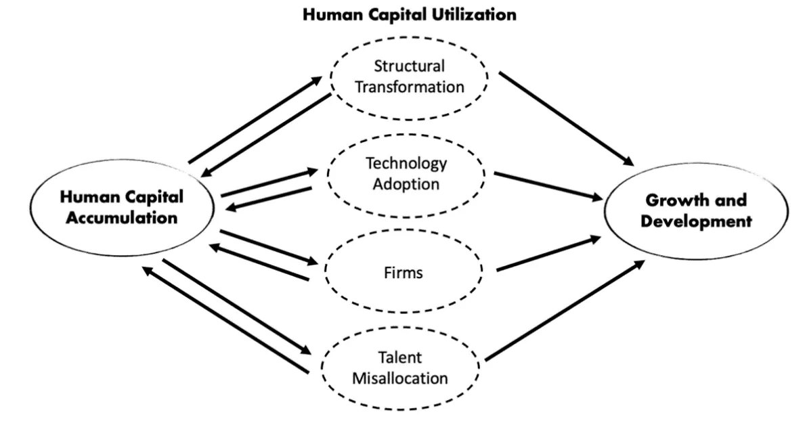

## Table of Contents

## What is human capital and why is it important for investors?

Human capital refers to the skills, knowledge, and experience that people possess, which contribute to their ability to perform work and create economic value. It includes education, training, health, and other factors that enhance a person's productivity and potential to generate income. In a business context, human capital represents the collective abilities and talents of a company's employees, which are crucial for its success and growth.

For investors, understanding a company's human capital is important because it can significantly impact the company's performance and future prospects. A company with a highly skilled and motivated workforce is more likely to innovate, adapt to market changes, and maintain a competitive edge. This can lead to better financial results and higher returns for investors. By assessing the quality of a company's human capital, investors can make more informed decisions about where to allocate their resources, ultimately aiming to maximize their investment returns.

## How does human capital influence a company's performance and growth?

Human capital is like the engine that drives a company forward. When a company has employees who are skilled, knowledgeable, and experienced, it can do its work better and faster. These employees can come up with new ideas, solve problems, and make the company more efficient. This means the company can make more money and grow bigger. If the employees are happy and motivated, they will work harder and stay with the company longer, which helps keep the business strong and stable.

On the other hand, if a company does not invest in its human capital, it might struggle. Without good training and development, employees might not have the skills they need to do their jobs well. This can lead to mistakes, slow progress, and unhappy customers. Over time, a company with weak human capital might find it hard to keep up with competitors who have better-trained and more motivated employees. So, taking care of human capital is really important for a company's success and growth.

## What are the key components of human capital that investors should focus on?

Investors should pay attention to a few important parts of human capital. One key part is education and training. This means looking at how much the company spends on helping its employees learn new skills and keep up with changes in their industry. A company that invests a lot in training is likely to have employees who can do their jobs better and come up with new ideas. Another important part is the health and well-being of employees. If a company takes good care of its workers, they will be happier and more productive. This can lead to less time off work and better overall performance.

Another component to consider is the experience and expertise of the workforce. Companies with experienced employees often have a strong foundation for success because these workers know how to handle challenges and can mentor newer staff. Investors should also look at employee engagement and retention. High levels of engagement mean that employees are motivated and committed to the company's goals. Good retention rates show that the company is a good place to work, which can attract more talented people. All these parts together make up the human capital that can drive a company's growth and success.

## How can investors measure the quality of human capital in a company?

Investors can measure the quality of human capital in a company by looking at how much the company spends on training and education for its employees. This shows how committed the company is to helping its workers learn and grow. A company that invests a lot in training is likely to have a more skilled and adaptable workforce. Investors can also check the company's reports to see if they talk about employee development programs and how these programs help the business.

Another way to measure human capital is by looking at how happy and healthy the employees are. Investors can look at things like employee satisfaction surveys, health and wellness programs, and how often employees take sick days. If employees are happy and healthy, they are more likely to be productive and stay with the company longer. This can lead to better performance and growth for the company.

Investors should also pay attention to how experienced and engaged the workforce is. They can do this by looking at the average years of experience of the employees and how long they stay with the company. High levels of experience and low turnover rates are good signs that the company has strong human capital. Additionally, investors can look at employee engagement scores, which show how motivated and committed the workers are to the company's goals. All these factors together give investors a good picture of the quality of a company's human capital.

## What role does employee education and training play in enhancing human capital?

Employee education and training are really important for making human capital better. When a company spends time and money on helping its workers learn new things, it helps them do their jobs better. Training can teach employees new skills or help them get better at what they already know. This means they can work faster and make fewer mistakes. It also helps the company keep up with changes in the industry, like new technology or ways of doing things. When employees are learning and growing, they feel more valuable and are more likely to stay with the company.

Training also helps employees come up with new ideas. When people learn new things, they can think of different ways to solve problems or make things better at work. This can lead to new products or ways of doing business that can help the company grow. Plus, when employees see that their company cares about their growth, they feel more connected to the company's goals. This makes them more motivated to work hard and help the company succeed. So, education and training are key parts of making human capital strong and helping the company do well.

## How does leadership and management quality affect human capital and investor decisions?

Leadership and management quality play a big role in how good a company's human capital is. When a company has strong leaders who know how to guide and support their teams, employees feel more valued and motivated. Good leaders create a positive work environment where people want to do their best. They also help employees grow by providing training and opportunities to learn new skills. This makes the workforce more skilled and ready to face new challenges. If a company's leaders are not good at their jobs, it can make employees unhappy and less productive. This can lead to more people leaving the company and a weaker human capital overall.

Investors pay close attention to the quality of leadership and management when deciding where to put their money. They know that good leaders can make a big difference in how well a company does. If a company has strong leaders, investors feel more confident that the company will grow and make money. They look at things like how long the leaders have been with the company and what they have achieved. On the other hand, if the leadership is weak, investors might worry that the company won't be able to handle problems or grow in the future. So, leadership and management quality are important factors that can influence investor decisions.

## Can you explain the relationship between employee satisfaction and company valuation?

Employee satisfaction is really important for how much a company is worth. When employees are happy with their jobs, they work harder and stay with the company longer. This makes the company run better because happy employees are more productive and come up with better ideas. When a company has a lot of satisfied employees, it can grow faster and make more money. Investors see this and think the company is a good place to put their money, which can make the company's value go up.

On the other hand, if employees are not happy, it can hurt the company's value. Unhappy employees might not work as hard and could leave the company more often. This can make the company struggle to get things done and lose important knowledge when people leave. When investors see that employees are not satisfied, they might worry that the company will not do well in the future. This can make them less interested in investing, which can lower the company's value. So, keeping employees happy is a big part of keeping a company's value high.

## What are the financial metrics that reflect the impact of human capital on a company?

Financial metrics that show how human capital affects a company include things like employee turnover rates and training costs. When a company has low turnover rates, it means employees are staying with the company longer, which is a good sign that the company is taking care of its human capital. This can save the company money because hiring and training new people can be expensive. Also, when a company spends money on training its employees, it can lead to better performance and more innovation, which can make the company more profitable in the long run.

Another important metric is productivity, which measures how much work employees can get done. When a company has strong human capital, employees are usually more skilled and motivated, leading to higher productivity. This can be seen in financial reports through metrics like revenue per employee, which shows how much money each worker helps the company make. High revenue per employee is a good sign that the company's human capital is strong. Also, looking at profit margins can help investors understand if the company's investment in human capital is paying off by making the company more efficient and profitable.

## How do industry-specific human capital needs influence investment strategies?

Different industries need different kinds of skills and knowledge from their employees. For example, a tech company might need people who are good at coding and using new technology, while a healthcare company might need nurses and doctors with specific medical training. Investors need to think about these industry-specific needs when deciding where to put their money. If a company in a certain industry has employees with the right skills, it is more likely to do well and grow. This can make it a good choice for investors who want to see their money grow.

Investors also need to look at how well a company is doing at meeting these industry-specific human capital needs. If a tech company is spending a lot on training its employees to use the latest technology, it might be a good sign that the company is ready for future growth. On the other hand, if a healthcare company is struggling to keep its nurses and doctors, it might be a warning sign that the company could have problems in the future. By understanding these needs and how companies are handling them, investors can make smarter choices about where to invest their money.

## What are the long-term effects of investing in human capital on shareholder returns?

Investing in human capital, like training and taking care of employees, can lead to better returns for shareholders over the long run. When a company spends money on helping its workers learn new skills and stay healthy, the employees become more productive and come up with new ideas. This can make the company more efficient and help it grow faster. As the company grows, it can make more money, which means more profits for shareholders. Happy and skilled employees also tend to stay with the company longer, which saves money on hiring and training new people.

Over time, a strong focus on human capital can make a company stand out from its competitors. Companies that invest in their people are often seen as good places to work, which can attract even more talented employees. This can lead to a cycle of growth and innovation that keeps the company strong and profitable. Investors who see that a company is taking care of its human capital might feel more confident about the company's future, which can drive up the company's stock price and lead to higher returns for shareholders.

## How can investors incorporate human capital considerations into their investment analysis?

Investors can look at how much a company spends on training and education for its employees. This shows if the company cares about helping its workers grow and learn new skills. A company that invests a lot in training is likely to have a more skilled and adaptable workforce. Investors can also check how happy and healthy the employees are by looking at things like employee satisfaction surveys and health programs. If employees are happy and healthy, they are more likely to stay with the company and work harder, which can lead to better performance and growth.

Investors should also pay attention to how experienced and engaged the workforce is. They can do this by looking at the average years of experience of the employees and how long they stay with the company. High levels of experience and low turnover rates are good signs that the company has strong human capital. Additionally, investors can look at employee engagement scores, which show how motivated and committed the workers are to the company's goals. By considering all these factors, investors can get a good picture of the quality of a company's human capital and make smarter investment choices.

## What case studies illustrate the successful impact of human capital on investment outcomes?

One good example is how Southwest Airlines focuses on its employees. They spend a lot of time and money making sure their workers are happy and well-trained. This makes their employees want to work hard and stay with the company. Because of this, Southwest has been able to keep costs low and provide great service to their customers. This has made investors happy because the company has been successful and their stock price has gone up over time. By taking care of their human capital, Southwest has shown that it can lead to good returns for investors.

Another example is Google. Google is known for spending a lot on training and giving their employees a good place to work. They have programs that help their workers learn new skills and feel valued. This has helped Google come up with new ideas and stay ahead of other companies in the tech industry. Investors see that Google's focus on human capital has helped the company grow and make more money. This makes them feel confident about investing in Google, which can lead to higher returns for shareholders.

## What is Understanding Human Capital?

Human capital refers to the composite attributes of individuals primarily comprised of their knowledge, skills, and experiences that significantly contribute to enhancing their economic productivity. This concept is recognized as an intangible yet indispensable asset integral to fostering economic growth and resilience. The economic value of human capital is interpreted through its impact on productivity, efficiency, and innovation within the workforce. The strategic investment in education and skills development is often seen as a critical driver of both personal financial growth and overall economic stability. 

This investment entails a broad spectrum of activities, including formal education, vocational training, and ongoing professional development. By enhancing human capital, individuals increase their ability to perform complex tasks, adapt to technological advancements, and innovate, thereby heightening their [earning](/wiki/earning-announcement) potential. Furthermore, robust human capital within an economy engenders resilience against economic downturns due to a more adaptable and innovative workforce that can navigate and mitigate challenges.

Economic theories often frame human capital within the context of economic output models like the Cobb-Douglas production function, where output $Y$ is a function of labor $L$, capital $K$, and human capital $H$:

$$
Y = A \cdot K^\alpha \cdot L^\beta \cdot H^\gamma
$$

In this equation, $A$ represents total [factor](/wiki/factor-investing) productivity, and $\alpha$, $\beta$, and $\gamma$ denote the output elasticities of each input, reflecting their respective shares in production. A higher $\gamma$ implies a greater contribution of human capital to the overall economic output.

In recent empirical studies, the role of human capital as a determinant of economic growth has consistently been reaffirmed, highlighting its importance in achieving sustainable development. The skillsets encompassed by human capital, especially those pertaining to technological proficiency and critical thinking, are increasingly emphasized as key drivers in modern economies, particularly as they adapt to rapid technological changes. Consequently, policy measures and institutional frameworks that facilitate access to education and skill enhancement are crucial in leveraging human capital for broader economic objectives.

## References & Further Reading

1. **Becker, G.S. (1993). "Human Capital: A Theoretical and Empirical Analysis, with Special Reference to Education".** In this seminal work, Becker explores the implications of investing in education and skills development, outlining the economic benefits of enhancing human capital.

2. **Treleaven, P. (2017). "Financial Regulation of Fintech". The Journal of Financial Perspectives.** This paper examines how advancements in fintech, particularly algorithmic trading, are influencing market dynamics and the requisite skill sets for financial professionals.

3. **Hendershott, T., Jones, C.M., & Menkveld, A.J. (2011). "Does Algorithmic Trading Improve Liquidity?" Journal of Finance.** This study investigates the impact of algorithmic trading on market liquidity, offering insights into the technical and financial expertise required to optimize trading algorithms.

4. **Gennaioli, N., La Porta, R., Lopez-de-Silanes, F., & Shleifer, A. (2013). "Human Capital and Regional Development". Quarterly Journal of Economics.** The authors discuss the role of human capital in regional economic growth, providing a broader context for its significance in specialized fields like algorithmic trading.

5. **Harris, L. (2003). "Trading and Exchanges: Market Microstructure for Practitioners".** This book provides a detailed overview of trading mechanisms and the necessary blend of technical skills and market knowledge needed for success in algorithmic trading.

6. **Brynjolfsson, E., & McAfee, A. (2014). "The Second Machine Age: Work, Progress, and Prosperity in a Time of Brilliant Technologies".** The authors explore the intersection of technological advancements, including algorithmic trading, with labor markets, emphasizing the evolving skill sets required in the financial sector.

7. **Autor, D. H. (2019). "Work of the Past, Work of the Future". AEA Papers and Proceedings.** This paper discusses technological impacts on the workforce, providing a lens through which the evolution of skills in algorithmic trading can be understood.

8. **Hull, J. (2017). "Options, Futures, and Other Derivatives".** Hull's comprehensive text is instrumental for understanding the financial theories that underpin trading strategies, crucial for professionals in algorithmic trading.

9. **Aitken, M., & Harris, F.H. (2011). "Algorithmic Trading: Pros and Cons". CFA Institute Conference Proceedings Quarterly.** The authors analyze the benefits and drawbacks of algorithmic trading, highlighting the essential knowledge areas for professionals in the field.

10. **Nash, R., & Behn, R. (2020). "Algorithmic Trading and Information". Journal of Economic Perspectives.** This article investigates into how information is processed and utilized in algorithmic trading, emphasizing the importance of continual learning and adaptation to stay competitive. 

These resources provide a comprehensive foundation for understanding the critical role of human capital in algorithmic trading, as well as the economic implications of this intersection. They are essential for anyone seeking to further investigate the dynamic relationship between technological innovations and human skills in financial markets.

