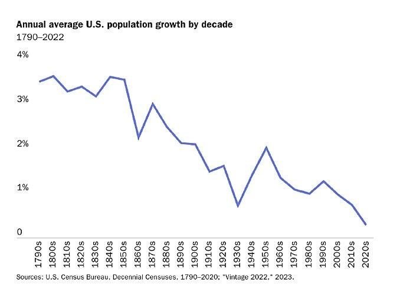

## Table of Contents

## What is immigration and how is it defined?

Immigration is when people move from one country to another to live there permanently. It's a big decision that can change someone's life a lot. People might move to find better jobs, to be safe, or to be with their family. When someone moves to a new country, they might need to learn a new language and get used to different ways of living.

Countries have rules about who can come in and live there. These rules are called immigration laws. Some countries make it easy for people to move there, while others have strict rules. When someone wants to move, they usually need to apply for permission, like a visa or a green card. This process can take a long time and can be hard to do.

## How does immigration contribute to the population growth of a country?

Immigration can make a country's population grow. When people move to a new country and stay there, they add to the number of people living in that country. If more people come in than leave, the population will get bigger. This is important because it can help fill jobs and keep the economy strong, especially in countries where not enough babies are being born.

Sometimes, countries need more workers because their own people are getting older and retiring. Immigrants can help by taking these jobs and paying taxes, which helps the country's economy. So, immigration not only increases the number of people but also helps the country in other ways, like supporting businesses and services that need more people to work.

## What are the basic economic theories related to immigration?

One basic economic theory about immigration is called the "push-pull" theory. This theory says that people move from one place to another because of "push" factors in their home country, like war or no jobs, and "pull" factors in the new country, like better jobs or safety. When people move to a new country for work, they can help the economy by filling jobs that need workers. This can make the economy grow because more people are working and spending money.

Another theory is about the impact of immigration on wages and jobs. Some people think that when immigrants come to a country, they might take jobs away from people who already live there and make wages go down because there are more people looking for work. But other people believe that immigrants create new jobs because they start businesses or spend money on things they need. So, while some people might feel competition for jobs, the overall economy can still benefit from the new energy and ideas that immigrants bring.

Overall, these theories show that immigration can have both good and bad effects on a country's economy. It's important for countries to think about these effects when they make rules about who can come in and live there. By understanding these theories, governments can make better decisions that help both the immigrants and the people already living in the country.

## How does immigration affect the labor market in the host country?

Immigration can change the labor market in the country where people move to. When immigrants come to a new country, they often look for jobs. If there are not enough workers in certain jobs, like in construction or farming, immigrants can help fill these jobs. This can be good for the economy because businesses can keep working and making things. But sometimes, if a lot of immigrants come at once, it might make it harder for people who already live there to find jobs, especially if they are looking for the same kinds of work.

Immigrants can also start their own businesses, which can create new jobs for everyone. When they start businesses, they hire people and help the economy grow. Also, immigrants spend money on things they need, like food and houses, which can help other businesses and create more jobs. But, if too many people are looking for work at the same time, it might make wages go down because businesses can pay less when there are a lot of people wanting jobs. So, immigration can help the labor market by filling jobs and creating new ones, but it can also make it harder for some people to find work and might lower wages.

## What role do immigrants play in entrepreneurship and innovation?

Immigrants often start their own businesses when they move to a new country. They bring new ideas and ways of doing things that can help the economy grow. When immigrants start businesses, they create jobs for other people, not just for themselves. This can help the whole community because more people are working and spending money. Many famous companies were started by immigrants, showing how important they are for entrepreneurship.

Immigrants also help with innovation. They come from different places and have different experiences, which can lead to new inventions and ways of solving problems. When immigrants work in places like tech companies or universities, they can bring fresh ideas that help create new products or improve old ones. This can make the country more competitive in the world and help it grow. So, immigrants play a big role in making new businesses and coming up with new ideas.

## How does immigration impact the demand for goods and services?

When immigrants move to a new country, they need things like food, clothes, and a place to live. This means they start buying things, which makes the demand for goods and services go up. If a lot of immigrants come to a country, the demand can go up a lot. This can be good for businesses because they sell more and can grow. It can also mean more jobs because businesses need more workers to make and sell the things people want.

Immigrants can also change what kinds of goods and services people want. They might bring new foods or traditions from their home country, which can make people try new things. This can lead to new kinds of shops or restaurants opening up. Sometimes, this means the country becomes more diverse, with more choices for everyone. So, immigrants not only increase the demand for things but also help make the market more interesting and varied.

## What is the effect of immigration on wages and income inequality?

Immigration can affect wages in different ways. When a lot of immigrants come to a country and start looking for jobs, it can make the job market more competitive. This means that there are more people wanting jobs, so businesses might not have to pay as much. This can make wages go down, especially for jobs that a lot of people want. But, immigrants can also help wages go up in some ways. They might start their own businesses and create new jobs, which can make the economy grow and help wages go up for everyone.

Immigration can also change income inequality. If immigrants mostly take jobs that pay less, it can make the difference between rich and poor people bigger. This is because the people at the bottom might earn even less, while the people at the top keep [earning](/wiki/earning-announcement) a lot. But, if immigrants start businesses or get good jobs, they can help make the economy stronger and maybe help reduce income inequality. It depends on the kinds of jobs immigrants get and how the economy is doing overall.

## How do immigrants influence the fiscal situation of the host country?

When immigrants move to a new country, they can affect the money situation of that country. Immigrants pay taxes just like everyone else. This means they help pay for things like schools, roads, and hospitals. If immigrants are working and paying taxes, they can help the country have more money to spend on these things. But, when immigrants first come, they might need help with things like learning the language or finding a place to live. This can cost money, and the government might have to spend more to help them.

Over time, though, immigrants can help the country's money situation get better. When they work and start businesses, they help the economy grow. This can mean more money for everyone. But, if a lot of immigrants come and they need help right away, it might be hard for the country at first. It's important for the country to have good plans to help immigrants so that everyone can benefit in the long run.

## What are the long-term effects of immigration on economic growth?

Immigration can help a country's economy grow over a long time. When immigrants come to a new country, they often work and start businesses. This means more people are working and making things, which can make the economy bigger. Immigrants also pay taxes, which helps the government have more money to spend on things like schools and roads. Over many years, this can make the country richer and help it grow.

But, immigration can also make things harder at first. When a lot of immigrants come, they might need help with things like learning the language or finding a place to live. This can cost money, and the government might have to spend more to help them. But if the country has good plans to help immigrants, the long-term effects can be good. Immigrants can bring new ideas and ways of doing things, which can make the economy stronger and help it grow over time.

## How does the skill level of immigrants affect their economic impact?

The skill level of immigrants can change how they affect the economy. When immigrants have high skills, like being doctors or engineers, they can help the economy a lot. They can fill important jobs that need special skills. This can make businesses grow and help the country make more money. High-skilled immigrants might also start their own businesses, which can create new jobs and help the economy even more.

On the other hand, when immigrants have lower skills, they might take jobs that pay less, like working in restaurants or cleaning. This can help fill jobs that need workers, but it might also make wages go down for those jobs because there are more people wanting to work. But even low-skilled immigrants can help the economy by spending money on things they need, like food and clothes. Over time, as they learn new skills or start their own businesses, they can help the economy grow too.

## What are the differences in economic impact between legal and illegal immigration?

Legal immigrants come to a country with permission, which means they can work and pay taxes right away. This can help the economy because they fill jobs and help businesses grow. Legal immigrants can also get help from the government if they need it, like learning the language or finding a place to live. Over time, legal immigrants can start their own businesses and create new jobs, which makes the economy stronger. They also pay into social security and other programs, which helps the country have more money for everyone.

Illegal immigrants come to a country without permission, so they might not be able to work legally at first. This can make it harder for them to help the economy because they might not be able to pay taxes or get help from the government. But, many illegal immigrants still work and spend money on things they need, like food and clothes. This can help the economy in some ways, but it can also make it harder for the government to plan and spend money. Over time, if illegal immigrants become legal, they can help the economy more by working legally and paying taxes.

## How do international studies and data support or challenge the economic benefits of immigration?

International studies and data show that immigration can help a country's economy grow. Many studies have found that immigrants fill important jobs and start new businesses. This can make the economy bigger because more people are working and making things. Immigrants also pay taxes, which helps the government have more money to spend on things like schools and roads. For example, a study by the National Academies of Sciences, Engineering, and Medicine in the United States found that over time, the positive effects of immigration on the economy are usually bigger than the costs.

But, some studies also show that immigration can make things harder at first. When a lot of immigrants come to a country, they might need help with things like learning the language or finding a place to live. This can cost money, and the government might have to spend more to help them. Also, some studies have found that immigration can make wages go down for some jobs because there are more people wanting to work. But, if the country has good plans to help immigrants, the long-term effects can be good. Overall, the data shows that immigration can help the economy grow over time, but it's important for countries to manage it well.

## References & Further Reading

[1]: Borjas, G. J. (2014). ["Immigration Economics."](https://www.hup.harvard.edu/books/9780674049772) Harvard University Press.

[2]: Kerr, W. (2019). ["The Gift of Global Talent: How Migration Shapes Business, Economy & Society."](https://www.sup.org/books/title?id=29770) Stanford University Press.

[3]: National Academies of Sciences, Engineering, and Medicine. (2017). ["The Economic and Fiscal Consequences of Immigration."](https://nap.nationalacademies.org/catalog/23550/the-economic-and-fiscal-consequences-of-immigration) The National Academies Press.

[4]: Griffin, J. E., & Oomen, R. C. A. (2011). ["Covariance Measurement in the Presence of Non-Synchronous Trading and Market Microstructure Noise."](https://papers.ssrn.com/sol3/papers.cfm?abstract_id=912541) The Review of Financial Studies, 24(5), 1570-1614.

[5]: Choi, A., & Kim, Y. (2021). ["The Impact of Algorithmic Trading on Liquidity Commonality."](https://link.springer.com/article/10.1007/s10690-021-09353-5) Journal of Financial Markets, 52, 100585.

[6]: Zeng, Y., & Lee, C. J. (2014). ["Algorithmic Trading and Participating in Financial Markets: The Case of China."](https://www.science.org/doi/10.1126/science.abq1346) Journal of Economic Surveys, 28(4), 682-711.