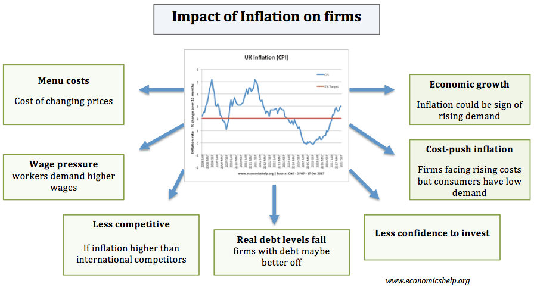

## Table of Contents

## What is inflation and how is it measured?

Inflation is when the prices of things we buy, like food and clothes, go up over time. It means that the money we have can buy less than it used to. For example, if a candy bar cost $1 last year and now it costs $1.10, that's inflation. It happens for many reasons, like when there's more money around than there are things to buy, or when it costs more to make things.

To measure inflation, people look at the prices of a bunch of different things that people usually buy. They use something called the Consumer Price Index, or CPI. The CPI tracks the prices of things like groceries, gas, and rent. By comparing the CPI from one year to the next, we can see how much prices have gone up and figure out the inflation rate. If the CPI goes up by 2% in a year, then the inflation rate is 2%. This helps us understand how fast prices are rising and how it affects our money.

## How does inflation affect the cost of living?

Inflation makes the cost of living go up because everything starts to cost more money. When prices rise, the same amount of money buys less than it used to. For example, if you used to spend $100 on groceries each week, but now because of inflation, the same groceries cost $110, you need more money to keep up with your usual spending. This means that if your income doesn't go up as fast as inflation, you might have to cut back on some things or find ways to earn more money.

Over time, inflation can make a big difference in how much it costs to live. If inflation is high, the price of things like rent, food, and gas can go up a lot, making it harder for people to afford their basic needs. This is especially tough for people on fixed incomes, like retirees, because their money doesn't stretch as far. Governments and central banks try to keep inflation at a level that's not too high or too low, so that people can plan their lives and businesses can grow without too much trouble.

## What are the different types of inflation?

There are different kinds of inflation, and they happen for different reasons. One type is called demand-pull inflation. This happens when people want to buy more stuff than what's available. Imagine if everyone suddenly wanted to buy a new toy, but there weren't enough toys to go around. The price of the toy would go up because so many people want it. Another type is cost-push inflation. This happens when it costs more to make things. If the price of the materials to make a toy goes up, then the price of the toy will go up too, even if people aren't buying more of them.

There's also built-in inflation, which happens because people expect prices to keep going up. If workers think prices will be higher next year, they might ask for higher wages now. When they get higher wages, they can spend more money, which can push prices up even more. This can create a cycle where wages and prices keep going up together. Lastly, there's hyperinflation, which is when prices go up really, really fast. This is rare, but when it happens, it can make money almost worthless because prices change so quickly that people can't keep up.

These different types of inflation can happen at the same time or one after the other. Understanding them helps people and governments figure out how to deal with rising prices and keep the economy stable.

## How does inflation impact consumer spending and saving?

Inflation can change how people spend their money. When prices go up, the same amount of money buys less than before. This means people might have to spend more to get the things they need, like food and gas. Sometimes, people might decide to buy things sooner rather than later, thinking prices will keep going up. This can lead to more spending now, but it can also mean people have less money left over for other things. If prices keep rising quickly, people might start to worry about their money and spend less, waiting to see what happens.

Inflation also affects how people save their money. When prices go up, the value of the money saved in a bank can go down. If you have $100 in the bank and inflation is 2%, that $100 will only buy as much as $98 could last year. This makes people think about where to keep their money. Some might look for ways to invest it, hoping to earn more than inflation takes away. But if inflation is really high, people might not want to save at all because their money loses value too fast. It's a tricky balance, and people have to think carefully about how to handle their money during times of inflation.

## What role does inflation play in economic recovery?

Inflation can help an economy recover by encouraging people to spend money. When prices are expected to go up, people might buy things sooner rather than later. This can get the economy moving again after a slowdown. More spending means more business for companies, which can lead to more jobs and more money flowing through the economy. Governments and central banks sometimes try to create a little bit of inflation on purpose to help the economy get back on its feet.

But too much inflation can be a problem. If prices rise too quickly, people might start to worry about their money losing value. They might spend less and save more, which can slow down the recovery. It's a delicate balance. Central banks try to keep inflation at a level that helps the economy without causing too many problems. They do this by adjusting interest rates and other tools to manage how fast prices are rising. Finding the right amount of inflation is key to helping an economy recover without causing new issues.

## How do central banks use monetary policy to manage inflation during economic recovery?

Central banks use something called monetary policy to manage inflation during economic recovery. This means they control things like interest rates to influence how much money people spend and save. If they want to fight inflation, they might raise interest rates. Higher interest rates make it more expensive to borrow money, so people might spend less and save more. This can help slow down rising prices. On the other hand, if they want to help the economy recover faster, they might lower interest rates. Lower rates make borrowing cheaper, so people might spend more, which can get the economy moving again.

But it's not just about interest rates. Central banks also use other tools, like buying and selling government bonds. When they buy bonds, they put more money into the economy, which can help it grow. When they sell bonds, they take money out, which can help control inflation. It's all about finding the right balance. Central banks watch the economy closely and adjust their policies to keep inflation at a level that helps the economy recover without causing too many problems. This way, they try to make sure that prices rise at a steady pace, which is good for both businesses and people.

## What are the effects of inflation on business investment and growth?

Inflation can make businesses think twice about investing. When prices go up, it costs more to buy the things they need to make their products. This can make it harder for businesses to plan for the future because they're not sure how much things will cost. If inflation is high, businesses might decide to wait before making big investments, like buying new machines or opening new stores. They might worry that their money won't go as far, and they could lose money if prices keep going up.

On the other hand, a little bit of inflation can actually help businesses grow. If people expect prices to go up, they might buy things sooner, which can mean more sales for businesses. This can encourage businesses to invest in new projects because they see more people spending money. But it's all about finding the right balance. If inflation is too high, it can scare businesses away from investing. Central banks try to keep inflation at a level that helps businesses feel confident enough to invest and grow, without prices rising too fast.

## How does inflation influence employment and wage growth during economic recovery?

Inflation can have a big effect on jobs and how much people get paid during an economic recovery. When prices start to go up, businesses might need to hire more people to keep up with the demand for their products. If people are buying more because they expect prices to keep rising, companies might need extra workers to make and sell their stuff. This can lead to more jobs and lower unemployment. But if inflation gets too high, businesses might start to worry about their costs going up too. They might not want to hire as many new people or might even have to let some workers go if they can't afford to keep paying them.

Wage growth is also tied to inflation. When prices go up, workers might ask for higher pay to keep up with the cost of living. If businesses are doing well because of more sales, they might be able to give their workers raises. This can help people feel like they're keeping up with inflation. But if inflation is too high and businesses are struggling, they might not be able to give big raises. Sometimes, wages might not go up as fast as prices, which can make it harder for people to afford things. Central banks try to manage inflation so that it helps the economy recover without making it too hard for businesses to pay their workers more.

## What are the historical examples of inflation affecting economic recovery?

After World War II, many countries like the United States and Europe saw inflation as they tried to rebuild their economies. Prices went up because there was a lot of demand for goods, but not enough stuff to buy. Governments and central banks used different tools to manage this inflation. In the U.S., the Federal Reserve kept interest rates low to help the economy grow, but they also had to raise them later to control rising prices. This helped the economy recover by encouraging spending and investment, but it also showed how important it is to keep inflation in check.

Another big example is the 1970s in the United States, a time known as stagflation. During this period, the economy was not growing well, and at the same time, prices were going up a lot. This made it hard for people to find jobs and for businesses to invest. The government tried different things to fix it, but it took a while to get the economy back on track. The Federal Reserve had to raise interest rates a lot to fight inflation, which slowed down the economy even more before things started to get better. This showed how tricky it can be to manage inflation during tough economic times.

## How do different economic theories explain the relationship between inflation and economic recovery?

Different economic theories have different ways of explaining how inflation and economic recovery work together. One theory, called Keynesian economics, says that a little bit of inflation can help an economy recover. Keynesians think that when prices go up a bit, it can encourage people to spend money now instead of saving it for later. This spending can help businesses grow and create more jobs. But if inflation gets too high, it can cause problems because people might start to worry about their money losing value and spend less.

Another theory, called monetarism, focuses more on the amount of money in the economy. Monetarists, like Milton Friedman, believe that inflation happens when there's too much money chasing too few goods. They think that to help the economy recover, central banks should control the money supply carefully. If they keep inflation low and steady, it can create a stable environment where businesses feel safe to invest and grow. But if the money supply grows too fast, it can lead to high inflation, which can hurt the recovery by making people less willing to spend and invest.

## What are the potential long-term consequences of high inflation on economic stability?

High inflation can make it hard for an economy to stay stable over the long term. When prices go up a lot, people might start to lose trust in their money. They might spend it quickly before it loses more value, which can make inflation even worse. This can lead to a cycle where prices keep going up and up, making it hard for people to plan for the future. Businesses might not want to invest in new projects because they're not sure what things will cost next year. This can slow down the economy and make it harder for it to grow.

If high inflation goes on for a long time, it can also make it tough for people to save money. The money they put in the bank might not be worth as much when they take it out because prices have gone up so much. This can make people feel like they can't get ahead, no matter how hard they work. Governments and central banks have to work hard to keep inflation under control so that the economy can stay stable. If they don't, high inflation can cause big problems that take a long time to fix.

## How can governments and policymakers mitigate the negative impacts of inflation on economic recovery?

Governments and policymakers can help control inflation during economic recovery by using different tools. One way is by adjusting interest rates. If inflation is too high, they might raise interest rates to make borrowing money more expensive. This can slow down spending and help keep prices from going up too fast. On the other hand, if they want to help the economy grow, they might lower interest rates to make borrowing cheaper, which can encourage people to spend more money. Another tool is managing the money supply. By controlling how much money is in the economy, they can help keep inflation at a level that supports recovery without causing too many problems.

Another way to mitigate the negative impacts of inflation is through fiscal policy. This means the government can change how much it spends and how much it taxes. If inflation is high, the government might spend less or raise taxes to take some money out of the economy. This can help slow down rising prices. If the economy needs a boost, the government might spend more on things like building roads or helping people find jobs. This can get more money flowing and help the economy recover. By using these tools carefully, governments and policymakers can help keep inflation in check and support a stable economic recovery.

## References & Further Reading

[1]: ["Inflation: Causes, Consequences, and Cures"](https://archive.org/details/inflationcausesc0000wils), International Monetary Fund.

[2]: Stiglitz, J. E. (1997). ["Reflections on the Natural Rate Hypothesis."](https://www.aeaweb.org/articles?id=10.1257/jep.11.1.3) Brookings Papers on Economic Activity, 1997(1), 295-333.

[3]: ["Algorithmic Trading and Information"](https://faculty.haas.berkeley.edu/hender/ATInformation.pdf) by Terrence Hendershott, Charles M. Jones, and Albert J. Menkveld, The Journal of Finance.

[4]: ["Inflation and Economic Recovery"](https://www.investopedia.com/financial-edge/0212/inflation-and-economic-recovery.aspx) by Jeffrey Sachs, The Journal of Economic Perspectives.

[5]: Brogaard, Jonathan, Terrence Hendershott, and Ryan Riordan. (2014). ["High-Frequency Trading and Price Discovery."](https://papers.ssrn.com/sol3/papers.cfm?abstract_id=1928510) Review of Financial Studies 27(8): 2267-2306.