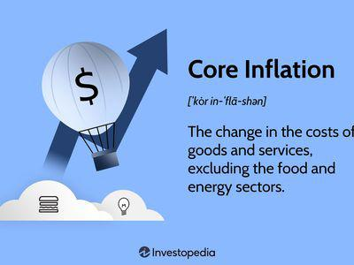

The global economy is in a constant state of flux, shaped by pivotal themes such as economic recovery, inflation, and technological advancements. These elements are crucial in understanding the complex and interconnected nature of modern economics.

Inflation holds a significant presence in the global economic narrative, as it affects the cost of living, business operations, and the formulation of monetary policies across the world. Variations in inflation rates influence consumer purchasing power and dictate the strategic decisions of central banks and policymakers. Controlling inflation is a challenging yet essential task, requiring careful calibration to maintain economic stability and ensure sustainable growth.



Post-crisis economic recovery further underscores the delicate balance needed between managing inflation and fostering growth initiatives. Recovery phases are marked by increased economic activities which signal a resurgence in growth following stagnation or recession. However, this resurgence brings with it the challenge of simultaneously encouraging growth while keeping inflation in check, a task that requires strategic policy interventions.

In recent years, algorithmic trading has become a formidable force in financial markets. By utilizing sophisticated algorithms, traders can manage economic volatility more effectively. This technological innovation provides market participants with the tools to execute trades swiftly and efficiently, thereby enhancing market efficiency and liquidity. Algorithmic trading's potential to adjust swiftly to economic indicators, including inflation, positions it as a vital component in the ongoing evolution of economic management.

In summary, the interplay between economic recovery, the complexities of inflation management, and the technological prowess of algorithmic trading is vital in shaping the future of modern economics. Understanding these dynamics is crucial for developing strategies that foster economic resilience and prosperity in an increasingly interconnected and technologically driven world.

## Table of Contents

## Understanding Economic Recovery

Economic recovery refers to the period after a recession during which economic activity begins to pick up and growth resumes. It signals a shift from economic contraction to expansion, typically marked by improvements in key economic indicators. Gross domestic product (GDP) growth, employment rates, and income levels are closely monitored during recovery periods to assess the health and direction of the economy.

GDP growth is considered one of the most comprehensive indicators of economic recovery. It measures the total value of goods and services produced within a country over a specific time frame. A consistent increase in GDP indicates a strengthening economy, as businesses expand production in response to rising demand. During a recovery, a robust GDP growth rate suggests successful policy interventions and an improving economic climate.

Employment rates are equally critical. High employment levels indicate job creation, increased consumer spending, and economic confidence. Conversely, high unemployment can stifle recovery by reducing consumer spending, thereby slowing economic growth. Governments often implement fiscal policies to spur job creation, while central banks may adjust monetary policies to encourage lending and investment.

Income levels also serve as a barometer for economic recovery. Rising incomes boost consumer confidence and spending, creating a positive feedback loop that further stimulates economic growth. Across different nations, the effectiveness of recovery strategies can vary based on pre-existing economic conditions and structural factors.

Government fiscal policies play a crucial role in driving economic recovery. These policies might include increased government spending, tax cuts, and other measures designed to spur economic activity and employment. By injecting capital into the economy, governments aim to bolster demand and encourage investment.

Central bank monetary policies are also vital in facilitating recovery. Central banks may employ tools such as [interest rate](/wiki/interest-rate-trading-strategies) adjustments and quantitative easing to manage [liquidity](/wiki/liquidity-risk-premium) and credit flow. Lowering interest rates can stimulate borrowing and investment, while quantitative easing can support financial markets by increasing the money supply and encouraging lending.

A successful economic recovery often necessitates a delicate balance between stimulating growth and controlling inflation. Excessive inflation can undermine purchasing power and economic stability, thus counteracting recovery efforts. Policymakers must carefully calibrate their strategies to ensure that initiatives to boost growth do not inadvertently lead to runaway inflation.

## Inflation: A Double-Edged Sword

Inflation is characterized by the general increase in prices and the erosion of purchasing power within an economy. It is a complex economic phenomenon that can have both beneficial and detrimental effects, depending on its magnitude and the context within which it occurs.

Controlled inflation, typically maintained at a low and stable rate, can be advantageous for economic growth. Economists argue that moderate inflation can stimulate spending and investment, as consumers and businesses are incentivized to purchase goods and invest rather than hold onto cash, which would depreciate in value over time. This positive impact on demand can support businesses, fostering job creation and ultimately contributing to economic recovery.

However, when inflation becomes uncontrolled, it can lead to hyperinflation, where prices rise rapidly and uncontrollably. This scenario results in severe economic instability and a sharp decline in the purchasing power of money. Historical instances, such as the hyperinflation experienced in Zimbabwe during the late 2000s, illustrate the devastating effects that can arise from uncontained inflation. Hyperinflation can decimate savings and cripple the functioning of an economy, leading to a loss of confidence in the currency and requiring extreme measures to restore economic stability.

Central banks are tasked with the significant responsibility of maintaining inflation within target levels to prevent it from spiraling out of control. They employ various monetary policy tools, with interest rate adjustments being one of the primary mechanisms. By increasing interest rates, central banks can reduce borrowing and spending, thereby cooling down an overheating economy and curbing inflation. Conversely, cutting interest rates can spur economic activity by making borrowing cheaper, useful in times of stagnation.

Another tool in the arsenal of central banks is quantitative easing (QE), which involves the purchase of government securities or other securities from the market to increase the money supply and encourage lending and investment. This tool is often used in conjunction with low-interest rates to further stimulate an economy facing deflationary pressures.

In summary, while inflation is a natural component of economic cycles, its management is essential to ensure it remains a force that supports economic growth rather than undermining it. Central banks play a crucial role in this balancing act, using interest rates and quantitative easing, among other tools, to maintain inflation at manageable levels.

## Economic Challenges in Controlling Inflation

Controlling inflation presents numerous challenges to countries, largely due to the unpredictability of economic shocks. These shocks may arise from various sources, including geopolitical tensions, natural disasters, or sudden shifts in consumer demand, each of which can disrupt economic stability and lead to inflationary pressures that are difficult to anticipate. These unforeseen events can lead to spikes in the prices of goods and services, complicating efforts by policymakers to maintain stable inflation rates.

The interconnected nature of today's global economy further complicates inflation control. Inflationary pressures in one region can have far-reaching impacts on other economies due to trade links, capital flows, and exchange rates. For instance, a surge in commodity prices in a major exporting country can lead to increased production costs globally, contributing to higher consumer prices elsewhere. This interconnectedness necessitates a coordinated policy response from different countries to mitigate spillover effects, enhancing the complexity of managing inflation on a global scale.

Tailoring strategies for controlling inflation to specific economic contexts and conditions is crucial. Traditional tools, such as modifying interest rates or employing quantitative easing, may not be equally effective across different economic situations. For instance, while raising interest rates can curb inflation by reducing consumer spending and slowing down economic growth, it may also stifle recovery efforts in fragile economies. Therefore, policymakers must carefully assess domestic economic conditions, such as unemployment rates, wage growth, and consumer confidence, to implement measures that do not counteract growth objectives while controlling inflation.

Furthermore, structural factors, such as supply chain disruptions, demographic changes, or technological advancements, play a significant role in influencing inflation. Policymakers must adapt their strategies to address these longer-term trends, which require a deep understanding of underlying economic dynamics and careful consideration of both short-term and long-term policy impacts. Through careful adjustment and fine-tuning of economic policies, governments can better manage inflation, providing a stable environment for economic growth and development.

## The Role of Algorithmic Trading in Modern Economics

Algorithmic trading employs sophisticated computer algorithms to automate and streamline the trading process in financial markets. This technology-driven approach transforms how trades are executed, significantly enhancing market efficiency and liquidity. By executing trades at optimal prices and speeds, [algorithmic trading](/wiki/algorithmic-trading) minimizes the time lag between market decision-making and execution, ensuring that traders can capitalize on even the smallest price differentials. 

The capacity of algorithmic systems to rapidly analyze vast amounts of data is one of their defining attributes. These systems can process various economic indicators, including inflation rates, interest rate changes, and economic forecasts, allowing them to adjust trading strategies swiftly. This adaptability is crucial in volatile markets where economic indicators can fluctuate rapidly, impacting asset prices and market conditions. For instance, an algorithm may be programmed to trigger buy or sell orders based on specific inflation thresholds or changes in interest rates, thus aligning trading activities with prevailing economic conditions.

In modern financial markets, traders and investors increasingly rely on algorithmic trading to manage risks and identify market opportunities. By analyzing historical data and current market conditions, algorithms can identify patterns and trends that might be challenging for human traders to discern. This risk management capability is augmented by the algorithm's ability to operate across various asset classes, geographic markets, and time zones, thereby offering a comprehensive trading solution.

Algorithmic trading is not only beneficial for individual traders and investors; it plays a pivotal role in shaping broader market dynamics. The increased liquidity and reduced bid-ask spreads resulting from algorithmic trading contribute to more transparent and competitive markets. This transparency can lead to fairer pricing of assets and more efficient allocation of resources within the economy.

Furthermore, the expansion of algorithmic trading necessitates robust technological infrastructure and regulatory frameworks. As the reliance on these algorithms grows, there is a corresponding need for enhanced cybersecurity measures to protect sensitive data and trading systems from potential breaches. Additionally, regulators must ensure that algorithmic trading practices do not exacerbate market [volatility](/wiki/volatility-trading-strategies) or lead to unethical trading behaviors, such as market manipulation or the creation of unfair trading advantages.

In conclusion, algorithmic trading is a cornerstone of modern financial markets, offering substantial advantages in terms of efficiency, data processing, and risk management. As these systems continue to evolve and integrate more complex data inputs, their influence on economic activities and market structures will only increase. However, the challenges of maintaining equitable and secure trading environments must be continually addressed to harness the full potential of sophisticated algorithmic trading systems.

## Algorithmic Trading: Economic Implications and Advantages

Algorithmic trading, also known as algo trading, leverages computer algorithms to execute trades at speeds and accuracies beyond human capabilities. One of the primary economic advantages of algorithmic trading is the significant reduction in transaction costs. By automating trade execution, these systems minimize the need for manual intervention, thereby reducing the possibility of human error and the associated costs. Algorithms can efficiently process numerous trades simultaneously, optimizing execution rates and ensuring transactions occur at the most favorable prices. This efficiency not only benefits individual traders but also enhances overall market liquidity, making markets more competitive and transparent.

The adoption of algorithmic strategies plays a transformative role in reshaping financial markets. These systems enable a more competitive environment by leveling the playing field; advanced execution techniques such as time-weighted average price (TWAP) and [volume](/wiki/volume-trading-strategy)-weighted average price (VWAP) are utilized to achieve better trading outcomes. Such strategies can be coded in Python, which is frequently used for developing and testing algorithmic trading systems:

```python
def calculate_vwap(prices, volumes):
    total_value = sum(p * v for p, v in zip(prices, volumes))
    total_volume = sum(volumes)
    return total_value / total_volume if total_volume else 0

prices = [100, 102, 101, 105]
volumes = [200, 150, 180, 220]
vwap = calculate_vwap(prices, volumes)
print("VWAP:", vwap)
```

Algorithmic trading also provides robustness against market shocks due to its rapid adaptability. These systems continuously analyze large sets of data, allowing them to react swiftly to changes in economic indicators or market conditions. This adaptability can mitigate risk and exploit market opportunities that may arise suddenly.

Despite these advantages, the reliance on algorithmic trading does introduce regulatory and ethical considerations. The speed at which these systems operate can contribute to market volatility, making it essential for regulators to monitor and manage these activities. Flash crashes, where markets plunge in a matter of minutes due to algorithmic errors, underscore the potential risks involved. Furthermore, the ethics of deploying sophisticated algorithms need careful scrutiny, ensuring that their use does not lead to unfair market manipulation or exploitation.

In conclusion, while algorithmic trading introduces substantial benefits to financial markets, such as reduced costs and enhanced efficiency, it is crucial to balance these with rigorous regulatory oversight and ethical frameworks to safeguard the integrity of market operations.

## Conclusion

The intersection of economic recovery, inflation, and technology through algorithmic trading marks a transformative phase in modern economics. This convergence reflects a dynamic shift where traditional economic variables are increasingly influenced by technological advancements. Algorithmic trading, in particular, offers significant benefits by enhancing market efficiency and liquidity. These automated systems execute trades at optimal prices, providing robustness against market volatility and enabling rapid adaptability to changing economic indicators, such as inflation rates. 

However, despite the clear advantages of algorithmic trading, it is imperative that regulators ensure these systems operate within ethical and fair frameworks. The speed and complexity of algorithm-based transactions can pose challenges in terms of market fairness and transparency. Effective regulation must address these concerns, promoting a balanced approach that safeguards market integrity while encouraging innovation.

Understanding the impact of inflation on economic recovery is crucial for policymakers striving to create balanced economic environments. Inflation can erode purchasing power and hinder growth prospects if not adequately controlled. By monitoring inflation trends and employing suitable monetary policies, policymakers can facilitate a steady path to recovery while minimizing economic disruptions.

As technology continues to evolve, its influence on economic management and recovery is set to grow significantly. Emerging technologies hold the potential to further refine economic strategies, providing sophisticated tools for data analysis and decision-making. Policymakers and industry stakeholders must remain vigilant and proactive, embracing these technological advancements while ensuring they contribute positively to sustainable economic growth. In this new era, the collaboration between economic policy and technology will be pivotal in navigating the complexities of global markets.

## References & Further Reading

[1]: ["Inflation: Causes, Consequences, and Cures"](https://archive.org/details/inflationcausesc0000wils), International Monetary Fund.

[2]: Stiglitz, J. E. (1997). ["Reflections on the Natural Rate Hypothesis."](https://www.aeaweb.org/articles?id=10.1257/jep.11.1.3) Brookings Papers on Economic Activity, 1997(1), 295-333.

[3]: ["Algorithmic Trading and Information"](https://faculty.haas.berkeley.edu/hender/ATInformation.pdf) by Terrence Hendershott, Charles M. Jones, and Albert J. Menkveld, The Journal of Finance.

[4]: ["Inflation and Economic Recovery"](https://www.investopedia.com/financial-edge/0212/inflation-and-economic-recovery.aspx) by Jeffrey Sachs, The Journal of Economic Perspectives.

[5]: Brogaard, Jonathan, Terrence Hendershott, and Ryan Riordan. (2014). ["High-Frequency Trading and Price Discovery."](https://papers.ssrn.com/sol3/papers.cfm?abstract_id=1928510) Review of Financial Studies 27(8): 2267-2306.