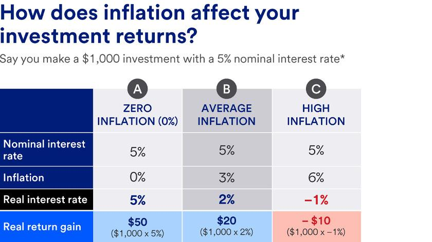

Fixed-income investments, inflation, economic impacts, and algorithmic trading represent crucial components of the modern financial landscape. Understanding these elements is essential for investors seeking to navigate and optimize their investment strategies in an ever-evolving economic environment. Fixed-income investments, such as bonds and certificates of deposit (CDs), offer predictable returns and are often perceived as lower-risk alternatives to stocks. However, their efficacy is significantly influenced by inflation, which erodes purchasing power and affects the real value of returns.

Inflation, the rate at which the general level of prices for goods and services rises, affects the economic landscape by diminishing the purchasing power of money. This, in turn, impacts consumer behavior and business investment strategies. As inflation rises, it often leads to higher interest rates, which inversely affect bond prices, creating a challenging scenario for fixed-income investors. Central banks, utilizing tools like interest rate adjustments, play a critical role in managing inflation to maintain economic stability.



In recent years, algorithmic trading has gained momentum as a modern approach in financial markets. This strategy involves the use of complex algorithms to make trading decisions at speeds and volumes impossible for human traders. Algorithmic trading offers advantages such as speed, efficiency, and the potential to hedge against inflation risk, making it a valuable tool for optimizing investment portfolios.

These elements are interconnected in today's economic landscape, where inflationary pressures are a constant concern and technological advancements offer new tools for managing investment risk. The understanding of how inflation affects fixed-income investments, coupled with the use of algorithmic trading, is increasingly important for investors aiming to protect and grow their wealth. This article aims to explore the effects of inflation on fixed-income investments and examine the role algorithmic trading plays in mitigating these effects, providing insights into how investors can adapt to these challenges and make informed decisions in an uncertain economic climate.

## Table of Contents

## Understanding Fixed-Income Investments

Fixed-income investments are a class of assets that offer a predetermined periodic income and return of principal at maturity. These investments are commonly issued by governments, corporations, or other entities seeking to raise capital. Examples include bonds, certificates of deposit (CDs), and treasury bills. Bonds can be further categorized into several types, such as government bonds, municipal bonds, and corporate bonds, each varying in terms of issuer, risk profile, and yield.

The primary benefit of fixed-income investments lies in their ability to provide predictable returns. When an investor acquires a fixed-income security, they typically receive regular interest payments, known as coupon payments, until the security reaches its maturity date. At maturity, the principal amount is returned to the investor. This predictable income stream is particularly appealing to retirees or risk-averse investors seeking stability in their portfolios.

Fixed-income investments are traditionally considered lower-risk compared to stocks. The expected rate of return on stocks is generally higher than that of fixed-income securities due to the higher risk associated with stocks. However, this higher expected return comes with increased [volatility](/wiki/volatility-trading-strategies). Fixed-income securities, on the other hand, provide more stable returns, making them a safer option during periods of market turbulence. This is quantitatively represented by the lower standard deviation of returns, which measures the variation in returns for a given security. For instance, the volatility of long-term government bonds is generally lower compared to that of equities.

The risk-return profile of fixed-income investments makes them a vital component of diversified investment portfolios. They often act as a hedge against stock market downturns, providing balance and reducing overall portfolio risk. Thus, despite the lower returns compared to equities, the inclusion of fixed-income assets can enhance the risk-adjusted returns of an investment strategy.

## The Impact of Inflation on Fixed-Income Investments

Inflation is a critical [factor](/wiki/factor-investing) that directly affects the returns of fixed-income investments by eroding their purchasing power. Fixed-income securities such as bonds and certificates of deposit (CDs) traditionally offer set interest payments over time. However, when inflation rates rise, the real value of these payments diminishes. In essence, though the nominal amount received by the investor remains the same, the actual goods and services that can be purchased with that amount decrease.

To quantify this impact, consider the concept of real returns, which adjusts nominal returns for inflation. The formula for real return is:

$$
\text{Real Return} = \frac{1 + \text{Nominal Return}}{1 + \text{Inflation Rate}} - 1
$$

For instance, if a bond yields a nominal return of 5% but the inflation rate stands at 3%, the real return is calculated as follows:

$$
\text{Real Return} = \frac{1 + 0.05}{1 + 0.03} - 1 \approx 0.0194 \, \text{or} \, 1.94\%
$$

This calculation illustrates how inflation erodes the purchasing power and reduces the effective returns on fixed-income investments.

Furthermore, there exists an inverse relationship between interest rates and bond prices. When inflation rises, central banks often respond by increasing interest rates to temper economic activity and control inflation. When interest rates rise, the fixed payments of existing bonds become less attractive compared to new bonds issued at higher rates, resulting in a decrease in the market price of existing bonds. Conversely, if inflation expectations lower interest rates, bond prices may rise.

For example, consider a government bond with a face value of $1,000, a nominal annual coupon rate of 4%, and a 10-year maturity. If new bonds are issued with a coupon rate of 5% due to rising interest rates, the older bond's price must decrease to offer a competitive yield. This adjustment creates potential capital losses for investors who sell bonds before maturity, hence directly impacting the investment's return.

Historically, inflationary periods have posed significant challenges for fixed-income portfolios. During the 1970s, a time of high inflation in many developed economies, real returns on bonds and similar investments were substantially diminished. As inflation erodes fixed payments' value, investors may find their purchasing power significantly decreased over time, necessitating strategies to mitigate these effects.

## Economic Implications of Inflation

Inflation is a significant factor that influences various aspects of the economy, particularly in shaping consumption and investment habits. It is essentially the rate at which the general level of prices for goods and services rises, subsequently eroding purchasing power. As inflation increases, the real value of money decreases, prompting consumers to alter their spending habits. Higher inflation typically leads to a reduction in the purchasing power of consumers, which may consequently result in decreased overall consumption. Conversely, in some cases, consumers might decide to purchase goods immediately to avoid future price increases, a behavior that can inject short-term demand into the economy but may not be sustainable long-term.

Investment behavior is also significantly impacted by inflation. As inflation rises, the expected real returns on investments such as bonds decline, because the fixed interest payments they provide lose value in terms of purchasing power. This erosion of real returns can shift investor preference towards assets that historically offer better protection against inflation, such as equities or real estate. However, this shift might also [carry](/wiki/carry-trading) higher volatility and risk.

Central banks play a crucial role in managing inflation through the adjustment of interest rates. Typically, to combat rising inflation, central banks may choose to increase interest rates. An increase in interest rates makes borrowing more expensive, which can reduce consumer spending and business investments, helping to cool down an overheating economy. The Taylor Rule is often used as a guideline for setting interest rates in response to changes in economic conditions. The rule can be expressed as:

$$
i_t = r_t^* + \pi_t + a(\pi_t - \pi_t^*) + b(y_t - y_t^*)
$$

Where:
- $i_t$ is the nominal interest rate.
- $r_t^*$ is the real interest rate.
- $\pi_t$ is the rate of inflation.
- $\pi_t^*$ is the target inflation rate.
- $y_t$ is the logarithm of real GDP.
- $y_t^*$ is the logarithm of potential output.

Historical trends illustrate various economic outcomes driven by inflationary periods. For instance, the 1970s experienced stagflation, a situation characterized by high inflation and stagnant economic growth, which led to significant economic upheaval and policy shifts. More recently, the low inflation period that followed the 2008 financial crisis saw central banks maintaining lower interest rates to stimulate growth, demonstrating their reliance on monetary policy tools to foster economic stability.

In conclusion, inflation's effect on consumption and investment is multifaceted, often prompting shifts in both individual and institutional behavior. Understanding these dynamics is vital for policymakers and investors alike, as it informs the strategic decisions necessary to maintain economic equilibrium. Central banks' vigilant monitoring and adjusting of interest rates serve as a potent mechanism for controlling inflation, aiming to safeguard both economic growth and price stability amidst evolving financial landscapes.

## Algorithmic Trading: A Modern Approach

Algorithmic trading refers to the use of computer algorithms to execute trading orders with speed and precision that surpass human capabilities. These algorithms can analyze market conditions and historical data to make trading decisions based on pre-set parameters or [machine learning](/wiki/machine-learning) models. This method of trading has gained significant traction within financial markets due to its ability to process vast amounts of information and execute trades at speeds that are impossible for human traders. 

The popularity of [algorithmic trading](/wiki/algorithmic-trading) is largely attributed to its advantages, which include enhanced speed, accuracy, and efficiency. By automating trading decisions, it reduces the likelihood of errors caused by human emotions such as fear or greed. Algorithms are designed to identify profitable opportunities based on statistical analysis and historical patterns, allowing them to swiftly capitalize on short-lived market inefficiencies. Moreover, algorithmic trading minimizes the market impact of trades by executing orders incrementally and at optimal times, thereby reducing transaction costs. 

When it comes to hedging against inflation risk, algorithmic trading strategies can be particularly effective. Inflation affects fixed-income investments by eroding their purchasing power; thus, investors seek strategies to mitigate this risk. Algorithms can be programmed to respond to changes in macroeconomic indicators that signify inflationary trends, such as the Consumer Price Index (CPI) or Producer Price Index (PPI). For instance, an algorithm might dynamically adjust a portfolio by rebalancing between inflation-sensitive assets and more stable securities.

Python code can be utilized to create a basic algorithm for inflation hedging:

```python
import numpy as np

# Example function to simulate inflation indicator responses
def inflation_hedge_strategy(cpi, bond_prices, threshold=0.03):
    """
    Adjusts a portfolio based on CPI data to hedge against inflation.

    :param cpi: An array of CPI values
    :param bond_prices: An array of bond prices
    :param threshold: The CPI threshold indicating significant inflation
    :return: Adjusted bond prices
    """
    adjusted_prices = []

    for i in range(len(cpi)):
        if cpi[i] > threshold:
            # Simulating the sale of bonds if inflation exceeds threshold
            adjusted_prices.append(bond_prices[i] * 0.95)
        else:
            # Maintaining bond prices if inflation is not significant
            adjusted_prices.append(bond_prices[i])

    return np.array(adjusted_prices)

# Example data
cpi_data = np.array([0.02, 0.025, 0.035, 0.04])  # Consumer Price Index values
bond_price_data = np.array([100, 102, 104, 106])  # Corresponding bond prices

# Execute the inflation hedge strategy
adjusted_bond_prices = inflation_hedge_strategy(cpi_data, bond_price_data)
print(adjusted_bond_prices)
```

In this example, the algorithm monitors CPI data and adjusts bond holdings if inflation surpasses a specified threshold. This rudimentary approach demonstrates how algorithms can proactively manage inflation risk by reallocating assets based on economic conditions. As such, algorithmic trading not only offers the capacity to exploit market efficiencies and reduce transaction costs but also empowers investors to create sophisticated strategies that align with their risk management objectives.

## Integrating Algorithmic Trading with Fixed-Income Investments

Investors are increasingly leveraging algorithmic trading to enhance the performance of fixed-income portfolios. This integration of technology into fixed-income investment strategies allows for considerable optimization in terms of both returns and risk management.

Algorithmic trading employs quantitative models and algorithms to analyze market data, assess market conditions, and execute trades. In the context of fixed-income investments, algorithms play a crucial role in evaluating various factors such as interest rates, macroeconomic indicators, and credit spreads to determine optimal trading opportunities. By rapidly processing vast amounts of market information, algorithms can provide insights into market conditions, enabling investors to time their trades effectively. This capability is particularly advantageous in fixed-income markets, where price movements can be influenced by economic news and monetary policy changes.

Moreover, algorithms can incorporate complex mathematical models to forecast [interest rate](/wiki/interest-rate-trading-strategies) movements and assess yield curves. By continuously monitoring these indicators, algorithmic trading systems can execute trades that capitalize on anticipated shifts in the market, optimizing the yield on fixed-income securities.

For example, one strategy used in algorithmic trading for fixed-income markets is statistical [arbitrage](/wiki/arbitrage). This approach involves identifying price inefficiencies between correlated financial instruments and executing trades to profit from these discrepancies. In the fixed-income sector, [statistical arbitrage](/wiki/statistical-arbitrage) can be implemented by analyzing the historical price relationships between various bonds or bond indices and executing trades when these relationships deviate from their historical norms.

Another example is the utilization of machine learning algorithms for adaptive strategies that adjust trading rules based on new market data. Machine learning models can identify patterns and trends that may not be evident through traditional analysis, allowing for dynamic strategy adjustments in response to evolving market conditions. By continuously learning from new data, these algorithms enhance predictive accuracy, further optimizing fixed-income portfolio returns.

In summary, the integration of algorithmic trading into fixed-income investments empowers investors with the tools to assess market conditions accurately and fine-tune their trading strategies. The ability to swiftly react to market changes, combined with sophisticated quantitative models, maximizes returns and manages risk effectively in a fluctuating economic environment.

## Challenges and Considerations

In the rapidly evolving financial landscape, algorithmic trading presents numerous opportunities, yet it also brings about specific regulatory and technical challenges. As algorithmic trading continues to gain traction, regulators around the world strive to establish comprehensive frameworks to ensure market stability and protect investors. Regulations such as the European Markets in Financial Instruments Directive II (MiFID II) and the SEC's Regulation National Market System (Reg NMS) in the United States are designed to increase transparency, reduce market manipulation, and manage the risks associated with high-frequency trading. Compliance with these regulations requires significant resources, as firms must invest in infrastructure and technology to monitor and report trading activities accurately.

Technically, algorithmic trading demands robust systems capable of executing trades at exceedingly high speeds. These systems must process vast amounts of market data in real-time, necessitating significant computational power and sophisticated data processing techniques. Latency, or delays in data transmission and execution, poses a significant challenge, as even millisecond lags can result in substantial financial losses. Consequently, firms invest heavily in optimizing network connectivity and utilizing advanced programming techniques to minimize latency.

Inflation introduces additional risks and volatility to fixed-income investments. Inflation erodes the real value of the fixed returns generated by these investments, diminishing purchasing power over time. As inflation rates rise, central banks often increase interest rates to control economic expansion. This can lead to an inverse relationship between interest rates and bond prices, resulting in price volatility. For instance, a fixed-income security yielding lower than the inflation rate will cause a negative real return, illustrating the pernicious effects of inflation on such assets.

Mathematically, the real return $R_r$ on a fixed-income investment can be expressed as:

$$
R_r = \frac{1 + R_n}{1 + I} - 1
$$

where $R_n$ is the nominal return and $I$ is the inflation rate. An increase in $I$ results in $R_r$ decreasing, highlighting the importance of considering inflation when evaluating these investments.

Informed decision-making and risk management are paramount in navigating the complexities introduced by algorithmic trading and inflation. Investors and traders must remain vigilant, continuously monitoring economic indicators and adjusting strategies accordingly. Utilizing a diversified investment portfolio can mitigate some risks, spreading exposure across various asset classes to cushion against volatile market conditions. 

Effective risk management strategies often entail predictive modeling and stress testing, allowing investors to evaluate potential adverse scenarios and the resilience of their portfolios. Algorithmic trading systems can be programmed to incorporate such models, automatically adjusting positions to mitigate potential losses. Additionally, leveraging hedging techniques, such as derivatives, can further safeguard investments from adverse market moves.

The integration of technology, economic insight, and strategic foresight is essential for investors to effectively manage the challenges posed by inflation and algorithmic trading. This underscores the necessity of continual learning and adaptation to technological advancements, ensuring that trading strategies remain relevant and effective in the face of evolving market conditions.

## Conclusion

In conclusion, this article has explored the intertwined dynamics of inflation, fixed-income investments, and algorithmic trading, emphasizing their significance in the current economic landscape. Inflation, by eroding the purchasing power of money, poses a fundamental challenge to fixed-income investments, which are typically valued for their predictable returns. The inverse relationship between interest rates and bond prices further complicates this scenario, necessitating a deeper understanding of economic impacts to safeguard real returns.

Amidst economic uncertainty, the adoption of algorithmic trading emerges as a crucial strategy. Algorithmic trading offers advantages such as speed and precision, enabling investors to make informed, timely decisions and hedge against inflation-related risks. By integrating algorithmic strategies with fixed-income investments, investors can optimize their portfolios to better withstand market volatility and exploit fleeting opportunities.

The need for a balanced investment strategy is paramount as market conditions continually evolve. Investors should prioritize continuous learning and adaptation to leverage technological advancements like algorithmic trading effectively. This learning approach not only mitigates risks but also positions investors to capitalize on the symbiotic potential of combining fixed-income stability with algorithmic agility in an ever-shifting economic landscape.

## References & Further Reading

[1]: Bergstra, J., Bardenet, R., Bengio, Y., & Kégl, B. (2011). ["Algorithms for Hyper-Parameter Optimization."](https://papers.nips.cc/paper/4443-algorithms-for-hyper-parameter-optimization) Advances in Neural Information Processing Systems 24.

[2]: ["Advances in Financial Machine Learning"](https://www.amazon.com/Advances-Financial-Machine-Learning-Marcos/dp/1119482089) by Marcos Lopez de Prado

[3]: ["Evidence-Based Technical Analysis: Applying the Scientific Method and Statistical Inference to Trading Signals"](https://www.amazon.com/Evidence-Based-Technical-Analysis-Scientific-Statistical/dp/0470008741) by David Aronson

[4]: ["Machine Learning for Algorithmic Trading"](https://github.com/stefan-jansen/machine-learning-for-trading) by Stefan Jansen

[5]: ["Quantitative Trading: How to Build Your Own Algorithmic Trading Business"](https://www.amazon.com/Quantitative-Trading-Build-Algorithmic-Business/dp/1119800064) by Ernest P. Chan