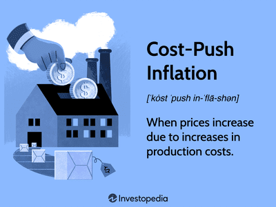

In today's dynamic economic landscape, inflation is a pivotal factor that influences the finances of both borrowers and lenders. As prices rise and purchasing power erodes, the economy experiences shifts that can significantly impact how financial obligations are met and profits are realized. Understanding these shifts is crucial for both parties to successfully navigate the financial complexities that inflation presents. 

Inflation affects borrowing and lending in multiple ways. For borrowers, inflation can reduce the real value of their debt, making it easier to repay with depreciated currency. Conversely, lenders must grapple with the reality of receiving payments in money that has less purchasing power, potentially diminishing their returns. This inherent tension necessitates a deep understanding of inflation trends and measures, such as the Consumer Price Index (CPI) and the Producer Price Index (PPI), which serve as critical indicators for financial planning and strategy.



Furthermore, algorithmic trading, or algo trading, is increasingly playing a role in how market participants react to inflationary trends. By leveraging technology to process vast amounts of financial data in real-time, algo trading strategies can adapt quickly to inflationary pressures, enabling better decision-making and risk management. These algorithms integrate macroeconomic data, including inflation metrics, to optimize trades and improve outcomes, showcasing a modern approach to tackling inflation's challenges.

This article explores the interplay between inflation, borrowers, and lenders, highlighting how algo trading influences these dynamics. By examining this nexus, financial stakeholders can gain insights into how to adapt to inflation and secure favorable positions in markets.

## Table of Contents

## Understanding Inflation

Inflation is a concept that encapsulates the overall increase in the price level of goods and services, resulting in a decrease in currency's purchasing power. It is a critical component of macroeconomic stability and is measured through a variety of indicators that help governments and financial institutions make informed policy decisions.

### Quantity Theory of Money

The quantity theory of money offers a framework to understand the underlying dynamics of inflation. According to this theory, there is a direct relationship between the quantity of money in an economy and the level of prices of goods and services sold. The equation of exchange given by:

$$
MV = PY
$$

where:
- $M$ is the total money supply,
- $V$ is the velocity of money, which is the rate at which money is exchanged,
- $P$ is the average price level,
- $Y$ is the real output, or real GDP, of the economy.

The theory posits that if $M$ increases faster than $Y$, it will lead to an increase in $P$, thereby causing inflation.

### Types of Inflation

Inflation can be categorized into several types based on the driving factors behind the price increases:

1. **Demand-Pull Inflation**: This occurs when the demand for goods and services exceeds supply. It's often described as "too much money chasing too few goods."

2. **Cost-Push Inflation**: This results from an increase in the costs of production, such as wages and raw materials, leading to a decrease in the supply of these goods and services while demand remains constant.

3. **Built-In Inflation**: Often referred to as wage-price inflation, this type happens when businesses increase prices to maintain profit margins after wage increases, leading workers to demand even higher wages, creating a self-sustaining cycle of rising prices.

### Key Indicators of Inflation

Two pivotal indicators are commonly used to measure inflation:

- **Consumer Price Index (CPI)**: CPI measures changes in the price level of a market basket of consumer goods and services purchased by households. It reflects the spending patterns of the population and is a widely used indicator for identifying periods of inflation or deflation.

- **Producer Price Index (PPI)**: PPI measures the average change over time in the selling prices received by domestic producers for their output. Unlike CPI, which looks at prices from the consumer's perspective, PPI gauges inflation from the perspective of the industry's producers.

Inflation's measurement and analysis are imperative for policymaking and economic forecasting, helping central banks and governments establish monetary policies to maintain economic stability. Understanding these fundamentals allows both borrowers and lenders to anticipate changes in the economic environment, informing their financial strategies and decisions.

## Inflation's Impact on Borrowers

Inflation influences borrowers by reducing the real value of their outstanding debt. When prices rise broadly, the purchasing power of currency diminishes, meaning a fixed amount of money now holds lesser value in terms of goods and services. This dilution of currency value benefits borrowers, as they repay their loans with money that is less valuable than when they initially borrowed it. Essentially, inflation erodes the real [interest rate](/wiki/interest-rate-trading-strategies)—the nominal interest rate adjusted for inflation—thereby decreasing the financial burden on borrowers over time.

In an inflationary environment, borrowers often experience wage increases, which can further ease debt management. As nominal wages rise, borrowers find themselves with more income relative to their fixed debt repayments, making it easier to service these debts. This phenomenon implies an improvement in their debt-to-income ratio, enhancing their ability not only to meet current financial obligations but also to decrease the relative weight of their debt over time.

Real-world scenarios illustrate how inflation can lessen the interest burdens on borrowers. Consider a scenario where a borrower has a fixed-rate mortgage. If the inflation rate rises above the mortgage rate, the real interest rate effectively becomes negative, reducing the cost of borrowing in real terms. For example, if a borrower took a mortgage at a rate of 3% and inflation surges to 5%, the real interest rate would be calculated as follows:

$$
\text{Real Interest Rate} = \text{Nominal Interest Rate} - \text{Inflation Rate} = 3\% - 5\% = -2\%
$$

This mathematical outcome means that the cost of borrowing is effectively nullified in real terms, eroding the value of the lender's money over time and favoring the borrower who repays with less valuable currency. Historical cases, such as those experienced during the inflationary periods of the 1970s in the United States, demonstrate borrowers benefitting significantly as inflation rates outpaced fixed interest rates set in their loan agreements.

In summary, inflation can play a significant role in diminishing the debt burden for borrowers by decreasing the real cost of interest payments and eroding the value of the principal amount over time. Coupled with potential wage growth, borrowers are often better poised to manage and alleviate their debt obligations in an inflationary setting.

## Inflation's Impact on Lenders

Inflation presents a multifaceted challenge for lenders, primarily through the reduction in the real value of future repayments. This erosion of purchasing power can significantly impact the profitability of loans issued by financial institutions. When lenders disburse funds, they typically anticipate returns that compensate for both the time value of money and the risk assumed. However, during periods of inflation, the actual value of these repayments diminishes as prices rise. For example, if a borrower repays a fixed-rate loan during inflation, the value of each dollar received is worth less in real terms than when it was originally lent.

Despite these challenges, inflation can create some opportunities for lenders. Increased inflation often leads to higher nominal interest rates, reflecting the premium required by lenders to counter the inflation risk. This rise in interest rates can improve the margins that banks and lending institutions enjoy on new loans. The increased demand for credit during inflationary periods is driven by borrowers seeking to lock in lower rates before anticipated rate hikes or needing additional funds to cover rising costs of goods and services.

Lenders must also adjust their interest strategies to maintain profitability. One approach is shifting from fixed-rate loans to more variable-rate products, which can adjust in response to inflationary trends and economic conditions. By doing so, lenders can better align their revenue with the actual cost of lending money over time.

To systematically analyze the impact of inflation on lending profitability, consider the following simplified formula for real interest rate adjustments:

$$
r = i - \pi
$$

where $r$ is the real interest rate, $i$ is the nominal interest rate, and $\pi$ is the inflation rate. If inflation increases without a corresponding increase in the nominal interest rate, the real interest rate $r$ tends to decrease, adversely affecting lenders. Therefore, setting interest rates involves not only assessing current inflation but predicting future trends.

Lenders may also engage in asset-liability management strategies to mitigate inflation risks. By holding a portfolio of inflation-adjusted assets, such as Treasury Inflation-Protected Securities (TIPS), lenders can hedge against the real value erosion of their assets. Additionally, utilizing derivative instruments like interest rate swaps can help to manage exposure and stabilize returns in volatile inflation environments.

In conclusion, while inflation poses significant challenges for lenders by reducing the real value of repayments, it offers opportunities through increased credit demand and higher nominal rates. Strategic adjustments in interest rate policies and innovative risk management methods can help lenders navigate these complexities, ultimately preserving profitability amidst economic fluctuations.

## Algorithmic Trading and Inflation

Algorithmic trading refers to the process of utilizing algorithms to execute trades based on pre-defined criteria and can significantly enhance trading decisions, especially in volatile environments influenced by inflation. These algorithms analyze vast amounts of data, including macroeconomic indicators like inflation metrics, to predict market movements and execute trades at optimal prices.

Integration of macroeconomic data, such as the Consumer Price Index (CPI) and Producer Price Index (PPI), is crucial in constructing robust trading models. By incorporating these inflation indicators, [algorithmic trading](/wiki/algorithmic-trading) systems can adapt to inflationary trends, identifying opportunities or risks that may not be immediately noticeable through traditional analysis. For example, a trading algorithm might use data on rising CPI to adjust asset allocations, anticipating sectors that perform well during inflationary periods.

Advanced algorithms often employ [machine learning](/wiki/machine-learning) techniques to refine their predictions based on historical and real-time data. A simple example of using inflation data in a trading algorithm could be adjusting the weights of assets in an investment portfolio. Here's a basic Python snippet to illustrate a simplistic model:

```python
import pandas as pd

# Example data: asset returns and inflation rate (CPI changes)
data = {'Asset': ['Stocks', 'Bonds', 'Commodities'],
        'Expected_Return': [0.07, 0.03, 0.05],
        'CPI_Impact': [0.02, -0.01, 0.04]}  # How each asset responds to inflation

df = pd.DataFrame(data)

# Adjust expected returns based on CPI impact
adjusted_returns = df['Expected_Return'] + df['CPI_Impact']

# Determine new asset allocation based on adjusted returns
df['Adjusted_Return'] = adjusted_returns
df['Allocation'] = df['Adjusted_Return'] / df['Adjusted_Return'].sum()

print(df[['Asset', 'Allocation']])
```

In practice, firms like Renaissance Technologies and Bridgewater Associates have successfully implemented algorithmic trading strategies that incorporate comprehensive macroeconomic datasets. Renaissance Technologies, for instance, has leveraged mathematical models to exploit pricing inefficiencies, enhancing returns by dynamically adjusting to changes in inflation and other economic indicators. Bridgewater Associates uses a robust macroeconomic model that factors in global inflation trends to manage and hedge against potential risks, aligning its investment strategies with anticipated economic shifts.

The effectiveness of such strategies lies in their ability to process and analyze complex datasets rapidly, offering insights that facilitate proactive decision-making. Using algorithmic trading systems that are sensitive to inflationary signals, traders can improve performance, hedge against inflation-induced [volatility](/wiki/volatility-trading-strategies), and capitalize on emerging market patterns, ultimately leading to more informed and efficient market participation.

## Real-World Applications and Strategies

In the context of navigating inflationary environments, market participants have developed strategies to adapt their investment portfolios and trading approaches. One notable strategy involves constructing inflation-adjusted portfolios. These portfolios are tailored to protect or even outperform traditional portfolios during periods of rising inflation. Investors typically allocate resources to assets that have historically demonstrated resilience against inflationary pressures, such as commodities, real estate, and stocks of companies with strong pricing power. Additionally, equities in sectors that tend to thrive during inflation, like energy and materials, are favored as part of sector rotation strategies.

Treasury Inflation-Protected Securities (TIPS) are another tool investors use to hedge against inflation. TIPS are government bonds indexed to inflation; as the Consumer Price Index (CPI) rises, the principal value of TIPS adjusts, thereby preserving the purchasing power of the investment and shielding capital from inflation's eroding effects. By offering a real rate of return, TIPS are particularly attractive during periods of anticipated inflation spikes.

Algorithmic trading systems have also evolved to integrate machine learning models that predict asset behavior in response to inflationary changes. Machine learning allows for the analysis of vast datasets to identify patterns or correlations between inflation metrics and asset performance. For instance, algorithms can be trained using historical price data, inflation reports, and macroeconomic indicators to predict future price movements. Below is a simplified Python example to demonstrate how investors might approach this using linear regression for predictive modeling:

```python
import pandas as pd
from sklearn.model_selection import train_test_split
from sklearn.linear_model import LinearRegression
from sklearn.metrics import mean_squared_error

# Assume 'data.csv' contains columns 'CPI', 'Interest Rates', and 'Asset Price'
data = pd.read_csv('data.csv')

# Feature selection: CPI and Interest Rates
X = data[['CPI', 'Interest Rates']]
y = data['Asset Price']

# Split the dataset into training and testing sets
X_train, X_test, y_train, y_test = train_test_split(X, y, test_size=0.2, random_state=0)

# Create and train the model
model = LinearRegression()
model.fit(X_train, y_train)

# Predict and evaluate
predictions = model.predict(X_test)
mse = mean_squared_error(y_test, predictions)

print(f'Mean Squared Error: {mse}')
```

Machine learning models like this can continuously refine their predictions as new inflation data becomes available, helping traders make informed decisions swiftly. 

By employing a combination of inflation-adjusted portfolios, sector rotation, TIPS, and advanced algorithmic trading techniques, market participants are better positioned to mitigate risks associated with inflation. These strategies demonstrate the importance of leveraging both traditional and modern financial instruments to enhance resilience in fluctuating economic contexts.

## Conclusion

In today's multifaceted financial landscape, understanding the dynamic interplay between inflation, borrowing, lending, and algorithmic trading is crucial. Inflation, characterized by rising prices and diminishing purchasing power, significantly influences the strategies of borrowers and lenders. Borrowers often benefit from repaying loans with money that has depreciated in value, while lenders face the challenge of retaining profitability amid fluctuating rates and demand for credit. This underscores the necessity for macroeconomic awareness and the adaptation of strategies to effectively manage the effects of inflation.

Algorithmic trading, which employs sophisticated algorithms to make trading decisions, further enriches the interaction between inflationary trends and market dynamics. By incorporating macroeconomic indicators, such as inflation metrics, into algorithmic models, traders can anticipate market shifts and position themselves advantageously. The use of real-time data, coupled with advanced computational techniques, allows for precise risk mitigation and enhances decision-making processes.

For financial stakeholders, leveraging these insights is paramount. Effective adaptation to inflation can secure favorable positions in ever-evolving markets. By employing real-time data and innovative algorithms, market participants can mitigate inflation-related risks, preserving capital and ensuring sustainable growth amidst uncertainty. Thus, a comprehensive understanding of inflation's impact, combined with sophisticated trading strategies, provides a robust framework for navigating modern financial markets.

## References & Further Reading

[1]: ["Advances in Financial Machine Learning"](https://www.amazon.com/Advances-Financial-Machine-Learning-Marcos/dp/1119482089) by Marcos Lopez de Prado

[2]: ["Machine Learning for Algorithmic Trading"](https://www.amazon.com/Machine-Learning-Algorithmic-Trading-alternative/dp/1839217715) by Stefan Jansen

[3]: ["Quantitative Trading: How to Build Your Own Algorithmic Trading Business"](https://www.amazon.com/Quantitative-Trading-Build-Algorithmic-Business/dp/1119800064) by Ernest P. Chan

[4]: ["The Evolving Role of Algorithmic Trading"](https://www.researchgate.net/publication/378548435_Algorithmic_Trading_and_AI_A_Review_of_Strategies_and_Market_Impact) from the CFA Institute

[5]: ["The Quantity Theory of Money: A Restatement"](https://www.jstor.org/stable/pdfplus/1815300.pdf) by Milton Friedman in The Economic Journal