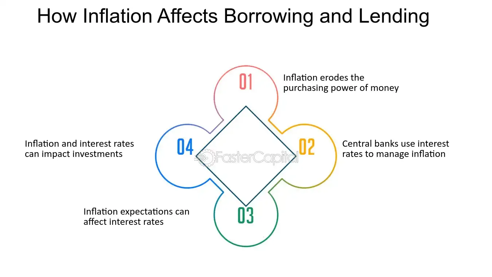

## Table of Contents

## What is inflation and how is it measured?

Inflation is when the prices of things we buy, like food and clothes, go up over time. It means that the money we have can buy less than before. Imagine if a candy bar cost $1 last year, but now it costs $1.10. That's inflation. It happens because the demand for goods and services can grow faster than the supply, or because the cost of making things goes up.

To measure inflation, economists use something called the Consumer Price Index, or CPI. The CPI tracks the prices of a basket of goods and services that a typical family buys, like food, housing, and transportation. By comparing the cost of this basket over time, they can see how much prices have gone up. If the CPI goes up by 2% in a year, that means inflation is 2%. Governments and central banks watch the CPI closely to make decisions about interest rates and other economic policies.

## How does inflation affect the economy in general?

Inflation can have a big impact on the economy. When prices go up, people's money doesn't go as far as it used to. This means they might have to cut back on spending, which can slow down the economy. Businesses might also find it harder to plan because they don't know if their costs will keep going up. If inflation gets too high, it can lead to a situation where people rush to buy things before prices go up even more, which can make inflation worse.

On the other hand, a little bit of inflation can be good for the economy. It can encourage people to spend money now rather than save it, because they know prices will be higher later. This can help keep the economy growing. Also, if wages go up along with prices, people might not feel the pinch as much. But it's a tricky balance, and central banks have to keep a close eye on inflation to make sure it doesn't get out of control.

## What are the basic differences between lenders and borrowers?

Lenders and borrowers have different roles in the world of money. Lenders are the ones who give out money. They could be banks, credit unions, or even people lending to friends. When someone lends money, they expect to get it back with some extra, called interest. This interest is like a reward for letting someone use their money. Lenders want to make sure they get their money back, so they might check if the borrower has a good history of paying back loans.

Borrowers, on the other hand, are the ones who take the money. They might need it to buy a house, go to school, or start a business. Borrowers have to pay back the money they borrowed, plus the interest. If they don't pay it back, they could get into trouble, like damaging their credit score or even losing what they bought with the loan. Borrowers need to think carefully about whether they can afford to pay back the loan before they take it.

In simple terms, lenders give money and expect it back with interest, while borrowers take money and have to pay it back with interest. Both need to be careful and responsible to make sure the lending and borrowing goes smoothly.

## How does inflation impact the purchasing power of money?

Inflation makes the money in your pocket worth less over time. When prices go up, the same amount of money can't buy as much as it used to. For example, if you had $100 last year and could buy 100 units of something, but this year the price went up and you can only buy 90 units with the same $100, that's because of inflation. Your money's purchasing power has gone down.

This can affect everyday life. If your salary doesn't go up as fast as prices, you might find it harder to afford the things you need. You might have to cut back on some things or look for cheaper options. On the other hand, if you have savings, inflation means those savings can buy less over time. That's why people often look for ways to invest their money to keep up with or beat inflation.

## In what ways does inflation affect interest rates?

Inflation and interest rates are closely connected. When inflation goes up, central banks often raise interest rates to try to slow it down. They do this because higher interest rates make borrowing money more expensive. When borrowing costs more, people and businesses might spend less, which can help bring down prices. On the other hand, if inflation is too low, central banks might lower interest rates to encourage more spending and help the economy grow.

But it's not just central banks that change interest rates because of inflation. Regular banks and lenders also pay attention to inflation. If they think inflation will keep going up, they might raise the interest rates on loans to make up for the fact that the money they get back will be worth less. This means that people who borrow money might have to pay more in interest. And if you have savings, higher inflation might mean you get higher interest on your savings to help your money keep up with rising prices.

## How does inflation influence the real value of debt for borrowers?

When inflation goes up, it can actually help people who owe money. Imagine you borrowed $1,000 when inflation was low. Over time, if inflation goes up, the money you owe doesn't buy as much as it used to. So, when you pay back that $1,000, it's worth less than when you borrowed it. This means the real value of your debt goes down. If your income also goes up with inflation, it can be easier to pay back what you owe because the money feels less heavy.

But, it's not always good news for borrowers. If the interest rate on your loan goes up because of inflation, you might end up paying more in interest. This could make your monthly payments higher, even if the real value of the debt goes down. So, while inflation can make the debt feel lighter, higher interest rates can make it harder to pay off. It's a bit of a balancing act, and it depends on how fast inflation and interest rates change.

## What are the effects of inflation on the returns for lenders?

When inflation goes up, it can hurt the returns that lenders get on their loans. Lenders give out money and expect to get it back with some extra, called interest. But if inflation is high, the money they get back is worth less than when they lent it out. This means the real value of the interest they earn goes down. Imagine you lend $100 and get $105 back, but because of inflation, that $105 can't buy as much as $105 could before. So, even though you got more money back, it's not as valuable.

To deal with this, lenders might raise the interest rates on their loans when they see inflation going up. By charging more interest, they try to make sure they still make a good return even after inflation. But this can be tricky. If they raise interest rates too much, fewer people might want to borrow money, which could slow down the economy. So, lenders have to find a balance between protecting their returns and keeping loans attractive to borrowers.

## How can lenders protect themselves against inflation?

Lenders can protect themselves against inflation by raising the interest rates they charge on loans. When they see prices going up, they know the money they get back will be worth less. So, by charging more interest, they try to make up for the loss in value. This way, even if inflation makes their money worth less, the extra interest can help them still make a good return on their loans.

Another way lenders can protect themselves is by being careful about who they lend to. If they think inflation will keep going up, they might only lend to people or businesses that they're sure can pay back the loan, even if interest rates go up. This helps them avoid losing money if borrowers can't handle higher payments because of inflation. By being selective, lenders can reduce the risk that inflation will hurt their returns.

## What strategies can borrowers use to manage their debt during high inflation?

During high inflation, borrowers can try to pay off their debt faster. When prices go up, the money they owe doesn't buy as much as it used to. If they can pay off their loans quicker, they won't have to give back money that's worth less. One way to do this is by making extra payments when they can. Another way is to use any extra money, like a bonus or tax refund, to pay down the debt. This can help them get out of debt before inflation makes it even harder.

Borrowers can also look for ways to lower their interest rates. High inflation often means higher interest rates, which can make their monthly payments go up. They might be able to talk to their lender about getting a lower rate, especially if they have a good history of paying on time. Another option is to refinance their loan if they can find a better rate somewhere else. By lowering the interest rate, they can save money and make their debt easier to manage during high inflation.

## How does inflation affect the decision-making process for new loans?

When inflation is high, people and businesses think carefully before taking out new loans. They know that high inflation can make the money they borrow worth less over time. This means they might have to pay back more in real terms than they borrowed. Also, if interest rates go up because of inflation, the cost of borrowing can get higher. So, they might decide to wait until inflation cools down or look for loans with lower interest rates to make sure they can handle the payments.

On the other hand, if someone really needs a loan, like to buy a house or start a business, they might still go ahead but with a plan. They could try to pay off the loan faster to beat the effects of inflation. Or they might look for loans with fixed interest rates, so their payments don't go up even if inflation does. It's all about weighing the need for the loan against the risks that come with high inflation and making smart choices to manage the debt.

## What are the long-term implications of inflation for both lenders and borrowers?

Over the long term, inflation can make things tricky for lenders. When prices keep going up, the money they get back from loans is worth less than when they lent it out. This means their returns might not be as good as they hoped. To deal with this, lenders might raise the interest rates on their loans. But if they do this too much, fewer people might want to borrow money, which could slow down the economy. So, lenders have to find a balance between protecting their money and keeping loans attractive to borrowers. If they don't, they could end up losing money over time.

For borrowers, high inflation over the long term can be both good and bad. On the good side, if they have a fixed-rate loan, the money they owe becomes worth less over time. This means it's easier to pay back the loan because the real value of their debt goes down. But on the bad side, if inflation keeps pushing up interest rates, their monthly payments could get higher. This can make it harder to manage their debt. Borrowers need to think carefully about how inflation might change over time and plan their borrowing and repayment strategies to make sure they can handle their loans in the long run.

## How do different types of inflation (e.g., demand-pull, cost-push) differently impact lenders and borrowers?

Demand-pull inflation happens when people want to buy more things than stores can sell. It's like too many people trying to buy candy at the same time, so the price goes up. For lenders, this type of inflation can make their money worth less when they get it back. They might raise interest rates to make up for it, but if they do, borrowers will have to pay more to borrow money. Borrowers might find it harder to pay back their loans because everything else is getting more expensive too. But if their income goes up with inflation, it might not be so bad for them.

Cost-push inflation is different. It happens when the cost of making things goes up, like if the price of sugar goes up and makes candy more expensive. For lenders, this can also make their money worth less over time, but it's a bit trickier. They might still raise interest rates, but if the cost of everything is going up, borrowers might have a tougher time. Their monthly payments could get bigger, and if they can't get a raise at work, it can be hard to keep up. Borrowers need to be careful because even though their debt might be worth less in the long run, the short-term costs can really add up.

## What is Understanding Inflation?

Inflation is a concept that encapsulates the overall increase in the price level of goods and services, resulting in a decrease in currency's purchasing power. It is a critical component of macroeconomic stability and is measured through a variety of indicators that help governments and financial institutions make informed policy decisions.

### Quantity Theory of Money

The quantity theory of money offers a framework to understand the underlying dynamics of inflation. According to this theory, there is a direct relationship between the quantity of money in an economy and the level of prices of goods and services sold. The equation of exchange given by:

$$
MV = PY
$$

where:
- $M$ is the total money supply,
- $V$ is the velocity of money, which is the rate at which money is exchanged,
- $P$ is the average price level,
- $Y$ is the real output, or real GDP, of the economy.

The theory posits that if $M$ increases faster than $Y$, it will lead to an increase in $P$, thereby causing inflation.

### Types of Inflation

Inflation can be categorized into several types based on the driving factors behind the price increases:

1. **Demand-Pull Inflation**: This occurs when the demand for goods and services exceeds supply. It's often described as "too much money chasing too few goods."

2. **Cost-Push Inflation**: This results from an increase in the costs of production, such as wages and raw materials, leading to a decrease in the supply of these goods and services while demand remains constant.

3. **Built-In Inflation**: Often referred to as wage-price inflation, this type happens when businesses increase prices to maintain profit margins after wage increases, leading workers to demand even higher wages, creating a self-sustaining cycle of rising prices.

### Key Indicators of Inflation

Two pivotal indicators are commonly used to measure inflation:

- **Consumer Price Index (CPI)**: CPI measures changes in the price level of a market basket of consumer goods and services purchased by households. It reflects the spending patterns of the population and is a widely used indicator for identifying periods of inflation or deflation.

- **Producer Price Index (PPI)**: PPI measures the average change over time in the selling prices received by domestic producers for their output. Unlike CPI, which looks at prices from the consumer's perspective, PPI gauges inflation from the perspective of the industry's producers.

Inflation's measurement and analysis are imperative for policymaking and economic forecasting, helping central banks and governments establish monetary policies to maintain economic stability. Understanding these fundamentals allows both borrowers and lenders to anticipate changes in the economic environment, informing their financial strategies and decisions.

## How does inflation impact borrowers?

Inflation influences borrowers by reducing the real value of their outstanding debt. When prices rise broadly, the purchasing power of currency diminishes, meaning a fixed amount of money now holds lesser value in terms of goods and services. This dilution of currency value benefits borrowers, as they repay their loans with money that is less valuable than when they initially borrowed it. Essentially, inflation erodes the real [interest rate](/wiki/interest-rate-trading-strategies)—the nominal interest rate adjusted for inflation—thereby decreasing the financial burden on borrowers over time.

In an inflationary environment, borrowers often experience wage increases, which can further ease debt management. As nominal wages rise, borrowers find themselves with more income relative to their fixed debt repayments, making it easier to service these debts. This phenomenon implies an improvement in their debt-to-income ratio, enhancing their ability not only to meet current financial obligations but also to decrease the relative weight of their debt over time.

Real-world scenarios illustrate how inflation can lessen the interest burdens on borrowers. Consider a scenario where a borrower has a fixed-rate mortgage. If the inflation rate rises above the mortgage rate, the real interest rate effectively becomes negative, reducing the cost of borrowing in real terms. For example, if a borrower took a mortgage at a rate of 3% and inflation surges to 5%, the real interest rate would be calculated as follows:

$$
\text{Real Interest Rate} = \text{Nominal Interest Rate} - \text{Inflation Rate} = 3\% - 5\% = -2\%
$$

This mathematical outcome means that the cost of borrowing is effectively nullified in real terms, eroding the value of the lender's money over time and favoring the borrower who repays with less valuable currency. Historical cases, such as those experienced during the inflationary periods of the 1970s in the United States, demonstrate borrowers benefitting significantly as inflation rates outpaced fixed interest rates set in their loan agreements.

In summary, inflation can play a significant role in diminishing the debt burden for borrowers by decreasing the real cost of interest payments and eroding the value of the principal amount over time. Coupled with potential wage growth, borrowers are often better poised to manage and alleviate their debt obligations in an inflationary setting.

## What is Inflation's Impact on Lenders?

Inflation presents a multifaceted challenge for lenders, primarily through the reduction in the real value of future repayments. This erosion of purchasing power can significantly impact the profitability of loans issued by financial institutions. When lenders disburse funds, they typically anticipate returns that compensate for both the time value of money and the risk assumed. However, during periods of inflation, the actual value of these repayments diminishes as prices rise. For example, if a borrower repays a fixed-rate loan during inflation, the value of each dollar received is worth less in real terms than when it was originally lent.

Despite these challenges, inflation can create some opportunities for lenders. Increased inflation often leads to higher nominal interest rates, reflecting the premium required by lenders to counter the inflation risk. This rise in interest rates can improve the margins that banks and lending institutions enjoy on new loans. The increased demand for credit during inflationary periods is driven by borrowers seeking to lock in lower rates before anticipated rate hikes or needing additional funds to cover rising costs of goods and services.

Lenders must also adjust their interest strategies to maintain profitability. One approach is shifting from fixed-rate loans to more variable-rate products, which can adjust in response to inflationary trends and economic conditions. By doing so, lenders can better align their revenue with the actual cost of lending money over time.

To systematically analyze the impact of inflation on lending profitability, consider the following simplified formula for real interest rate adjustments:

$$
r = i - \pi
$$

where $r$ is the real interest rate, $i$ is the nominal interest rate, and $\pi$ is the inflation rate. If inflation increases without a corresponding increase in the nominal interest rate, the real interest rate $r$ tends to decrease, adversely affecting lenders. Therefore, setting interest rates involves not only assessing current inflation but predicting future trends.

Lenders may also engage in asset-liability management strategies to mitigate inflation risks. By holding a portfolio of inflation-adjusted assets, such as Treasury Inflation-Protected Securities (TIPS), lenders can hedge against the real value erosion of their assets. Additionally, utilizing derivative instruments like interest rate swaps can help to manage exposure and stabilize returns in volatile inflation environments.

In conclusion, while inflation poses significant challenges for lenders by reducing the real value of repayments, it offers opportunities through increased credit demand and higher nominal rates. Strategic adjustments in interest rate policies and innovative risk management methods can help lenders navigate these complexities, ultimately preserving profitability amidst economic fluctuations.

## References & Further Reading

[1]: ["Advances in Financial Machine Learning"](https://www.amazon.com/Advances-Financial-Machine-Learning-Marcos/dp/1119482089) by Marcos Lopez de Prado

[2]: ["Machine Learning for Algorithmic Trading"](https://www.amazon.com/Machine-Learning-Algorithmic-Trading-alternative/dp/1839217715) by Stefan Jansen

[3]: ["Quantitative Trading: How to Build Your Own Algorithmic Trading Business"](https://www.amazon.com/Quantitative-Trading-Build-Algorithmic-Business/dp/1119800064) by Ernest P. Chan

[4]: ["The Evolving Role of Algorithmic Trading"](https://www.researchgate.net/publication/378548435_Algorithmic_Trading_and_AI_A_Review_of_Strategies_and_Market_Impact) from the CFA Institute

[5]: ["The Quantity Theory of Money: A Restatement"](https://www.jstor.org/stable/pdfplus/1815300.pdf) by Milton Friedman in The Economic Journal