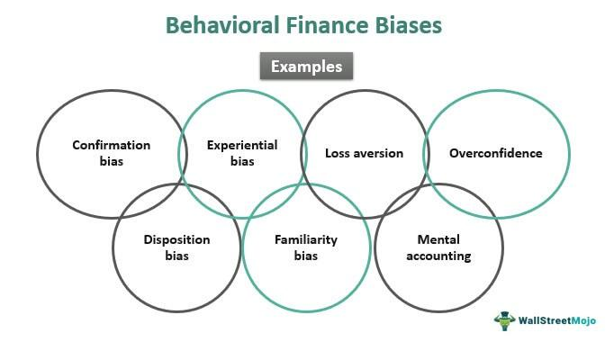

Investing in today's financial markets involves maneuvering through an intricate maze of information and inherent biases. Cognitive biases, in particular, information biases, have a profound influence on investment decisions, often resulting in less than optimal financial outcomes. These biases skew perception, leading to decisions based on distorted or incomplete information, which can affect portfolio performance and risk management.

Algorithmic trading, commonly known as algo trading, heavily depends on data and automated decision-making processes. Despite the perceived objectivity of these systems, they are not exempt from cognitive biases. Algorithms are designed by humans and are often based on models that can implicitly encode biases, which can be detrimental if left unchecked. These biases in algo trading can manifest in ways that distort market interpretations and hinder effective trading practices.



In this article, we examine the convergence of investment decision-making, information bias, cognitive bias, and algorithmic trading. We will explore how these biases influence trading outcomes and propose several strategies to counteract their negative effects. By shedding light on these complex interactions, we aim to provide insights into achieving more rational and effective trading decisions in an increasingly technologically driven financial landscape.

## Table of Contents

## Understanding Cognitive Biases

Cognitive biases are systematic patterns where individuals deviate from rational judgment, significantly affecting their decision-making processes. These biases can influence how traders perceive and interpret information, which, in turn, impacts their investment strategies and decisions. 

One prominent type of cognitive bias is confirmation bias, where individuals favor information that confirms their pre-existing beliefs or hypotheses. This can lead to skewed decision-making as traders may give disproportionate weight to data that supports their initial thesis while disregarding or undervaluing conflicting information. For instance, a trader who believes in the bullish momentum of a stock might focus on positive news and ignore negative reports, resulting in a biased investment decision.

Overconfidence bias is another common cognitive bias in investing. This bias involves an inflated belief in one's own ability to predict or influence outcomes. Traders with overconfidence bias may take on excessive risk under the assumption that their forecasts are more accurate than they actually are. Such behavior often leads to overtrading and insufficient diversification, which can have detrimental effects on portfolio performance.

Availability bias occurs when people rely on immediate examples that come to mind when evaluating a topic or decision. In the investing context, traders might make decisions based on recent market events or information that is easily accessible, rather than conducting thorough research. This shortcut can result in impulsive decisions that do not reflect the broader market conditions or trends.

Understanding these cognitive biases is essential for traders aiming to make informed and rational investment decisions. To counteract these biases, traders can adopt structured decision-making processes and employ strategies such as maintaining diverse information sources, conducting independent analysis, and regularly reviewing past trading outcomes to identify potential bias influences. Recognizing cognitive biases and implementing rational checks can lead to more accurate investment evaluations and improved trading strategies.

## Information Bias in Investing

Information bias in investing emerges when data or information is misrepresented or selectively emphasized, resulting in skewed perceptions of reality. This bias can significantly impact investment decisions, as investors may rely on faulty information, irrelevant data, or become overwhelmed by an overabundance of information. The increasing prevalence of social media and the internet exacerbates the risk of information bias by inundating investors with vast quantities of data from diverse sources, not all of which are reliable or pertinent.

The core issue with information bias lies in its potential to mislead investors into making suboptimal decisions. For instance, investors might inadvertently focus on metrics that, while easily available or frequently discussed, do not actually influence an asset's intrinsic value. Alternatively, excessive information can lead to analysis paralysis, where investors struggle to make informed decisions due to the sheer [volume](/wiki/volume-trading-strategy) of data.

To illustrate, let's consider a scenario where a trader depends heavily on trending social media posts to make investment decisions. Despite being popular, such posts may lack empirical backing or be based on skewed data sets. This selective reliance on poorly substantiated data can trigger a misalignment between perceived and actual market conditions, potentially leading to poor investment outcomes.

Moreover, the digital age's information overload contributes to information bias by overwhelming investors. In theoretical terms, this could be expressed as a cognitive load problem, where the working memory is inundated with information, making it difficult to filter relevant data effectively. Symbolically, if $I(t)$ represents information at time $t$, and $R$ represents the relevance filter function, the effective information $E(t)$ that should influence decisions is:

$$
E(t) = I(t) \times R
$$

Here, $R$ must be managed carefully to ensure that it filters out noise efficiently, retaining only data pertinent to investment decisions. Investors need strategies to refine $R$, thereby reducing noise and focusing on meaningful information.

While algorithms and automated systems offer potential solutions by parsing large data volumes more efficiently, they must be programmed thoughtfully to avoid embedding inherent biases in their decision-making models. As the digital landscape continues to evolve, understanding and mitigating information bias is crucial for ensuring resilient and informed investment strategies.

## Common Cognitive Biases in Algo Trading

Algo trading, which employs complex algorithms to automate trading decisions, is believed to offer an objective approach to market participation. However, it is not free from the influence of cognitive biases that can distort data interpretation and strategy execution. Understanding these biases is crucial to safeguarding trading models and strategies from unwanted discrepancies and errors.

### Confirmation Bias

One prevalent cognitive bias in algo trading is confirmation bias. This occurs when algorithms are programmed, either intentionally or inadvertently, to favor information or data that confirms pre-existing beliefs or hypotheses. This bias can manifest in the selection of data inputs, the design of predictive models, or the interpretation of [backtesting](/wiki/backtesting) results. Confirmation bias can lead to a skewed perception of market conditions, causing algorithms to overlook contradictory market signals that could indicate a potential downturn or a need for strategy adjustment.

```python
# Example of a potential confirmation bias in modeling with Python
import numpy as np
import pandas as pd

# Assume df is a pandas DataFrame with historical data
df = pd.DataFrame({
    'market_signal': np.random.randn(100),
    'confirmatory_variable': np.random.rand(100)
})

# Hypothetical scenario where only confirmatory_variable > 0.5 are considered
biased_data = df[df['confirmatory_variable'] > 0.5]

# A simple linear model that might falsely confirm a bias
from sklearn.linear_model import LinearRegression
model = LinearRegression()
X = biased_data[['confirmatory_variable']]
y = biased_data['market_signal']
model.fit(X, y)

# The coefficients might reflect a biased confirmation of the model hypothesis
print(f'Coefficient: {model.coef_}')
```

### Overconfidence Bias

Overconfidence bias arises when traders or algorithm designers overestimate their forecasting abilities or the precision of their models. This can lead to increased risk-taking, underestimation of market [volatility](/wiki/volatility-trading-strategies), or excessive reliance on specific algorithms that have performed well in past conditions but have not been tested across varying market environments. Overconfidence can also result in inadequate portfolio diversification as traders mistakenly believe in the superiority of their chosen strategies.

### Anchoring Bias

Anchoring bias occurs when algorithms rely too heavily on initial pieces of information when making trading decisions. This can particularly affect the inputs used in the construction of trading algorithms or the setting of key parameters such as entry and [exit](/wiki/exit-strategy) points. For instance, an algorithm may place disproportionate weight on recent historical prices or market conditions during its setup phase, anchoring future trades to this initial reference point. This bias can cause algorithms to miss adaptive changes in market dynamics, leading to poor trading performance.

In summary, understanding these cognitive biases and recognizing their potential impact on [algorithmic trading](/wiki/algorithmic-trading) operations is essential for developing robust strategies that can adapt to changing market conditions. By addressing these biases, traders can refine their models to prevent distorted interpretations of market trends and enhance trading outcomes significantly.

## Strategies to Mitigate Biases in Investing and Trading

To mitigate the impact of information and cognitive biases, traders can employ several strategies that enhance decision-making and improve trading outcomes. One effective approach is limiting exposure to excessive news and diversifying information sources. In the digital age, investors are inundated with data from a multitude of platforms, which can lead to information overload and heightened information bias. By curating a balanced set of information channels and focusing on high-quality, relevant data, traders can make more accurate assessments of market conditions and reduce noise-induced errors.

Another strategy is embracing a rules-based trading system, which involves creating and strictly following predefined trading rules and criteria. This method helps counteract subjective decision-making processes often skewed by cognitive biases. For example, algorithmic strategies could be developed using Python to define entry and exit points based on quantitative indicators rather than emotional judgments. Here’s a simple Python snippet illustrating the use of a moving average crossover strategy:

```python
import pandas as pd

# Assume 'data' is a DataFrame containing stock prices with a column 'Close'
data['Short_MA'] = data['Close'].rolling(window=20).mean()
data['Long_MA'] = data['Close'].rolling(window=50).mean()

# Generate buy/sell signals
data['Signal'] = 0
data.loc[data['Short_MA'] > data['Long_MA'], 'Signal'] = 1
data.loc[data['Short_MA'] < data['Long_MA'], 'Signal'] = -1

# Execute trades based on signals
# (Trading logic to be implemented here)

```
This code creates a simple strategy where trades are triggered based on moving average crossovers, thus eliminating individual bias from the decision-making process.

Additionally, actively seeking feedback and maintaining continuous monitoring and evaluation of trading strategies are crucial for avoiding cognitive bias-related pitfalls. Regularly reviewing trading performance and outcomes allows traders to identify patterns of bias and adjust their strategies accordingly. This approach aligns with principles of behavioral economics by incorporating systematic feedback loops to refine decision-making frameworks. Backtesting strategies and reviewing past trades can provide valuable insights into the biases that may have influenced outcomes, thereby informing more rational approaches in the future. 

These strategies, when combined, can provide a robust framework for reducing biases and enhancing the decision-making processes critical to successful investing and trading.

## The Role of Behavioral Economics in Understanding Investment Biases

Behavioral economics is an interdisciplinary field merging psychology and economics to explain how individuals often deviate from purely rational decision-making. This perspective is particularly relevant in finance, where psychological factors and cognitive biases can significantly influence investment choices.

Traditional economic models often assume that investors act as rational [agents](/wiki/agents), consistently seeking to maximize utility. This rational-actor model suggests that individuals possess full information, process this information without error, and always make decisions that align with their best interests. However, real-world decision-making is frequently affected by systematic biases, which behavioral economics seeks to understand and address.

For instance, cognitive biases such as loss aversion, where investors disproportionately fear losses relative to equivalent gains, challenge the rational actor model. This can lead investors to irrationally hold onto losing stocks to avoid realizing a loss, contrary to optimal investment strategies.

Furthermore, framing effects, where the context or presentation of information affects decision-making, demonstrate deviations from rationality. An investor might react differently to the information that a stock market has "fallen by 10%" compared to "90% of its value remains," even though both statements are equivalent. Such biases indicate that decisions are not always based on objective criteria but are influenced by subjective interpretations.

Behavioral economics provides valuable tools for traders and investors to recognize these biases and adjust their strategies accordingly. By incorporating behavioral insights, decision-makers can develop frameworks that anticipate and counteract biases. For example, using pre-commitment strategies or algorithmic rules can help mitigate spontaneous, emotionally-driven decisions.

In Python, creating a simple algorithm to assist in making bias-aware investment decisions might involve setting predetermined rules for buying or selling stocks. Here's an example of how such an algorithm could look:

```python
def trading_strategy(current_price, purchase_price, max_loss=0.1, max_gain=0.2):
    """
    A simple trading strategy that sells if the stock price falls by 10% or rises by 20%.

    Parameters:
    - current_price: The current price of the stock.
    - purchase_price: The initial purchase price of the stock.
    - max_loss: Maximum allowable loss before selling (default is 10%).
    - max_gain: Target gain before selling (default is 20%).

    Returns:
    - str: Action to be taken ('Sell', 'Hold').
    """
    loss_threshold = purchase_price * (1 - max_loss)
    gain_threshold = purchase_price * (1 + max_gain)

    if current_price <= loss_threshold:
        return 'Sell - Loss limit reached'
    elif current_price >= gain_threshold:
        return 'Sell - Gain target achieved'
    else:
        return 'Hold'

# Example usage
action = trading_strategy(current_price=110, purchase_price=100)
print(action)  # Output could be 'Sell - Gain target achieved'
```

By studying behavioral economics, traders can gain a thorough understanding of the nuances affecting investment behavior, allowing them to construct more robust decision-making processes. This recognition of human fallibility and the development of strategies to overcome it are crucial for achieving improved financial outcomes. Through this lens, behavioral economics acts as a crucial tool that bridges the gap between idealized economic models and actual human behavior in markets.

## Conclusion

Information bias and cognitive biases are significant obstacles to achieving optimal investment and trading decisions. Within the context of algorithmic trading, these biases can distort data interpretation and decision-making processes. Recognizing and understanding the manifestations of cognitive and information biases is crucial for mitigating their adverse effects.

Algorithmic trading, while data-driven, is not immune to the pitfalls of cognitive biases such as confirmation bias, overconfidence bias, and anchoring bias. These biases can lead to systematic deviations from rational decision-making, adversely affecting trading strategies and outcomes.

Developing and employing diverse strategies to counteract these biases can greatly enhance trading performance. Limiting exposure to excessive or irrelevant information, instituting rules-based trading methodologies, and diversifying information sources are practical approaches to curb the influence of information bias. Additionally, continuous evaluation and feedback mechanisms help in identifying and rectifying biased decision patterns, promoting more rational investment choices.

As technology becomes more entrenched in financial markets, addressing cognitive and information biases assumes even greater importance. Adopting a proactive stance towards understanding and mitigating these biases will enable traders and investors to harness technology effectively, driving improved trading decisions and outcomes. The integration of behavioral economics insights will further aid in refining decision-making frameworks, promoting more accurate and reliable trading strategies in an increasingly complex financial environment.

## References & Further Reading

[1]: Kahneman, D. (2011). ["Thinking, Fast and Slow."](https://link.springer.com/article/10.1007/s00362-013-0533-y) Farrar, Straus and Giroux.

[2]: Barberis, N., & Thaler, R. (2003). ["A survey of behavioral finance."](https://www.semanticscholar.org/paper/A-Survey-of-Behavioral-Finance-Barberis-Thaler/a4ab7d7161deac0f532d121b1614cf7b97d90e78) Handbook of the economics of finance.

[3]: Brock, W. A., Lakonishok, J., & LeBaron, B. (1992). ["Simple technical trading rules and the stochastic properties of stock returns."](https://onlinelibrary.wiley.com/doi/10.1111/j.1540-6261.1992.tb04681.x) The Journal of Finance, 47(5), 1731-1764.

[4]: Tetlock, P. C. (2007). ["Giving Content to Investor Sentiment: The Role of Media in the Stock Market."](https://onlinelibrary.wiley.com/doi/abs/10.1111/j.1540-6261.2007.01232.x) The Journal of Finance, 62(3), 1139-1168.

[5]: Tversky, A., & Kahneman, D. (1974). ["Judgment under Uncertainty: Heuristics and Biases."](https://www2.psych.ubc.ca/~schaller/Psyc590Readings/TverskyKahneman1974.pdf) Science, 185(4157), 1124-1131.

[6]: Kahneman, D., & Riepe, M. W. (1998). ["Aspects of investor psychology."](https://www.semanticscholar.org/paper/Aspects-of-Investor-Psychology-Kahneman-Riepe/09f86a3ff4419386209086f1285d369661fab9b7) Journal of Portfolio Management, 24(4), 52-65.