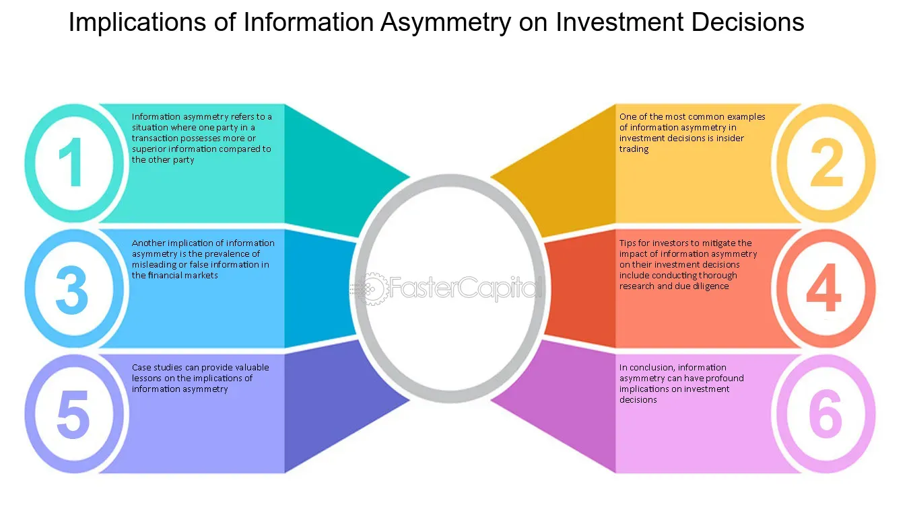

## Table of Contents

## What is information bias and how does it relate to investment decisions?

Information bias happens when people make decisions based on information that is not complete or is wrong. In the world of investing, this can be a big problem. Investors might hear news or rumors about a company and decide to buy or sell its stock without knowing all the facts. For example, if someone hears that a company is about to launch a new product, they might buy the stock thinking it will go up in value. But if the product fails or the news was not true, the stock could go down instead.

This kind of bias can lead to bad investment choices because it makes people act on incomplete or incorrect information. It's important for investors to do their own research and not just follow what they hear from others. By looking at a company's financial reports, understanding the market, and maybe even talking to experts, investors can make better decisions. Avoiding information bias helps in making smarter and more informed choices about where to put their money.

## Can you explain the different types of information bias that affect investors?

There are several types of information bias that can affect investors. One common type is confirmation bias, where investors look for information that supports what they already believe and ignore information that doesn't fit their views. For example, if an investor thinks a certain stock will do well, they might only pay attention to positive news about that company and miss out on warnings or negative reports.

Another type is availability bias, which happens when investors make decisions based on the information that's easiest to remember or find. This can lead them to focus on recent news or events rather than looking at the bigger picture. For instance, if there's a lot of media coverage about a new technology, an investor might rush to buy stocks in that sector without considering long-term trends or risks.

Lastly, there's anchoring bias, where investors rely too much on the first piece of information they get. If an investor hears an initial price for a stock, they might stick to that number even if later information suggests the stock's value has changed. This can cause them to miss out on better investment opportunities or hold onto a stock longer than they should.

## How does confirmation bias influence an investor's decision-making process?

Confirmation bias makes investors look for information that agrees with what they already think. If an investor believes a company will do well, they will pay more attention to good news about that company. They might read articles or watch videos that say the company is doing great and ignore any bad news. This can make them feel more sure about their choice to invest in that company, even if there are signs that it might not be a good idea.

This kind of bias can lead to bad investment choices. When investors only see the information that matches their beliefs, they might miss important warnings or risks. For example, if a company is having financial problems, but the investor only reads positive reports, they might keep their money in that company and lose it when the stock price drops. To avoid this, investors need to look at all kinds of information, not just the stuff that makes them feel good about their decisions.

## What role does availability bias play in investment choices?

Availability bias makes investors focus on the information that's easy to remember or find. This can lead them to make choices based on recent news or events instead of looking at the bigger picture. For example, if there's a lot of talk about a new technology, an investor might quickly buy stocks in that sector without thinking about the long-term risks or if the excitement will last.

This kind of bias can cause investors to miss out on better opportunities or make rushed decisions. If an investor only pays attention to what's in the news right now, they might not see other good investments that aren't as well-known. It's important for investors to take a step back and look at all the information they can, not just what's easy to find or remember, to make smarter choices.

## How can anchoring bias skew an investor's perception of value?

Anchoring bias can make investors stick to the first piece of information they hear about a stock's price. If an investor hears that a stock is worth $50, they might keep thinking it should be around that price, even if new information shows that the stock's value has changed. This can make them buy or sell the stock at the wrong time because they're still focused on that first number they heard.

For example, if a stock's price drops to $40 because of bad news, an investor with anchoring bias might think it's a good deal because it's lower than the $50 they first heard. But if they ignore the reasons why the price dropped, they might end up losing money. It's important for investors to look at all the new information and not just stick to that first number to make better choices about buying or selling stocks.

## What are the psychological mechanisms behind overconfidence bias in investment?

Overconfidence bias in investment happens when people think they know more than they really do. They might believe they can predict the market better than others or that they won't make mistakes. This feeling can come from past successes, where they made good choices and their investments did well. They might also get overconfident if they hear a lot of positive news or if they see other people making money in the market. This can make them take bigger risks, thinking they can't lose.

This kind of thinking can lead to big problems. When investors are overconfident, they might not do enough research or listen to advice from others. They might buy stocks without thinking about all the risks or sell too late because they think the price will keep going up. Overconfidence can make them lose money because they don't see the whole picture. It's important for investors to stay humble and keep learning, so they don't let overconfidence lead them to bad choices.

## How does the framing effect impact the way investors process financial information?

The framing effect can change how investors see financial information. It happens when the same information is presented in different ways, making people feel differently about it. For example, if an investor hears that a stock has a 70% chance of going up, they might feel good about it. But if they hear the same stock has a 30% chance of going down, they might feel worried, even though it's the same information.

This can lead investors to make choices based on how the information is framed, not on the facts themselves. If a financial report uses words like "growth" and "potential," it might make investors feel more positive and more likely to buy. But if the same report uses words like "risk" and "uncertainty," it might make them feel more cautious and less likely to invest. Understanding the framing effect can help investors look past the words and focus on the real numbers and facts to make better decisions.

## What are some strategies to mitigate the effects of information bias in investment decisions?

To reduce the impact of information bias in investment decisions, it's important for investors to seek out a wide range of information sources. Instead of just looking at news that supports their current beliefs, they should read different opinions and reports. This helps them see the whole picture and not just the parts that make them feel good about their choices. Talking to financial experts or joining investment groups can also give them new viewpoints and help them avoid confirmation bias.

Another strategy is to take time to think before making a decision. Instead of rushing to buy or sell based on the latest news or what's easy to remember, investors should step back and look at long-term trends and data. Keeping a journal of their investment decisions and the reasons behind them can help them see if they're being influenced by biases like availability or anchoring. By being aware of these biases, investors can make more thoughtful and balanced choices.

Lastly, using tools like checklists or decision-making frameworks can help investors stay focused on the facts. A checklist might include steps like reviewing a company's financial statements, considering the industry's overall health, and looking at expert analyses. This structured approach can help them avoid being swayed by how information is framed or by overconfidence in their own judgment. By following these strategies, investors can make better decisions and reduce the risks caused by information bias.

## How can investors use behavioral finance to better understand and counteract information bias?

Behavioral finance helps investors understand how their minds work and how that can affect their investment choices. It shows that people often make decisions based on emotions and biases instead of just looking at the facts. For example, if an investor feels good about a company because they heard some positive news, they might ignore other information that suggests the company isn't doing so well. By learning about these biases, like confirmation bias or availability bias, investors can start to see when they might be making choices based on incomplete or wrong information.

To counteract information bias, investors can use what they learn from behavioral finance to be more aware of their own thinking. They can try to look at all kinds of information, not just the stuff that makes them feel good about their choices. They can also take their time to think before deciding to buy or sell, and maybe even talk to other people or experts to get different viewpoints. By doing this, investors can make better decisions and avoid the traps that come from relying too much on biased information.

## What are the long-term consequences of information bias on portfolio performance?

Information bias can hurt an investor's portfolio over the long run. If an investor only pays attention to information that agrees with what they already think, they might miss important signs that their investments are not doing well. For example, if they keep buying stocks in a company because they only see the good news, they might not notice when the company starts to have problems. This can lead to losing money because they didn't see the whole picture and made choices based on incomplete information.

Over time, these bad decisions can add up and make the investor's portfolio perform worse than it could have. If they keep making choices based on biases like thinking they know more than they do or focusing on recent news, they might miss out on better opportunities. It's important for investors to look at all the information they can and not just the stuff that makes them feel good about their choices. By doing this, they can make smarter decisions and help their portfolio do better in the long run.

## How do advanced data analytics and machine learning help in identifying and reducing information bias?

Advanced data analytics and [machine learning](/wiki/machine-learning) help investors spot and reduce information bias by looking at a lot of information quickly and finding patterns that people might miss. These tools can go through big sets of data, like news articles, financial reports, and social media posts, to see what's really going on with a company or the market. They can find things that might not be obvious to someone just reading the news, like hidden risks or trends that are starting to change. By using these tools, investors can get a fuller picture of their investments and not just rely on the information that's easy to find or remember.

Machine learning can also help by learning from past data to predict what might happen next. This can help investors avoid making decisions based on just the latest news or what they already believe. For example, if a machine learning model sees that a certain kind of news often leads to a drop in stock prices, it can warn investors before they make a choice based on that news. By using these advanced tools, investors can make better decisions and reduce the chances that their biases will lead them to lose money over time.

## What are the latest research findings on the impact of information bias on different types of investment strategies?

Recent research has shown that information bias can greatly affect different investment strategies, including passive and active investing. In passive investing, where investors try to match the performance of a market index, information bias can lead them to choose the wrong index or miss out on better options. For example, if an investor only looks at recent news about tech companies, they might think a tech-heavy index is always a good choice, even if other sectors are doing better. This can cause them to miss out on gains from other parts of the market. On the other hand, active investors, who try to beat the market by [picking](/wiki/asset-class-picking) individual stocks, can also be hurt by information bias. They might focus too much on news or rumors about a company and buy or sell stocks based on incomplete information, leading to poor performance.

Another finding from recent studies is that information bias can have different effects on short-term and long-term investment strategies. For short-term traders, who buy and sell stocks quickly, information bias can lead to quick losses if they act on the latest news without looking at the bigger picture. They might buy a stock because of a positive news story, only to see it drop when the full story comes out. Long-term investors, who hold onto stocks for years, might also be affected, but in a different way. They might keep a stock too long because they only see the good news about it and miss signs that the company is in trouble. Over time, this can hurt their portfolio's performance. By understanding these impacts, investors can take steps to reduce the effects of information bias and make better choices.

## What is Information Bias in Investing?

Information bias in investing emerges when data or information is misrepresented or selectively emphasized, resulting in skewed perceptions of reality. This bias can significantly impact investment decisions, as investors may rely on faulty information, irrelevant data, or become overwhelmed by an overabundance of information. The increasing prevalence of social media and the internet exacerbates the risk of information bias by inundating investors with vast quantities of data from diverse sources, not all of which are reliable or pertinent.

The core issue with information bias lies in its potential to mislead investors into making suboptimal decisions. For instance, investors might inadvertently focus on metrics that, while easily available or frequently discussed, do not actually influence an asset's intrinsic value. Alternatively, excessive information can lead to analysis paralysis, where investors struggle to make informed decisions due to the sheer [volume](/wiki/volume-trading-strategy) of data.

To illustrate, let's consider a scenario where a trader depends heavily on trending social media posts to make investment decisions. Despite being popular, such posts may lack empirical backing or be based on skewed data sets. This selective reliance on poorly substantiated data can trigger a misalignment between perceived and actual market conditions, potentially leading to poor investment outcomes.

Moreover, the digital age's information overload contributes to information bias by overwhelming investors. In theoretical terms, this could be expressed as a cognitive load problem, where the working memory is inundated with information, making it difficult to filter relevant data effectively. Symbolically, if $I(t)$ represents information at time $t$, and $R$ represents the relevance filter function, the effective information $E(t)$ that should influence decisions is:

$$
E(t) = I(t) \times R
$$

Here, $R$ must be managed carefully to ensure that it filters out noise efficiently, retaining only data pertinent to investment decisions. Investors need strategies to refine $R$, thereby reducing noise and focusing on meaningful information.

While algorithms and automated systems offer potential solutions by parsing large data volumes more efficiently, they must be programmed thoughtfully to avoid embedding inherent biases in their decision-making models. As the digital landscape continues to evolve, understanding and mitigating information bias is crucial for ensuring resilient and informed investment strategies.

## References & Further Reading

[1]: Kahneman, D. (2011). ["Thinking, Fast and Slow."](https://link.springer.com/article/10.1007/s00362-013-0533-y) Farrar, Straus and Giroux.

[2]: Barberis, N., & Thaler, R. (2003). ["A survey of behavioral finance."](https://www.semanticscholar.org/paper/A-Survey-of-Behavioral-Finance-Barberis-Thaler/a4ab7d7161deac0f532d121b1614cf7b97d90e78) Handbook of the economics of finance.

[3]: Brock, W. A., Lakonishok, J., & LeBaron, B. (1992). ["Simple technical trading rules and the stochastic properties of stock returns."](https://onlinelibrary.wiley.com/doi/10.1111/j.1540-6261.1992.tb04681.x) The Journal of Finance, 47(5), 1731-1764.

[4]: Tetlock, P. C. (2007). ["Giving Content to Investor Sentiment: The Role of Media in the Stock Market."](https://onlinelibrary.wiley.com/doi/abs/10.1111/j.1540-6261.2007.01232.x) The Journal of Finance, 62(3), 1139-1168.

[5]: Tversky, A., & Kahneman, D. (1974). ["Judgment under Uncertainty: Heuristics and Biases."](https://www2.psych.ubc.ca/~schaller/Psyc590Readings/TverskyKahneman1974.pdf) Science, 185(4157), 1124-1131.

[6]: Kahneman, D., & Riepe, M. W. (1998). ["Aspects of investor psychology."](https://www.semanticscholar.org/paper/Aspects-of-Investor-Psychology-Kahneman-Riepe/09f86a3ff4419386209086f1285d369661fab9b7) Journal of Portfolio Management, 24(4), 52-65.