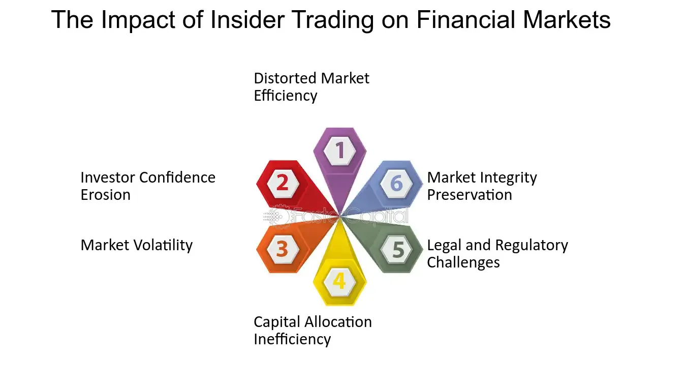

## Table of Contents

## What is insider buying?

Insider buying happens when people who work at a company, like executives or directors, buy shares of their own company's stock. These people are called insiders because they know a lot about the company. When they buy stock, it often means they think the company is doing well or will do well in the future. This can be a good sign for other investors because it shows that the people who know the company best believe in it.

However, insider buying doesn't always mean the stock will go up. Sometimes insiders buy for other reasons, like to show confidence to the public or because they think the stock is a good deal at its current price. It's important for investors to look at other information too, not just insider buying, to make smart choices about buying or selling stocks.

## How can I identify insider buying in a company?

To find out if insiders are buying a company's stock, you can look at the company's official reports. These reports are called SEC filings in the United States, and they tell you about any big stock buys or sells by insiders. You can find these reports on the SEC's website or on financial websites that track insider trading. Just search for the company's name and look for sections about insider transactions.

Another way to spot insider buying is by using financial news websites and stock market apps. Many of these services have tools that show insider buying and selling activity. They often list the names of the insiders, how many shares they bought, and when they bought them. This can help you see if there's a pattern of insiders buying the stock, which might mean they think the company is doing well.

Remember, insider buying is just one piece of the puzzle. It's a good idea to look at other things too, like the company's financial health, news about the company, and what analysts are saying. This will give you a fuller picture and help you make better decisions about investing in the company.

## Why do insiders buy their own company's stock?

Insiders buy their own company's stock for a few main reasons. One big reason is that they believe the company is doing well or will do well in the future. Since insiders know a lot about the company, their buying can be a sign that they think the stock is a good investment. Another reason is that they might want to show confidence in the company to the public. When insiders buy stock, it can make other investors feel more sure about the company too.

Sometimes, insiders buy stock because they think it's a good deal at its current price. They might believe the stock is undervalued and will go up in value later. But insiders don't always buy stock just because they think it's a good investment. Sometimes they have other reasons, like wanting to meet certain company rules or to get a better tax situation. So, while insider buying can be a good sign, it's important to look at other information too before deciding to invest.

## What does insider buying indicate about a company's future performance?

Insider buying can be a good sign about a company's future. When people who work at the company, like the boss or the board members, buy the company's stock, it often means they think the company will do well. They know a lot about the company, so their buying can show that they believe the stock price will go up. This can make other investors feel more confident about the company too.

But insider buying doesn't always mean the company will do better in the future. Sometimes insiders buy stock for other reasons, like to show the public they believe in the company or because they think the stock is a good deal right now. So, while insider buying can be a helpful clue, it's important to look at other things too, like the company's money situation and what other people are saying about it, before deciding to invest.

## How does insider buying influence stock prices?

Insider buying can make a stock's price go up. When people who work at the company, like the boss or board members, buy the company's stock, it often means they think the company will do well. Other investors see this and might think, "If the people who know the company best are buying, maybe I should too." This can make more people want to buy the stock, which can push the price higher.

But insider buying doesn't always make the stock price go up right away. Sometimes, the stock price might not change much because other things, like the company's money situation or news about the company, can be more important to investors. Also, if insiders are buying for reasons other than thinking the stock will go up, like to show confidence or because they think it's a good deal, the stock price might not move as much. So, while insider buying can be a good sign, it's just one piece of the puzzle when it comes to stock prices.

## Can insider buying be used as a reliable indicator for investment decisions?

Insider buying can be a helpful clue for making investment choices, but it's not a sure thing. When people who work at the company buy its stock, it often means they think the company will do well. This can make other investors feel more sure about the company too, and might make the stock price go up. But, insiders might buy stock for other reasons, like to show confidence or because they think it's a good deal right now. So, just because insiders are buying doesn't always mean the stock will go up.

It's important to look at other things too, not just insider buying, before deciding to invest. You should check the company's money situation, read news about the company, and see what other people are saying about it. Insider buying can be a good sign, but it's just one part of the puzzle. By looking at everything together, you can make smarter choices about whether to buy or sell a stock.

## What are the legal requirements and disclosures related to insider buying?

In the United States, insiders have to follow rules set by the Securities and Exchange Commission (SEC). If an insider buys or sells a lot of their company's stock, they have to tell the SEC about it. They do this by filling out a form called Form 4, which they have to send to the SEC within two business days of the trade. This form tells everyone how many shares the insider bought or sold, and at what price. This is so everyone can see what insiders are doing with the company's stock.

These rules are there to keep things fair. Insiders know a lot about their company, so it's important that they don't use this information to make money in a way that's not fair to other investors. By making insiders tell everyone about their trades, the SEC helps make sure that everyone has the same information. This way, no one can take advantage of secret information that others don't have.

## How should an investor interpret different levels of insider buying?

When insiders buy a little bit of their company's stock, it might not mean much. It could just be that they think the stock is a good deal right now, or they might be buying for other reasons like showing confidence to the public. But if a lot of insiders are buying a lot of stock, it's usually a stronger sign. It means they really believe in the company and think it will do well in the future. This can make other investors feel more sure about the company too.

Still, even if there's a lot of insider buying, it's not a sure thing that the stock will go up. Insiders might have other reasons for buying, and there are lots of other things that can affect a stock's price. So, while big insider buying can be a good sign, it's important to look at other things too, like the company's money situation and what other people are saying about it. By looking at everything together, you can make smarter choices about whether to buy or sell a stock.

## What are the potential risks of relying on insider buying for investment decisions?

Relying too much on insider buying for investment decisions can be risky. Just because insiders are buying stock doesn't always mean the company will do better in the future. Insiders might buy for reasons other than thinking the stock will go up, like to show confidence to the public or because they think it's a good deal right now. If you only look at insider buying and ignore other important information, you might make a bad investment choice.

It's also important to remember that insider buying is just one piece of the puzzle. Other things, like the company's money situation, news about the company, and what other people are saying about it, can be more important. If you focus too much on insider buying, you might miss out on these other clues that could tell you more about whether the stock is a good investment. So, while insider buying can be a helpful sign, it's not enough on its own to make a smart investment decision.

## How does insider buying compare to other investment signals like analyst ratings or financial metrics?

Insider buying is one way to get a clue about a company's future, but it's not the only one. When insiders buy their company's stock, it often means they think the company will do well. But insiders might buy for other reasons too, like to show confidence to the public or because they think the stock is a good deal right now. So, insider buying is just one piece of the puzzle and should be looked at along with other signals.

Analyst ratings and financial metrics are other important signals to consider. Analysts are experts who study companies and give ratings on whether they think the stock is a good buy, hold, or sell. Financial metrics, like earnings, debt, and cash flow, show how healthy a company is. These signals can give you a fuller picture of the company's situation. While insider buying can be a helpful sign, it's usually a good idea to look at all these signals together to make the best investment choices.

## What advanced statistical methods can be used to analyze the impact of insider buying on stock performance?

To understand how insider buying affects stock performance, you can use a method called regression analysis. This method helps you see if there's a link between insider buying and how the stock does over time. You can look at data on insider buying and compare it with the stock's price changes. By doing this, you can figure out if insider buying really makes a difference in the stock's performance. Regression analysis can also show you how strong this link is and if other things, like the company's earnings or the overall market, affect the stock too.

Another useful method is event study analysis. This method looks at what happens to the stock price right after insiders buy the stock. You can see if the stock price goes up or down after the insider buying happens. Event study analysis helps you understand the short-term impact of insider buying. It can tell you if the market reacts quickly to insider buying and if this reaction lasts for a while or goes away fast. By using these advanced statistical methods, you can get a clearer picture of how insider buying might affect a company's stock performance.

## How can machine learning models enhance the prediction of stock movements based on insider buying patterns?

Machine learning models can help predict how stocks will move by looking at patterns in insider buying. These models can learn from lots of data about when insiders buy stock and what happens to the stock price after. By finding patterns that humans might miss, [machine learning](/wiki/machine-learning) can make better guesses about whether the stock will go up or down. For example, a model might see that when a certain number of insiders buy stock at the same time, the stock usually goes up a few weeks later. This can help investors make smarter choices about when to buy or sell.

To make these predictions, machine learning models use different kinds of data, not just insider buying. They can look at things like the company's earnings, news about the company, and what other investors are doing. By putting all this information together, the models can give a fuller picture of what might happen to the stock price. This way, investors can use insider buying as one piece of the puzzle, along with other important clues, to make better investment decisions.

## References & Further Reading

[1]: ["Insider Trading and the Stock Market"](https://finbold.com/guide/insider-trading/) by Henry G. Manne

[2]: Khan, M., & Zubair, S. (2013). ["Impact of Insider Trading on Firm Value."](https://papers.ssrn.com/sol3/papers.cfm?abstract_id=3441058) Journal of Business Research.

[3]: ["The Intelligent Investor"](https://www.amazon.com/Intelligent-Investor-3rd-Ed/dp/0063356724) by Benjamin Graham

[4]: Morelli, D. (2003). ["Fundamental Analysis and the Market Adjustment Process."](https://onlinelibrary.wiley.com/doi/abs/10.1111/1911-3846.12466) Journal of Financial Research.

[5]: ["High-Frequency Trading: A Practical Guide to Algorithmic Strategies and Trading Systems"](https://www.ahmetbeyefendi.com/wp-content/uploads/2020/07/High-Frequency-Trading-Irene-Aldridge.pdf) by Irene Aldridge

[6]: Narasimhan Vijaya Kumar, M. (2012). ["Technique and Technologies of Algorithmic Trading."](https://scholar.google.com/citations?user=64NVAYsAAAAJ&hl=en) Springer.

[7]: Fama, E.F. (1970). ["Efficient Capital Markets: A Review of Theory and Empirical Work,"](https://onlinelibrary.wiley.com/doi/abs/10.1111/j.1540-6261.1970.tb00518.x) The Journal of Finance.