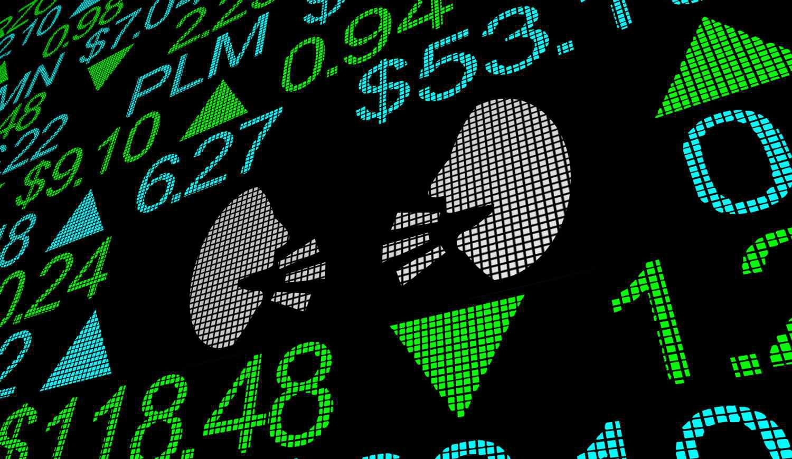

In the ever-evolving landscape of investment strategies, understanding how different approaches can be combined is key to maximizing returns. Three such strategies—insider buying, investment decisions, and algorithmic trading—hold significant potential when integrated effectively. Insider buying refers to the practice where company executives or board members purchase shares of their own firm, a move that often signals their confidence in the company’s future prospects. This activity can offer valuable insights into stock movements as it suggests that those with the most knowledge about the firm expect positive performance.

Investment decisions encompass a range of strategies aimed at generating returns in the stock market. These include value investing, focusing on undervalued stocks; growth investing, targeting companies with high potential for growth; and dividend investing, which seeks stocks that offer regular income. Each strategy relies on a mix of fundamental and technical analysis to evaluate potential investments, offering diverse approaches that can be tailored to different market conditions and investor goals.



Algorithmic trading introduces a modern dimension to investment practices, utilizing computer algorithms to execute trades based on predefined criteria. This method enhances the speed and accuracy of trading by reducing human error, and often employs techniques such as trend-following and statistical arbitrage to capitalize on market inefficiencies. The incorporation of artificial intelligence and machine learning in these algorithms enables predictive analytics, providing investors with advanced tools for making informed trading decisions.

By leveraging these strategies collectively, investors can gain unique insights and opportunities within the financial markets. Combining insider buying patterns with traditional stock market strategies and the precision of algorithmic trading allows for a well-rounded investment approach. This integrated strategy not only helps in identifying potential growth opportunities but also optimizes decision-making through a blend of human insight and automation, ultimately guiding informed investment decisions in a complex financial landscape.

## Table of Contents

## Understanding Insider Buying

Insider buying refers to situations where company executives or board members purchase shares of their own firm. This activity can often serve as a signal of confidence in the company’s future prospects. Insiders possess an intimate understanding of the company's operations, and their investment actions are closely monitored by the market as potential indicators of the company’s financial health and prospects.

One method through which investors track insider buying patterns is by analyzing Form 4 submissions with the U.S. Securities and Exchange Commission (SEC). Form 4 is a document that company insiders must file within two business days following the purchase or sale of their company’s stock. These submissions provide valuable insights into insider buying trends and the possible implications for stock movements. By examining these filings, investors can identify if there is a consistent pattern of insider buying, which might suggest positive insider sentiment about the company’s future performance.

However, insider buying should not be viewed in isolation. While it may suggest potential undervaluation of a company’s stock, it is crucial to assess the context, [volume](/wiki/volume-trading-strategy), and frequency of transactions. A single insider purchase may not be significant, but repeated buying by multiple insiders could be more telling. Additionally, the nature of the purchase—whether it’s part of an executive compensation plan or an open market purchase—may also impact the interpretation of these transactions. 

Therefore, investors are advised to adopt a comprehensive approach in analyzing insider buying activities. By combining this analysis with broader market analyses and considering external economic factors, investors can better gauge the implications of insider transactions and make more informed investment decisions.

## Stock Market Investment Strategies

Stock market strategies such as value, growth, and dividend investing rely on different approaches to generate returns. Each method offers distinct pathways for investors looking to optimize portfolio performance based on their individual financial goals and risk tolerance.

Value investing involves the identification of stocks that are undervalued in relation to their intrinsic worth. Investors implementing this strategy look for discrepancies between a company's market price and its fundamental value, often highlighted by financial metrics such as the Price-to-Earnings (P/E) ratio, Price-to-Book (P/B) ratio, and the price-earnings growth ratio (PEG). Notable investors, like Benjamin Graham and Warren Buffett, have popularized value investing by focusing on companies with strong fundamentals that the market may have temporarily overlooked.

Growth investing, by contrast, targets companies anticipated to demonstrate above-average growth in earnings, revenue, or cash flow. This strategy does not typically prioritize initial undervaluation but rather emphasizes potential exponential gains. Growth stocks, often found in sectors such as technology and healthcare, usually reinvest profits into business expansion rather than pay dividends. Investors engaged in growth investing evaluate metrics like revenue and earnings growth rates, the company’s competitive edge, and potential market expansion.

Dividend investing is designed to provide regular income through the acquisition of stocks that distribute consistent dividends. This approach is particularly appealing to investors seeking steady income, such as retirees. Dividend-paying companies usually come from well-established industries and can often withstand economic fluctuations. Key metrics for dividend investing include the dividend yield, payout ratio, and dividend growth rate.

All these strategies can be enhanced using both fundamental and technical analysis:

1. **Fundamental Analysis**: In assessing a company’s intrinsic value, fundamental analysis involves examining financial statements, industry conditions, and economic factors to gauge a company's overall health and future performance. This approach helps determine whether a stock is overvalued or undervalued.

2. **Technical Analysis**: This involves the study of historical price movements and trading volumes to predict future price trends. Investors use chart patterns and technical indicators like moving averages, relative strength index (RSI), and moving average convergence divergence (MACD) as tools to identify entry and exit points.

Combining both fundamental and technical analysis helps investors make more informed decisions by providing a complete picture of a stock’s potential. The deep understanding of these diverse strategies empowers investors to tailor their portfolios according to market conditions and individual objectives. Using these approaches strategically can significantly impact investment outcomes and long-term financial success.

## Algorithmic Trading: Automation in Investment

Algorithmic trading refers to the use of computer algorithms to execute trades according to predefined criteria, often resulting in increased trading speed and precision compared to human traders. This approach substantially enhances efficiency by minimizing human error and allowing for rapid, data-driven decision-making in financial markets.

A primary technique in [algorithmic trading](/wiki/algorithmic-trading) is trend-following, where algorithms identify and act on price trends in financial markets. This method aims to capitalize on [momentum](/wiki/momentum) by tracking asset price movements and making trading decisions that align with the identified trend. A common model used in trend-following is the moving average crossover, where an algorithm might buy when a short-term moving average crosses above a long-term moving average, indicating an upward trend.

Another prevalent strategy is statistical [arbitrage](/wiki/arbitrage), which leverages market inefficiencies to achieve profit. This approach typically involves complex mathematical models and large datasets to identify small price discrepancies between related financial instruments or markets. For instance, pairs trading is a form of [statistical arbitrage](/wiki/statistical-arbitrage) where the algorithm simultaneously buys and sells related stocks based on historical price correlations, betting on the reversion to their mean.

The integration of [artificial intelligence](/wiki/ai-artificial-intelligence) (AI) and [machine learning](/wiki/machine-learning) in algorithmic trading systems has further transformed investment strategies. These technologies enable the use of predictive analytics, improving the capacity to forecast market movements and adjust trading strategies dynamically. Machine learning models can be trained on vast datasets to recognize patterns and predict future price movements, allowing for more informed trading decisions that adapt to ever-changing market conditions.

For example, a simple linear regression model in Python might be used to predict stock prices based on historical data:

```python
import numpy as np
from sklearn.linear_model import LinearRegression

# Sample data: historical prices
X = np.array([1, 2, 3, 4, 5]).reshape(-1, 1)  # Days
y = np.array([10, 12, 15, 18, 21])  # Prices

# Train the linear regression model
model = LinearRegression()
model.fit(X, y)

# Predict future price
days_ahead = np.array([6]).reshape(-1, 1)
predicted_price = model.predict(days_ahead)
print(f"Predicted price in 6 days: {predicted_price[0]:.2f}")
```

This code demonstrates a straightforward method for predicting stock prices, where the linear regression model learns the relationship between day number and price, and then forecasts future prices based on this relationship.

Overall, algorithmic trading continues to evolve, driven by advancements in AI and machine learning. These technologies not only enhance traditional trading strategies but also open new avenues for innovation in financial markets, emphasizing the growing importance of data- and technology-driven approaches in contemporary investment practices.

## Combining Strategies for Optimal Investment

Integrating insider buying analysis with stock market and algorithmic trading strategies forms a robust investment framework. Insider buying involves company executives or directors purchasing their own company’s stocks, often a strong indicator of confidence in the firm’s future prospects. When utilized legally and ethically, this information can significantly enhance stock selection by indicating potential company growth opportunities. For instance, consistent insider buying may suggest that those with detailed knowledge of the company's operations and prospects foresee a rise in stock value, providing an advantage to discerning investors.

The strategic combination of insider buying data with algorithmic trading capitalizes on the speed and precision of modern technology. Algorithmic trading uses computer programs to execute trades based on predetermined criteria, enhancing trading efficiency and minimizing human error. By integrating insider buying insights into these algorithms, investors can refine their stock selection process, ensuring a more data-driven and informed approach.

For example, an algorithm could be programmed to monitor Form 4 submissions, which insiders use to report their buying activities to the Securities and Exchange Commission (SEC). Upon detecting significant insider buying activity, the algorithm could prioritize these stocks for further analysis or automatic inclusion in a portfolio, assuming that insider confidence could lead to positive market performance.

Python code can be implemented to track and react to insider buying activity efficiently. Consider the following Python example using pseudocode to conceptualize this integration:

```python
import requests
from stock_analysis import evaluate_stock

def fetch_insider_trades(company_ticker):
    # API call to obtain recent insider trades for a given company ticker
    response = requests.get(f"https://api.sec.gov/insider/{company_ticker}")
    return response.json()

def algorithmic_trade(company_ticker):
    insider_trades = fetch_insider_trades(company_ticker)
    for trade in insider_trades:
        if trade['type'] == 'Buy' and trade['volume'] > threshold:
            # Evaluate stock using predefined algorithm
            if evaluate_stock(company_ticker):
                # Execute trade
                execute_algorithmic_trade(company_ticker)

# Example usage
company_list = ['AAPL', 'TSLA', 'GOOGL']
for company in company_list:
    algorithmic_trade(company)
```

In this example, the script monitors insider buying activity and evaluates whether the company is worth investing in based on additional criteria defined in `evaluate_stock`. By synthesizing insights from insider transactions with precise algorithmic execution, this hybrid strategy maximizes potential returns while minimizing risk and emotional bias.

In conclusion, the synergy of human insight derived from insider buying data with the computational robustness of algorithmic trading enables investors to optimize investment strategies in a highly complex and interdependent market environment. This approach not only enhances decision-making efficiency but also bridges traditional investment analysis with cutting-edge technological advancements.

## Conclusion

As the investment landscape becomes increasingly digital and data-driven, integrating traditional and modern strategies becomes crucial for maximizing returns. The effective application of insider buying analysis, diverse stock market strategies, and algorithmic trading serves as a comprehensive approach that accommodates both established and innovative methodologies. 

Understanding the dynamics of insider buying is pivotal; it provides valuable insight into the confidence levels of company executives and board members regarding the future prospects of their own company. This understanding supports informed decision-making by indicating potentially undervalued stocks.

Simultaneously, traditional stock market strategies, such as value, growth, and dividend investing, remain essential. These approaches, supported by rigorous fundamental and technical analysis, cater to different investment preferences and risk appetites, offering a balanced perspective on portfolio diversification.

In contrast, algorithmic trading represents the technological advancement in investment strategies, enabling high-frequency trading with greater precision and less human error. The integration of AI and machine learning has further enhanced this domain, allowing predictive analytics to identify and capitalize on market inefficiencies in real-time.

For investors aiming to capitalize on market opportunities, continued learning and adaptation are fundamental. The constant evolution of investment strategies necessitates a willingness to adopt new technologies and methodologies, ensuring competitive advantage and optimal financial gain.

As future trends in investment emerge, the synergistic application of these strategies promises not only an adaptation to contemporary market conditions but also a thriving potential in capital markets. Understanding and harnessing these interconnected strategies leads to more informed, strategic investment decisions, preparing investors for an increasingly complex and automated financial world.

## References & Further Reading

[1]: ["Insider Trading and the Stock Market"](https://finbold.com/guide/insider-trading/) by Henry G. Manne

[2]: Khan, M., & Zubair, S. (2013). ["Impact of Insider Trading on Firm Value."](https://papers.ssrn.com/sol3/papers.cfm?abstract_id=3441058) Journal of Business Research.

[3]: ["The Intelligent Investor"](https://www.amazon.com/Intelligent-Investor-3rd-Ed/dp/0063356724) by Benjamin Graham

[4]: Morelli, D. (2003). ["Fundamental Analysis and the Market Adjustment Process."](https://onlinelibrary.wiley.com/doi/abs/10.1111/1911-3846.12466) Journal of Financial Research.

[5]: ["High-Frequency Trading: A Practical Guide to Algorithmic Strategies and Trading Systems"](https://www.ahmetbeyefendi.com/wp-content/uploads/2020/07/High-Frequency-Trading-Irene-Aldridge.pdf) by Irene Aldridge

[6]: Narasimhan Vijaya Kumar, M. (2012). ["Technique and Technologies of Algorithmic Trading."](https://scholar.google.com/citations?user=64NVAYsAAAAJ&hl=en) Springer.

[7]: Fama, E.F. (1970). ["Efficient Capital Markets: A Review of Theory and Empirical Work,"](https://onlinelibrary.wiley.com/doi/abs/10.1111/j.1540-6261.1970.tb00518.x) The Journal of Finance.