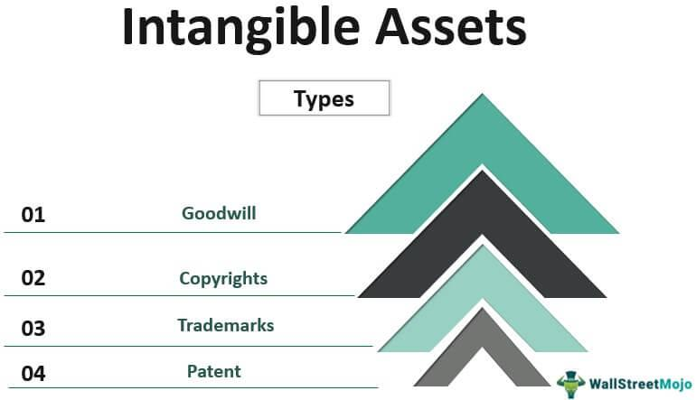

## Table of Contents

## What are intangible assets?

Intangible assets are things that a company owns that you can't touch or see. They are different from tangible assets, like machines or buildings, because they don't have a physical form. Examples of intangible assets include things like a company's brand name, patents, copyrights, and even its customer lists. These assets are valuable because they help the company make money, even though they aren't physical objects.

These assets are important because they can give a company an edge over its competitors. For example, a strong brand name can make customers choose one company's products over another's. Patents can stop other companies from making the same product, which can help the company keep its market share. Because intangible assets are so important, companies need to keep track of them and report their value on their financial statements, even though it can be hard to figure out exactly how much they are worth.

## How do intangible assets differ from tangible assets?

Intangible assets and tangible assets are two types of things a company can own, but they are very different. Tangible assets are things you can touch and see, like a computer, a truck, or a building. They have a physical form and you can easily see and use them. On the other hand, intangible assets are things you can't touch or see. They don't have a physical form, but they are still very important. Examples include a company's brand name, patents, or customer lists.

The main difference between the two is that tangible assets are easy to value because you can see them and know what they are worth. If you want to sell a truck, you can look at what similar trucks are selling for and get a good idea of its value. Intangible assets are harder to value because they don't have a physical form. For example, how much is a brand name worth? It's not easy to put a number on that. But even though they are hard to value, intangible assets can be very important to a company's success because they help the company make money and stand out from competitors.

## What types of intangible assets commonly affect stock valuation?

Intangible assets like brand names, patents, and customer lists can really affect how much a company's stock is worth. A strong brand name can make people want to buy a company's products more than others. This can lead to more sales and higher profits, which can make the stock price go up. Patents are also important because they stop other companies from making the same product. This can help a company keep its customers and make more money, which can also make the stock price go up.

Customer lists are another intangible asset that can affect stock valuation. If a company has a big list of loyal customers, it can keep making money from them over time. This can make investors think the company will do well in the future, which can make the stock price go up. Even though these intangible assets are hard to see and value, they can have a big impact on how much a company's stock is worth.

## How are intangible assets valued on a company's balance sheet?

Intangible assets are tricky to put a value on because you can't touch them. They are things like a company's brand name, patents, or customer lists. To show these on a balance sheet, companies have to guess how much they are worth. They might look at how much money the asset could make in the future or how much it cost to get the asset in the first place. For example, if a company spent a lot of money to buy a patent, they might use that amount as the value on the balance sheet.

Once a value is set, the company has to follow some rules about how to show it on the balance sheet. Some intangible assets, like patents, lose value over time. This is called amortization. The company will slowly lower the value of the asset on the balance sheet each year to show that it's getting less valuable. Other intangible assets, like brand names, might not lose value over time. These are checked every year to see if they are still worth the same amount or if they need to be changed. This way, the balance sheet shows a fair picture of what the company owns, even if it's hard to see or touch.

## What is the role of intangible assets in stock valuation?

Intangible assets like brand names, patents, and customer lists can really affect how much a company's stock is worth. A strong brand name can make people want to buy a company's products more than others. This can lead to more sales and higher profits, which can make the stock price go up. Patents are also important because they stop other companies from making the same product. This can help a company keep its customers and make more money, which can also make the stock price go up.

Customer lists are another intangible asset that can affect stock valuation. If a company has a big list of loyal customers, it can keep making money from them over time. This can make investors think the company will do well in the future, which can make the stock price go up. Even though these intangible assets are hard to see and value, they can have a big impact on how much a company's stock is worth.

## How do investors assess the impact of intangible assets on a company's stock price?

Investors look at intangible assets to figure out how much a company's stock is worth. They pay attention to things like the company's brand name, patents, and customer lists. A strong brand can make people want to buy the company's products more, which can lead to more sales and higher profits. This can make the stock price go up. Patents are also important because they stop other companies from making the same product. This can help the company keep its customers and make more money, which can also make the stock price go up.

Another thing investors look at is the company's customer lists. If a company has a big list of loyal customers, it can keep making money from them over time. This can make investors think the company will do well in the future, which can make the stock price go up. Even though intangible assets are hard to see and value, investors know they can have a big impact on how much a company's stock is worth. They use different ways to guess how much these assets are worth and how they might affect the stock price.

## Can intangible assets lead to a higher stock valuation? If so, how?

Yes, intangible assets can lead to a higher stock valuation. These assets, like a company's brand name, patents, and customer lists, can make the company more valuable even though you can't touch them. A strong brand name can make people want to buy the company's products more than others. This can lead to more sales and higher profits, which can make the stock price go up. Patents are also important because they stop other companies from making the same product. This can help the company keep its customers and make more money, which can also make the stock price go up.

Customer lists are another intangible asset that can affect stock valuation. If a company has a big list of loyal customers, it can keep making money from them over time. This can make investors think the company will do well in the future, which can make the stock price go up. Even though intangible assets are hard to see and value, they can have a big impact on how much a company's stock is worth. Investors look at these assets to guess how much they might help the company make money and grow, which can lead to a higher stock valuation.

## What are some examples of companies where intangible assets significantly impact their stock valuation?

Apple is a good example of a company where intangible assets like its brand name really help its stock price. People all over the world know and trust the Apple brand. This makes them want to buy Apple's products, like iPhones and MacBooks, even if they cost more than other similar products. Because of this, Apple can sell a lot of products and make a lot of money, which makes investors think Apple's stock is worth more.

Another example is Coca-Cola. The Coca-Cola brand is very strong and famous around the world. People feel good about drinking Coca-Cola, and this helps the company sell a lot of drinks. This strong brand helps Coca-Cola make a lot of money, and investors see this and think the stock is worth more. Also, Coca-Cola has secret recipes and formulas that other companies can't use, which helps them keep making money and keeps their stock price high.

## How do accounting standards treat intangible assets, and what implications does this have for stock valuation?

Accounting standards treat intangible assets in a special way because they are hard to see and value. They are things like a company's brand name, patents, or customer lists. To show these on a balance sheet, companies have to guess how much they are worth. They might look at how much money the asset could make in the future or how much it cost to get the asset in the first place. Some intangible assets, like patents, lose value over time. This is called amortization. The company will slowly lower the value of the asset on the balance sheet each year to show that it's getting less valuable. Other intangible assets, like brand names, might not lose value over time. These are checked every year to see if they are still worth the same amount or if they need to be changed.

The way accounting standards treat intangible assets can affect how investors see a company's stock value. If a company has a lot of valuable intangible assets, like a strong brand name or important patents, it can make more money and be more successful. This can make investors think the company's stock is worth more. But because it's hard to put a number on how much these assets are worth, it can also make it harder for investors to guess how much the stock should be worth. So, the way intangible assets are shown on the balance sheet can have a big impact on how much investors think a company's stock is worth.

## What are the challenges in quantifying the impact of intangible assets on stock valuation?

Quantifying the impact of intangible assets on stock valuation is hard because these assets, like brand names or patents, don't have a clear value. You can't touch them or see them, so it's tough to put a number on how much they are worth. For example, how much is the Coca-Cola brand worth? It's not easy to say, but it's clear that the brand helps Coca-Cola sell a lot of drinks and make a lot of money. Investors need to guess how much these intangible assets might help the company make money in the future, and that's not easy to do.

Another challenge is that the value of intangible assets can change over time. A brand name that is popular now might not be as popular in the future. Or a patent might lose its value if someone comes up with a better way to do things. Accounting rules try to deal with this by making companies check the value of their intangible assets every year, but it's still hard to get it right. All of these things make it tricky for investors to figure out how much a company's stock should be worth because of its intangible assets.

## How do intangible assets influence long-term stock performance?

Intangible assets like brand names, patents, and customer lists can really help a company's stock do well over a long time. A strong brand name can make people want to buy a company's products more than others. This can lead to more sales and higher profits year after year. For example, a company like Apple has a very strong brand that people trust, which helps them sell a lot of iPhones and MacBooks. This steady stream of sales and profits can make investors think the company will keep doing well, which can make the stock price go up over time.

Patents are also important for long-term stock performance. They stop other companies from making the same product, which can help the company keep its customers and make more money over the years. If a company has a big list of loyal customers, it can keep making money from them over time. This can make investors think the company will do well in the future, which can make the stock price go up. Even though intangible assets are hard to see and value, they can have a big impact on how well a company's stock does over the long term.

## What advanced methodologies are used to model the impact of intangible assets on stock valuation?

To figure out how much intangible assets like brand names or patents affect a company's stock value, experts use some advanced ways to model this. One way is called the discounted cash flow (DCF) method. This method tries to guess how much money the intangible asset will help the company make in the future. Then, it takes that future money and figures out what it's worth now. It's like saying, "If this brand will help us make a lot of money in the future, how much is that worth to us today?" This can be tricky because it's hard to guess exactly how much money the asset will make, but it's a good way to get an idea.

Another way is called the royalty relief method. This method tries to guess how much money a company would have to pay to use the intangible asset if they didn't own it. For example, if a company has a famous brand, how much would they have to pay someone else to use that brand? This can help figure out how much the brand is worth to the company. Both of these methods help investors and companies understand how much intangible assets might help the stock price over time, even though it's hard to put a number on something you can't touch.

## What are the valuation methods for intangible assets?

Valuation methods for intangible assets are essential for accurately reflecting the financial health and potential of a company. One widely recognized approach is the Calculated Intangible Value (CIV), which assesses an asset's contribution to earnings. This method involves analyzing the excess earnings generated by a company after accounting for tangible asset contributions. CIV provides insights into the value driven by intangible assets such as brand reputation, patents, and intellectual property.

Another prevalent method is the market-to-book ratio, used to provide a comparative measure of a company's market value against its book value. This ratio is calculated as:

$$
\text{Market-to-Book Ratio} = \frac{\text{Market Value of Equity}}{\text{Book Value of Equity}}
$$

This method, however, has limitations due to fluctuations in market sentiment and external economic factors that can distort the perceived value of intangible assets. While popular, it often requires cautious interpretation and supplementary analysis to account for the discrepancy between market perceptions and actual asset contributions.

Industry-specific metrics and earnings performance evaluations are also critical when assessing intangible assets. These techniques involve benchmarking against industry standards and analyzing financial performance indicators that highlight the competitive advantages conferred by intangibles. For instance, in the technology sector, metrics might include R&D intensity or intellectual property portfolios.

Valuation accuracy is crucial for providing a true picture of a company's financial health. Reliable valuations necessitate comprehensive data analysis and a deep understanding of the industry context. Tools such as discounted cash flow (DCF) models, which estimate the present value of expected future cash flows derived from intangible assets, are often deployed to enhance precision in valuation.

Overall, by employing a combination of these valuation methods, investors and analysts can gain a more holistic view of a company's true potential, beyond tangible measurements alone.

## References & Further Reading

[1]: Lev, B. (2005). ["Intangible Assets: Concepts and Measurements."](https://www.semanticscholar.org/paper/Intangible-Assets%3A-Concepts-and-Measurements-Lev/8fb887e2e63bb5b74c3110b25780adf4fa71b791) Journal of Innovation Management.

[2]: Damodaran, A. (2010). ["The Dark Side of Valuation: Valuing Young, Distressed, and Complex Businesses."](https://pages.stern.nyu.edu/~adamodar/pdfiles/country/darkside.pdf) Ft Press.

[3]: Tang, P., & Wang, B. (2020). ["Machine Learning and the Valuation of Intangible Assets."](https://www.sciencedirect.com/science/article/pii/S0360319924052996) In: Proceedings of AI in Financial Markets.

[4]: Hirschey, M. (2001). ["Goodwill, Intangible Assets, and Shareholder Returns."](https://lib.manaraa.com/books/Investor%20Underreaction%20to%20Goodwill%20Write-Offs.pdf) Financial Analysts Journal.

[5]: Ang, A., Bekaert, G., & Wei, M. (2008). ["The Term Structure of Real Rates and Expected Inflation."](https://www.jstor.org/stable/25094457) National Bureau of Economic Research Working Paper.

[6]: Chincarini, L. B., & Kim, D. (2006). ["Quantitative Equity Portfolio Management."](https://www.scirp.org/reference/referencespapers?referenceid=2212862) McGraw-Hill Education.

[7]: Silver, N. (2012). ["The Signal and the Noise: Why So Many Predictions Fail—But Some Don't."](https://www.amazon.com/Signal-Noise-Many-Predictions-Fail-but/dp/0143125087) Penguin Books.