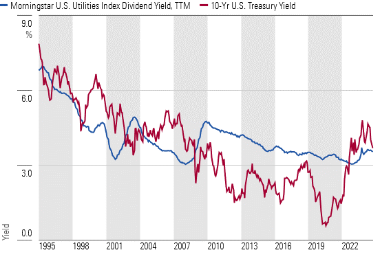

## Table of Contents

## What are utility stocks?

Utility stocks are shares in companies that provide essential services like electricity, gas, water, and sometimes even internet and phone services. These companies are often considered stable because people need their services no matter what's happening in the economy. For example, even during tough times, people still need to use electricity and water in their homes.

Investing in utility stocks can be a good choice for people who want a steady income. These stocks usually pay regular dividends, which are like small payments to shareholders. Because utility companies are so important, they often have predictable earnings, which can make their stocks less risky than others. However, they might not grow as quickly as stocks in more exciting industries like technology.

## What is an interest rate?

An interest rate is the cost of borrowing money or the reward for saving it. When you take out a loan, like a car loan or a mortgage, the interest rate is the extra money you have to pay back on top of the amount you borrowed. For example, if you borrow $100 with a 5% interest rate, you'll end up paying back $105. Banks and other lenders use interest rates to make money from loans.

Interest rates also affect savings. When you put money into a savings account, the bank might pay you interest. This means your money grows over time. The interest rate on your savings account tells you how much extra money you'll earn. If you have $100 in a savings account with a 2% interest rate, you'll have $102 at the end of the year. Interest rates are important because they influence how much it costs to borrow and how much you can earn from saving.

## How do interest rates affect the economy?

Interest rates play a big role in the economy. When interest rates are low, it's cheaper for people and businesses to borrow money. This can lead to more spending and investment, which can help grow the economy. For example, if a company can borrow money at a low rate, it might decide to build a new factory or hire more workers. When people see low rates, they might buy homes or cars because the loans are cheaper. This increased activity can boost economic growth.

On the other hand, when interest rates are high, borrowing becomes more expensive. This can slow down the economy because people and businesses might not want to take out loans if they have to pay a lot in interest. High rates can make people save more and spend less, which can lead to less economic activity. For instance, if it's expensive to get a mortgage, fewer people might buy houses, and this can cool down the housing market. Central banks often adjust interest rates to control inflation and keep the economy stable.

## Why are utility stocks considered a safe investment?

Utility stocks are thought of as a safe investment because they are in businesses that people always need. Companies that provide electricity, water, and gas are essential, so they usually have steady income no matter what's happening in the economy. Even when times are tough, people still need to turn on their lights and use water. This means utility companies can keep making money and paying dividends to their shareholders, which makes their stocks less risky.

Another reason utility stocks are seen as safe is because they often pay regular dividends. These are like small payments to people who own the stock. Because utility companies have predictable earnings, they can afford to give these payments regularly. Investors who want a steady income without too much risk often choose utility stocks for this reason. While they might not grow as fast as stocks in more exciting industries, the stability and regular dividends make them a reliable choice.

## What is the relationship between interest rates and utility stock prices?

Interest rates and utility stock prices have an interesting relationship. When interest rates go up, it can be bad for utility stocks. Utility companies often have a lot of debt because they need money to build things like power plants. If interest rates rise, it costs them more to pay back that debt. Also, when interest rates go up, other investments like bonds start to look better because they offer higher returns. This can make people want to sell their utility stocks and buy bonds instead, which can push the price of utility stocks down.

On the other hand, when interest rates go down, it can be good for utility stocks. Lower interest rates mean it's cheaper for utility companies to borrow money, so their costs go down. This can make their profits higher, which can make their stock prices go up. Also, when interest rates are low, bonds don't pay as much, so people might think utility stocks are a better choice because they offer regular dividends. This can make more people want to buy utility stocks, pushing their prices up.

## How do rising interest rates impact the cost of capital for utility companies?

When interest rates go up, it costs more for utility companies to borrow money. These companies often need to borrow a lot to build things like power plants or to update their systems. If the interest rates are higher, the money they have to pay back on their loans goes up too. This means the cost of capital, which is the money they use to run and grow their business, becomes more expensive. It's like if you had to pay more interest on a loan for a car; it would cost you more over time.

Higher interest rates can also make it harder for utility companies to make money. When borrowing costs more, it cuts into the profits the company can make. If the company has to pay more in interest, there's less money left over for other things like paying dividends to shareholders or investing in new projects. This can make it tougher for the company to grow and might even affect how much money they can make overall.

## Can you explain the concept of dividend yield and its relevance to utility stocks?

Dividend yield is a way to measure how much money you get back from an investment in the form of dividends. It's like a percentage that tells you how much of the price you paid for a stock you get back each year in dividends. You find the dividend yield by taking the yearly dividend payment and dividing it by the stock's price. If a stock costs $100 and pays $5 in dividends each year, the dividend yield is 5%. This number helps you see how much income you can expect from owning the stock.

For utility stocks, dividend yield is really important. Utility companies usually pay good dividends because they have steady income from providing services like electricity and water. People like utility stocks because they want a reliable income from their investments. Even when the economy is not doing well, utility companies keep making money, so they can keep paying dividends. This makes their stocks attractive to people who want to earn money regularly from their investments without too much risk.

## How do changes in interest rates influence the dividend payout of utility stocks?

When interest rates go up, it can affect how much money utility companies can pay out in dividends. These companies often borrow a lot of money to build things like power plants. If interest rates rise, it costs them more to pay back what they borrowed. This means they have less money left over for dividends. Also, when interest rates go up, other investments like bonds start to look better because they pay more. People might sell their utility stocks to buy bonds, which can make the stock price go down. If the stock price goes down, the company might decide to keep the dividend the same to make the dividend yield look better, but they can't always do that if they don't have enough money.

On the other hand, when interest rates go down, it's usually good news for utility stocks and their dividends. It's cheaper for utility companies to borrow money, so they have more money left over after paying back their loans. This can mean more money for dividends. Also, when interest rates are low, bonds don't pay as much, so people might think utility stocks are a better choice because of their regular dividends. This can make more people want to buy utility stocks, which can help keep the stock price up. With a higher stock price and more money to spare, utility companies might be able to increase their dividends or at least keep them steady.

## What historical data shows the correlation between interest rate changes and utility stock performance?

Looking back at history, we can see that when interest rates go up, utility stocks often don't do as well. For example, during the late 1970s and early 1980s, interest rates were really high. This made it more expensive for utility companies to borrow money, and their stock prices went down. People also started buying more bonds because they paid better, which meant fewer people wanted to buy utility stocks. This shows how rising interest rates can hurt utility stocks.

On the other hand, when interest rates go down, utility stocks usually do better. In the early 2000s, after the dot-com bubble burst, the Federal Reserve lowered interest rates to help the economy. This made it cheaper for utility companies to borrow money, and their stock prices went up. People also liked utility stocks more because they paid good dividends, and those dividends looked even better when interest rates were low. So, lower interest rates helped utility stocks perform well.

## How do utility companies hedge against interest rate risks?

Utility companies often use something called interest rate swaps to protect themselves from changes in interest rates. An interest rate swap is like a deal where the utility company agrees to exchange one kind of interest payment for another kind with another company. For example, if they have a loan with a variable interest rate, they might swap it for a fixed rate. This way, even if interest rates go up, the utility company knows exactly how much they will have to pay, and it won't be more than they planned.

Another way utility companies can protect themselves is by using financial tools like interest rate caps and floors. An interest rate cap is like an insurance policy that limits how high the interest rate on their loans can go. If rates go above a certain point, the cap kicks in and the utility company doesn't have to pay the extra. An interest rate floor does the opposite, setting a minimum interest rate. By using these tools, utility companies can make sure their costs don't go up too much if interest rates change suddenly.

## What are the long-term implications of sustained interest rate changes on utility stocks?

When interest rates stay high for a long time, it can be tough for utility stocks. These companies often need to borrow a lot of money to build things like power plants. If interest rates are high, it costs them more to pay back their loans. This can mean less money for things like paying dividends to shareholders. Also, when interest rates are high, other investments like bonds start to look better because they offer higher returns. This can make people want to sell their utility stocks and buy bonds instead, which can push the price of utility stocks down over time.

On the other hand, if interest rates stay low for a long time, it can be good for utility stocks. It's cheaper for utility companies to borrow money, so they have more money left over after paying back their loans. This can mean more money for dividends, which can make their stocks more attractive to investors. When interest rates are low, bonds don't pay as much, so people might think utility stocks are a better choice because they offer regular dividends. This can help keep the price of utility stocks up over the long term.

## How should investors adjust their strategies in utility stocks in response to anticipated interest rate changes?

When investors think interest rates might go up, they need to be careful with utility stocks. Utility companies often borrow a lot of money, and if interest rates rise, it costs them more to pay back their loans. This can mean less money for dividends, which might make the stock less attractive. Investors might want to sell some of their utility stocks before interest rates go up, or look for utility companies that have less debt. They could also consider moving some of their money into other investments like bonds, which might start to pay better when interest rates rise.

On the other hand, if investors think interest rates will go down, they might want to buy more utility stocks. When interest rates are low, it's cheaper for utility companies to borrow money, so they can have more money left over for dividends. This makes their stocks more appealing, especially to people looking for steady income. Investors could also hold onto their utility stocks and maybe even buy more, expecting that the stock prices will go up and the dividends will stay strong or even increase.

## What is the impact of interest rates on utility stocks?

Interest rates significantly influence utility stocks due to the capital-intensive operations of utility companies, necessitating substantial borrowing for infrastructure maintenance and expansion. Consequently, the variations in interest rates can have pronounced effects on the profitability and stock valuation of these companies.

Higher interest rates lead to increased borrowing costs. Given the dependence of utility companies on debt financing for their long-term capital projects, an upward shift in interest rates raises the cost of their existing and new debts. This increase in debt servicing costs can compress profit margins and thus impact shareholder returns. As a result, utilities may face challenges in maintaining attractive dividend payouts, which are a key feature for investors seeking income stability. A formula representing the impact on profitability can be expressed as:

$$
\text{Net Income} = \text{Revenue} - (\text{Operating Expenses} + \text{Interest Expenses})
$$

Where an increase in interest rates elevates the "Interest Expenses" component, thereby reducing net income if other variables remain constant.

Conversely, when interest rates decline, utility companies benefit from lower borrowing costs. Reduced interest expenses can lead to enhanced profitability, allowing these companies to either increase dividends or reinvest in further expansion. This scenario can lead to a rise in stock prices, as investors perceive stronger financial health and potential for increased returns.

Utility stocks become particularly attractive during periods of low interest rates. The stability and predictability of their dividends stand out more prominently compared to the typically lower yields on fixed-income securities during such times. This shift often results in increased investor demand for utility stocks, as the relative value proposition of their dividends becomes more compelling in a lower [interest rate](/wiki/interest-rate-trading-strategies) environment.

The relationship between interest rates and utility stock demand can be illustrated through the Dividend Discount Model (DDM), which is often employed to evaluate the fair value of a stock based on its expected dividends:

$$
P_0 = \frac{D_1}{r - g}
$$

Where:
- $P_0$ = Current stock price
- $D_1$ = Expected dividend next year
- $r$ = Required rate of return
- $g$ = Growth rate of dividends

In this model, a decrease in the required rate of return ($r$) due to lower interest rates increases the stock price ($P_0$), assuming the dividend growth rate ($g$) remains constant.

Understanding these dynamics helps investors to strategically adjust their portfolios in response to anticipated interest rate changes, thus optimizing their potential returns from utility stocks.

## References & Further Reading

[1]: Fabozzi, F. J., & Peterson, P. P. (2015). ["The Handbook of Mortgage-Backed Securities"](https://academic.oup.com/book/7943). Oxford University Press.

[2]: Geman, H. (2005). ["Commodities and Commodity Derivatives: Modelling and Pricing for Agriculturals, Metals and Energy"](https://download.e-bookshelf.de/download/0000/5675/90/L-G-0000567590-0015270354.pdf). Wiley Finance.

[3]: Lopez de Prado, M. (2018). ["Advances in Financial Machine Learning"](https://www.amazon.com/Advances-Financial-Machine-Learning-Marcos/dp/1119482089). Wiley.

[4]: Chan, E. (2009). ["Quantitative Trading: How to Build Your Own Algorithmic Trading Business"](https://github.com/ftvision/quant_trading_echan_book). Wiley.

[5]: Derman, E. (2016). ["The Volatility Smile"](https://onlinelibrary.wiley.com/doi/book/10.1002/9781119289258). Wiley.

[6]: Jansen, S. (2020). ["Machine Learning for Algorithmic Trading - Second Edition"](https://github.com/PacktPublishing/Machine-Learning-for-Algorithmic-Trading-Second-Edition). Packt Publishing.

[7]: Aronson, D. (2006). ["Evidence-Based Technical Analysis: Applying the Scientific Method and Statistical Inference to Trading Signals"](https://www.amazon.com/Evidence-Based-Technical-Analysis-Scientific-Statistical/dp/0470008741). Wiley.