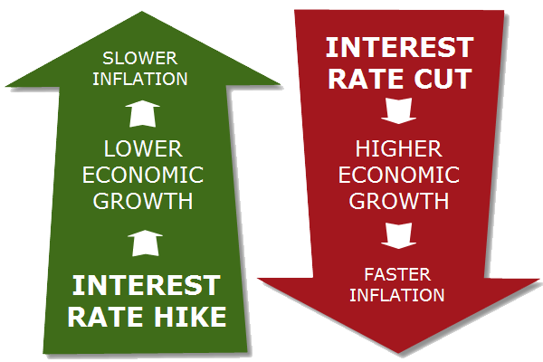

## Table of Contents

## What are interest rates and how do they affect the economy?

Interest rates are the cost of borrowing money, usually shown as a percentage. When you take a loan from a bank, you pay back the money you borrowed plus some extra, which is the interest. Banks and other financial institutions set these rates based on many things, like what the central bank does and what's happening in the economy. The central bank, like the Federal Reserve in the U.S., can change its key interest rate, which influences all other rates.

When interest rates go up, borrowing money becomes more expensive. This can slow down the economy because people and businesses might borrow less. They might not want to take out loans for things like buying a house or starting a new project. On the other hand, saving money becomes more attractive because you can earn more interest on your savings. When interest rates go down, borrowing money is cheaper, which can help the economy grow. People might take out more loans, and businesses might invest more. But, saving money becomes less attractive because you earn less interest. So, interest rates are a powerful tool that can help control how fast or slow the economy is moving.

## How do interest rates influence currency values in forex trading?

Interest rates can have a big impact on how much a country's currency is worth in forex trading. When a country's central bank raises its interest rates, it usually makes that country's currency more valuable. This happens because higher interest rates attract more foreign money. Investors want to put their money in places where they can earn more interest. So, they buy the currency of the country with higher rates, which increases its demand and value.

On the other hand, when a country's central bank lowers its interest rates, it can make the currency less valuable. Lower rates mean less interest for investors, so they might take their money out of that country and invest it somewhere else. This can decrease the demand for the currency and make its value go down. Forex traders watch these interest rate changes closely because they can make big differences in currency values and affect their trading decisions.

## What is the relationship between interest rates and inflation in forex markets?

Interest rates and inflation are closely linked in forex markets. When a country's central bank raises interest rates, it often does this to control inflation. Higher interest rates can slow down spending and borrowing, which can help keep prices from rising too fast. If a country has high inflation, its currency might become less valuable because people worry about the economy. But if the central bank raises rates to fight inflation, it can make the currency stronger because investors see it as a good place to earn interest.

On the other hand, if a country's central bank lowers interest rates, it might be trying to boost the economy and encourage spending. Lower rates can lead to more borrowing and spending, which can push inflation up. If inflation gets too high, the currency can lose value in forex markets. Traders watch these changes because they can predict how a currency might move based on what the central bank does with interest rates and how it affects inflation.

## How can traders use interest rate differentials to their advantage in forex trading?

Traders can use interest rate differentials to make money in forex trading by taking advantage of the difference in interest rates between two countries. When a trader borrows in a country with low interest rates and invests in a country with high interest rates, they can earn the difference as profit. This strategy is called the "carry trade." For example, if Japan has low interest rates and the U.S. has high interest rates, a trader can borrow Japanese yen, convert it to U.S. dollars, and invest in U.S. assets. The trader earns the difference between the U.S. and Japanese interest rates, as long as the exchange rate stays stable or moves in their favor.

However, using interest rate differentials can be risky. If the exchange rate changes a lot, it can wipe out the profits from the interest rate difference. For example, if the U.S. dollar suddenly loses value against the Japanese yen, the trader might lose more money on the exchange rate than they earn from the interest rate difference. Traders need to watch economic news and central bank actions closely because these can change interest rates and currency values quickly. So, while interest rate differentials can offer a chance to make money, they also come with risks that traders need to manage carefully.

## What are the effects of central bank policies on interest rates and forex trading?

Central banks have a big role in setting interest rates, and their policies can really shake up forex trading. When a central bank decides to raise its key interest rate, it makes borrowing money in that country more expensive. This can attract more foreign money because investors want to earn higher interest. As a result, the country's currency might become stronger in the forex market. For example, if the U.S. Federal Reserve raises rates, the U.S. dollar might get stronger because more people want to invest in the U.S. Forex traders pay close attention to these moves because they can make big changes in how much a currency is worth.

On the flip side, when a central bank lowers its interest rates, borrowing money becomes cheaper. This can lead to more spending and borrowing in the economy, which might help it grow. But it can also make the country's currency weaker in forex markets because lower rates don't attract as much foreign money. If the European Central Bank lowers rates, the euro might lose value. Traders watch these policy changes carefully because they can predict how currencies might move. Central bank policies are like big waves that can push currencies up or down, and traders need to ride these waves smartly to make money.

## How do interest rate announcements impact forex market volatility?

Interest rate announcements can make the forex market go wild. When a central bank says it's going to change interest rates, traders get excited and start buying or selling currencies fast. This can make the prices of currencies jump up and down a lot. It's like everyone is trying to guess what will happen next and wants to be the first to make a move. If the announcement is a surprise, like a big change in rates, the market can get even more crazy. Traders who didn't see it coming might rush to change their plans, making the market even more unpredictable.

But it's not just the announcement itself that causes all the action. The days or even weeks before the announcement can be full of guesses and rumors about what the central bank might do. This can make the market shaky as traders try to get ahead of the news. Once the announcement is out, things can calm down a bit, but if the change in rates is different from what everyone expected, the market can stay jumpy for a while. So, interest rate announcements are big events that can make the forex market a rollercoaster ride.

## What are carry trades and how do they relate to interest rates in forex trading?

Carry trades are a way for traders to make money by using the difference in interest rates between two countries. In a carry trade, a trader borrows money from a country with low interest rates and then uses that money to invest in a country with higher interest rates. The trader makes money from the difference between the two rates. For example, if Japan has low interest rates and the U.S. has high interest rates, a trader can borrow Japanese yen, change it into U.S. dollars, and then invest in something in the U.S. that pays a higher interest. As long as the exchange rate between the yen and the dollar stays the same or moves in the trader's favor, they can keep earning the difference in interest rates.

But carry trades can be risky. If the currency the trader borrowed (like the yen) suddenly becomes more valuable compared to the currency they invested in (like the dollar), it can wipe out the profits from the interest rate difference. This can happen if there are big changes in the economy or if the central banks in those countries change their interest rates. Traders need to watch the news and be ready for quick changes in the market. Even though carry trades can be a good way to make money, they come with risks that traders need to think about carefully.

## How do traders anticipate and react to interest rate changes in forex markets?

Traders try to guess what central banks will do with interest rates by looking at lots of information. They read reports about how the economy is doing, listen to what central bank leaders say, and keep an eye on things like inflation and jobs numbers. If they think a central bank will raise rates, they might start buying that country's currency because they know it could become more valuable. On the other hand, if they think rates will go down, they might sell the currency because it could lose value. Traders also use charts and numbers to help them make these guesses, trying to spot patterns that show what might happen next.

When a central bank finally announces a change in interest rates, traders act fast. If the change is what they expected, they might have already made their moves and the market might not jump around too much. But if the change is a surprise, like a bigger increase or decrease than expected, the market can get really wild. Traders might rush to buy or sell currencies, causing big swings in prices. Even after the announcement, traders keep watching to see how the economy reacts and what the central bank might do next, always ready to change their plans if things don't go as they thought.

## What are the risks associated with trading forex based on interest rate movements?

Trading forex based on interest rate movements can be risky because the market can be very unpredictable. If a trader thinks a central bank will raise rates and buys that country's currency, but the rates stay the same or go down, the trader can lose money. Also, even if the trader guesses right about the interest rate change, the currency might not move the way they expect. Other things like news, politics, or big events can make the currency go up or down suddenly, messing up the trader's plans.

Another big risk is using carry trades, where traders borrow from a country with low rates and invest in a country with high rates. This can work well if the exchange rates stay stable, but if the currency they borrowed suddenly becomes more valuable, it can wipe out their profits. Traders also need to watch out for sudden changes in the economy or central bank policies that can change interest rates quickly. So, while trading forex based on interest rates can be a way to make money, it's important for traders to understand these risks and be ready for surprises.

## How do global interest rate trends influence forex trading strategies?

Global interest rate trends can really change how traders make their moves in the forex market. When traders see that interest rates are going up in one country and down in another, they might decide to buy the currency from the country with rising rates. They do this because higher rates can make a currency more valuable as more investors want to put their money there to earn more interest. On the other hand, if rates are falling in a country, traders might sell that currency because it could lose value. So, traders always keep an eye on what central banks around the world are doing with interest rates to figure out their next steps.

But it's not just about the rates themselves. Traders also look at how these rate changes fit into bigger trends. If lots of countries are raising rates at the same time, it might mean the global economy is getting stronger, and traders might adjust their strategies to take advantage of that. Or if many countries are lowering rates, it could signal that the economy is slowing down, and traders might want to be more careful. By understanding these global trends, traders can make smarter guesses about where currencies are headed and plan their trades accordingly.

## What advanced technical analysis tools can be used to predict forex movements due to interest rates?

Traders use different tools to try and guess how forex markets will move because of interest rates. One tool is the Relative Strength Index (RSI). It helps traders see if a currency is being bought or sold too much. If the RSI shows a currency is overbought, it might mean that people are buying it because they think interest rates will go up, and it could be time to sell. If it's oversold, it might mean the opposite, and it could be time to buy. Another tool is the Moving Average Convergence Divergence (MACD). This tool helps traders spot when the trend of a currency might be changing because of interest rate news. If the MACD lines cross, it can signal that it's time to buy or sell based on what traders think will happen with rates.

Another useful tool is the Fibonacci retracement. Traders use it to find levels where a currency might stop falling or rising because of interest rate changes. If a currency hits a Fibonacci level, traders might think it's a good time to buy or sell, depending on what they believe will happen with interest rates. Lastly, chart patterns like head and shoulders or double tops and bottoms can also help traders predict movements. These patterns can show when a currency might change direction because of interest rate news. By using these tools together, traders can make better guesses about how interest rates will affect forex markets and plan their trades more carefully.

## How can forex traders incorporate interest rate forecasts into long-term trading strategies?

Forex traders can use interest rate forecasts to plan their long-term trading strategies by looking at what central banks might do in the future. If a trader thinks a country's central bank will raise rates over the next few months or years, they might decide to buy that country's currency now. They do this because higher interest rates can make a currency more valuable as more investors want to put their money there to earn more interest. On the other hand, if a trader thinks rates will go down, they might sell that currency because it could lose value. By keeping an eye on economic reports, central bank statements, and other news, traders can make better guesses about where interest rates are headed and adjust their long-term plans accordingly.

Traders also need to think about how interest rate changes in different countries can affect each other. If one big country raises rates, it might cause other countries to do the same to keep their currencies strong. Traders can use this information to plan trades that take advantage of these global trends. For example, if a trader sees that many countries are raising rates at the same time, they might decide to invest in currencies from those countries because it could mean the global economy is getting stronger. By understanding these long-term trends and how they connect, traders can make smarter decisions and build strategies that help them make money over time.

## What is the importance of understanding interest rates in forex trading?

Interest rates are a pivotal [factor](/wiki/factor-investing) in Forex trading as they directly impact a country's currency valuation, primarily through their influence on inflation and economic growth. Central banks set these rates as part of their monetary policy, influencing the cost of borrowing money. 

When a central bank decides to increase interest rates, it effectively makes the national currency more attractive to investors. This is due to the higher returns available on investments denominated in that currency compared to those in countries with lower interest rates. Such increases can lead to an influx of foreign capital, as international investors seek to benefit from the comparatively higher yields, hence driving up the currency's value due to increased demand.

Mathematically, the relationship between interest rates and currency valuation can be expressed through the [interest rate](/wiki/interest-rate-trading-strategies) parity condition, which is often used to predict future exchange rates by considering differential interest rates between two countries. The formula is given by:

$$

F = S \times \left( \frac{1 + i_d}{1 + i_f} \right) 
$$

where $F$ is the future exchange rate, $S$ is the spot exchange rate, $i_d$ is the domestic interest rate, and $i_f$ is the foreign interest rate. An increase in $i_d$ relative to $i_f$ generally leads to an appreciation of the domestic currency, thus supporting a higher future exchange rate $F$.

Forex traders place significant importance on tracking interest rate changes and announcements from central banks. Such data is crucial as it enables traders to anticipate shifts in currency prices and adjust their positions accordingly. Typically, traders use a mix of fundamental and technical analysis to interpret these announcements, focusing on predicting the impact of interest rate adjustments on market movements. By closely analyzing the monetary policy signals from central banks, traders aim to capitalize on short-term fluctuations and long-term trends in the Forex market.

In conclusion, with monetary policy decisions carrying the potential to create substantial market movements, understanding the dynamics of interest rates is essential for any Forex trader looking to effectively navigate and profit within this complex and competitive domain.

## References & Further Reading

[1]: Mishkin, F. S. (2009). ["The Economics of Money, Banking, and Financial Markets."](https://www.pearsonhighered.com/assets/preface/0/1/3/4/0134855388.pdf) Pearson Education.

[2]: ["Algorithmic and High-Frequency Trading"](https://www.amazon.com/Algorithmic-High-Frequency-Trading-Mathematics-Finance/dp/1107091144) by Álvaro Cartea, Sebastian Jaimungal, and José Penalva

[3]: Reinganum, M. R. (1981). ["Market Microstructure and Asset Pricing: On the Compensation for Illiquidity in Stock Returns."](https://www.sciencedirect.com/science/article/pii/0304405X9500870K) Journal of Financial Economics.

[4]: ["Interest Rate Markets: A Practical Approach to Fixed Income"](https://onlinelibrary.wiley.com/doi/book/10.1002/9781119200949) by Siddhartha Jha

[5]: ["Foreign Exchange: A Practical Guide to the FX Markets"](https://www.amazon.com/Foreign-Exchange-Practical-Guide-Markets/dp/0471732036) by Tim Weithers