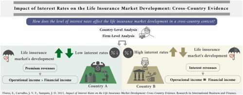

The insurance sector's profitability is being significantly reshaped by the interaction of fluctuating interest rates and the advent of algorithmic trading. This trio of factors is transforming the financial landscape, driving a new era of operational efficiency and investment strategy within the industry. Understanding the delicate balance between these elements provides key insights into the challenges and opportunities that insurers face amidst shifting economic conditions.

Interest rates play a critical role in determining the financial health of insurance companies. These rates influence the returns on the sector’s extensive investments in bonds and other interest-sensitive assets. Thus, when interest rates fluctuate, they can dictate both the cost of holding existing lower-yield investments and the potential for acquiring higher-yield assets. This duality requires insurers to remain vigilant, adapting their asset and liability management strategies to maintain optimal profitability.



Algorithmic trading introduces a new dimension by leveraging advanced data analytics and computational power to optimize investment strategies. It allows insurers to automate complex trading decisions, enabling rapid responses to market changes. This technological advancement supports the sector's pursuit of maximum returns while mitigating risks.

This exploration will delve into how the combination of interest rate movements and algorithmic trading is influencing insurer performance, and how these factors can be strategically harnessed to navigate the continuously evolving financial environment.

## Table of Contents

## Impact of Interest Rates on Insurance Profitability

Interest rates significantly influence the profitability of the insurance sector because insurance companies typically hold substantial portfolios of interest-sensitive assets, such as bonds and mortgages. This relationship between interest rates and the profitability of insurers can be explained through various mechanisms.

When interest rates rise, the opportunity cost of holding existing low-yield bonds increases for insurers. This is because bonds issued during periods of lower interest rates typically yield less than new bonds issued at higher rates. Insurance companies may face unrealized losses on their existing bond portfolios as the market value of these bonds declines when newer bonds with more attractive rates become available. Nevertheless, rising interest rates can offer insurers the opportunity to invest in new, higher-yielding securities. This increase in income from new investments can, over time, offset the drawbacks of decreased market value of existing assets, potentially leading to improved overall profitability.

Conversely, when interest rates fall, the dynamic shifts. The costs associated with liabilities typically decrease, as insurers' obligations to policyholders, often tied to interest assumptions, may be reduced. The decline in interest rates can make certain insurance products, such as annuities, less appealing to consumers, affecting new business volumes. Furthermore, lower interest rates compress the interest margins on investments, limiting the investment returns that insurers can generate from their asset holdings. This condition puts additional pressure on profitability, especially if the rates remain low for an extended period.

The intricate relationship between interest rates and insurance profitability underscores the importance for insurers to adopt dynamic asset management strategies that can adapt to changing rate environments. Mathematical models, such as the following, can contextualize the valuation of bond portfolios under different [interest rate](/wiki/interest-rate-trading-strategies) scenarios:

$$
P = \frac{C}{(1 + r)^1} + \frac{C}{(1 + r)^2} + \cdots + \frac{C + M}{(1 + r)^n}
$$

Where:

- $P$ is the price of the bond.
- $C$ represents the coupon payment.
- $r$ is the interest rate (or yield).
- $M$ is the maturity value of the bond.
- $n$ is the number of periods until maturity.

Implementing such models helps insurers determine how interest rates affect their portfolios, enabling informed decision-making about when to sell current assets or reinvest in new opportunities. Additionally, this understanding supports the management of duration and convexity of their portfolios, which are crucial for maintaining profitability amidst interest rate fluctuations.

## Adjustments in Asset and Liability Management

Insurance companies strategically manage their asset and liability portfolios in response to changing interest rates to optimize profitability and ensure financial stability. The core of these strategies revolves around maintaining an effective balance between the assets held, primarily in the form of bonds, and the liabilities which largely consist of policyholder obligations.

When interest rates are rising, insurers face the challenge of an increased opportunity cost associated with holding existing lower-yield bonds. However, they can capitalize on the situation by investing new premiums into higher-yield securities, thereby increasing their interest income. This is a critical tactic for insurers, as a significant portion of their income is derived from investment returns on these interest-sensitive assets.

Conversely, during periods of declining interest rates, insurers look to manage their liabilities effectively. Lower interest rates generally mean reduced future liabilities' present value, thereby easing some of the financial burdens. However, lower rates also render traditional insurance products, like annuities and long-term life insurance policies, less attractive to consumers, potentially impacting sales volumes.

To efficiently navigate these dynamic conditions, insurance companies employ various asset and liability management (ALM) techniques, including duration matching and immunization strategies. Duration matching involves aligning the duration of assets with the duration of liabilities to mitigate interest rate risk. This is particularly useful when aiming to stabilize the gap between asset returns and the cost of liabilities.

Moreover, [algorithmic trading](/wiki/algorithmic-trading) plays a crucial role in optimizing asset allocation within this framework. By leveraging data analytics and computing power, algorithmic trading systems can process vast amounts of financial data to make real-time investment decisions. This facilitates a more dynamic response to market conditions, allowing insurers to adjust their portfolios swiftly and effectively. Algorithms can analyze trends, forecast market movements, and execute trades with precision, reducing the reliance on human intervention and potentially lowering operational costs.

For instance, a simple python script can illustrate how algorithmic trading might be applied to asset allocation:

```python
# Hypothetical model for asset allocation using an algorithmic approach
import numpy as np
import pandas as pd
from sklearn.linear_model import LinearRegression

# Generate synthetic historical data for interest rates and bond yields
np.random.seed(0)
interest_rates = np.random.normal(0.05, 0.02, 100)
bond_yields = interest_rates + np.random.normal(0.01, 0.005, 100)

# Convert to a DataFrame
data = pd.DataFrame({'Interest_Rates': interest_rates, 'Bond_Yields': bond_yields})

# Train a simple linear model to predict bond yields based on interest rates
model = LinearRegression()
model.fit(data[['Interest_Rates']], data['Bond_Yields'])

# Make predictions for future interest rates
future_interest_rates = np.array([0.04, 0.05, 0.06]).reshape(-1, 1)
predicted_yields = model.predict(future_interest_rates)

# Output predicted yields
print("Predicted bond yields:", predicted_yields)
```

In this hypothetical model, the algorithm predicts bond yields based on interest rate trends, enabling insurers to make informed decisions about their asset purchases.

Through these strategic adjustments in asset and liability management, combined with the integration of algorithmic trading, insurance companies aim to enhance profitability and maintain resilience against the backdrop of fluctuating interest rates.

## Role of Algorithmic Trading in the Insurance Sector

Algorithmic trading, a key component in modern investment strategies, has become instrumental in the operations of insurance companies by offering an automated, data-driven approach to managing financial portfolios. This technology employs data analytics and computing power to execute complex investment decisions with precision and speed, providing several advantages to insurers.

Firstly, algorithmic trading significantly reduces operational costs for insurance companies by minimizing the need for human intervention in trading activities. It eliminates the inefficiencies and errors often associated with manual trading, thus cutting down on transaction costs. By automating processes, insurers can allocate resources more effectively, ultimately boosting their bottom line.

Second, the use of algorithmic trading allows insurers to respond swiftly to market fluctuations. The ability to process vast amounts of market data in real-time enables insurers to capitalize on fleeting opportunities and adjust their portfolios promptly in response to economic shifts. For example, Python libraries like NumPy and Pandas can handle large datasets efficiently, facilitating the implementation of trading strategies that are contingent on rapid data analysis.

```python
import numpy as np
import pandas as pd

# Sample code to demonstrate data analysis using Python
data = pd.DataFrame({
    'interest_rate': [1.5, 1.7, 2.0, 2.2],
    'bond_price': [100, 98, 95, 93]
})

# Calculate changes in bond prices relative to interest rates
data['change_in_price'] = data['bond_price'].pct_change()

print(data)
```

Moreover, algorithmic trading enhances the capability of insurers to predict market trends, aligning with their goal of maximizing returns while managing associated risks. By employing predictive analytics, algorithms can identify patterns and generate forecasts, supporting insurers in making informed decisions regarding asset allocation and risk management.

In the context of a volatile interest rate environment, the integration of algorithmic trading is particularly beneficial. As insurers strive to optimize their investment strategies amid economic uncertainty, algorithmic systems can provide a level of agility and insight that manual processes simply cannot match. They allow for dynamic portfolio adjustments that hedge against interest rate risks and optimize returns.

The adoption of algorithmic trading within the insurance sector is not without challenges, including the need for sophisticated technology infrastructure and skilled personnel to develop and maintain these algorithms. However, the benefits in terms of efficiency, cost reduction, and enhanced market responsiveness underscore its growing importance as a strategic tool for insurers aiming to maintain and enhance profitability in a competitive financial landscape.

## Private Equity and Complex Reinsurance Strategies

The insurance sector, in response to prolonged periods of low interest rates, has increasingly turned towards private equity and complex reinsurance strategies. These approaches aim to enhance profitability by gaining exposure to higher-yielding, albeit riskier, asset classes.

Private equity provides insurers with opportunities to invest in private markets, which can offer superior returns compared to traditional, low-yield bond investments typical in a low interest rate environment. This strategy helps insurers to diversify their portfolios and improve return on investment by tapping into sectors that are not accessible through conventional public markets. The partnership between insurance companies and private equity firms allows the former to access specialized expertise in managing and maximizing these private market investments.

However, these investments come with increased risk, particularly concerning interconnectedness and [liquidity](/wiki/liquidity-risk-premium) pressures. The interconnectedness risk arises as insurers become more reliant on private equity firms, whose fortunes may be tied to broader market movements and economic conditions. A significant downturn in the market could simultaneously impact multiple insurers holding similar private equity investments, amplifying the financial shock to the sector.

Liquidity risk, on the other hand, is inherent in private equity due to the illiquid nature of these investments. Unlike publicly traded securities, which can be sold quickly in response to evolving market conditions, private equity investments often have long lock-up periods and limited options for quick liquidation. This can become problematic during periods of financial stress when insurers might need to liquidate assets to meet policyholder claims or other obligations.

Complex reinsurance strategies are also employed as a means of managing risk and capital more effectively. These strategies include various forms of structured reinsurance products that transfer portions of an insurer's risk to other parties. Such reinsurance solutions can enhance an insurer's capital efficiency by freeing up capital reserves, which can then be redeployed into higher-yielding investments like private equity.

Both reinsurance and private equity strategies require careful calibration to ensure that the pursuit of higher returns does not compromise the financial stability of insurance companies. Insurers must maintain a delicate balance, continuously assessing the risk-reward trade-offs of these investment avenues while employing robust risk management practices to mitigate potential challenges arising from market [volatility](/wiki/volatility-trading-strategies) and economic uncertainties.

## Future Trends and Considerations

As interest rates persistently fluctuate, the insurance industry must enhance its adaptability by leveraging advanced technology and sophisticated data analytics to refine investment strategies and sustain profitability. This dynamic environment demands a precise understanding of risk and opportunity, necessitating the utilization of predictive analytics and real-time data processing.

Regulatory considerations are increasingly crucial in this context. Cross-border risk-sharing arrangements and the involvement of private equity in insurance investments introduce complex dimensions to financial stability. The interconnectedness of markets amplifies systemic risk, requiring stringent regulatory oversight to mitigate potential adverse impacts. This involves assessing the capital adequacy of insurers and monitoring the exposure to high-risk investments, particularly those tied to private equity ventures that may not be as liquid or transparent.

Algorithmic trading continues to evolve, offering new pathways for innovation and operational efficiency within the insurance sector. The integration of [machine learning](/wiki/machine-learning) algorithms allows for adaptive trading systems, capable of analyzing vast quantities of market data to inform investment decisions. These systems can automatically adjust portfolio allocations in response to emerging trends, optimizing returns while maintaining risk thresholds. For example, insurers can utilize Python-based libraries such as Pandas and NumPy to manipulate and analyze financial data effectively, forecasting potential shifts in market conditions.

Moreover, technology integration extends beyond trading activities to encompass broader operational efficiencies. Automation of routine processes, from policy management to claims processing, can free up resources for strategic initiatives, thereby enhancing overall corporate agility. As insurance companies continue to adopt cloud computing and blockchain technology, they gain more robust, secure ways to handle data and transactions, further driving innovation.

Looking ahead, staying at the forefront of these technological advancements will be crucial for insurers aiming to maintain a competitive edge. By harnessing the potential of algorithmic trading and cutting-edge data analytics, the insurance sector can better navigate the intricacies of global financial markets, ensuring resilience amidst uncertain economic conditions while remaining compliant with evolving regulatory standards.

## Conclusion

The profitability of the insurance sector is intricately connected to fluctuations in interest rates and the strategic implementation of algorithmic trading. Interest rate movements influence the valuation and attractiveness of the assets and liabilities held by insurers, thereby impacting their financial outcomes. Leveraging advanced trading technologies provides insurers with a potent tool to enhance asset allocation and optimize returns amidst these financial dynamics. By employing algorithmic trading, insurers can efficiently process large volumes of data to make informed investment decisions, thus enabling them to navigate complex global markets. This approach not only aids in mitigating risks associated with volatile interest rates but also enhances operational efficiency.

Furthermore, diversifying investment portfolios allows insurers to spread risk and capitalize on various market opportunities, fostering long-term profitability and stability. This diversification is essential in a financial landscape where traditional bonds may no longer suffice to meet desired return levels, leading to a strategic shift towards equities and alternative assets.

To sustain growth and maintain resilience, a forward-looking approach is crucial. Insurers must continuously adapt to evolving economic conditions and technological advancements. This adaptability should be coupled with prudent regulatory oversight to balance innovation with risk management. Such oversight ensures that insurers remain compliant with financial safeguards while exploring new avenues for growth. In conclusion, the intersection of interest rate movements and advanced trading strategies offers both challenges and opportunities, necessitating a comprehensive strategy to secure the insurance industry's future prosperity.

## References & Further Reading

[1]: ["Interest Rate Risk Management for Insurers"](https://www.financestrategists.com/wealth-management/investment-risk/interest-rate-risk/) by the Society of Actuaries

[2]: ["The Impact of Rising Interest Rates on Life Insurers"](https://www.milliman.com/en/insight/impact-of-rising-interest-rates-for-life-insurers) by Moody's Investors Service

[3]: ["Algorithmic and High-Frequency Trading"](https://assets.cambridge.org/97811070/91146/frontmatter/9781107091146_frontmatter.pdf) by Álvaro Cartea, Sebastian Jaimungal, and José Penalva

[4]: ["Managing Interest Rate Risk in a Changing World"](https://www.investopedia.com/articles/optioninvestor/08/manage-interest-rate-risk.asp) by Munich Re

[5]: ["The Handbook of Insurance-Linked Securities"](https://onlinelibrary.wiley.com/doi/book/10.1002/9781119206545) by Pauline Barrieu and Luca Albertini