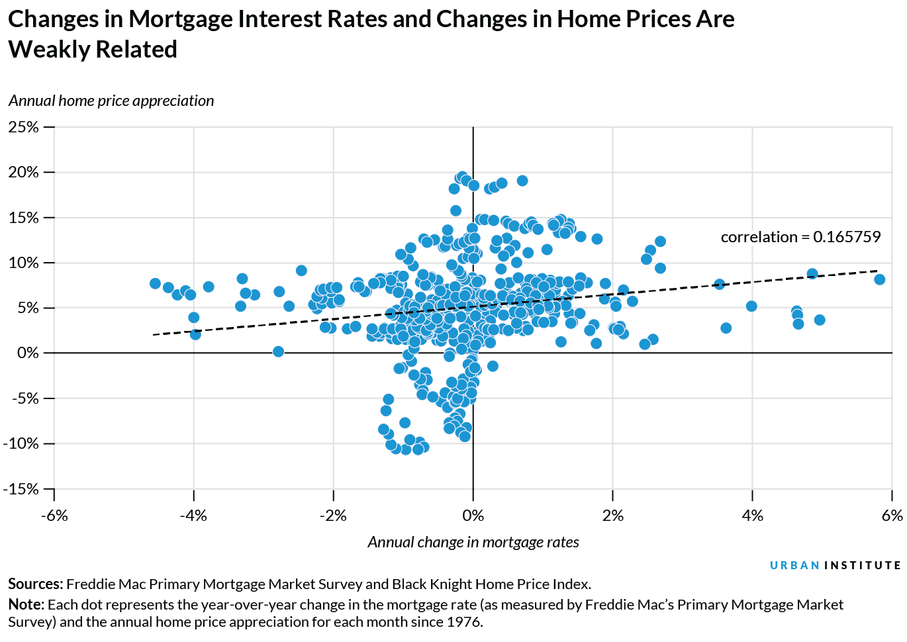

The real estate market is inherently dynamic, characterized by frequent shifts that are precipitated by a variety of economic factors. Among these, interest rates, property values, and the burgeoning practice of algorithmic trading stand out as pivotal forces in shaping the contemporary real estate landscape. Understanding how these dynamics interact is crucial for stakeholders aiming to navigate the sector effectively.

Interest rates are fundamentally influential in the real estate market. They determine the cost of borrowing, thereby affecting the affordability of property purchases and influencing demand. Higher interest rates typically discourage borrowing, leading to reduced demand for real estate, while lower rates can stimulate growth by making mortgages more accessible. The relation between interest rates and real estate is bidirectional; changes in rates can alter market dynamics, and shifts in the housing market can also influence interest rate policies.



Property values, another critical component, are sensitive to fluctuations in interest rates, but they are also affected by broader economic conditions and market trends. Traditional assessment methods, such as the Sales Comparison, Cost, and Income Capitalization Approaches, are being supplemented by data-centric models that leverage technology to provide more nuanced insights. These models can account for a diverse range of variables, including demographic shifts and economic indicators.

Technological advancements, particularly in the area of algorithmic trading, are transforming property investment strategies. Algorithmic trading utilizes sophisticated computer models to automate decision-making processes based on data analysis. This approach offers investors enhanced speed and precision, enabling them to capitalize on market opportunities with greater efficiency. The integration of machine learning and big data analytics into these models allows for the real-time prediction of market trends, providing a competitive edge in property valuation and transaction management.

This article will explore the intersection of interest rates, property values, and algorithmic trading, with a particular emphasis on how they influence property valuations and investment strategies. It will focus on the impacts of interest rate fluctuations and the role of data-driven trading in modernizing real estate markets, providing a comprehensive overview of how these elements collectively shape the trajectory of the industry.

## Table of Contents

## Understanding Property Values and Valuation

Property values are fundamentally influenced by a tapestry of factors, primarily demand, economic conditions, and prevailing market trends. Demand for real estate, driven by population growth, income levels, and consumer preferences, significantly dictates property valuations. Concurrently, economic indicators such as employment rates, inflation, and GDP growth paint the broader economic landscape, impacting consumer purchasing power and confidence in property investments. Market trends, reflecting patterns in buyer behavior and investor sentiment, further contribute to shifts in property value dynamics.

Traditional real estate valuation methods are pivotal tools in quantifying property worth. The Sales Comparison Approach assesses a property's market value by analyzing recent sales of comparable properties, ensuring adjustments for distinctive features. For new constructions or public buildings, the Cost Approach calculates the value by summing the land value with the depreciated cost of new construction. Meanwhile, the Income Capitalization Approach is crucial in evaluating investment properties, focusing on the potential income a property could generate relative to the investor's required rate of return.

The past decade has witnessed the rise of data-centric valuation models, which harness the power of big data and predictive analytics. These models utilize vast datasets and [machine learning](/wiki/machine-learning) algorithms to provide more precise property assessments by analyzing numerous variables, including historical sale prices, location-specific factors, and macroeconomic indicators. Algorithmic trading and data analytics play increasingly integral roles in this landscape by delivering nuanced, real-time insights into property valuations. Through the application of advanced algorithms, investors can swiftly identify lucrative opportunities and trends within the market, optimizing decision-making processes.

Demographic changes, including shifts in age distribution, migration patterns, and household compositions, also exert significant influence over property values. The growing urbanization trend drives demand in metropolitan areas, boosting property values. Additionally, economic indicators, like interest rates and inflation, directly affect the affordability and desirability of real estate investments. A low-interest-rate environment, for example, can enhance affordability, stimulating demand and potentially driving up property values.

In conclusion, understanding property values and valuation requires a multidisciplinary approach that incorporates traditional methods, the impact of emerging technologies, and the broader socio-economic context. As real estate markets evolve, data-centric models and [algorithmic trading](/wiki/algorithmic-trading) will likely play an increasingly important role in shaping valuations and investment strategies.

## Interest Rates and their Influence on Real Estate Market

Interest rates are a pivotal [factor](/wiki/factor-investing) in determining both the affordability and the demand for property purchases. Their fluctuations can greatly influence the real estate market by affecting capital flows, investment returns, and property valuations.

Interest rates directly affect the affordability of mortgages. When interest rates are low, borrowing costs decrease, making it cheaper for consumers to take out mortgages. As a result, there can be an increase in demand for properties, which often leads to higher property prices. Conversely, high interest rates can suppress demand as mortgages become more expensive, leading to a potential decrease in property prices.

The housing market dynamics are closely tied to interest rates through various mechanisms. One significant aspect is the movement of capital flows. Lower interest rates tend to encourage investment flows into real estate due to the attractive financing options available. This can boost housing market activity. Additionally, real estate investment returns are impacted by interest rates, as they determine the cost of borrowing and influence the valuation of investment properties.

Changes in the Federal Reserve's policy, particularly adjustments in interest rates, have a direct impact on property valuations. The Federal Reserve manages inflation and employment levels through its monetary policy, primarily by adjusting target interest rates. These changes can ripple through the economy, affecting consumer spending and investment in real estate. For instance, a rise in interest rates typically signals tightening economic conditions, which can diminish investor confidence and reduce property demand.

Mortgage rates, which are influenced by interest rates, are a critical factor in property investment payoffs. A lower mortgage rate reduces the cost of financing a property purchase, thereby increasing potential returns on investment. Consequently, investors and homebuyers closely watch [interest rate](/wiki/interest-rate-trading-strategies) trends to make informed decisions about the timing of their real estate transactions.

Real estate investors can develop strategies to leverage interest rate trends, optimizing their investment decisions. For example, during periods of anticipated low interest rates, investors might increase their real estate holdings to capitalize on favorable borrowing conditions. Additionally, fixed-rate mortgages can be advantageous during rising interest rate environments, providing stability in repayment amounts against increasing rates.

Thus, understanding the intricate relationship between interest rates and the real estate market allows investors to make strategic decisions that align with their financial goals and market conditions.

## The Role of Algorithmic Trading in Real Estate

Algorithmic trading, a staple in financial markets, is increasingly adopted in real estate investment to facilitate automated decision-making. This approach utilizes computer models to enhance the efficiency and effectiveness of property transactions. By analyzing vast datasets, algorithmic trading offers improved insights, speed, and accuracy, enabling investors to capitalize on emergent opportunities and optimize investment strategies.

One significant advantage of algorithmic trading is its ability to process large volumes of data swiftly, distilling complex market trends into actionable insights. The speed at which these algorithms operate allows investors to react almost instantaneously to market changes, thereby maximizing potential returns while minimizing risks. Moreover, precision in market transactions is achieved by eliminating human error and emotions, which often cloud judgment in investment decisions.

The integration of machine learning and big data analytics into real estate trading algorithms is another transformative development. Machine learning models analyze historical data and current market conditions to identify patterns and predict future property values. This predictive capability is invaluable in forecasting market shifts and assessing property potential, empowering investors with a competitive edge.

Several successful case studies highlight the effectiveness of algorithmic strategies in real estate. For instance, some hedge funds utilize algorithms that incorporate a wide array of data sources, including economic indicators, geographical data, and social media trends, to make investment decisions. These algorithms adaptively learn from new data, refining their strategies for better performance over time.

Despite the benefits, implementing algorithmic trading models in real estate poses several challenges. One concern is market [volatility](/wiki/volatility-trading-strategies), which can lead to erroneous predictions and financial losses if not adequately managed. The reliance on technology also introduces risks associated with system failures or cyber-attacks, necessitating robust security and fail-safe mechanisms.

Another critical consideration is the quality of data used in algorithmic models. Inaccurate or incomplete data can skew predictions, leading to suboptimal investment decisions. Ensuring high data integrity and implementing regular audits are crucial to maintaining the accuracy and reliability of these trading systems.

Finally, ethical considerations, including fairness and transparency, are paramount in deploying algorithmic trading. There is an ongoing discourse on mitigating biases in machine learning models and ensuring that algorithmic decisions do not unfairly disadvantage any market participants.

In summary, while algorithmic trading offers significant advantages by enhancing data-driven decision-making, speed, and precision, careful consideration of the associated challenges and ethical implications is necessary to harness its full potential in real estate markets.

## Challenges and Risks in Real Estate Algo Trading

Algorithmic trading in real estate is revolutionizing how market participants engage in property transactions. While the integration of technology offers numerous benefits, it also introduces a set of challenges and risks that stakeholders should be aware of. This section explores these challenges, emphasizing areas such as market volatility, regulatory compliance, data quality, ethical considerations, and technical reliability.

### Market Volatility and Technology Reliance

Algorithmic trading models operate at speeds significantly faster than human decision-making. This rapid execution, although advantageous, means that algorithms can contribute to market volatility, particularly during periods of economic uncertainty. The automation and reliance on historical data can lead to amplified price swings if the market moves in unexpected ways. A significant risk arises when algorithms misinterpret short-term market inefficiencies as long-term trends, leading to poorly timed executions and potential financial losses.

### Regulatory Landscapes and Compliance

Operating within the regulatory frameworks set forth by financial authorities is crucial. As algorithms can execute trades across multiple markets and jurisdictions, varying regulatory requirements pose a risk. Ensuring compliance involves understanding the specifics of regulations like the U.S. Securities and Exchange Commission (SEC) rules or the European Union’s Markets in Financial Instruments Directive (MiFID II). Regulatory challenges include ensuring transparency, maintaining a record of algorithmic decisions, and adhering to anti-money laundering (AML) and know-your-customer (KYC) guidelines.

### Data Quality Challenges

High-quality data is the foundation of effective algorithmic trading strategies. Poor data quality, characterized by inaccuracies, incompleteness, or biases, can severely impact the accuracy of algorithmic predictions and valuations. Ensuring data integrity involves cleaning datasets, validating sources, and employing techniques such as anomaly detection to identify and rectify inconsistencies. For example, using Python, stakeholders can implement data cleaning routines with libraries such as Pandas and NumPy to refine datasets:

```python
import pandas as pd
import numpy as np

# Load dataset
data = pd.read_csv('real_estate_data.csv')

# Drop missing values
data = data.dropna()

# Remove duplicates
data = data.drop_duplicates()

# Detect anomalies
z_scores = np.abs((data - data.mean()) / data.std())
data_cleaned = data[(z_scores < 3).all(axis=1)]
```

### Ethical Considerations

Algorithmic trading models must be scrutinized for fairness, transparency, and bias. There is a risk of algorithms perpetuating existing biases present in training data, leading to unfair treatment of certain market segments. Transparency in how algorithms arrive at decisions is essential to building trust among market participants. Ethical concerns also extend to the potential misuse of proprietary information and ensuring equitable market access.

### Technical Reliability

The complexity of algorithmic systems necessitates robust technical infrastructure. This includes fail-safes to prevent issues such as latency, outages, or erroneous trades. Strategies to mitigate technical failures involve regular system audits, real-time monitoring, and implementing backup systems to ensure continuity. For example, edge computing can be used to process data closer to its source, reducing latency and improving system responsiveness.

Algorithmic trading in real estate presents both opportunities and challenges. Understanding the nuances associated with market dynamics, regulatory compliance, data integrity, ethical concerns, and technical reliability is crucial for mitigating risks and capitalizing on the potential of technological innovations.

## Future Prospects and Innovations

The evolving nature of algorithmic trading models is significantly shaped by advancements in [artificial intelligence](/wiki/ai-artificial-intelligence) (AI) and machine learning. These technologies offer sophisticated tools for analyzing vast datasets, thereby enhancing decision-making processes and accuracy in predicting market trends. AI-driven insights are poised for integration with traditional real estate practices, providing enhanced valuation models and market forecasts. For example, machine learning algorithms can analyze historical data to predict future property values more accurately, allowing investors to make informed decisions regarding property acquisitions and sales.

Blockchain technology is transforming real estate by offering increased transparency and security in transactions. Its decentralized nature ensures that property transactions are recorded on an immutable ledger, reducing the risk of fraud and enhancing the trustworthiness of the market. Smart contracts, powered by blockchain, automate processes that traditionally require intermediaries, such as brokers and legal advisors, thereby lowering transaction costs and increasing efficiency.

Technology-driven trading is anticipated to improve market efficiency and investment practices significantly. Algorithmic models can process information and execute trades at speeds far surpassing human capabilities, thus optimizing investment strategies and maximizing returns. Forecasting models empowered by big data analytics are increasingly prevalent, enabling precise evaluations of market opportunities and risks. These models can incorporate a multitude of variables, ranging from economic indicators to social media sentiment, to provide a holistic view of the market landscape.

The role of big data and predictive analytics in real estate strategy formulation is expanding rapidly. With the ability to process and interpret large volumes of data, predictive analytics provides actionable insights that guide investment strategies and property management decisions. Statistical techniques, such as regression analysis and machine learning algorithms, allow for the identification of trends and patterns that may not be immediately apparent through conventional analysis. Python, a popular programming language, is frequently used in these analyses. For example:

```python
import pandas as pd
from sklearn.linear_model import LinearRegression

# Hypothetical dataset of real estate prices and influencing factors
data = pd.DataFrame({
    'square_feet': [1500, 2500, 1800, 2200],
    'location_quality': [7, 9, 8, 10],
    'age_of_property': [10, 5, 8, 3],
    'price': [300000, 500000, 360000, 450000]
})

# Independent variables
X = data[['square_feet', 'location_quality', 'age_of_property']]
# Dependent variable
y = data['price']

# Building a linear regression model
model = LinearRegression()
model.fit(X, y)

# Predict price for a new property
new_property = [[2000, 8, 5]]
predicted_price = model.predict(new_property)
print(f"Predicted price: ${predicted_price[0]:,.2f}")
```

In this example, a linear regression model predicts real estate prices based on various factors, highlighting the application of predictive analytics in real estate. As the field continues to innovate, the integration of AI, machine learning, blockchain, and big data will undoubtedly redefine real estate markets, enhancing both strategic decision-making and market transparency.

## Conclusion

Interest rates, property values, and algorithmic trading are pivotal elements that collectively shape the contemporary real estate market. Understanding their interconnected roles provides crucial insights for navigating industry trends and identifying lucrative investment opportunities. Interest rates directly influence property affordability and investment returns. When rates are low, borrowing costs decrease, stimulating property purchases and driving up values. Conversely, high rates can suppress demand and decrease property valuations. Algorithmic trading, leveraging advanced technological tools like machine learning and big data analytics, enhances market efficiency by providing real-time insights into these fluctuations. 

However, technology elevates both opportunities and challenges within the real estate sector. While data-driven strategies offer precision and speed, they also demand robust infrastructure and address risks such as market volatility and technological dependency. Continuous innovation and adaptability remain essential in effectively harnessing these dynamics for strategic decision making. 

In concluding thoughts, the transformative power of data-driven insights is undeniable in modern real estate transactions and valuations. By integrating technological advancements with traditional practices, stakeholders can optimize decision-making processes and enhance overall market efficiency. This evolution underscores both the complexity and potential that technology introduces, reinforcing the importance of being adaptable in a rapidly changing environment.

## References & Further Reading

[1]: Bergstra, J., Bardenet, R., Bengio, Y., & Kégl, B. (2011). ["Algorithms for Hyper-Parameter Optimization."](https://dl.acm.org/doi/10.5555/2986459.2986743) Advances in Neural Information Processing Systems 24.

[2]: ["Advances in Financial Machine Learning"](https://www.amazon.com/Advances-Financial-Machine-Learning-Marcos/dp/1119482089) by Marcos Lopez de Prado

[3]: ["Evidence-Based Technical Analysis: Applying the Scientific Method and Statistical Inference to Trading Signals"](https://www.amazon.com/Evidence-Based-Technical-Analysis-Scientific-Statistical/dp/0470008741) by David Aronson

[4]: ["Machine Learning for Algorithmic Trading"](https://github.com/stefan-jansen/machine-learning-for-trading) by Stefan Jansen

[5]: ["Quantitative Trading: How to Build Your Own Algorithmic Trading Business"](https://www.amazon.com/Quantitative-Trading-Build-Algorithmic-Business/dp/1119800064) by Ernest P. Chan