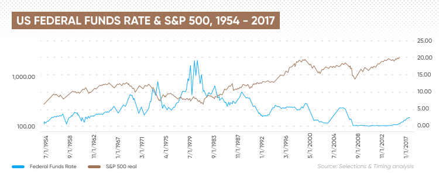

The financial landscape is subject to continuous evolution, with intricate dynamics governing the interactions among various economic factors. Key among these are stock market fluctuations, interest rates, and the increasing prevalence of algorithmic trading. Each element plays a vital role in shaping the economic environment, prompting interest among investors, policymakers, and stakeholders seeking to understand their impact.

Stock market fluctuations serve as a key indicator of economic health, influencing consumer confidence and spending patterns. A thriving stock market often correlates with increased household wealth, leading to heightened consumption and economic stimulation. Conversely, market downturns can trigger reduced consumer expenditure and a slowdown in economic growth.

Interest rates, determined by central banks, are another critical factor affecting economic activity. Lower interest rates can incentivize borrowing and investment, driving economic expansion. Conversely, elevated interest rates may restrain spending, potentially decelerating economic progress. Global interest rate trends also have implications for cross-border investments and currency valuations, further underscoring their significance.

Notably, the rise of algorithmic trading marks a transformative development in contemporary financial markets. Characterized by high-frequency trading and automation, algorithmic trading enhances market liquidity and operational efficiency. While these advancements present numerous benefits, they also raise concerns regarding market stability and the potential for rapid, destabilizing events.

This article aims to explore the interactions and broader economic implications of these elements. By examining key concepts, current trends, and possible future developments, we aim to provide a comprehensive understanding of how stock market movements, interest rates, and algorithmic trading collectively shape the financial landscape.

## Table of Contents

## Understanding the Stock Market's Economic Impact

The stock market serves as a critical indicator of economic health, often reflecting broader economic trends and impacting various stakeholders' financial behaviors. When stock prices rise, they can enhance consumer confidence and spending, as individuals feel wealthier and more secure in their investments. This phenomenon, known as the 'wealth effect,' can contribute to increased household consumption, providing a stimulus for economic activity. Conversely, declining stock prices can result in reduced consumer spending, as individuals may perceive a loss in wealth, leading to more conservative financial decisions.

Stock market performance influences investment decisions significantly. Positive market trends tend to encourage investment in equities, fostering innovation and supporting business expansion. For instance, during periods of sustained market growth, companies often find it easier to raise capital through stock issuance. This capital can be deployed for research and development, leading to technological advancements and operational expansions, which can ultimately propagate economic growth. On the other hand, during market downturns, firms might face capital constraints, impacting their ability to innovate and grow.

However, stock market [volatility](/wiki/volatility-trading-strategies) poses challenges by affecting investor sentiment and decision-making. Significant market fluctuations can lead to heightened uncertainty, causing investors to withdraw funds or shift to safer assets, such as bonds or cash. This behavior can have broader economic repercussions, slowing down investment flows into productive ventures and potentially dampening economic growth. For example, the financial crisis of 2008 demonstrated how extreme market volatility could lead to a reduction in consumer confidence and business investment, fueling an economic downturn.

The historical analysis of market trends provides valuable insights into these dynamics. For instance, the bull market of the late 1990s, driven by advancements in information technology, led to substantial investment in the tech sector, fostering significant economic growth. However, the subsequent burst of the dot-com bubble in 2000 exemplified how rapid market corrections can have adverse economic impacts, as businesses curtailed spending and investments in response to plummeting stock valuations.

In summary, the economic impact of the stock market is multifaceted. Changes in stock prices influence consumer behavior, investment decisions, and overall economic activity. Understanding these impacts helps investors, policymakers, and businesses navigate the complex interplay between stock market dynamics and economic growth.

## Interest Rates and Their Ripple Effects

Interest rates, managed by central banks, are fundamental tools for influencing economic activity. These rates determine the cost of borrowing money and can significantly impact consumer behavior, business investments, and overall economic growth. When central banks reduce interest rates, borrowing becomes more attractive for individuals and businesses, leading to increased investment and spending. This can stimulate economic growth and reduce unemployment by encouraging the expansion of businesses and consumption by households.

Conversely, higher interest rates tend to make borrowing more expensive, which can dampen consumer spending and business investments. This cautious approach can slow down economic growth but might be necessary to curb runaway inflation. The inverse relationship between interest rates and inflation is a vital aspect of economic stability. Inflation represents the rate at which the general level of prices for goods and services is rising, and when inflation is high, central banks may raise interest rates to cool off an overheating economy.

Global [interest rate](/wiki/interest-rate-trading-strategies) trends also have implications for cross-border investments and currency valuations. Investors often seek higher returns available in countries with higher interest rates, which can lead to increased capital flow into those economies, strengthening their currencies. Conversely, lower interest rates can weaken a country's currency and might make its exports more competitive on the global market.

Historically, changes in monetary policy, as exemplified by shifts in interest rates, have yielded significant impacts on economies and financial markets. For instance, the aggressive interest rate cuts by the Federal Reserve during the 2008 financial crisis aimed to stimulate the US economy by making borrowing cheaper and fostering economic growth. These actions played a crucial role in mitigating the recession's impact and setting the stage for recovery.

Overall, interest rates are a critical lever in economic policy, influencing everything from consumer confidence to international trade dynamics. Understanding their ripple effects on various economic aspects provides insight into the complex interactions governing market stability and growth.

## The Rise of Algorithmic Trading

Algorithmic trading has markedly transformed financial markets through the introduction of high-frequency trading ([HFT](/wiki/high-frequency-trading-strategies)) and automation. This innovative approach leverages complex algorithms to make trading decisions at speeds and volumes unattainable by human traders. The proliferation of [algorithmic trading](/wiki/algorithmic-trading) has contributed significantly to increased market [liquidity](/wiki/liquidity-risk-premium) and efficiency by enabling rapid execution of trades and narrowing bid-ask spreads.

The advantages of algorithmic trading include enhanced price discovery and the reduction of transaction costs due to automation and increased market participation. Algorithms can analyze vast quantities of market data and execute trades with precision, reducing the time and effort traditionally required by human traders. As a result, markets are more efficient, with information being disseminated and acted upon almost instantaneously.

Despite these benefits, algorithmic trading presents several concerns. One of the primary criticisms is its impact on market stability. The speed of HFT can lead to abrupt market movements, sometimes resulting in flash crashes—sudden, severe price declines that recover quickly. A notable example is the Flash Crash of May 6, 2010, when the Dow Jones Industrial Average plunged nearly 1,000 points within minutes [1]. Such events have raised questions about the robustness and resilience of financial markets influenced by algorithmic trading.

The economic impact of algorithmic trading extends to traditional investment strategies and financial institutions. As algorithms dominate trading volumes, traditional investors may find themselves at a disadvantage due to slower reaction times. Furthermore, institutions may incur significant costs investing in technology and infrastructure to compete effectively with algorithmic traders. Additionally, the reliance on quantitative models adds a layer of complexity to the risk management processes of financial institutions.

Regulation plays a critical role in addressing the challenges posed by algorithmic trading. Regulatory bodies worldwide have been working to implement measures such as circuit breakers, which halt trading during extreme market volatility, and order-to-trade ratios, which limit excessive market activity by high-frequency traders. As technology continues to evolve, regulators face the ongoing challenge of adapting policies to ensure market integrity and fairness.

The future of algorithmic trading is likely to be shaped by advancements in [artificial intelligence](/wiki/ai-artificial-intelligence) (AI) and [machine learning](/wiki/machine-learning) (ML). These technologies promise more sophisticated models capable of processing even larger datasets and making more complex trading decisions. However, this evolution also brings potential risks related to ethical considerations and regulatory oversight, underscoring the need for a collaborative approach between financial institutions, technology developers, and regulators.

In summary, algorithmic trading has significantly reshaped the financial markets, offering notable efficiency and liquidity benefits while posing challenges related to market stability and regulatory oversight. As technology advances, the continued evolution of algorithmic trading will necessitate careful consideration of its impacts on investors, financial institutions, and market dynamics.

---
[1] U.S. Commodity Futures Trading Commission and U.S. Securities and Exchange Commission, "Findings Regarding the Market Events of May 6, 2010," September 30, 2010.

## Interconnections and Synergies

The intersection of stock markets, interest rates, and algorithmic trading forms an intricate tapestry of economic synergies, each component influencing and being influenced by the others. At the core of this relationship is the dynamic interaction between interest rates and trading strategies. Changes in interest rates, often dictated by central bank policies, can significantly influence algorithmic trading. Algorithms, designed to respond to market data in milliseconds, may adjust their strategies based on interest rate fluctuations, impacting stock market liquidity and volatility. For instance, a sudden rise in interest rates might shift algorithmic strategies from equities to bonds, affecting market prices and liquidity across asset classes.

Further complicating this landscape is the integration of artificial intelligence (AI) in trading. AI and machine learning models can process vast amounts of data, identifying patterns and making decisions with a speed and accuracy that surpass traditional methods. This integration opens new economic opportunities, allowing for more efficient price discovery and potentially higher returns on investment. However, it also presents challenges, such as the potential for systemic risks if AI-driven strategies lead to market overreactions or flash crashes. The lack of transparency in AI decision-making processes raises concerns about accountability and market fairness.

The complex interplay of stock markets, interest rates, and algorithmic trading necessitates collaborative approaches between policymakers and market participants. Regulatory frameworks that promote transparency and fair practices can help mitigate potential adverse impacts on the economy. For instance, circuit breakers can be implemented to halt trading during extreme volatility, preventing drastic market swings driven by high-frequency trading algorithms.

Looking ahead, the future of these financial components will likely be characterized by deeper integration and increased reliance on technology. As financial markets become more interconnected, the interactions between stock markets, interest rates, and algorithmic trading will continue to evolve, with new technologies such as blockchain potentially playing a role in trading systems. Policymakers and investors must remain vigilant and adaptive, continuously analyzing and adjusting to the shifting dynamics of this financial ecosystem to harness its benefits while mitigating its risks.

## Conclusion

The economic impact of the stock market, interest rates, and algorithmic trading illustrates the intricate and multifaceted nature of modern financial systems. Each of these components plays a distinct role in shaping economic conditions, yet they are profoundly interconnected, influencing one another in complex ways. The stock market acts as a vital indicator of economic health, affecting consumer confidence and spending patterns. Interest rates, determined by central banks, are crucial in modulating economic activity by influencing borrowing costs, investment flows, and inflation rates. Meanwhile, algorithmic trading, with its technological innovations, has redefined market operations, enhancing liquidity and efficiency, but also raising concerns about stability.

Comprehending these dynamics is essential for investors who seek to make informed decisions, as well as for policymakers tasked with crafting strategies to foster economic stability and growth. The interplay between stock market performance, interest rate adjustments, and algorithmic trading strategies necessitates a nuanced understanding, enabling the anticipation of market trends and the formulation of effective interventions.

As technological advancements continue to unfold and economic landscapes shift, these elements will keep evolving, presenting both challenges and opportunities. Artificial intelligence and machine learning are likely to further influence trading practices and market behaviors, while global economic shifts will impact interest rate policies and stock market dynamics. In this context, continuous research and analysis will be indispensable for navigating the evolving economic impacts of these elements, ensuring adaptability and resilience in an ever-changing financial environment.

## References & Further Reading

[1]: U.S. Commodity Futures Trading Commission and U.S. Securities and Exchange Commission. (2010). ["Findings Regarding the Market Events of May 6, 2010."](https://www.sec.gov/news/studies/2010/marketevents-report.pdf)

[2]: Kampf, C. E. (2017). ["The Impact of Interest Rates on Stock Market Performance: An Analysis of the European and the Brazilian Market."](https://www.smithsonianmag.com/smart-news/germanys-controversial-new-version-mein-kampf-now-bestseller-180961637/) 

[3]: Lopez de Prado, M. (2018). ["Advances in Financial Machine Learning."](https://www.amazon.com/Advances-Financial-Machine-Learning-Marcos/dp/1119482089) Wiley.

[4]: Chan, E. P. (2008). ["Quantitative Trading: How to Build Your Own Algorithmic Trading Business."](https://github.com/ftvision/quant_trading_echan_book) Wiley.

[5]: Jansen, S. (2020). ["Machine Learning for Algorithmic Trading."](https://github.com/stefan-jansen/machine-learning-for-trading) Packt Publishing.