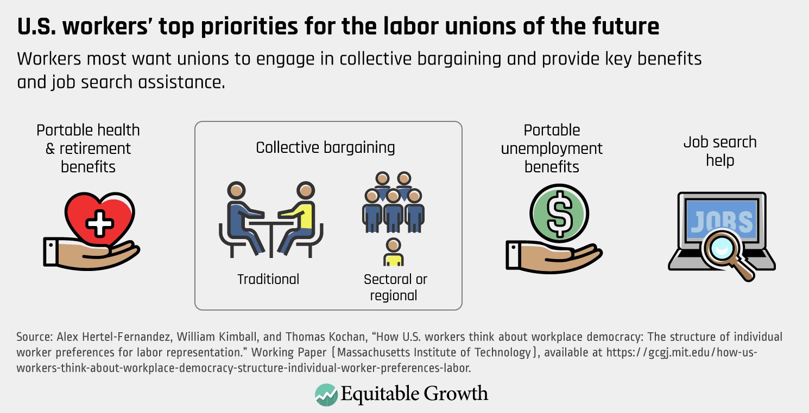

## Table of Contents

## What is a labor union?

A labor union is a group of workers who join together to make their work lives better. They work together to talk to their bosses about things like pay, hours, and safe working places. By joining together, workers have more power to make changes than if they tried alone.

Unions also help workers when they have problems at work. If a worker is treated unfairly, the union can help them fight for their rights. Unions can also help workers get better health care, retirement plans, and other benefits. This makes the workplace better for everyone in the union.

## How do labor unions work?

Labor unions work by bringing workers together to talk to their bosses about what they need. When workers join a union, they choose leaders who speak for everyone. These leaders meet with the company's bosses to talk about pay, working hours, and making the workplace safe. If the bosses and union leaders agree, they make a contract that says what the workers will get. This contract helps make sure everyone is treated fairly at work.

Sometimes, if the bosses and union leaders can't agree, the workers might go on strike. This means they stop working to show how important they are to the company. Going on strike can be hard, but it can also make the bosses listen and agree to the workers' needs. Unions also help workers if they have problems at work, like if they are treated unfairly. The union can help them fight for their rights and make sure they are treated well.

## What are worker benefits?

Worker benefits are extra things that workers get from their jobs, apart from their pay. These can include health insurance, which helps pay for doctor visits and medicine. Workers might also get paid time off, like vacation days or sick days, so they can rest or take care of themselves without losing money. Another common benefit is a retirement plan, which helps workers save money for when they stop working. These benefits make workers' lives easier and help them feel more secure.

Some companies also offer other kinds of benefits, like help with paying for school or training, so workers can learn new skills. They might give discounts on things like gym memberships or help with buying a house. These extra benefits can make workers happier and more likely to stay with the company. When workers feel taken care of, they often work better and feel more loyal to their job.

## How do labor unions negotiate worker benefits?

Labor unions help workers get better benefits by talking to the bosses about what the workers need. The union leaders meet with the company's bosses and explain why things like health insurance, paid time off, and retirement plans are important. They try to make a deal that both the workers and the bosses can agree on. This deal is written down in a contract, which says what benefits the workers will get. By working together, the union makes sure everyone's voice is heard and that the workers get the best possible benefits.

Sometimes, the bosses and union leaders can't agree right away. When this happens, the union might decide to go on strike. This means the workers stop working to show the bosses how important they are to the company. Going on strike can be hard, but it often makes the bosses listen and agree to better benefits. The union keeps fighting until they get a good deal for the workers. This way, everyone in the union can enjoy better health care, more time off, and a secure retirement.

## What are some common benefits that labor unions have secured for workers?

Labor unions have helped workers get many important benefits. One big benefit is better health insurance. This means workers can go to the doctor and get medicine without worrying about big bills. Unions also fight for paid time off, like vacation days and sick days. This lets workers take a break or take care of themselves without losing money. Another important benefit is a good retirement plan. This helps workers save money so they can live well after they stop working.

Unions also work to get other kinds of benefits for workers. For example, they might help workers get help with paying for school or training. This lets workers learn new skills and grow in their jobs. Some unions also get discounts on things like gym memberships or help with buying a house. These extra benefits make workers' lives easier and happier. By working together, unions make sure workers get the support they need to live well.

## How have labor unions historically impacted worker benefits?

Labor unions have made a big difference in workers' lives over many years. They started fighting for better pay and shorter work hours a long time ago. Before unions, many workers had to work very long hours for little money. Unions helped change this by talking to bosses and sometimes going on strike. This made bosses agree to pay workers more and let them work fewer hours. This was a big win for workers and made their lives much better.

Unions also helped workers get important benefits like health insurance and retirement plans. Before unions, many workers didn't have these things. Unions fought hard to make sure workers could go to the doctor without big bills and save money for when they got older. They also got workers paid time off, so they could take a break or take care of themselves without losing money. These benefits made workers' lives easier and more secure. Unions keep fighting to make sure workers get the support they need.

## What is the current state of labor unions and their influence on worker benefits?

Today, labor unions still work hard to help workers get good benefits, but they face some challenges. In many places, fewer people are joining unions than before. This makes it harder for unions to have a big impact. But unions still fight for things like better health insurance, paid time off, and good retirement plans. They talk to bosses and sometimes go on strike to make sure workers get what they need. Even with fewer members, unions can still make a difference by working together and being strong.

In some industries, like teaching and health care, unions are still very strong. They help workers in these jobs get good benefits and fair treatment. Unions also work to make sure workers have safe places to work and fair pay. Even though it's harder now, unions keep trying to make workers' lives better. They know that when workers are treated well, everyone benefits. So, unions will keep fighting for workers, no matter what challenges they face.

## How do labor unions affect wages and compensation?

Labor unions help workers get better pay and compensation by talking to the bosses. When workers join a union, they choose leaders who speak for everyone. These leaders meet with the company's bosses and explain why workers need more money. They try to make a deal that both the workers and the bosses can agree on. This deal is written down in a contract, which says how much workers will get paid. By working together, the union makes sure everyone's voice is heard and that the workers get the best possible pay.

Sometimes, the bosses and union leaders can't agree right away. When this happens, the union might decide to go on strike. This means the workers stop working to show the bosses how important they are to the company. Going on strike can be hard, but it often makes the bosses listen and agree to better pay. The union keeps fighting until they get a good deal for the workers. This way, everyone in the union can enjoy higher wages and better compensation.

## What role do labor unions play in workplace safety and health benefits?

Labor unions help keep workers safe and healthy at work. They talk to the bosses about making the workplace safer. This means things like making sure there are no dangerous machines or chemicals around. Unions also make sure workers know how to stay safe. If a worker gets hurt or sick at work, the union can help them get the care they need. This makes workers feel more secure because they know the union is looking out for them.

Unions also fight for good health benefits. They talk to the bosses to make sure workers have health insurance. This helps workers go to the doctor and get medicine without big bills. Unions also work to get workers paid time off if they are sick. This means workers can take care of themselves without losing money. By working together, unions make sure workers stay healthy and safe, which makes the workplace better for everyone.

## How do labor unions impact retirement and pension benefits?

Labor unions help workers get good retirement and pension benefits. They talk to the bosses about why it's important for workers to have money when they stop working. Unions make sure that workers have a retirement plan that helps them save money over time. This means workers can live well after they retire. By working together, unions make sure everyone's voice is heard and that the workers get the best possible retirement benefits.

Sometimes, the bosses and union leaders can't agree right away. When this happens, the union might decide to go on strike. This means the workers stop working to show the bosses how important they are to the company. Going on strike can be hard, but it often makes the bosses listen and agree to better retirement benefits. The union keeps fighting until they get a good deal for the workers. This way, everyone in the union can enjoy a secure retirement.

## What are the economic implications of labor unions on worker benefits?

Labor unions help workers get better pay and benefits, which can make a big difference in their lives. When unions talk to bosses and get a good deal, workers earn more money. This extra money can help them buy things they need, like food and a place to live. It also means they can save more for the future. When workers have more money, they spend more, which helps the economy grow. This is good for everyone because it means more jobs and more money moving around.

Unions also help workers get important benefits like health insurance and retirement plans. These benefits make workers feel more secure because they know they can go to the doctor or save for when they stop working. When workers have these benefits, they don't have to worry as much about getting sick or not having enough money later in life. This makes them happier and more productive at work. But sometimes, when unions ask for more benefits, it can cost the company more money. The company might have to raise prices or find other ways to pay for these benefits, which can affect the economy in different ways.

## How do labor unions influence policy and legislation related to worker benefits?

Labor unions help make laws that are good for workers. They talk to people who make laws and tell them what workers need. Unions want laws that make sure workers get fair pay, good health insurance, and time off when they are sick. They also want laws that keep workers safe at work. By working together, unions can make a big difference. They help pass laws that make life better for everyone who works.

Sometimes, unions have to fight hard to get these laws passed. They might go on strike or have big meetings to show how important these laws are. When unions work together, they can make lawmakers listen. This can lead to new laws that help workers get better benefits. Even though it can be hard, unions keep trying to make sure workers are treated fairly and have what they need to live well.

## References & Further Reading

[1]: Freeman, R. B., & Medoff, J. L. (1984). ["What Do Unions Do?"](https://journals.sagepub.com/doi/abs/10.1177/001979398503800207) Basic Books.

[2]: Hirsch, B. T., Kaufman, B. E., & Zoellner, D. H. (Eds.). (2004). ["The Economics of Labor Unions"](https://www.researchgate.net/publication/344025219_Minimum_Wage_Channels_of_Adjustment). Edward Elgar Publishing.

[3]: Lopez de Prado, M. (2018). ["Advances in Financial Machine Learning"](https://www.amazon.com/Advances-Financial-Machine-Learning-Marcos/dp/1119482089). Wiley.

[4]: Jansen, S. (2020). ["Machine Learning for Algorithmic Trading"](https://github.com/stefan-jansen/machine-learning-for-trading). Packt Publishing.

[5]: ILO. (2016). ["International Labour Standards on Working Time"](https://www.ilo.org/sites/default/files/wcmsp5/groups/public/%40ed_protect/%40protrav/%40travail/documents/genericdocument/wcms_145675.pdf). International Labour Organization.

[6]: Degryse, C. (2016). ["Digitalisation of the Economy and its Impact on Labour Markets."](https://papers.ssrn.com/sol3/papers.cfm?abstract_id=2730550) ETUI.

[7]: Aronson, D. (2006). ["Evidence-Based Technical Analysis: Applying the Scientific Method and Statistical Inference to Trading Signals"](https://www.amazon.com/Evidence-Based-Technical-Analysis-Scientific-Statistical/dp/0470008741). Wiley.

[8]: Autor, D. H. (2019). ["Work of the Past, Work of the Future"](https://www.nber.org/papers/w25588). AEA Papers and Proceedings.

[9]: Chan, E. (2008). ["Quantitative Trading: How to Build Your Own Algorithmic Trading Business"](https://github.com/ftvision/quant_trading_echan_book). Wiley.

[10]: Bamberger, A. I. (2017). ["Robots and Labor: Technological Unemployment in the 21st Century"](https://www.nature.com/articles/s41599-020-00676-8). Journal of Economic Perspectives, American Economic Association.