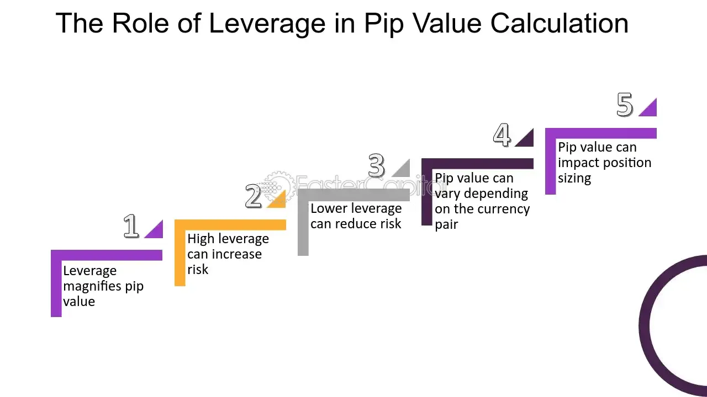

## Table of Contents

## What is leverage in forex trading?

Leverage in forex trading is like borrowing money to increase the size of your trade. Imagine you have $1,000, but with leverage, you can control a much larger position, maybe $100,000 worth of currency. This means you can potentially make bigger profits, but it also means you can lose more money if the market moves against you. Leverage is often described as a ratio, like 100:1, which means for every $1 you have, you can trade $100.

Using leverage can be risky because even small changes in the market can lead to big losses. If the market moves just 1% against you, you could lose all your initial $1,000. That's why it's important to use leverage carefully and understand how it works. Many traders use stop-loss orders to limit their potential losses when trading with leverage.

## What is a pip and how is its value calculated?

A pip is the smallest price move that a currency pair can make. In most currency pairs, a pip is equal to 0.0001. For example, if the EUR/USD moves from 1.1850 to 1.1851, that's a one pip movement. However, for currency pairs involving the Japanese yen, a pip is usually 0.01 because the yen is quoted to two decimal places instead of four.

To calculate the value of a pip, you need to know the lot size you are trading and the exchange rate of the currency pair. If you are trading a standard lot size of 100,000 units, the value of one pip for most pairs is typically $10. This is calculated by taking the pip value (0.0001) and multiplying it by the lot size (100,000). So, 0.0001 x 100,000 = $10. If you're trading a mini lot (10,000 units), the pip value would be $1. For yen pairs, the calculation is slightly different because of the different pip size, but the principle remains the same.

## How does leverage affect the pip value in forex trading?

Leverage in [forex](/wiki/forex-system) trading does not change the value of a pip directly. The pip value stays the same no matter how much leverage you use. For example, if you're trading a standard lot of 100,000 units, a pip is still worth $10, whether you use 1:10 leverage or 1:100 leverage. Leverage just lets you control a bigger position with less money.

However, leverage can make the impact of pip movements feel much bigger. With leverage, you can trade larger amounts than you could without it. So, even though the pip value doesn't change, the total profit or loss from each pip movement can be much larger because you're trading more. If the market moves against you, those pip losses can quickly add up and wipe out your account if you're not careful.

## What are the risks associated with using high leverage?

Using high leverage in forex trading can lead to big losses. When you use high leverage, you're borrowing a lot of money to trade. If the market moves against you, even a small change can wipe out your account. For example, if you use 100:1 leverage and the market moves just 1% against you, you could lose all your money. This means you can lose more than you put in, which is a big risk.

Another risk is that high leverage can make you act impulsively. When you're controlling a large position with little money, you might feel pressured to make quick decisions. This can lead to bad trades and more losses. It's easy to get caught up in the excitement of potentially big profits, but the reality is that high leverage can lead to big losses if you're not careful.

## How can leverage impact the potential profit from a pip movement?

Leverage lets you control a bigger position with less money. When you use leverage, the potential profit from a pip movement can be much bigger because you're trading a larger amount. For example, if you trade a standard lot of 100,000 units without leverage, a one pip move is worth $10. But if you use 100:1 leverage, you can control that 100,000 units with just $1,000. So, if the market moves in your favor by one pip, you still make $10, which is a big profit compared to the $1,000 you put in.

But remember, leverage is a double-edged sword. While it can make your profits bigger, it can also make your losses bigger. If the market moves against you by one pip, you lose $10. That might not sound like much, but when you're using high leverage, those losses can add up fast. If the market keeps moving against you, you could lose all your money quickly. So, it's important to use leverage carefully and understand the risks.

## Can you explain the relationship between account balance, leverage, and pip value?

The relationship between your account balance, leverage, and pip value is important to understand when trading forex. Your account balance is the money you have in your trading account. Leverage lets you control a bigger position than your account balance would allow. For example, with 100:1 leverage, you can control $100,000 with just $1,000. The pip value is how much money you make or lose for each pip the market moves. If you trade a standard lot of 100,000 units, a pip is worth $10 no matter how much leverage you use.

But leverage changes how big the impact of a pip movement feels on your account balance. When you use high leverage, you can make bigger profits from each pip movement because you're trading a larger amount. But if the market moves against you, those pip losses can quickly eat into your account balance. So, while leverage doesn't change the pip value itself, it makes the effect of each pip movement much bigger on your account balance. This means you need to be careful with how much leverage you use, because it can lead to big losses if the market goes the wrong way.

## What strategies can traders use to manage the impact of leverage on pip value?

Traders can use stop-loss orders to manage the impact of leverage on pip value. A stop-loss order is like a safety net that automatically closes your trade if the market moves against you by a certain amount. This can help limit your losses, which is important when you're using high leverage. By setting a stop-loss order, you can control how much money you might lose on a trade, even if the market moves a lot of pips against you.

Another strategy is to use smaller lot sizes. When you trade with less money, the impact of each pip movement on your account is smaller. This means you can still use leverage, but you won't lose as much money if the market goes the wrong way. Trading smaller lot sizes can help you stay in the market longer and give your trades more room to move in your favor.

Lastly, it's important to have a good risk management plan. This means deciding how much of your account you're willing to risk on each trade. A common rule is to risk no more than 1-2% of your account on any single trade. By sticking to this rule, you can use leverage without putting your whole account at risk. This way, even if you have a few losing trades, you won't lose all your money and can keep trading.

## How does the choice of currency pair influence the effect of leverage on pip value?

The choice of currency pair can change how leverage affects pip value because different pairs have different pip values. For most currency pairs, a pip is worth 0.0001, but for pairs with the Japanese yen, a pip is worth 0.01. This means that if you're trading a yen pair, the pip value is different, and when you use leverage, the impact of each pip movement on your account will be different too. For example, if you trade a standard lot of EUR/USD, a pip is worth $10. But if you trade a standard lot of USD/JPY, a pip is worth about $8.33. So, with the same amount of leverage, the potential profit or loss from each pip movement will be different depending on the currency pair.

When you use leverage, you're controlling a bigger position than your account balance would allow. This means that even though the pip value itself doesn't change with leverage, the impact of each pip movement on your account balance can be much bigger. If you're trading a currency pair with a higher pip value, like EUR/USD, the effect of leverage on your account will be more significant than if you're trading a pair with a lower pip value, like USD/JPY. So, it's important to understand the pip value of the currency pair you're trading and how it can affect your account when you use leverage.

## What are the differences in pip value calculation when trading with different leverages?

When you trade forex, the pip value stays the same no matter what leverage you use. For example, if you trade a standard lot of 100,000 units of EUR/USD, a pip is worth $10. This doesn't change whether you use 1:10 leverage or 1:100 leverage. Leverage just lets you control a bigger position with less money. So, if you use 100:1 leverage, you can trade that 100,000 units with just $1,000. But the pip value itself, which is how much money you make or lose for each pip, stays the same.

However, leverage makes the impact of each pip movement feel much bigger on your account balance. When you use high leverage, you're trading a larger amount, so the potential profit or loss from each pip movement is bigger. For example, if you use 100:1 leverage and the market moves one pip in your favor, you still make $10, but that's a big profit compared to the $1,000 you put in. But if the market moves one pip against you, you lose $10, which can add up quickly and eat into your account balance. So, while leverage doesn't change the pip value itself, it changes how much each pip movement affects your account.

## How do regulatory requirements affect the use of leverage and pip value?

Regulatory requirements can limit how much leverage traders can use. Different countries have different rules about leverage. For example, in the United States, the maximum leverage for major currency pairs is 50:1, while in some other countries, it can be as high as 1000:1. These rules are there to protect traders from losing too much money too quickly. When leverage is lower, traders can't control as big a position with their money, which means they can't make or lose as much from each pip movement.

Even though regulatory limits on leverage don't change the pip value itself, they do change how much each pip movement affects a trader's account. If you're only allowed to use 50:1 leverage instead of 100:1, you can control a smaller position. So, if the market moves one pip, the impact on your account will be smaller. This can make trading safer, but it also means you might not make as much profit from each trade.

## What advanced techniques can be used to optimize leverage for maximizing pip value gains?

One advanced technique to optimize leverage for maximizing pip value gains is to use a strategy called position sizing. This means you decide how much to trade based on how much risk you're willing to take. Instead of using the same amount of leverage for every trade, you can adjust it depending on how confident you are in the trade. If you think a trade has a high chance of success, you might use more leverage to increase your potential profit from each pip movement. But if you're not as sure, you can use less leverage to protect your account from big losses.

Another technique is to use a trailing stop-loss order. This is a type of stop-loss that moves with the market. As the market moves in your favor, the stop-loss moves too, locking in more profit. This way, you can use higher leverage without risking as much, because the trailing stop-loss can help you keep more of your gains if the market suddenly turns against you. By combining smart position sizing with a trailing stop-loss, you can use leverage to maximize your pip value gains while still managing your risk.

## How does the concept of margin call relate to leverage and pip value in trading?

A margin call happens when the money in your trading account falls below a certain level because of losses from trading. When you use leverage, you're borrowing money to trade more than you have in your account. If the market moves against you and you lose money, your account balance can drop quickly. If it drops too low, your broker might make a margin call, which means you need to add more money to your account or they will close your trades to limit their risk.

The connection between margin calls, leverage, and pip value is all about how much you can lose. When you use high leverage, even a small move in the market (just a few pips) can cause big losses. If those losses are big enough, they can trigger a margin call. So, even though the value of each pip doesn't change with leverage, the impact of each pip movement on your account can be huge, and that's what can lead to a margin call if you're not careful.

## What makes leverage a double-edged sword?

Leverage is a fundamental concept in Forex trading, serving as a mechanism by which traders can control positions that are larger than their actual account balances. It functions as a loan provided by brokers, allowing traders to amplify their exposure to the market with a relatively small capital investment. This amplification of trading positions is expressed as a ratio, such as 50:1 or 100:1, which dictates the extent to which the trader's initial capital can be expanded.

### Benefits of Leveraging in Forex

The primary advantage of leverage is that it increases the potential for significant returns. By leveraging a position, traders can maximize their profit from market movements without needing to commit a large sum of their own capital. For instance, with a 100:1 leverage ratio, a trader can control a $100,000 position with just $1,000 of their own money. This powerful financial tool thus enables participation in the Forex market even for those with limited initial funds.

Moreover, leverage is instrumental in diversifying trading strategies. Traders can open multiple positions across various currency pairs, which may enhance potential gains if different trends or events affect these pairs positively. As a result, it supports active trading strategies, including [scalping](/wiki/gamma-scalping) or [day trading](/wiki/day-trading-spy), where small price movements across various trades can collectively result in significant overall profits.

### Risks Associated with High Leverage

While leverage can substantially increase the potential for gains, it equally magnifies the potential for losses. The downside is that large trade volumes can lead to significant capital depletion if the market moves against the trader's position. If a trader utilizes maximum leverage and the position moves unfavorably by just 1%, it can wipe out the entire initial investment. This risk exposure demonstrates how leverage can act as a double-edged sword in Forex trading.

Effective risk management practices are therefore crucial in leveraged trading. Traders must employ strict stop-loss orders and adhere to sound money management rules to limit exposure. The choice of an appropriate leverage ratio is vital; more conservative leverage ratios can prevent catastrophic losses during volatile market conditions.

#### Formula for Leverage Impact

The potential impact of leverage on a trader's account can be explained by the following formula:

$$
\text{Account Equity Change} = \text{Leverage Ratio} \times \text{Percentage Change in Market}
$$

If a trader has a leverage ratio of 100:1 and the market moves by 1%:

$$
\text{Account Equity Change} = 100 \times 0.01 = 1
$$

Thus, a 1% change in the market can lead to a 100% change in the trader's account equity, illustrating the potential risks and rewards associated with high leverage.

In conclusion, while leverage can significantly boost profits, it demands respect and a methodical approach to risk management to mitigate potential drawbacks. Understanding and judiciously employing leverage is pivotal for sustainable success in Forex trading.

## How do you calculate pip value with leverage?

Leverage significantly influences the pip value and the fluctuations in an account balance in Forex trading. To understand this effect, it's essential first to recognize how pip value is determined. A pip, or "percentage in point," typically represents the smallest price movement in the exchange rate of a currency pair. The value of a pip can vary depending on the currency pair and the lot size. In standard lots, one pip equals 0.0001 for most pairs and 0.01 for pairs involving the Japanese yen.

Imagine you're trading EUR/USD with a standard lot (100,000 units). At an exchange rate of 1.1500, a single pip movement equals $10 for a standard lot. For currency pairs where the USD is not the quote currency, further conversion is necessary to determine the pip value in USD. The formula for pip value is:

$$
\text{Pip Value} = \frac{\text{One Pip}}{\text{Exchange Rate}} \times \text{Lot Size}
$$

Leverage allows traders to control a larger position than what their account balance would ordinarily permit. It's expressed as a ratio, such as 50:1 or 200:1, indicating the magnitude by which the trader's equity can be amplified. For instance, with 100:1 leverage, a trader could control $100,000 in market value with just $1,000 of equity.

Let's assess two scenarios with different leverages:

1. **Without Leverage**: A trader using no leverage would need the full $100,000 to control a standard lot. If the market moves 10 pips, the profit or loss would be $100 (10 pips × $10 per pip).

2. **With 100:1 Leverage**: The same trade with leverage would only require $1,000 in equity to control the $100,000 position. A 10 pip movement results in the same $100 profit or loss. However, because only $1,000 is used, the percentage gain or loss relative to the initial margin is significantly increased, reflecting the amplified risk inherent with leverage.

The impact on the account balance due to leveraging can be quite pronounced. High leverage multiplies both potential gains and potential losses, necessitating robust risk management. Small adverse market fluctuations can lead to margin calls or stop-outs if the account's equity falls below required levels.

To manage these risks effectively, traders should:

- **Use Online Calculators**: Many platforms offer calculators to simplify the determination of pip values and required margins. These tools can help traders better assess their potential exposure and necessary adjustments in real-time.

- **Adopt Risk Management Strategies**: Implementing stop-loss orders, position sizing techniques, and continuously monitoring leveraged positions can help mitigate the repercussions of unfavorable market shifts.

A deeper understanding of leverage's effect on pip value ensures that traders are making informed decisions, balancing the allure of magnified profits with the reality of increased risks.

## References & Further Reading

[1]: Bergstra, J., Bardenet, R., Bengio, Y., & Kégl, B. (2011). ["Algorithms for Hyper-Parameter Optimization."](https://dl.acm.org/doi/10.5555/2986459.2986743) Advances in Neural Information Processing Systems 24.

[2]: ["Advances in Financial Machine Learning"](https://www.amazon.com/Advances-Financial-Machine-Learning-Marcos/dp/1119482089) by Marcos Lopez de Prado

[3]: ["Evidence-Based Technical Analysis: Applying the Scientific Method and Statistical Inference to Trading Signals"](https://www.amazon.com/Evidence-Based-Technical-Analysis-Scientific-Statistical/dp/0470008741) by David Aronson

[4]: ["Machine Learning for Algorithmic Trading"](https://github.com/PacktPublishing/Machine-Learning-for-Algorithmic-Trading-Second-Edition) by Stefan Jansen

[5]: ["Quantitative Trading: How to Build Your Own Algorithmic Trading Business"](https://books.google.com/books/about/Quantitative_Trading.html?id=j70yEAAAQBAJ) by Ernest P. Chan