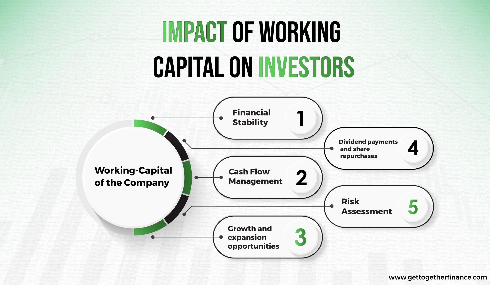

In today's rapidly evolving financial landscape, working capital, corporate finance, and algorithmic trading are pivotal concepts driving business success. These elements are fundamentally intertwined and exert a significant influence on a company's financial health and competitive position. Understanding the intricacies of these concepts is essential for businesses aiming to optimize their financial strategies and achieve sustainable growth.

Working capital serves as a measure of a company's operational efficiency and short-term financial health. It is calculated as the difference between current assets and current liabilities and provides insight into the company's ability to cover its short-term obligations. Effective management of working capital ensures that a company can continue its operations smoothly and invest strategically in growth opportunities without experiencing liquidity shortages.



Corporate finance encompasses the strategies and decisions that companies make to manage their financial resources effectively. It involves activities such as capital raising, investment analysis, and financial planning, all of which are crucial for maintaining and improving a company's market position. A well-structured corporate finance strategy can bolster a company's financial stability and enhance its ability to navigate the complexities of financial markets.

Algorithmic trading represents a significant advancement in financial technology, utilizing computer algorithms to execute trades at high speed and precision. This technology minimizes human error and emotion-driven decisions, improving the consistency of trade execution and enabling firms to exploit market inefficiencies. By incorporating algorithmic trading strategies, businesses can achieve a competitive advantage, enhancing their ability to respond swiftly to market changes and optimize investment returns.

The convergence of these elements—working capital, corporate finance, and algorithmic trading—presents an opportunity for businesses to refine their approach to financial management. By comprehensively understanding how these components interplay, companies can effectively navigate challenges, capitalize on market opportunities, and thrive in today's competitive financial environment.

## Table of Contents

## Understanding Working Capital in Corporate Finance

Working capital represents the difference between a company's current assets and current liabilities and serves as a fundamental indicator of liquidity. Current assets typically include cash and other assets expected to be converted into cash within a year, such as accounts receivable and inventory. Current liabilities, on the other hand, consist of obligations the company must fulfill within the same period, including accounts payable and short-term debt.

The formula for calculating working capital is straightforward:

$$
\text{Working Capital} = \text{Current Assets} - \text{Current Liabilities}
$$

Effective management of working capital is essential for maintaining operational efficiency and enabling strategic investments. It ensures that a company has sufficient cash flow to meet its short-term obligations and invest in opportunities for growth. Companies with positive working capital are more likely to handle unexpected expenses or challenges, as they possess the [liquidity](/wiki/liquidity-risk-premium) needed to operate smoothly without resorting to external financing.

Conversely, a company experiencing negative working capital may face insolvency risks. Such a situation implies the current liabilities exceed current assets, potentially leading to liquidity issues. This condition can restrict a company's ability to pay its debts as they become due, inhibiting operational efficiency and the opportunity to make strategic investments.

Managing working capital effectively thus not only supports day-to-day operations but also underpins long-term financial health. Techniques for optimizing working capital include improving receivables collection, managing inventory levels prudently, and extending payable terms without damaging supplier relationships. These strategies contribute to maintaining a healthy balance between assets and liabilities, which is crucial for sustaining business stability and growth.

## Implications of Working Capital on Financial Prospects

Working capital serves as a crucial determinant of a company's financial health and influences its market standing. At its core, working capital is the difference between current assets and current liabilities, providing insight into a company's operational liquidity.

A low level of working capital can suggest potential financial distress. This often stems from a company's inability to meet short-term obligations, which might lead to higher borrowing costs or, in severe cases, insolvency. However, strategic investment in long-term assets can also result in low working capital. In such scenarios, the company might deliberately dip into its working capital to fund projects expected to yield future benefits, indicating a calculated risk rather than fiscal weakness.

Conversely, high working capital generally implies robust operational efficiency, as the company can cover its short-term liabilities comfortably. High working capital might also signify that a company is holding on to excess liquid assets without deploying them effectively in growth opportunities. This can result in missed investment opportunities, suggesting a conservative approach that prioritizes liquidity over growth.

A mathematical representation of working capital can be expressed as:

$$
\text{Working Capital} = \text{Current Assets} - \text{Current Liabilities}
$$

Monitoring this balance provides crucial insights for stakeholders into a company's capacity to sustain operations while adhering to financial obligations. Maintaining an optimal working capital level is essential for safeguarding financial stability and reinforcing market reputation.

By analyzing working capital trends, companies can better assess their financial prognosis and strategically decide on asset allocations to ensure long-term sustainability and growth.

## The Role of Algorithmic Trading in Modern Corporate Finance

Algorithmic trading has transformed the landscape of modern corporate finance by leveraging advanced computer programs to automate transactions across financial markets. These programs enable the execution of trades at speeds and efficiencies unattainable by human traders. This automation is crucial for firms aiming to maximize profitability and minimize risks associated with manual trading operations.

One of the key advantages of [algorithmic trading](/wiki/algorithmic-trading) is its ability to eliminate human error and emotional biases. Traditional trading is often susceptible to impulsive decision-making influenced by a trader's emotions. Automation through algorithms, however, ensures that trading decisions are based on data-driven criteria and predefined strategies, thereby enhancing consistency in trade execution. This systematic approach leads to more reliable outcomes and reduces the likelihood of costly mistakes.

Moreover, algorithmic trading offers firms a distinct competitive advantage by allowing them to exploit market inefficiencies. These inefficiencies often manifest in the form of price discrepancies and short-lived [arbitrage](/wiki/arbitrage) opportunities. Algorithms can analyze vast amounts of market data in real-time, identifying these opportunities much faster than is possible manually. For instance, mean reversion strategies can be applied using a simple Python script to identify when a stock's price deviates from its historical average and make the appropriate trades to capitalize on the expected price correction.

```python
import numpy as np
import pandas as pd

# Simulate stock prices
np.random.seed(42)
price_changes = np.random.normal(0, 1, 100)
prices = np.cumsum(price_changes) + 100

# Calculate moving average
window_size = 20
moving_average = pd.Series(prices).rolling(window=window_size).mean()

# Identifying mean reversion signals
signals = pd.Series(np.where(prices < moving_average, 'Buy', 'Sell'), index=range(len(prices)))

print(signals)
```

The above code snippet illustrates how a simple mean reversion strategy can be implemented to identify potential buy or sell signals based on a moving average.

Furthermore, algorithmic trading facilitates high-frequency trading ([HFT](/wiki/high-frequency-trading-strategies)), where a large number of orders are executed in fractions of a second. HFT firms often engage in strategies that involve arbitrage, [market making](/wiki/market-making), or latency, driven  trading to exploit very short-term price fluctuations. These strategies benefit from the ability to process and act on information faster than any human could.

In conclusion, algorithmic trading's role in modern corporate finance is pivotal. It brings unparalleled efficiency and precision to trading operations, providing firms with the tools to not only reduce operational risks but also enhance their ability to generate returns by continuously optimizing their trading strategies. As financial markets evolve, the reliance on such automated techniques will likely increase, cementing the role of algorithmic trading as an essential component of corporate finance strategy.

## Balancing Working Capital with Algorithmic Trading Strategies

Integrating algorithmic trading into working capital management provides a powerful avenue to optimize both liquidity and investment strategies. By leveraging advanced algorithms, companies can anticipate cash flow needs more accurately, ensuring they maintain sufficient working capital to meet short-term obligations. This foresight is achieved through data-driven models that analyze past financial patterns and current market conditions to predict future cash inflows and outflows. 

Algorithmic solutions facilitate the allocation of excess funds into short-term investments that maximize returns without compromising liquidity. For instance, algorithms can assess varying degrees of market risk, enabling firms to choose the most appropriate investment vehicles, such as money market funds or short-term bonds. The algorithms' ability to process vast amounts of data in real-time allows for quick reallocation of resources based on the market dynamics, thus capturing opportunities or averting potential losses.

The relationship between efficient working capital utilization and algorithmic trading strategies can significantly bolster a company's financial health. Consider an example where a company manages its accounts payable to delay outflows while utilizing algorithmic trading to invest available cash. By doing so, the firm can increase its return on idle funds, effectively turning potential financial slack into a revenue-generating opportunity. 

Furthermore, with Python, companies can implement algorithms that automate these processes. A simple example is using the following Python code to simulate cash flow forecasting:

```python
import numpy as np

def forecast_cashflow(cash_inflows, cash_outflows, periods):
    forecast = []
    for period in range(periods):
        net_cashflow = cash_inflows[period] - cash_outflows[period]
        forecast.append(net_cashflow)
    return np.cumsum(forecast)  # Cumulative cash flow over the periods

# Example data
cash_inflows = [10000, 12000, 11000, 13000]
cash_outflows = [9000, 10500, 9500, 11500]

# Forecast cash flow for 4 periods
forecast = forecast_cashflow(cash_inflows, cash_outflows, 4)
print(f"Forecasted Cumulative Cash Flows: {forecast}")
```

This example illustrates how algorithms can be designed to simulate future cash positions, aiding financial managers in making informed decisions about whether to hold cash for operational needs or to invest it. The synergistic implementation of algorithmic trading with working capital management can enhance both liquidity and profitability, positioning companies strategically for sustained growth in competitive markets.

## Conclusion

The integration of working capital management and algorithmic trading signifies transformative potential for corporate finance strategies. By intelligently managing liquidity, companies can ensure that sufficient cash flow is available to meet short-term obligations while also enabling strategic investments that may drive long-term growth. This balance is vital, as maintaining an optimal level of working capital directly impacts a company's financial health and operational efficiency.

Algorithm-driven trading provides businesses with a powerful tool to enhance their financial strategies. Through the use of complex algorithms, companies can execute trades with a precision and speed far beyond the capabilities of human traders. This approach not only minimizes the likelihood of human error but also reduces the influence of emotional biases, which often skew decision-making processes in financial markets.

Moreover, algorithmic trading allows firms to take advantage of transient market inefficiencies, potentially maximizing returns on investments. The ability to quickly respond to market changes can significantly improve a company's competitive standing, offering a distinct edge over slower-reacting rivals. By leveraging data and predictive analytics, these algorithms can also help optimize the allocation of working capital, ensuring optimal liquidity levels.

Incorporating these technologies and strategies is crucial for companies aiming to sustain growth and maintain a competitive edge in today's fast-paced financial environment. As businesses grapple with increasingly complex market conditions, the synergy between effective working capital management and advanced algorithmic trading techniques presents unparalleled opportunities to drive efficiency, profitability, and innovation. Embracing these tools is not merely advantageous but essential for companies seeking to secure a strong foothold in today's dynamic financial landscape.

## References & Further Reading

[1]: Bergstra, J., Bardenet, R., Bengio, Y., & Kégl, B. (2011). ["Algorithms for Hyper-Parameter Optimization."](https://proceedings.neurips.cc/paper/2011/file/86e8f7ab32cfd12577bc2619bc635690-Paper.pdf) Advances in Neural Information Processing Systems 24.

[2]: ["Advances in Financial Machine Learning"](https://www.amazon.com/Advances-Financial-Machine-Learning-Marcos/dp/1119482089) by Marcos Lopez de Prado

[3]: ["Evidence-Based Technical Analysis: Applying the Scientific Method and Statistical Inference to Trading Signals"](https://www.amazon.com/Evidence-Based-Technical-Analysis-Scientific-Statistical/dp/0470008741) by David Aronson

[4]: ["Machine Learning for Algorithmic Trading"](https://github.com/stefan-jansen/machine-learning-for-trading) by Stefan Jansen

[5]: ["Quantitative Trading: How to Build Your Own Algorithmic Trading Business"](https://github.com/LucindaYa/quant-resources/blob/master/Quantitative%20Trading%20How%20to%20Build%20Your%20Own%20Algorithmic%20Trading%20Business.pdf) by Ernest P. Chan