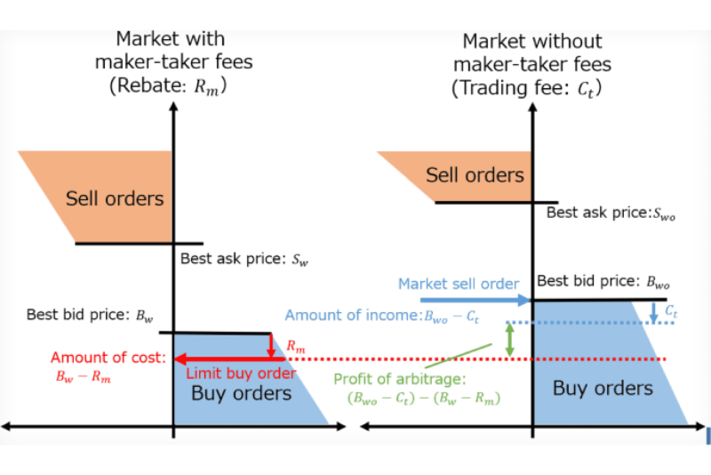

## Table of Contents

## What are maker-taker fees in trading?

Maker-taker fees are charges that stock exchanges use to encourage people to trade. When you place an order that adds liquidity to the market, you are called a "maker." This means you're putting in an order that other people can trade against later. Exchanges want more of these orders because they help keep the market active. So, they often give makers a small rebate or a lower fee as a reward.

On the other hand, if you take an order that's already on the market, you're called a "taker." This means you're immediately matching with an existing order and taking liquidity out of the market. Because takers reduce the number of orders available for others, exchanges usually charge takers a higher fee. This system helps balance the market by encouraging more orders to be placed and keeping trading active.

## How do maker-taker fees affect the cost of trading for beginners?

Maker-taker fees can make trading more expensive for beginners, especially if they don't understand how these fees work. When beginners trade, they often act as takers because they want to buy or sell right away. This means they have to pay higher fees. If a beginner doesn't know about these fees, they might be surprised by how much they end up paying for each trade.

However, if beginners learn to place orders that add to the market's [liquidity](/wiki/liquidity-risk-premium), they can become makers and pay lower fees or even get small rebates. This can save them money over time. But it requires patience because they have to wait for their orders to be filled. Understanding maker-taker fees can help beginners make smarter trading choices and manage their costs better.

## What is the difference between a maker and a taker in trading?

In trading, a maker is someone who puts an order into the market that other people can trade against later. This type of order adds to the market's liquidity, which means it helps keep the market active and full of orders. Exchanges like makers because they make the market more lively, so they often give makers a small reward, like a rebate or a lower fee.

On the other hand, a taker is someone who takes an order that's already in the market. When a taker trades, they match with an existing order right away, which removes that order from the market. This reduces the market's liquidity. Because takers take away orders, exchanges usually charge them a higher fee. Knowing the difference between makers and takers can help traders decide the best way to trade and manage their costs.

## How do maker-taker fee structures influence trading volume?

Maker-taker fee structures can boost trading volume by encouraging more people to trade. When exchanges offer lower fees or rebates to makers, it motivates traders to place more orders that add liquidity to the market. This means more orders are available for others to trade against, making the market more active. As a result, more traders might be drawn to the market, increasing the overall trading volume.

However, the higher fees for takers might discourage some traders from taking orders quickly. If the fees are too high, traders might hesitate to trade, which could lower the trading volume. But if the balance is right, the lower fees for makers can still attract enough traders to keep the volume high. So, maker-taker fee structures need to be carefully set to encourage both makers and takers, helping to keep the market lively and active.

## Can maker-taker fees impact market liquidity, and if so, how?

Maker-taker fees can impact market liquidity by encouraging more people to add orders to the market. When exchanges give makers lower fees or rebates, it makes it more attractive for traders to place orders that other people can trade against later. This means more orders are available in the market, which is called liquidity. More liquidity makes it easier for everyone to buy and sell because there are always orders to match with.

However, if the fees for takers are too high, it might discourage some traders from taking those orders quickly. This could reduce the number of trades happening, which might lower liquidity a bit. But if the maker-taker fee structure is balanced well, it can keep the market active and full of orders, helping to maintain or even increase liquidity.

## What strategies can traders use to minimize the impact of maker-taker fees?

Traders can minimize the impact of maker-taker fees by trying to be makers more often. This means they should place orders that add to the market's liquidity instead of taking orders that are already there. By doing this, traders can get lower fees or even small rebates from the exchange. For example, instead of buying a stock right away, a trader can place a limit order to buy it at a specific price. If the market reaches that price, the order will be filled, and the trader will be a maker.

Another strategy is to be aware of the fee structure of different exchanges. Some exchanges have lower maker fees or higher taker fees than others. By choosing to trade on an exchange with a favorable fee structure, traders can save money. It's also important to think about how often they trade. If they trade a lot, even small differences in fees can add up. So, understanding and planning around maker-taker fees can help traders keep their costs down.

## How do maker-taker fees vary across different trading platforms?

Maker-taker fees can be different on each trading platform. Some platforms might give makers a bigger reward, like a larger rebate, to encourage more people to add orders to the market. Other platforms might charge takers a higher fee to make sure they think carefully before taking an order away. For example, one platform might give makers a 0.1% rebate while charging takers a 0.3% fee, while another might offer a 0.05% rebate for makers and a 0.25% fee for takers.

These differences can affect where traders choose to trade. If a trader likes to be a maker and add orders to the market, they might pick a platform that gives a big rebate. But if they often need to buy or sell quickly, they might choose a platform with lower taker fees. It's important for traders to look at the fee structures of different platforms and decide which one will save them the most money based on how they like to trade.

## What are the potential conflicts of interest created by maker-taker fee models?

Maker-taker fee models can create conflicts of interest because they might encourage some people to trade in ways that benefit them more than the market. For example, if a trading platform offers big rebates to makers, some traders might place lots of orders just to get those rebates. This can make the market look more active than it really is, which can trick other traders into thinking there's more interest in a stock than there actually is.

Another conflict can happen if brokers or trading firms get paid by the exchange for sending orders that add liquidity. These firms might push their clients to place orders that make them money, even if it's not the best choice for the clients. This can lead to a situation where the interests of the firms and their clients don't line up, and the clients might end up paying more in fees or not getting the best prices for their trades.

## How have regulatory bodies responded to maker-taker fee structures?

Regulatory bodies have been paying attention to maker-taker fee structures because they want to make sure trading is fair for everyone. They worry that these fees might trick people into thinking the market is busier than it really is. So, they've been looking at rules to make sure everyone knows about the fees and how they work. For example, the U.S. Securities and Exchange Commission (SEC) has been studying how these fees affect the market and has suggested changes to make things clearer.

One big change they've talked about is making sure that the fees are shown clearly to everyone. This way, traders can see exactly what they're paying and make better choices. Some regulators have also thought about setting limits on how big the difference can be between maker and taker fees. They want to stop anyone from using the fees to make the market look more active than it is. By doing these things, regulators hope to keep the market fair and honest for all traders.

## What is the historical context and evolution of maker-taker fees in financial markets?

Maker-taker fees started in the early 2000s when electronic trading became more popular. Before that, trading happened on physical trading floors where people shouted out their orders. But with electronic trading, exchanges needed a new way to encourage people to trade. They came up with the idea of maker-taker fees to make the market more active. The first exchange to use this system was the Island ECN in 1999, and it quickly caught on with other exchanges. They wanted to attract more orders to their platforms, so they gave lower fees or rebates to people who added orders to the market, called makers, and charged higher fees to people who took those orders away, called takers.

Over time, maker-taker fees have changed and grown. At first, the difference between maker and taker fees was small, but as more exchanges started using this system, the fees got bigger. Some exchanges started to offer bigger rebates to makers to get more people to trade on their platforms. This made the market very competitive, with exchanges trying to outdo each other. But it also led to worries about fairness and transparency. Regulators started to look at these fees more closely to make sure they weren't causing problems in the market. Today, maker-taker fees are a common part of trading, but they're still being watched and sometimes changed to keep the market fair for everyone.

## How do maker-taker fees influence high-frequency trading strategies?

Maker-taker fees can really shape how high-frequency traders (HFTs) do their work. HFTs use super fast computers to trade a lot of stocks in a very short time. They like to be makers because they can get small rebates from the exchange for adding orders to the market. This can add up to a lot of money if they trade many times a day. So, they often place lots of orders that they hope will be matched later, helping them earn those rebates.

But, HFTs also need to be careful about being takers. If they take orders too often, they'll have to pay higher fees, which can eat into their profits. To avoid this, they use smart strategies to switch between being makers and takers. They might place orders just a tiny bit away from the current price, hoping to be makers, but they're also ready to take orders if it's a good deal. This way, they can keep their costs down and make the most of the maker-taker fee system.

## What advanced analytical models can be used to assess the impact of maker-taker fees on trading performance?

Advanced analytical models like regression analysis and time-series analysis can help traders figure out how maker-taker fees affect their trading performance. Regression analysis looks at how changes in fees might change things like trading volume, profit, and how often orders get filled. By studying data over time, traders can see patterns and understand if being a maker or a taker leads to better results. This helps them decide the best way to trade and manage their costs.

Time-series analysis is another useful tool. It looks at how trading performance changes over time with different fee structures. Traders can use this to see if maker-taker fees have a big impact on their profits and losses. By comparing their performance before and after changes in fees, they can make smarter choices about when to be a maker or a taker. These models help traders make the most of the maker-taker fee system and keep their trading costs low.

## What are the financial implications of maker-taker fees?

Maker-taker fees have a significant impact on trading costs, particularly influencing the strategies employed by traders in financial markets. Under this fee model, liquidity providers, or makers, are generally rewarded with rebates when their orders are executed, while liquidity takers are charged a fee for executing against those orders. This dynamic alters the cost structure inherent in various trading strategies, often leading traders to tailor their approaches to minimize costs and maximize profits.

For algorithmic and high-frequency traders, understanding and optimizing maker-taker fees is vital. These traders often engage in a large [volume](/wiki/volume-trading-strategy) of trades executed at lightning speed, meaning that even nominal savings per trade can translate into substantial financial gains over time. Algorithmic trading strategies can be specifically designed to capitalize on the rebates provided to liquidity makers. This incentivizes traders to place limit orders that might not be immediately executed but contribute to market depth and liquidity.

Consider a simplified scenario involving an algorithmic trader using Python to evaluate potential cost savings. Suppose the transaction cost of a liquidity taker is $f_t$ and the rebate for a liquidity maker is $r_m$. In a given trading strategy, if the number of trades executed as taker actions is $n_t$ and trades executed as maker actions is $n_m$, the resulting trading cost $C$ can be expressed as:

$$
C = n_t \times f_t - n_m \times r_m
$$

Therefore, by increasing the proportion of trades executed as maker actions, a trader can effectively reduce the overall transaction costs. Here's a sample Python script that demonstrates how adjusting the number of maker trades could affect total trading costs:

```python
# Sample trading cost calculation
transaction_cost_taker = 0.002  # Fee in currency units per taker trade
rebate_maker = 0.001  # Rebate in currency units per maker trade

# Suppose 1,000 trades as taker and 2,000 trades as maker
num_taker_trades = 1000
num_maker_trades = 2000

# Calculating total trading cost or savings
total_cost = (num_taker_trades * transaction_cost_taker) - (num_maker_trades * rebate_maker)
print("Total Trading Cost: ", total_cost)
```

Such strategies are not merely theoretical. In practice, the rise of [algorithmic trading](/wiki/algorithmic-trading) has paralleled the adoption of the maker-taker model, particularly in equity and [cryptocurrency](/wiki/cryptocurrency) markets. These markets thrive on liquidity and rely heavily on the nuanced cost structures embedded in maker-taker fees. Thus, traders who can navigate this fee landscape effectively and implement strategies that favor their position as makers can substantially reduce trading costs and, thereby, enhance profitability.

## References & Further Reading

[1]: Foucault, T., Kadan, O., & Kandel, E. (2013). ["Liquidity Cycles and Make/Take Fees in Electronic Markets."](https://onlinelibrary.wiley.com/doi/10.1111/j.1540-6261.2012.01801.x) The Journal of Finance, 68(1), 299-341.

[2]: Menkveld, A. J. (2013). ["High Frequency Trading and the New-Market Makers."](https://www.sciencedirect.com/science/article/pii/S1386418113000281) The Review of Financial Studies, 27(6), 1665-1706.

[3]: Cartea, Á., & Penalva, J. (2012). ["Where is the Value in High Frequency Trading?"](https://papers.ssrn.com/sol3/papers.cfm?abstract_id=4554933) The Journal of Financial Economics, 99(2), 278-294.

[4]: Amihud, Y., & Mendelson, H. (1986). ["Asset Pricing and the Bid-Ask Spread."](https://www.sciencedirect.com/science/article/pii/0304405X86900656) Journal of Financial Economics, 17(2), 223-249.

[5]: Harris, L. (2003). ["Trading and Exchanges: Market Microstructure for Practitioners."](https://academic.oup.com/book/52292) Oxford University Press.