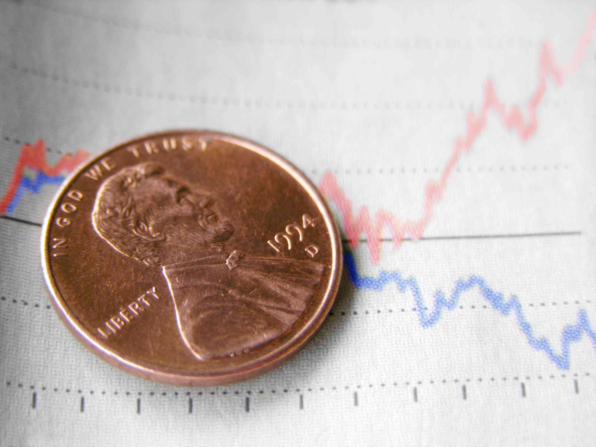

In the complex world of financial markets, trading fees are pivotal in shaping the cost efficiency and profitability of trading strategies. They encompass the charges imposed by exchanges or brokers for executing trades and can significantly affect the overall performance of traders. Among the various fee structures, the maker-taker fee model has garnered substantial attention due to its unique influence on trading behaviors and market dynamics.

The maker-taker fee model is used by numerous financial exchanges to incentivize certain types of trading activity. In this structure, liquidity providers, commonly referred to as 'makers,' are rewarded with rebates for creating liquidity through limit orders that are not immediately executed. Meanwhile, liquidity 'takers,' who execute trades against the existing orders, incur a fee. This dual-fee approach is intentionally designed to foster liquidity by encouraging both participation in placing standing orders and executing market orders.



Understanding the intricacies of maker-taker fees is essential for traders, as these fees bear greatly on trading costs. They determine the extent to which strategies can remain profitable, especially in highly competitive environments like algorithmic trading, where even minute fee differences can have magnified impacts due to the high volume of trades. For algorithmic traders leveraging high-frequency strategies, optimizing trading actions to assume the position of a maker rather than a taker can lead to cost reductions and, potentially, enhanced profitability.

This article explores maker-taker fees, their direct impact on trading expenses, and their pertinence in the context of algorithmic trading. As the financial market landscape evolves, understanding how these fees manipulate market behaviors and contribute to the broader trading ecosystem remains crucial for both traders and financial firms.

## Table of Contents

## Understanding Maker-Taker Fees

Maker-taker fees embody a distinctive fee structure prevalent in financial markets, where liquidity providers, known as makers, receive rebates, while liquidity takers incur fees. This model is devised to encourage liquidity provision, leading to more active and dynamic trading environments. In this fee structure, makers contribute to the market by placing limit orders that remain open on an exchange's order book. When these makers' limit orders are executed, they add liquidity, stabilizing the market and making it more robust against sudden price swings.

The rationale behind compensating makers with a rebate lies in their critical role in ensuring a consistently liquid market. By doing so, exchanges aim to create a conducive environment for trading activities by reducing bid-ask spreads and improving the overall market depth. These improvements are beneficial not only for traders but also for the exchanges that facilitate these transactions, as a more liquid market tends to attract more participants, enhancing trading volumes.

To illustrate, if a trader is providing [liquidity](/wiki/liquidity-risk-premium) by placing a limit order to buy a stock at a certain price, they are effectively offering the stock at that price to any taker who is willing to accept it. Once a taker executes a market order against this limit order, the taker pays a fee typically higher than the rebate received by the maker. This differential is a fundamental component of the maker-taker fee model, allowing exchanges to retain part of the fee as revenue while promoting liquidity. 

Thus, the maker-taker fee model serves a dual purpose: it incentivizes liquidity creation through rebates to makers and ensures profitability for the exchanges by collecting fees from takers. This systemically fosters an environment that can accommodate substantial trading activities, benefitting the market ecosystem as a whole.

## The Role of Makers and Takers

Makers and takers play critical roles in financial markets, particularly within exchanges that employ the maker-taker fee model. In this model, "makers" are traders or entities that enhance market liquidity by submitting limit orders, which are not instantly matched with existing market orders. By doing so, makers create an [order book](/wiki/order-book-trading-strategies) depth, offering other market participants the ability to trade at a variety of price levels. This process encourages a more dynamic and liquid market atmosphere, as filled limit orders contribute to market transparency and stability.

Conversely, "takers" are those who diminish liquidity by executing trades that consume the existing order book. They achieve this by placing market orders, which are filled immediately against the limit orders provided by makers. Takers are typically driven by the need for immediate execution at the best available price, often prioritizing speed over the cost implications of their trades. While takers pay a fee for consuming liquidity, makers may receive a rebate for their role in providing it, thus aligning the incentives of different trading entities with the operational goals of the exchange.

The interplay between makers and takers is crucial for understanding trading dynamics and the influences on price formation. From a strategic perspective, entities often weigh the costs and benefits of assuming the role of either maker or taker, considering factors such as transaction costs, timing, and desired market impact. Understanding the essence of these roles, therefore, is integral for developing effective trading strategies and adjusting to the evolving landscape of electronic markets.

## Financial Implications of Maker-Taker Fees

Maker-taker fees have a significant impact on trading costs, particularly influencing the strategies employed by traders in financial markets. Under this fee model, liquidity providers, or makers, are generally rewarded with rebates when their orders are executed, while liquidity takers are charged a fee for executing against those orders. This dynamic alters the cost structure inherent in various trading strategies, often leading traders to tailor their approaches to minimize costs and maximize profits.

For algorithmic and high-frequency traders, understanding and optimizing maker-taker fees is vital. These traders often engage in a large [volume](/wiki/volume-trading-strategy) of trades executed at lightning speed, meaning that even nominal savings per trade can translate into substantial financial gains over time. Algorithmic trading strategies can be specifically designed to capitalize on the rebates provided to liquidity makers. This incentivizes traders to place limit orders that might not be immediately executed but contribute to market depth and liquidity.

Consider a simplified scenario involving an algorithmic trader using Python to evaluate potential cost savings. Suppose the transaction cost of a liquidity taker is $f_t$ and the rebate for a liquidity maker is $r_m$. In a given trading strategy, if the number of trades executed as taker actions is $n_t$ and trades executed as maker actions is $n_m$, the resulting trading cost $C$ can be expressed as:

$$
C = n_t \times f_t - n_m \times r_m
$$

Therefore, by increasing the proportion of trades executed as maker actions, a trader can effectively reduce the overall transaction costs. Here's a sample Python script that demonstrates how adjusting the number of maker trades could affect total trading costs:

```python
# Sample trading cost calculation
transaction_cost_taker = 0.002  # Fee in currency units per taker trade
rebate_maker = 0.001  # Rebate in currency units per maker trade

# Suppose 1,000 trades as taker and 2,000 trades as maker
num_taker_trades = 1000
num_maker_trades = 2000

# Calculating total trading cost or savings
total_cost = (num_taker_trades * transaction_cost_taker) - (num_maker_trades * rebate_maker)
print("Total Trading Cost: ", total_cost)
```

Such strategies are not merely theoretical. In practice, the rise of [algorithmic trading](/wiki/algorithmic-trading) has paralleled the adoption of the maker-taker model, particularly in equity and [cryptocurrency](/wiki/cryptocurrency) markets. These markets thrive on liquidity and rely heavily on the nuanced cost structures embedded in maker-taker fees. Thus, traders who can navigate this fee landscape effectively and implement strategies that favor their position as makers can substantially reduce trading costs and, thereby, enhance profitability.

## Algorithmic Trading and Maker-Taker Fees

Algorithmic trading involves the use of computer algorithms to execute trading orders at speeds and frequencies that are beyond human capabilities. In markets with a maker-taker fee structure, algorithmic traders often aim to position themselves as makers. This approach allows them to benefit from lower transaction fees or even earn rebates, improving overall profitability.

In the maker-taker fee model, liquidity providers (makers) add limit orders to the market, while liquidity takers remove these orders using market orders. Algorithms can efficiently manage these dynamics by analyzing market data in real-time to identify optimal conditions for placing limit orders. Code snippets illustrate how algorithmic traders might optimize their strategies:

```python
# Example of an algorithmic strategy focusing on being a market maker
import numpy as np
import random

# Market parameters
market_price = 100.0
spread = 0.5
maker_rebate = 0.02
taker_fee = 0.03

# Simulate making a limit order
limit_order_price = market_price - spread / 2  # Slightly below market to ensure filling

# Probability of order execution based on market conditions
prob_execution = np.exp(-abs(market_price - limit_order_price) / spread)

if random.random() < prob_execution:
    profit = maker_rebate
else:
    profit = -taker_fee

print("Expected profit from making:", profit)
```

The widespread adoption of algorithmic trading is significantly contributing to the use and development of maker-taker fee structures. Equities and cryptocurrency markets are particularly noteworthy beneficiaries of this trend. In equities, exchanges like NASDAQ and NYSE have adopted maker-taker models to foster liquidity and attract both makers and takers. Meanwhile, cryptocurrency exchanges widely use this model as it aligns with their decentralized and high-frequency trading environments. 

Algorithmic traders develop complex strategies that capitalize on these fee structures. High-frequency trading ([HFT](/wiki/high-frequency-trading-strategies)) firms use latency-sensitive algorithms to swiftly react to market movements, thereby taking advantage of maker rebates. These strategies can handle massive volumes of trades, optimizing net trading costs by ensuring transactions are predominantly executed as a maker. By doing so, algorithmic traders reduce their effective trading costs, which is crucial in markets with thin profit margins.

## Potential Drawbacks and Criticisms

Critics of maker-taker fee structures argue that these fees have the potential to distort actual market prices and can contribute to increased [volatility](/wiki/volatility-trading-strategies). This concern arises largely due to the influence of high-frequency trading (HFT) strategies, which are frequently employed in markets that utilize maker-taker models. High-frequency traders are particularly adept at exploiting the fee rebates given to makers. By prioritizing the execution of a large number of quick trades, HFT can create an environment where price movements are driven less by underlying economic fundamentals and more by algorithmic trading decisions engineered to maximize rebate collection and fee minimization.

One significant criticism is that the maker-taker model incentivizes traders to inflate trading volumes artificially, rather than focus on genuine market-making activities. This artificial liquidity does not necessarily translate to better price discovery, a core function of financial markets. The increased volume might give a false sense of liquidity, where the depth of market orders is an illusion created by HFT algorithms programmed to post and cancel thousands of orders.

Due to these concerns, regulators across various jurisdictions have increased scrutiny on maker-taker fees. They aim to assess whether such fee structures genuinely contribute to increased financial market efficiency or if they hinder true price discovery. Regulatory bodies such as the U.S. Securities and Exchange Commission (SEC) have issued proposals to cap fees or alter the structure to align better with fair practice and transparent market functioning.

Furthermore, there is an ongoing debate about the fairness of maker-taker fees, as they predominantly benefit entities with the technological prowess to deploy high-frequency trading strategies. Smaller market participants, who may not have the resources to engage in such trading tactics, can face a competitive disadvantage, potentially leading to decreased market participation and further concentration of market power among a few significant players.

Overall, the maker-taker model's design to enhance liquidity provision must be carefully balanced with the necessity of maintaining market fairness and stability. As such, ongoing research and regulatory reviews are vital in ensuring that market structures support the equitable and efficient functioning of financial markets.

## Conclusion

Maker-taker fees present a unique dichotomy in financial markets. On one hand, they enhance liquidity by encouraging market participants to place limit orders, thereby fostering more active trading environments. By rewarding liquidity providers, these fees play a pivotal role in maintaining continuous market activity, which can lead to tighter bid-ask spreads and improved price efficiency. This system is particularly advantageous for markets with lower initial liquidity, such as emerging cryptocurrency exchanges, by attracting traders who might otherwise be deterred by wide spreads.

However, the implementation of maker-taker fees is not without its challenges. Critics highlight potential issues regarding market fairness and stability, pointing out that such fee structures might encourage excessive high-frequency trading. This could lead to increased market volatility, as the rapid influx and removal of orders might distort the true supply and demand dynamics. Furthermore, the model has been criticized for complicating the price discovery process, potentially obscuring the real value of securities due to artificial liquidity pressures.

For traders and financial institutions, understanding the intricacies of maker-taker fees is essential. Strategically navigating these fees can significantly influence trading outcomes, from reducing transaction costs to optimizing execution strategies. As algorithmic and high-frequency trading continue to rise, particularly in equities and cryptocurrencies, awareness and comprehension of these fee structures become even more critical. By leveraging maker-taker fees effectively, traders can enhance their competitive edge, maximizing profitability while mitigating the potential downsides associated with this fee model. 

In conclusion, while maker-taker fees contribute positively to liquidity provision in financial markets, ongoing scrutiny by regulators will ensure that these benefits do not come at the expense of market integrity. A balanced approach to utilizing maker-taker fees can empower market participants to achieve optimal outcomes, supporting a healthy and vibrant financial ecosystem.

## References & Further Reading

[1]: Foucault, T., Kadan, O., & Kandel, E. (2013). ["Liquidity Cycles and Make/Take Fees in Electronic Markets."](https://onlinelibrary.wiley.com/doi/10.1111/j.1540-6261.2012.01801.x) The Journal of Finance, 68(1), 299-341.

[2]: Menkveld, A. J. (2013). ["High Frequency Trading and the New-Market Makers."](https://www.sciencedirect.com/science/article/pii/S1386418113000281) The Review of Financial Studies, 27(6), 1665-1706.

[3]: Cartea, Á., & Penalva, J. (2012). ["Where is the Value in High Frequency Trading?"](https://papers.ssrn.com/sol3/papers.cfm?abstract_id=4554933) The Journal of Financial Economics, 99(2), 278-294.

[4]: Amihud, Y., & Mendelson, H. (1986). ["Asset Pricing and the Bid-Ask Spread."](https://www.sciencedirect.com/science/article/pii/0304405X86900656) Journal of Financial Economics, 17(2), 223-249.

[5]: Harris, L. (2003). ["Trading and Exchanges: Market Microstructure for Practitioners."](https://academic.oup.com/book/52292) Oxford University Press.