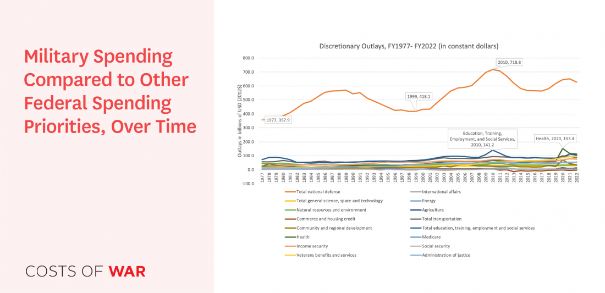

The relationship between military spending and economic growth is multifaceted and often contentious. On one hand, significant military outlays can catalyze economic investments and foster innovations. Throughout history, defense budgets have been a substantial source of funding for technological advancements, many of which have later found applications beyond military use. The defense sector's demand for advanced technologies stimulates research and development, creating industries and jobs that contribute to economic growth. These investments can lead to breakthroughs in areas such as aerospace, communications, and cybersecurity.

On the other hand, excessive military spending may divert resources from other crucial areas like education, healthcare, and infrastructure. This resource allocation challenge, often referred to as the "guns vs. butter" model, highlights the trade-offs between a nation's defense spending and its domestic needs. Such decisions can affect a country's long-term sustainable economic growth, as inadequate investment in social programs may hinder overall development.

In recent years, the landscape of economic analysis has evolved with the emergence of algorithmic trading. These automated trading systems, driven by sophisticated mathematical models and high-speed data processing, are reshaping financial markets. Understanding the economic impact of military budgets now requires a nuanced analysis that accounts for these modern financial dynamics. The way military spending influences macroeconomic indicators like national GDP, inflation, and technological advancements can be quite complex, especially when factoring in the fast-paced nature of financial markets influenced by algorithmic trading.

This article aims to explore these intricate connections, examining how defense budgets impact national economies and technological innovation, particularly through the lens of algorithmic trading. As nations allocate significant financial resources to defense, it becomes crucial to analyze the outcomes of such spending not only in terms of security but also in their broader economic implications. These insights will contribute to a more comprehensive understanding of how countries can balance these competing priorities to foster both national security and economic prosperity.

## Table of Contents

## Understanding Military Spending

Military spending, also known as defense expenditure, refers to the financial allocation by a government to maintain and enhance its military forces. This includes spending on personnel salaries, operations and maintenance, procurement of weapons and equipment, research and development, and infrastructure. Within national budgets, military spending serves the primary purpose of ensuring national security and protecting a country from external and internal threats. It also encompasses a country's strategic interests, extending its influence on the global stage, and sometimes, participating in international alliances and peacekeeping missions.

Historically, military spending has comprised a substantial portion of national budgets throughout the world. One notable instance was during World War II, when the United States significantly increased its military budget, which resulted in substantial economic activity and the emergence of the U.S. as a leading global military power. The Cold War era also saw heightened military expenditures, as countries like the United States and the Soviet Union engaged in an arms race that focused on nuclear and conventional weaponry.

Factors influencing a country's military spending decisions include perceived threats, geopolitical dynamics, historical rivalries, and domestic politics. For instance, a country facing a direct military threat may prioritize defense spending to strengthen its offensive and defensive capabilities. Geopolitical considerations, such as alliances through NATO or regional security systems, can also necessitate higher defense budgets to meet allied expectations and commitments.

Domestic factors, such as political leadership and economic conditions, play a significant role as well. Governments with strong military-industrial complexes might exhibit higher military spending due to the influence of defense contractors and labor unions associated with defense industries. Conversely, during periods of economic downturn or fiscal austerity, a government might opt to decrease military spending to reallocate resources toward economic recovery or social programs.

Inflation, technological advancements, and population size are additional factors that can impact the scale of military expenditure. As new technologies emerge, countries may invest heavily to modernize their forces, which can further influence budgetary allocations. Understanding these dynamics is crucial in grasping the broader implications of military spending on national and global scales.

## Economic Impacts of Military Spending

Military expenditures significantly impact both national deficits and Gross Domestic Product (GDP). These expenditures are a substantial part of government budgets, influencing economic indicators across the board. Military spending can lead to increased national deficits if financed through borrowing rather than reallocating existing resources or increasing taxes. When a government chooses to finance military spending through debt, it enlarges the national deficit, impacting long-term fiscal sustainability. However, in cases where it boosts demand for domestically produced goods and services or creates employment through military contracts, it can result in short-term GDP growth. 

The "{\textbf{guns vs. butter}}" model illustrates the trade-offs between national defense and civilian goods production. This model helps explain the opportunity costs of allocating resources to military spending instead of social programs, public infrastructure, or education. When a government decides to increase military budgets, it can lead to a reduction in funding or growth potential in other areas, posing long-term socio-economic challenges. Thus, a balance is necessary to optimize the allocation of resources to ensure holistic national growth.

Military spending can foster economic growth by stimulating technological advancements and creating jobs. Defense industries fuel substantial innovation due to their demand for cutting-edge technology, which can have commercial applications beyond the military context. For example, technologies initially developed for military use, such as the internet and GPS, have since driven significant economic innovation and growth worldwide.

Job creation is another avenue through which military spending can impact economic growth. Investments in defense sectors can lead to direct employment in military and defense manufacturing industries and indirect employment in supporting sectors. This employment generation can bolster economic growth, particularly in regions heavily reliant on defense contracts.

To mathematically model the relationship, consider the GDP function:

$$
GDP = C + I + G + (X - M)
$$

where $C$ stands for consumption, $I$ for investment, $G$ for government spending, and $(X - M)$ for net exports. Within this framework, an increase in military spending ($G$) can raise GDP in the short term. However, the efficiency of this growth depends on the multiplier effect of military expenditures compared to alternative uses of government resources.

While the direct impacts of military spending can inflate GDP and spur technological growth, the opportunity costs must be evaluated to measure overall economic health. Sustainable long-term economic growth requires a balanced approach to resource allocation, minimizing negative impacts on deficit, while maximizing the beneficial spillovers of technological advancements and job creation spurred by military investments.

## Algorithmic Trading and Defense Budgets

Algorithmic trading, the use of computer algorithms to execute trading strategies at speeds and frequencies that human traders cannot achieve, has become a significant component of financial markets. This form of trading leverages advanced mathematical models and high-speed data analysis to make trading decisions. Its growth has been fueled by technology improvements, many of which have their roots in military developments.

A prime influence of military advancements on [algorithmic trading](/wiki/algorithmic-trading) is evident in computing power and data processing. For instance, technologies such as parallel computing and advanced [machine learning](/wiki/machine-learning) algorithms, initially developed or refined for military applications, have been adapted for use in financial markets. High-frequency trading ([HFT](/wiki/high-frequency-trading-strategies)), a subcategory of algorithmic trading, benefits from these technologies by executing a large number of trades in fractions of a second, a capability that has reshaped market dynamics.

One specific example of technology transferring from military to financial markets is the Global Positioning System (GPS). Originally designed for military navigation, GPS technologies are now crucial in ensuring synchronization of time stamps across trading systems, which is essential for the accuracy and efficiency of algorithmic trading operations. 

Another example is the development of secure communication protocols. The need for secure and fast communication in military operations has led to the development of encryption technologies. These protocols are now employed to ensure the secure transmission of financial data, a critical aspect of maintaining the integrity of trading algorithms.

Additionally, signal processing technologies, which were enhanced by military-funded research for radar and communications applications, now assist in analyzing market data patterns with increased accuracy and speed. This capacity allows for better prediction models in algorithmic trading, enhancing their performance and reliability.

In summary, many technological advancements that originated within military domains have found transformative applications within the sphere of algorithmic trading, helping to drive innovation and efficiency in financial markets. These cross-domain influences underscore the interconnected nature of military efforts and economic sectors, highlighting the significance of military contributions to technological progress in various industries.

## Case Studies: Military Spending and Economic Growth

### Case Study 1: Impact of Military Spending on the US Economy

The United States has historically maintained one of the highest military budgets globally. This expenditure can have multifaceted impacts on the economy. On one hand, military spending leads to job creation, advancements in technology, and enhances military capabilities. The defense sector is a significant employer, providing jobs for millions of Americans, both directly within the armed forces and indirectly through defense contracts with private companies. This can stimulate economic activity, particularly in sectors such as aerospace, manufacturing, and engineering.

However, high levels of military spending can also lead to increased national deficit. According to the Stockholm International Peace Research Institute (SIPRI), the U.S. allocated about $778 billion to its military budget in 2020, accounting for approximately 3.7% of its GDP. While such spending supports economic vitality through various channels, it also raises concerns about opportunity costs. Funds directed toward defense could be alternatively utilized for social programs, infrastructure, or education, potentially fostering long-term economic growth through improved human capital and public goods.

### Case Study 2: Analysis of China’s Military Budget and Economic Strategy

China's military spending has progressively increased as the nation endeavors to enhance its global standing and military capabilities. The nation's military budget, while substantial, remains significantly lower than the U.S. in absolute terms. In 2020, China's defense spending was estimated to be around $252 billion, equivalent to 1.7% of its GDP. China's strategy involves not only enhancing its military infrastructure but also integrating military advancements into economic development initiatives.

China's economic strategy involves the dual-use technology model, where military technologies are adapted for civilian use. The development of sectors like telecommunications, satellite navigation, and high-tech manufacturing exemplifies this approach. By embedding military innovations within the wider economy, China aims to bolster its industrial base, fostering technological advancement and economic resilience.

### Case Study 3: Effects of Military Spending on Emerging Economies with Limited Resources

Emerging economies with constrained resources face unique challenges in balancing military spending with essential development needs. High military expenditures in these countries can strain limited financial resources, diverting funds away from critical areas such as health, education, and infrastructure. Countries like Nigeria and Pakistan allocate a sizable portion of their national budgets to defense, often at the expense of social development.

While military spending may be justified by the need for national security and stability, excessive defense allocations can hinder social and economic progress. These nations struggle with the 'guns vs. butter' dilemma, where the opportunity cost of military spending is high, potentially exacerbating poverty and inequality. Moreover, without significant technological and industrial capacity, these countries may not experience the same economic benefits from military expenditures that more developed economies can leverage. 

In conclusion, while military spending can stimulate certain economic sectors, it is crucial for nations, particularly those with limited resources, to carefully evaluate and optimize their defense allocations to ensure sustainable economic growth and development.

## Challenges and Criticisms

The allocation of funds between military spending and social programs often sparks debate among economists, policymakers, and the general public. This debate centers on the opportunity costs associated with defense budgets, where investing in military capabilities may detract from funding essential social programs, such as education, healthcare, and infrastructure development. Critics argue that excessive military expenditures could undermine long-term economic development and social welfare by diverting resources from areas that could yield higher societal benefits.

From an economic development perspective, military spending has faced criticism for its limited capacity to generate sustainable economic growth compared to investments in human capital and infrastructure. The "guns vs. butter" model, a classic economic theory, illustrates this trade-off by highlighting the necessity for governments to prioritize between military and civilian goods. Military spending often creates short-term economic boosts through job creation and technological advancements. However, these benefits are mediated by the potential long-term drawbacks of increased national debt and reduced public spending.

Furthermore, ethical considerations surface when defense spending is prioritized over other public needs. Allocating substantial national budgets to military endeavors can result in the neglect of urgent social issues, such as poverty, education disparity, and healthcare inadequacies. Critics argue that a state's responsibility should encompass improving the quality of life for its citizens through balanced resource allocation. Ethical discourse suggests that an aggressive defense budget could be viewed as neglecting moral obligations toward equitable economic distribution and ensuring basic human rights.

In evaluating military expenditures, it is crucial to consider these criticisms and construct defense budgets that align strategically with a nation's broader socio-economic goals. The challenge lies in achieving a balance that addresses national security concerns while optimizing resource distribution for broader societal advancement. As such, policymakers are tasked with navigating the complex landscape of defense funding to strike a balance that promotes both national security and societal development.

## Future Directions

Global military spending is poised to undergo notable changes driven by geopolitical, economic, and technological factors. An important potential shift is the increasing allocation of defense budgets toward cyber capabilities and unmanned systems. Nations are recognizing the need to fortify their cyber defenses amidst escalating cyber threats, which act as catalysts for reallocating traditional military expenditures. Additionally, innovations such as unmanned aerial vehicles (UAVs) and autonomous systems are attracting more investment, reflecting a shift from conventional troop deployments to technology-based defense strategies.

Algorithmic trading is playing a growing role in reshaping economic impacts of defense budgets. By applying sophisticated algorithms, financial markets can better interpret and react to defense expenditure announcements and geopolitical tensions. The real-time analysis facilitated by algorithmic trading allows for quicker adjustments in defense-related company valuations, impacting stock prices and market sentiment. Furthermore, advanced data analytics, originally developed for military applications, are now integral to algorithmic trading. Machine learning and [artificial intelligence](/wiki/ai-artificial-intelligence), grounded in past military research and operations, enable these algorithms to process vast datasets efficiently, thus influencing market dynamics more profoundly.

Future technological innovations driven by military research are expected to follow two primary trajectories: enhancement of existing technologies and breakthroughs in new domains. Enhancements in existing technologies could include the development of more sophisticated missile defense systems and stealth technologies. On the frontier of new domains, breakthroughs are anticipated in fields like quantum computing and artificial intelligence. These areas hold the potential to revolutionize communications, cryptography, and strategic planning, thereby exerting significant influence on both military operations and civilian applications. Predictive analytics and automated decision-making in defense strategies could benefit substantially from such advancements.

In summary, the future of global military spending and its economic impacts is intricately linked to the advancement of technology and the strategic implementation of algorithmic trading. As defense budgets evolve, so too will the broader technological landscape, offering opportunities and challenges for national and global economic stability.

## Conclusion

Military spending functions as both a catalyst for economic development and a substantial consumer of national resources. The dual nature of defense budgets reflects their complex impact on economic dynamics. On one hand, military expenditures can drive technological progress and job creation, serving as a vehicle for economic growth. The development and procurement of defense technologies often have spillover effects, leading to innovations in the civil sector and boosting industries beyond the military domain. Historical evidence shows that military investments have led to advancements that germinate entirely new markets and elevate national productivity.

Conversely, the consumption of resources by military budgets can divert funds from essential social programs such as healthcare, education, and infrastructure. The opportunity cost of defense spending, often framed within the "guns vs. butter" economic model, highlights the trade-off between national security and other welfare-enhancing expenditures. The challenge lies in striking a balance; an optimal allocation of military funds is crucial to maintaining a scaffold for sustainable economic growth without imposing unnecessary strain on other sectors.

Achieving this balance requires an ongoing analysis and adjustment of defense budgets to align with the national economic context and strategic needs. Continued research into how military spending can be optimized will provide insights into how nations can harness defense expenditures for broader economic benefits while managing the inherent resource limitations. Furthermore, integrating advanced economic modeling, potentially enhanced by algorithmic trading insights, offers a strategic tool for policymakers to forecast the broad impacts of defense budgets.

In conclusion, the dual role of military spending necessitates a nuanced understanding of its potential and pitfalls. By maintaining a balanced approach that optimizes expenditures, national economies can benefit from the positive contributions of defense budgets while mitigating their resource-consuming aspects. Encouraging robust research and adaptive strategic planning will support more informed decision-making and ensure that defense spending aligns with long-term economic goals.

## References & Further Reading

[1]: Smith, R. P. (2009). ["Military Expenditure and Growth."](https://www.tandfonline.com/doi/full/10.1080/10242690500167791) In D. L. Braddon & K. Hartley (Eds.), Handbook on the Economics of Conflict.

[2]: Dunne, J. P., & Tian, N. (2015). ["Military Expenditure and Economic Growth: A Survey."](https://www.semanticscholar.org/paper/Military-expenditure-and-economic-growth%3A-A-survey-Dunne-Tian/506f866f5921827998d1ae872984820e2333c6f0) Journal of Economic Surveys, 29(5), 829-855.

[3]: Tang, A. K. (2011). ["Military Expenditure and Economic Growth in Developing Countries: Evidence from System GMM Estimates."](https://www.tandfonline.com/doi/pdf/10.1080/10242694.2012.710813) Journal of Peace Research, 48(6), 735-745.

[4]: Stockholm International Peace Research Institute (SIPRI). ["Military Expenditure Database."](https://www.sipri.org/databases/milex)

[5]: Alper, F. O., & Dincer, H. (2011). ["The Effects of Military Expenditure on Economic Growth: The Case of the Middle Eastern Countries and Turkey."](https://pmc.ncbi.nlm.nih.gov/articles/PMC8685361/) Transition Studies Review, 18(2).

[6]: "The Economics of Defense Spending: A Homeland Security Perspective" by Anthony H. Cordesman and Erin K. Fitzgerald. Center for Strategic and International Studies (CSIS).