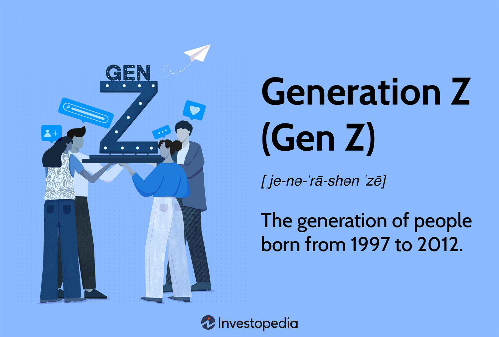

The millennial generation, born between 1981 and 1996, has emerged as a significant force in the global economy, distinguished by their distinctive consumer behaviors and spending patterns. These behaviors are shaped by a confluence of economic challenges, such as the Great Recession, student debt burdens, and housing market fluctuations, alongside the rapid advancement of digital technologies that permeate their daily lives. As digital natives, millennials have seamlessly integrated technology into all facets of their consumer behavior, from how they gather information to how they make purchasing decisions. Consequently, businesses aiming to tap into this vital market segment must develop a nuanced understanding of these behaviors and preferences.

Millennials’ inclination towards digital solutions is prominently reflected in their investment habits, particularly in the context of algorithmic trading, commonly known as algo trading. This investment strategy, which uses computer algorithms to automatically execute trades, appeals to millennials due to their familiarity and comfort with technology, as well as their desire for efficiency and potential for better returns in finance. The tech-savvy nature of this generation makes them more receptive to automated financial solutions, driving the evolution of conventional investment practices and compelling financial service providers to innovate and refine their offerings.

In this article, the exploration includes an examination of millennial consumer habits, the prevailing market trends influencing these behaviors, and the burgeoning role of algorithmic trading as a preferred investment strategy. This understanding is crucial for businesses aiming to capture the millennial market effectively and for anticipating the shifting dynamics as this generation matures further. Whether through embracing technological advancements or aligning with millennial values such as sustainability and authenticity, businesses that adapt to these trends are likely to succeed in securing loyalty from this influential demographic.

## Table of Contents

## Who Are the Millennials?

Millennials, also known as Generation Y, comprise individuals born between 1981 and 1996, a cohort that has grown up amidst rapid technological advancements and the rise of the internet. As digital natives, they have adapted seamlessly to the continual evolution of technology, which significantly shapes their consumer behavior. This generation prefers convenience and accessibility, often gravitating toward digital channels for their shopping needs. This inclination is evident in their frequent use of e-commerce platforms, mobile applications, and other tech-driven solutions that simplify the shopping process. 

Social connections and authenticity play critical roles in millennials' interactions with brands. They tend to favor companies that reflect genuine values and ethical practices, which aligns with their broader social and environmental consciousness. As such, brand ethics stand as a pivotal [factor](/wiki/factor-investing) in their decision-making processes. Millennials were among the first to leverage social media platforms and online reviews extensively to inform their purchasing decisions. They typically research products through peer feedback and user-generated content, valuing the opinions of others like themselves over traditional advertising.

Despite facing notable financial constraints, such as those presented by the Great Recession and burgeoning student loan debt, millennials remain a powerful market segment with significant spending power. Their financial decisions are often carefully considered, as evidenced by their meticulous approach to online research and propensity to spend on brands that match their ethical and experiential preferences. Consequently, understanding and catering to millennial values and buying behavior is imperative for businesses looking to capture this lucrative demographic.

## Millennial Consumer Behavior

Millennial consumer behavior is notably shaped by the pervasive influence of digital technology, fostering unique purchasing patterns that set them apart from previous generations. This cohort extensively utilizes online resources for research before making buying decisions, placing high importance on peer feedback and reviews. This reliance on digital platforms enhances their capability to make informed choices, underscoring the significance of transparency in brand communications.

Experiential consumption is a driving force behind millennial spending habits. Millennials prioritize experiences, such as travel, dining, and entertainment, over material possessions. This inclination influences their preference for brands that offer or enhance experiences, notably those aligning with values of quality and ethical production. The rise of experience-driven spending reflects a shift toward valuing the emotional and aspirational aspects of consumption.

Health and wellness have emerged as significant areas of investment for millennials, influencing their purchasing decisions across various sectors, including food, fitness, and lifestyle products. This emphasis on personal well-being is reflective of a broader cultural trend that prioritizes mental and physical health, which in turn affects consumer choices in favor of products perceived as healthy and sustainable.

As millennials advance through different life stages, such as starting families or advancing in their careers, their priorities naturally evolve. This maturation process affects their consumer behavior, driving a shift towards products and services that support growing family needs or facilitate work-life balance. As they transition into these stages, their focus may increasingly include financial services and home-related products.

Social media plays a crucial role in shaping millennial brand loyalty. Brands that engage authentically with their audience through social media platforms can create stronger connections and foster loyalty. Millennials value interactions with brands that are transparent, honest, and engage in meaningful dialogues that resonate with their values. This generation's inclination towards social media underscores the importance for brands to maintain a robust and genuine online presence to effectively engage with their millennial audience.

## Market Trends Influencing Millennial Consumers

Sustainability plays a pivotal role in influencing millennial consumers, with this generation placing a stronger emphasis on environmentally and socially responsible brands compared to their predecessors. Studies show that millennials are more likely to support businesses that prioritize eco-friendly practices, reflecting a shift in consumer priorities towards sustainability. According to Nielsen, 73% of millennials are willing to pay more for sustainable goods, a sentiment mirrored in their preference for brands demonstrating genuine commitment to environmental stewardship.

Technological advancements have significantly transformed shopping habits, with millennial consumers favoring tech-driven convenience. The proliferation of smartphones and mobile applications has facilitated seamless online shopping experiences, aligning with millennials' desire for efficiency and accessibility. Data from Statista indicates that around 67% of millennials prefer online shopping due to the convenience it offers, underscoring the importance of e-commerce and mobile-friendly platforms in capturing this market segment.

Experiential consumption is a defining trend among millennials, who prioritize experiences over material possessions. This shift in value has monumental implications for the travel and leisure industries, which have seen increased demand as millennials seek unique and memorable experiences. The rise of services like Airbnb and experiential travel packages highlights this preference, illustrating a significant market shift from product-driven to experience-driven consumption.

Quality over quantity is another market trend marked by an increased interest in premium products among millennials. This preference indicates a discerning consumer base that values durability, craftsmanship, and authenticity over sheer [volume](/wiki/volume-trading-strategy). A report by Deloitte notes that millennials are driving the demand for higher quality products, impacting sectors such as fashion, electronics, and automotive, where premium offerings are gaining traction.

Diversity and inclusion are integral to the brands that resonate with millennial consumers. This generation values representation and equality, and they support brands that reflect and celebrate diverse identities and perspectives. Companies that have embraced inclusive practices and represent a broad spectrum of communities in their marketing efforts tend to attract a more loyal millennial customer base. Brands like Nike and Dove, which have launched inclusive and diverse advertising campaigns, continue to see positive engagement from millennials, illustrating the critical role of these values in shaping consumer preferences.

## The Rise of Algorithmic Trading

Algorithmic trading, commonly known as algo trading, represents a dynamic advancement in financial markets, leveraging computer algorithms to automate trading decisions. Among millennials—individuals born between 1981 and 1996—this method has gained significant traction. This tech-savvy generation, accustomed to rapid technological innovations, is drawn to algo trading for its notable efficiency, speed, and potential for higher returns.

Unofficially coined as the internet generation, millennials are familiar with digital tools and platforms, therefore naturally gravitating towards self-directed trading solutions that offer comprehensive analytical capabilities. Algorithmic trading perfectly aligns with these preferences. It enables traders to execute orders based on pre-set rules involving timing, price, or complex mathematical models. As a result, trades are executed at speeds unattainable by human intervention, optimizing profit potential while reducing transaction costs.

The burgeoning interest among millennials has prompted financial service providers to tailor their offerings accordingly. User-friendly platforms equipped with intuitive interfaces and analytical tools are now widely available. These platforms frequently feature drag-and-drop interfaces, allowing users to construct trading algorithms without the need for deep programming knowledge. Such innovations are broadening the accessibility of algo trading, aligning with millennials' preference for technology-integrated solutions.

Algorithmic trading also serves as a democratizing force in the investment world. Previously a domain preserved for financial institutions and hedge funds, advanced trading technologies are now accessible to individual traders. This shift is substantial, as it empowers millennials to compete on a more equal footing with institutional investors, using sophisticated tools and strategies to potentially enhance their returns.

An essential part of this democratization process involves the increasing availability of educational resources. Online courses, webinars, and forums related to algo trading are proliferating, providing millennials with the knowledge required to navigate this complex field effectively. Platforms like Coursera, Khan Academy, and Udemy offer courses that cover the basics of [algorithmic trading](/wiki/algorithmic-trading), while more advanced topics can be pursued through formal education and certifications.

In summary, the rise of algorithmic trading exemplifies the intersection of technological innovation and evolving consumer preferences. By harnessing algo trading capabilities, millennials are not only transforming their personal investment strategies but also influencing broader financial market trends. Businesses and financial institutions that anticipate and respond to these changes are well-positioned to thrive in this new landscape.

## Conclusion

Millennials represent a significant and influential consumer segment with distinct behaviors and preferences that have been shaped by economic challenges and digital advancements. This generation seeks experiences over material goods, prioritizes sustainability, and places high value on authenticity and transparency from brands. Businesses that align with these values, particularly those emphasizing sustainable practices and genuine engagement, are more likely to earn millennial loyalty.

In finance, technological integration, exemplified by algorithmic trading, is reshaping millennials' investment approaches. Algo trading offers efficiency, speed, and access to advanced financial tools, which is appealing to a tech-savvy demographic keen on optimizing investment strategies. As millennials increasingly adopt these technological advancements, they demonstrate a shift in investment habits that is likely to influence broader market trends.

Staying informed about the evolving preferences of millennials is vital for businesses aiming for long-term success. This entails not only understanding their current behaviors but also anticipating future shifts as millennials continue to mature and their priorities evolve. The ongoing impact on market dynamics is substantial, requiring a proactive approach from companies to adapt to these changes and harness the potential of engaging effectively with this powerful consumer group.

## References & Further Reading

[1]: Howe, N., & Strauss, W. (2000). ["Millennials Rising: The Next Great Generation"](https://books.google.com/books/about/Millennials_Rising.html?id=To_Eu9HCNqIC). Vintage Books.

[2]: Dholakia, U. M. (2019). ["How the Millennial Generation is Transforming Employee Benefits and Wellness Programs"](https://pubmed.ncbi.nlm.nih.gov/25181813/). Marketing Science.

[3]: Nielsen (2015). ["Global Corporate Sustainability Report"](https://s3-us-west-2.amazonaws.com/ungc-production/attachments/cop_2015/182381/original/UN_Global_Rapport_2015_CJN.pdf?1439536845).

[4]: Deloitte (2018). ["2018 Gen Z and Millennial Survey"](https://www2.deloitte.com/content/dam/Deloitte/global/Documents/About-Deloitte/gx-2018-millennial-survey-report.pdf).

[5]: Kissell, R. (2013). ["The Science of Algorithmic Trading and Portfolio Management"](https://www.sciencedirect.com/book/9780124016897/the-science-of-algorithmic-trading-and-portfolio-management). Academic Press.

[6]: Statista (2020). ["Millennials: online shopping preference worldwide 2020"](https://www.statista.com/topics/11087/gen-z-online-shopping-behavior/).

[7]: Roose, K. (2019). ["How Millennials Became The Burnout Generation"](https://www.buzzfeednews.com/article/annehelenpetersen/millennials-burnout-generation-debt-work). The New York Times.

[8]: Lopez de Prado, M. (2018). ["Advances in Financial Machine Learning"](https://www.amazon.com/Advances-Financial-Machine-Learning-Marcos/dp/1119482089). Wiley. 

[9]: PwC. (2016). ["Millennials at Work: Reshaping the Workplace"](https://www.pwc.com/gx/en/financial-services/publications/assets/pwc-millenials-at-work.pdf).