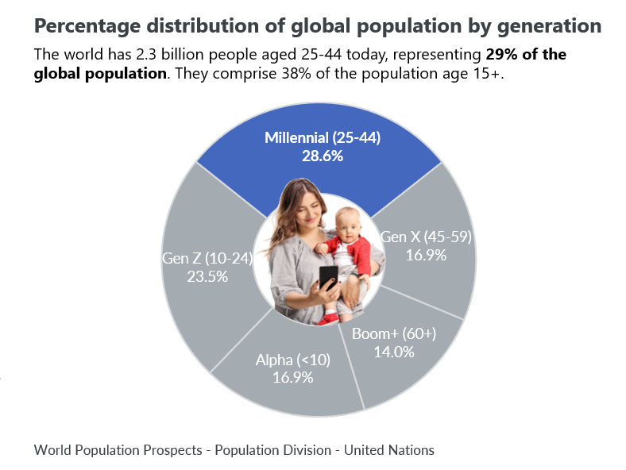

## Table of Contents

## What defines a millennial consumer?

A millennial consumer is someone born between the early 1980s and the mid-1990s. They grew up with technology and the internet, so they are very comfortable using digital devices and social media. This generation values experiences over material things and often prefers to spend money on travel, concerts, or dining out rather than buying stuff.

Millennials care a lot about social issues like the environment, equality, and fair trade. They like to buy from companies that share their values and are transparent about their practices. They are also more likely to research products online and read reviews before making a purchase. This makes them a savvy group of consumers who want to make informed choices.

## How do millennial consumers differ from previous generations in their buying habits?

Millennial consumers, born between the early 1980s and mid-1990s, have different buying habits compared to older generations like Baby Boomers and Gen X. Millennials grew up with the internet and technology, so they are very comfortable shopping online and using digital tools to research products. They often read reviews and compare prices before buying something. This is different from older generations who might prefer going to physical stores and making decisions based on what they see and touch.

Another big difference is what millennials value when they spend money. They care more about experiences than owning things. So, they might spend more on travel, concerts, or eating out rather than buying a new TV or car. Millennials also pay attention to social issues like the environment and equality. They want to buy from companies that are ethical and transparent. This is different from older generations who might focus more on the price and quality of a product without looking at the company's values.

Overall, millennial consumers are more digital, experience-focused, and socially conscious than previous generations. Their buying habits reflect a shift towards a more connected and value-driven approach to consumption.

## What are the key values and priorities that influence millennial purchasing decisions?

Millennial consumers, born between the early 1980s and mid-1990s, value experiences over owning things. They like to spend money on travel, concerts, and eating out instead of buying new stuff. This is because they grew up with the internet and technology, which made them see the world in a different way. They want to make memories and enjoy life, not just collect things.

Another big thing for millennials is caring about social issues. They want to buy from companies that are good for the environment, treat their workers fairly, and support equality. They look for brands that are honest about how they do business. Millennials will often check a company's values before they buy anything. This shows they want their money to help make the world a better place.

Millennials also use the internet a lot when they shop. They read reviews and compare prices online before they decide to buy something. They are careful and want to make smart choices. This is different from older generations who might just go to a store and buy what they see. Millennials want to know everything about a product before they spend their money.

## How has the rise of digital technology affected millennial consumer behavior?

The rise of digital technology has really changed how millennial consumers behave. Millennials grew up with the internet and smartphones, so they feel very comfortable using these tools for shopping. They often look for products online, read reviews, and compare prices before they decide to buy something. This means they are careful shoppers who want to make smart choices. They also like to use social media to find out about new products and see what their friends think.

Another big change is that digital technology makes it easy for millennials to buy things from anywhere in the world. They can shop from home, at work, or even while they're on the go. This has made them more likely to buy things online instead of going to physical stores. It's also made them more aware of different brands and products, because they can see what's available in other countries. Overall, digital technology has made millennial consumers more informed, connected, and likely to shop online.

## What role does social media play in the purchasing decisions of millennials?

Social media is a big part of how millennials decide what to buy. They use it to find out about new products and see what other people think. They look at reviews and posts from their friends to see if something is good or not. If a lot of people they know like a product, they are more likely to buy it. This makes social media a powerful tool for companies to reach millennials and show off their products.

Millennials also share their own experiences on social media. If they buy something and like it, they might post about it and tell their friends. This can make other people want to buy the same thing. On the other hand, if they have a bad experience, they might warn others not to buy it. This is why companies need to be careful and make sure their products are good, because millennials can spread the word quickly on social media.

## How do millennials respond to traditional advertising versus newer marketing strategies?

Millennials don't like traditional advertising as much as older people do. They grew up with the internet and are used to skipping ads on TV or ignoring them in magazines. They think traditional ads are annoying and don't trust them as much. Instead of watching a TV commercial, they might look up a product online to see what other people say about it.

Newer marketing strategies work better with millennials. They like it when companies use social media to talk to them. They pay attention to ads that are shared by their friends or influencers they follow. They also like it when companies are honest and show their values. For example, if a company cares about the environment, millennials might be more likely to buy from them. These new ways of marketing feel more personal and real to millennials, so they respond better to them.

## What are the most effective ways to engage millennial consumers in brand loyalty programs?

To engage millennial consumers in brand loyalty programs, it's important to make the program feel personal and rewarding. Millennials like it when companies know who they are and what they like. So, a good loyalty program should use data to give them special offers and rewards that match their interests. For example, if a millennial often buys coffee, the program could give them a free coffee after a certain number of purchases. This makes them feel valued and more likely to keep coming back.

Another way to engage millennials is by making the loyalty program easy to use on their phones. Millennials are always on their smartphones, so a mobile app for the loyalty program can make it simple for them to join and use. The app should be easy to navigate and let them track their rewards and see new offers. Also, using social media to share the program and let them earn rewards by sharing with friends can make it more fun and engaging. This way, the loyalty program becomes a part of their daily life and helps build a strong connection with the brand.

## How do sustainability and ethical considerations impact millennial consumer choices?

Millennials care a lot about the environment and how companies treat people. When they shop, they think about if the product is good for the earth or if it was made in a fair way. They want to buy from companies that care about these things too. If a company is bad for the environment or treats workers badly, millennials will often choose not to buy from them. They like to support brands that are honest about their practices and work to make the world a better place.

This focus on sustainability and ethics changes what millennials buy. They might pay more for a product if they know it's good for the planet or if the company treats its workers well. They read up on a company's values and look for certifications like "fair trade" or "organic." By choosing to buy from ethical and sustainable brands, millennials feel like they are making a difference with their money. This makes them loyal to brands that share their values and helps drive companies to be more responsible.

## What are the economic impacts of millennial consumer trends on various industries?

Millennial consumer trends have big effects on many industries. They like to spend money on experiences like travel and eating out, so the travel and restaurant industries are doing well. These industries have to make their services fun and shareable on social media to attract millennials. On the other hand, industries that sell things like cars and big TVs are not doing as well. Millennials don't want to buy these things as much because they care more about experiences and saving money.

Another impact is that millennials care about the environment and how companies treat people. This makes industries like fashion and food change how they do things. They have to be more sustainable and ethical to keep millennial customers. For example, clothing companies are using more eco-friendly materials and being more open about where their clothes come from. Food companies are also trying to be more sustainable and fair to their workers. If they don't, millennials might not buy from them, which can hurt their business.

## How can businesses adapt their products and services to better meet the needs of millennial consumers?

Businesses can adapt their products and services to better meet the needs of millennial consumers by focusing on digital experiences. Millennials grew up with the internet and smartphones, so they like to shop online and use apps. Companies should make sure their websites and apps are easy to use and have good customer reviews. They should also use social media to talk to millennials and show off their products. If a business can make shopping fun and easy on a phone, millennials will be more likely to buy from them.

Another way businesses can adapt is by caring about the same things millennials care about, like the environment and treating people fairly. Millennials want to buy from companies that are good for the planet and treat their workers well. So, businesses should be open about how they make their products and try to be more sustainable. They can also offer products that are eco-friendly or support fair trade. By showing they care about these issues, businesses can build trust with millennials and make them want to keep buying their products.

## What are the long-term implications of millennial consumer behavior on global markets?

Millennial consumer behavior is changing how businesses work all over the world. They like to spend money on experiences like travel and eating out instead of buying big things like cars. This means industries that offer fun experiences are growing, while those that sell big items might struggle. Companies need to be ready for this change and offer more experiences to keep millennials interested. Also, because millennials care about the environment and fairness, businesses everywhere have to be more sustainable and treat people well. If they don't, they might lose millennial customers, which could hurt their business a lot.

In the long run, these changes could make the world a better place. As more companies try to be good for the environment and fair to workers, it could help solve big problems like climate change and inequality. But it also means that businesses that don't change might have a hard time. They will need to think about what millennials want and adjust their products and services. This could lead to new kinds of products and ways of doing business that are better for everyone.

## How can companies use data analytics to predict and respond to millennial consumer trends?

Companies can use data analytics to understand what millennial consumers like and want. They can look at information from social media, online shopping, and customer feedback to see what millennials are buying and talking about. This helps them see patterns and predict what millennials might want next. For example, if a lot of millennials are posting about eco-friendly products, a company can use this data to make more of those products. By using data, companies can stay ahead of trends and make things that millennials will like.

Once companies know what millennials want, they can change their products and services to match those needs. They can use data to make special offers and rewards that millennials will enjoy. For example, if data shows that millennials like to shop on their phones, a company can make a better mobile app. They can also use data to see if their changes are working and keep improving. This way, companies can keep millennial customers happy and loyal by always giving them what they want.

## References & Further Reading

[1]: Howe, N., & Strauss, W. (2000). ["Millennials Rising: The Next Great Generation"](https://books.google.com/books/about/Millennials_Rising.html?id=To_Eu9HCNqIC). Vintage Books.

[2]: Dholakia, U. M. (2019). ["How the Millennial Generation is Transforming Employee Benefits and Wellness Programs"](https://pubmed.ncbi.nlm.nih.gov/25181813/). Marketing Science.

[3]: Nielsen (2015). ["Global Corporate Sustainability Report"](https://s3-us-west-2.amazonaws.com/ungc-production/attachments/cop_2015/182381/original/UN_Global_Rapport_2015_CJN.pdf?1439536845).

[4]: Deloitte (2018). ["2018 Gen Z and Millennial Survey"](https://www2.deloitte.com/content/dam/Deloitte/global/Documents/About-Deloitte/gx-2018-millennial-survey-report.pdf).

[5]: Kissell, R. (2013). ["The Science of Algorithmic Trading and Portfolio Management"](https://www.sciencedirect.com/book/9780124016897/the-science-of-algorithmic-trading-and-portfolio-management). Academic Press.

[6]: Statista (2020). ["Millennials: online shopping preference worldwide 2020"](https://www.statista.com/topics/11087/gen-z-online-shopping-behavior/).

[7]: Roose, K. (2019). ["How Millennials Became The Burnout Generation"](https://www.buzzfeednews.com/article/annehelenpetersen/millennials-burnout-generation-debt-work). The New York Times.

[8]: Lopez de Prado, M. (2018). ["Advances in Financial Machine Learning"](https://www.amazon.com/Advances-Financial-Machine-Learning-Marcos/dp/1119482089). Wiley. 

[9]: PwC. (2016). ["Millennials at Work: Reshaping the Workplace"](https://www.pwc.com/gx/en/financial-services/publications/assets/pwc-millenials-at-work.pdf).