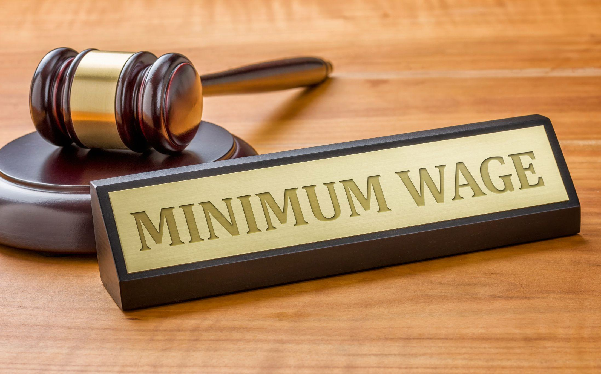

In today's dynamic economic landscape, the ability to comprehend the nuances of costs is essential for businesses and individuals. Fixed and variable costs are two primary types that significantly impact financial planning and decision-making. Fixed costs, such as rent and salaries, remain constant regardless of production levels, while variable costs, like raw materials and utilities, fluctuate with business activity. This article examines how these costs influence overall financial health and planning.

Particular focus is given to labor costs, a combination of wage rates, benefits, and other employee-related expenses. These costs are crucial in determining a company's profitability and are often scrutinized for optimization strategies. The ongoing debates surrounding minimum wage contribute to this discussion, highlighting contrasting perspectives on its economic implications. Proponents argue for improved living standards and economic stimulation, while opponents caution against potential job losses and increased burdens on small businesses.



Additionally, the role of algorithmic trading in managing costs effectively is explored. Algorithmic trading leverages computational algorithms to make financial decisions, providing significant advantages in handling cost volatility. By analyzing patterns and predicting market movements, these algorithms offer businesses a tool to optimize costs, particularly those related to labor and materials.

Ultimately, this article aims to provide a comprehensive understanding of how these elements—fixed and variable costs, labor considerations, and algorithmic advancements—interact in crafting effective financial strategies.

## Table of Contents

## Understanding Fixed and Variable Costs

Fixed costs are expenses that remain constant regardless of the level of production or sales within a business. These costs do not fluctuate with the volume of goods or services that a company produces. Common examples of fixed costs include rent, salaries, insurance, and property taxes. For instance, a business will pay the same amount for rent every month, regardless of its production output.

Variable costs, on the other hand, are expenses that vary directly with the level of production or sales. As the production [volume](/wiki/volume-trading-strategy) increases, so do the variable costs, and vice versa. Examples of variable costs include raw materials, utility expenses (such as electricity used in manufacturing), and direct labor costs related to the production process. For example, the cost of raw materials will increase as more products are manufactured.

Both fixed and variable costs significantly influence a business's financial health. Understanding the proportion of fixed to variable costs is essential for determining a company's break-even point, which is the level of sales necessary to cover all costs. The formula for calculating the break-even point in units is:

$$
\text{Break-even Point (units)} = \frac{\text{Fixed Costs}}{\text{Selling Price per Unit} - \text{Variable Cost per Unit}}
$$

Correctly categorizing costs into fixed and variable components is vital for accurate financial forecasting and budgeting. By understanding how costs behave, a business can better predict profitability under different scenarios. Misclassification can lead to flawed predictions, potentially resulting in financial shortfalls.

For instance, a firm anticipating an increase in sales should ensure its assumption of variable costs reflects this rise. Conversely, if a company believes its costs are mostly fixed, predicting profits necessitates a different approach. Accurate cost classification helps organizations set pricing strategies, manage operating leverage, and allocate resources efficiently.

Developing a comprehensive understanding of fixed and variable costs aids businesses in strategizing for cost control and long-term planning, shaping financial decisions that bolster sustainability and growth.

## The Significance of Labor Costs

Labor costs represent a significant portion of a business's total expenditures and are crucial to financial analysis and operational planning. These costs are multifaceted, comprising wage rates, benefits, and other employee-related expenses. Understanding these components is vital for assessing their implications on financial performance.

### Components of Labor Costs

1. **Wage Rates**: This is the most direct form of labor cost, representing the compensation paid to employees, usually expressed as hourly, daily, or annual amounts.

2. **Benefits**: These are non-wage compensations provided to employees, which can include health insurance, retirement plans, paid leave, and bonuses. Benefits represent a crucial factor in employee satisfaction and retention.

3. **Other Employee-Related Expenses**: This category includes payroll taxes, training costs, and any additional costs related to employment. It might also cover expenses for uniforms, equipment, or travel reimbursement in specific sectors.

### Labor Costs as Fixed and Variable Costs

Labor costs can be categorized as both fixed and variable, depending on the employment structure and business model:

- **Fixed Labor Costs**: These costs remain constant regardless of business activity levels. Salaries of permanent staff and certain employee benefits are typically fixed. For example, a manager's monthly salary would be considered a fixed labor cost.

- **Variable Labor Costs**: These fluctuate with production levels or services rendered. Part-time or freelance workers, whose hours may increase or decrease with demand, embody variable labor costs. Similarly, overtime pay is another example of how labor costs can vary.

### Impact on Profitability

Labor costs significantly influence a company's profitability due to their proportionate weight in total expenses. Managing these costs efficiently ensures a healthy margin between revenue and operating expenses, critical for sustaining and improving profitability. High labor costs without corresponding productivity gains can compress profit margins, while strategically managed labor expenses can enhance competitiveness.

### Strategies for Managing Labor Costs

Businesses adopt various strategies to control labor expenses without compromising on productivity or quality:

- **Automation and Technology**: Implementing technology solutions can reduce reliance on manual labor for repetitive tasks, thus lowering labor costs. Investment in automation might entail initial costs but can lead to substantial savings in the long term.

- **Flexible Workforce Models**: Utilizing part-time staff, freelancers, or temporary workers provides flexibility to scale labor costs according to demand. This approach helps in aligning labor spending directly with revenue fluctuations.

- **Employee Productivity Optimization**: Training programs and performance incentives can enhance employee output. Improved productivity means higher returns on labor costs, which can mitigate the impact of these costs on profitability.

- **Outsourcing**: For functions that are not core to the business, outsourcing can be a cost-effective method. It allows businesses to convert fixed costs into variable costs, providing financial flexibility.

By understanding and effectively managing labor costs, businesses can bolster their financial health and gain a competitive edge in their respective markets.

## Debating Minimum Wage: Pros and Cons

The minimum wage debate is a critical economic discussion that has evolved over time, deeply rooted in the quest for economic equality and social welfare. The history of minimum wage legislation dates back to the late 19th and early 20th centuries, primarily as a social reform measure aimed at improving living standards. The initial intent was to ensure that workers, especially those in low-skilled jobs, received a wage sufficient to maintain a basic standard of living. Over the years, the discussion around minimum wage has expanded to include various economic implications.

Proponents of increasing the minimum wage argue that it is essential for improving living standards, particularly for low-income workers. An increase in the minimum wage can lead to higher earnings for these individuals, thereby reducing poverty levels and income inequality. Higher wages can stimulate economic growth by increasing consumer spending, as workers have more disposable income to spend on goods and services, which can, in turn, boost demand and drive economic activity. For instance, the Keynesian economic principle suggests that greater consumer spending can lead to a multiplier effect, potentially resulting in increased production and job creation.

On the other hand, opponents of raising the minimum wage contend that such hikes could lead to negative employment effects. Critics argue that increasing the minimum wage may compel businesses, especially small enterprises, to cut jobs or reduce hiring to offset the higher labor costs. This argument is grounded in the classical economic theory which posits that higher wages can lead to a decrease in demand for labor, particularly among businesses operating with tight profit margins. Furthermore, businesses might pass on the increased costs to consumers through higher prices, potentially leading to inflationary pressures.

Changes in the minimum wage can significantly impact the categorization of labor costs as either fixed or variable. Generally, labor costs have both fixed and variable components. Fixed labor costs include expenses that do not fluctuate with production levels, like the base salary paid to permanent employees. Conversely, variable labor costs change according to the level of business activity, such as overtime payments and bonuses. An increase in the minimum wage tends to elevate the fixed labor costs, as businesses must pay their employees a higher base salary regardless of their production levels. This shift can alter a company's cost structure, influencing decisions on pricing, staffing, and overall financial strategy.

In conclusion, while the debate on minimum wage involves complex economic considerations, understanding its pros and cons is critical for those involved in policy-making and business management. Balancing the benefits of improved living standards and economic stimulation against the potential drawbacks of job losses and increased business costs remains a central challenge in this ongoing discussion.

## Algorithmic Trading and Cost Efficiency

Algorithmic trading leverages computer programs to execute trading orders at high speeds and volumes by using complex mathematical models and formulas. This type of trading is prevalent in financial markets due to its efficiency and capacity to process a large quantity of data in real-time, minimizing the need for human intervention. Its primary role is to provide [liquidity](/wiki/liquidity-risk-premium), facilitate price discovery, and enhance efficiency in markets.

One of the notable benefits of [algorithmic trading](/wiki/algorithmic-trading) is its ability to help businesses manage costs, especially through hedging against price [volatility](/wiki/volatility-trading-strategies). Algorithms can analyze historical data and market conditions to predict future price movements, allowing traders to make informed decisions quickly. This predictive capability aids in optimizing the timing of trades, thus minimizing the risk of adverse price movements that could lead to financial losses. For instance, algorithms can implement strategies like statistical [arbitrage](/wiki/arbitrage), pairs trading, and market-making to stabilize pricing and reduce transaction costs.

Moreover, algorithmic trading can also optimize labor costs through predictive analytics. By analyzing patterns and trends in market data, algorithms can forecast changes in labor demand and supply, helping businesses balance their workforce requirements in alignment with market conditions. For example, algorithms can predict peak operational times, allowing businesses to schedule labor more effectively, thus avoiding overstaffing or understaffing situations.

Several case studies illustrate the profound cost-saving effects of algorithmic trading. A notable example is the case of a multinational investment bank that adopted algorithmic trading strategies to reduce execution costs significantly. Using a time-weighted average price (TWAP) algorithm, the bank managed to execute large orders incrementally over a specific time frame, minimizing market impact and slippage costs. This strategic execution led to substantial savings and improved overall portfolio performance.

In another case, a [hedge fund](/wiki/hedge-fund-trading-strategies) employed [machine learning](/wiki/machine-learning) algorithms to optimize its trading strategies, enhancing precision in entry and [exit](/wiki/exit-strategy) points in the market. The algorithm's predictive analytics capability provided insights into market trends, leading to better strategic planning and reduced unnecessary trading activities, resulting in lower operational costs.

In conclusion, algorithmic trading plays a crucial role in enhancing cost efficiency in financial markets. Its ability to mitigate price volatility, optimize labor costs, and deliver strategic advantages positions it as a valuable tool for businesses striving to manage and reduce costs. As technology continues to advance, the potential for algorithmic trading to drive further efficiencies in cost management is significant.

## Integrating Cost Strategies for Business Success

In businesses, efficiently balancing fixed and variable costs is crucial for optimizing financial performance. Ensuring that these costs are managed effectively can enhance profitability and sustainability.

Firstly, businesses can use technology and automation to reduce both fixed and variable costs. Automation of repetitive tasks can lead to significant time savings and cost reductions. For instance, implementing robotic process automation (RPA) can streamline manufacturing processes, reducing the need for manual labor thereby lowering variable labor costs. Additionally, cloud computing can reduce fixed costs by diminishing the need for on-premises IT infrastructure, which typically requires substantial upfront investment and ongoing maintenance expenses.

However, the implementation of these strategies is not without challenges. One primary obstacle is the initial investment required for technology adoption. Small businesses, in particular, may struggle to secure the necessary funds. Additionally, workforce resistance to automation can impede adoption, as employees may fear job loss or role changes. Companies must address these concerns through clear communication and by providing training for employees to work alongside new technologies.

To continuously evaluate and adjust costs, businesses should establish robust cost management practices. Regular financial audits can help identify areas where costs can be optimized. Implementing a dynamic budgeting approach allows for flexibility in managing unforeseen changes in the business environment. Further, employing data analytics can provide insights into cost structures, enabling businesses to make informed decisions about cost-cutting strategies and investments.

For example, using Python, businesses can automate the analysis of cost data. A simple script could calculate mean and variance of monthly costs, helping identify trends and irregularities:

```python
import numpy as np

# Example monthly costs
fixed_costs = np.array([1000, 1020, 980, 1015])
variable_costs = np.array([500, 550, 530, 510])

# Calculating mean and variance
mean_fixed = np.mean(fixed_costs)
var_fixed = np.var(fixed_costs)

mean_variable = np.mean(variable_costs)
var_variable = np.var(variable_costs)

print(f"Mean Fixed Costs: ${mean_fixed}, Variance: ${var_fixed}")
print(f"Mean Variable Costs: ${mean_variable}, Variance: ${var_variable}")
```

In conclusion, businesses must embrace technology and automation to efficiently balance their cost structures. Although challenges exist, particularly around initial costs and employee adaptation, these can be mitigated through strategic planning and effective communication. Regular evaluation and continuous improvement of cost management practices are essential for long-term business success.

## Conclusion

In today's ever-changing economic environment, a thorough comprehension of fixed and variable costs is crucial for both businesses and individuals. These costs form the foundation of financial planning and decision-making, influencing a company's financial health and operational strategies. Fixed costs, such as rent and salaries, remain constant regardless of output, while variable costs fluctuate with production levels. By effectively categorizing and managing these costs, businesses can enhance their financial forecasting and operational efficiency.

Understanding labor costs is equally important, given their profound impact on a company’s profitability. Labor costs, encompassing wages, benefits, and other employee-related expenses, can be both fixed and variable. Staying informed about changes in labor costs and minimum wage regulations is vital for businesses aiming to maintain competitiveness and sustainability. The ongoing debates surrounding minimum wage highlight the need for businesses to balance living standards with economic viability, taking into account the potential implications for job markets and operational costs.

Algorithmic trading emerges as a formidable tool for achieving cost efficiency, offering solutions in managing financial risks and optimizing labor expenses through predictive analytics. This technology, when leveraged effectively, can lead to substantial cost savings and improved market strategies, showcasing its significance in modern financial landscapes.

The synthesis of these insights emphasizes a call to action for businesses and individuals to pursue further research and adaptation of comprehensive cost management strategies. Continuous evaluation and adjustment of costs, supported by technological advancements, are paramount for sustaining financial health and achieving economic success.

## References & Further Reading

[1]: Krueger, A. B. (2015). ["The Minimum Wage: How Much is Too Much?"](https://www.nytimes.com/2015/10/11/opinion/sunday/the-minimum-wage-how-much-is-too-much.html) National Bureau of Economic Research.

[2]: Card, D., & Krueger, A. B. (1995). ["Myth and Measurement: The New Economics of the Minimum Wage"](https://www.jstor.org/stable/j.ctv7h0s52). Princeton University Press.

[3]: Autor, D. H., Manning, A., & Smith, C. L. (2016). ["The Contribution of the Minimum Wage to U.S. Wage Inequality over Three Decades: A Reassessment"](https://www.aeaweb.org/articles?id=10.1257/app.20140073) American Economic Journal: Applied Economics, 8(1), 58-99.

[4]: Malevergne, Y., & Sornette, D. (2009). ["Extreme Financial Risks: From Dependence to Risk Management"](https://link.springer.com/book/10.1007/b138841) Springer-Verlag.

[5]: Naz, S., Donia, M. B. L., & Sistani, M. (2020). ["Predictive Analytics for Human Resources Management: A Shifting Landscape"](https://psycnet.apa.org/record/2021-06723-003). Springer Nature.

[6]: Lo, A. W. (2012). ["Adaptive Markets: Financial Evolution at the Speed of Thought"](https://archive.org/details/adaptivemarketsf0000loan) Princeton University Press.

[7]: Lundberg, S., & Lee, S.-I. (2017). ["A Unified Approach to Interpreting Model Predictions"](https://dl.acm.org/doi/10.5555/3295222.3295230) Advances in Neural Information Processing Systems 31.

[8]: Gajardo, G., Kristjanpoller, W. D., & Minutolo, M. C. (2018). ["Cryptocurrencies for Financial Portfolio Diversification: The Case of Bitcoin"](https://scholar.google.com/citations?user=1vhDro8AAAAJ) Research in International Business and Finance, 45, 32-46.