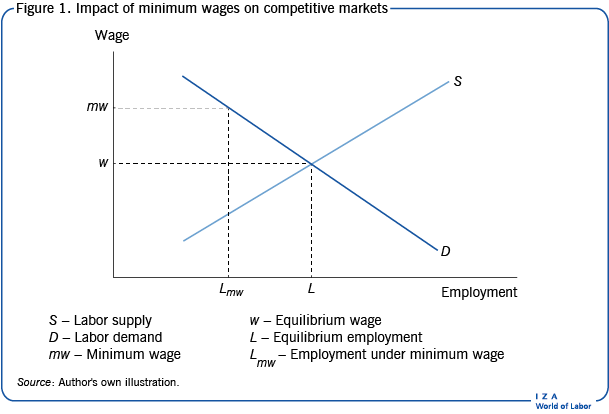

## Table of Contents

## What is the minimum wage?

The minimum wage is the lowest amount of money that an employer can legally pay their workers per hour. It is set by the government to make sure that workers earn enough to live on. In the United States, the federal minimum wage is $7.25 per hour, but some states and cities have their own higher minimum wages.

Different countries have different minimum wages. For example, in the United Kingdom, the minimum wage varies depending on the worker's age and whether they are an apprentice. It is important because it helps to protect workers from being paid too little and helps to reduce poverty. However, some people argue that it can also make it harder for businesses to hire new workers.

## How is the minimum wage determined?

The minimum wage is set by the government to make sure workers get paid enough money. In many countries, the government looks at things like the cost of living, how much people need to live on, and what other wages are like in the country. They might also talk to people who work in businesses and people who work for workers to help decide. Sometimes, they use special groups or committees to study all this information and suggest what the minimum wage should be.

Once the government decides on a minimum wage, they make it into a law. This law says that all employers must pay their workers at least that amount of money per hour. If an employer does not follow this law, they can get in trouble and have to pay fines. In some places, the minimum wage can be different in different parts of the country or for different types of workers. For example, some places might have a higher minimum wage in big cities where it costs more to live, or a different rate for young workers or people who are just starting out.

## What are labor costs?

Labor costs are the total amount of money a business spends on its workers. This includes the money they pay for wages or salaries, as well as other things like benefits, taxes, and any other costs related to having employees. For example, if a business pays its workers an hourly wage, the labor cost includes not just the hourly pay but also things like health insurance, Social Security taxes, and maybe even the cost of training new workers.

Labor costs are important for businesses because they are usually one of the biggest expenses. When a business is figuring out how much it costs to make a product or provide a service, labor costs are a big part of that calculation. If labor costs go up, like if the minimum wage increases, the business might have to charge more for its products or find ways to save money in other areas. This can affect how much profit the business makes and can also impact the prices customers have to pay.

## How do minimum wage laws affect labor costs for businesses?

Minimum wage laws directly affect labor costs for businesses because they set the lowest amount of money that businesses can pay their workers. If the government raises the minimum wage, businesses have to pay their workers more money per hour. This means their labor costs go up. For example, if a business has 10 workers who each work 40 hours a week, and the minimum wage goes up by $1 per hour, the business will have to pay an extra $400 every week just for those workers.

When labor costs go up because of minimum wage laws, businesses might have to make changes. They might raise the prices of their products or services to cover the extra costs. Or, they might try to save money in other ways, like using fewer workers or finding ways to make their workers more efficient. Some businesses might even move to places where the minimum wage is lower. It's a big decision for businesses, and it can affect how they run and how much they can grow.

## Can minimum wage increases lead to higher prices for consumers?

Yes, when the minimum wage goes up, it can make prices higher for people who buy things. This is because businesses have to pay their workers more money, and that makes their costs go up. To cover these extra costs, businesses might decide to charge more for the things they sell. So, if you go to a store or a restaurant, you might see that the prices are higher than before.

This can affect everyone who buys things. For example, if the minimum wage goes up and a fast food restaurant has to pay its workers more, they might raise the price of their burgers and fries. People who eat at that restaurant will have to pay more money for their meals. But it's not just fast food; it can happen with all kinds of products and services, from clothes to haircuts. So, when the minimum wage increases, it can lead to higher prices for everyone.

## What is the relationship between minimum wage and employment levels?

When the minimum wage goes up, it can affect how many people businesses hire. If businesses have to pay more money to their workers, they might decide to hire fewer people to keep their costs down. This means that some people might find it harder to get a job, especially if they are just starting out or don't have a lot of skills. So, a higher minimum wage could lead to fewer jobs being available.

On the other hand, when the minimum wage goes up, it can also help some people. Workers who already have jobs might get paid more money, which can help them live better lives. Sometimes, when people have more money, they spend more, and that can be good for the economy. It can make businesses busier and might even lead to more jobs in the long run. So, the relationship between minimum wage and employment levels can be complicated, with both good and bad effects.

## How do minimum wage laws impact small businesses differently from large corporations?

Minimum wage laws can hit small businesses harder than big companies. Small businesses usually don't have a lot of extra money to spend. When the minimum wage goes up, they might have to pay their workers more, but they can't always raise their prices or find other ways to save money as easily as big companies can. This can make it tough for small businesses to keep going, and some might even have to close down if they can't afford the higher costs.

On the other hand, big companies often have more money and resources to deal with higher minimum wages. They can spread the extra costs over more workers and more products or services. They might also have better ways to make their workers more efficient or find other ways to save money. So, while big companies might still feel the impact of higher minimum wages, they usually have more ways to handle it than small businesses do.

## What are the economic theories supporting and opposing minimum wage increases?

Some people think that raising the minimum wage is good for the economy. They believe it gives workers more money to spend on things they need, like food and clothes. When workers have more money, they spend more, which can make businesses busier and help the economy grow. This idea is called the "demand-side" theory. People who support this theory also say that a higher minimum wage can help reduce poverty and make life better for people who work hard but don't earn a lot of money.

On the other hand, some people think that raising the minimum wage can hurt the economy. They worry that if businesses have to pay their workers more, they might hire fewer people or even have to close down. This idea is called the "supply-side" theory. People who support this theory believe that higher labor costs can make businesses less able to grow and create jobs. They also think that prices might go up because businesses will try to cover their extra costs, which can make life harder for everyone, not just business owners.

These two theories show that the debate about minimum wage increases is complicated. Both sides have good points, and the real effects can depend a lot on things like how much the minimum wage goes up, what the economy is like at the time, and how businesses and workers react to the change.

## How do minimum wage laws vary by country and what are the global impacts on labor costs?

Minimum wage laws are different in every country. Some countries, like Australia and Luxembourg, have high minimum wages to make sure workers can live well. Other countries, like Mexico and India, have lower minimum wages because their costs of living are lower. In some places, like the United States, the minimum wage can be different in different states or cities. For example, New York City has a higher minimum wage than many other places in the US. Some countries don't have a minimum wage at all, like Denmark and Sweden, where workers' pay is decided by agreements between unions and businesses.

When countries change their minimum wages, it can affect labor costs all over the world. If a country raises its minimum wage a lot, businesses there might have to pay more for their workers. This can make their products or services more expensive. If these businesses sell things to other countries, the higher prices can affect people in those countries too. On the other hand, if a country keeps its minimum wage low, it might be cheaper for businesses to make things there, which can lead to more jobs in that country but might also make it harder for workers in other countries to compete. So, minimum wage laws in one country can have a big impact on labor costs and the economy around the world.

## What empirical studies have been conducted on the effects of minimum wage on labor costs?

Many studies have looked at how minimum wage changes affect labor costs. One famous study was done by economists David Card and Alan Krueger in the 1990s. They looked at what happened when New Jersey raised its minimum wage and compared it to Pennsylvania, which did not. They found that the increase in the minimum wage did not lead to fewer jobs in New Jersey's fast food restaurants. This surprised a lot of people because it went against the idea that higher minimum wages always mean fewer jobs. Other studies have also found that small increases in the minimum wage might not hurt employment as much as people thought.

However, not all studies agree. Some research shows that when the minimum wage goes up a lot, businesses might hire fewer people or cut back on hours to save money. A study by economists David Neumark and William Wascher found that minimum wage increases can lead to fewer jobs, especially for young workers and people with less education. They argue that businesses have to pay more for labor, so they might try to use less of it. These different findings show that the effects of minimum wage on labor costs can be complicated and depend on a lot of things, like how big the increase is and what the economy is like at the time.

## How do automation and technology influence the impact of minimum wage laws on labor costs?

Automation and technology can change how minimum wage laws affect labor costs for businesses. When the minimum wage goes up, businesses might start using machines or computers to do work that people used to do. This can help businesses save money because they don't have to pay as many workers. For example, a fast food restaurant might use a self-service kiosk instead of having a person take orders. This means the business can keep its labor costs down even if the minimum wage goes up.

But, using more technology and automation can also have other effects. If businesses start using machines instead of people, some workers might lose their jobs. This can make it harder for people to find work, especially if they don't have the skills to use the new technology. On the other hand, technology can also create new jobs in areas like programming and maintenance. So, while automation might help businesses manage higher minimum wages, it can also change the kinds of jobs that are available and who can get them.

## What are the long-term effects of minimum wage policies on labor market dynamics and income inequality?

Over time, minimum wage policies can change how the job market works and affect how much money people have compared to each other. When the minimum wage goes up, workers who earn the minimum wage get more money. This can help reduce income inequality because these workers, who often don't earn a lot, get a bigger share of the money that's being made. If more people have more money to spend, it can also make the economy grow because businesses get busier. But, if businesses have to pay more for their workers, they might hire fewer people or use more machines instead of people. This can make it harder for some people to find jobs, especially if they are just starting out or don't have a lot of skills.

In the long run, minimum wage policies can also affect how businesses grow and change. If businesses have to pay more for their workers, they might try to find ways to save money, like making their workers more efficient or moving to places where the minimum wage is lower. This can lead to more competition between workers in different places and might even make some businesses move their jobs to other countries. So, while minimum wage policies can help workers earn more money and reduce income inequality, they can also make the job market more complicated and affect where and how businesses operate.

## What is the difference between fixed and variable costs?

Fixed costs are expenses that remain constant regardless of the level of production or sales within a business. These costs do not fluctuate with the volume of goods or services that a company produces. Common examples of fixed costs include rent, salaries, insurance, and property taxes. For instance, a business will pay the same amount for rent every month, regardless of its production output.

Variable costs, on the other hand, are expenses that vary directly with the level of production or sales. As the production [volume](/wiki/volume-trading-strategy) increases, so do the variable costs, and vice versa. Examples of variable costs include raw materials, utility expenses (such as electricity used in manufacturing), and direct labor costs related to the production process. For example, the cost of raw materials will increase as more products are manufactured.

Both fixed and variable costs significantly influence a business's financial health. Understanding the proportion of fixed to variable costs is essential for determining a company's break-even point, which is the level of sales necessary to cover all costs. The formula for calculating the break-even point in units is:

$$
\text{Break-even Point (units)} = \frac{\text{Fixed Costs}}{\text{Selling Price per Unit} - \text{Variable Cost per Unit}}
$$

Correctly categorizing costs into fixed and variable components is vital for accurate financial forecasting and budgeting. By understanding how costs behave, a business can better predict profitability under different scenarios. Misclassification can lead to flawed predictions, potentially resulting in financial shortfalls.

For instance, a firm anticipating an increase in sales should ensure its assumption of variable costs reflects this rise. Conversely, if a company believes its costs are mostly fixed, predicting profits necessitates a different approach. Accurate cost classification helps organizations set pricing strategies, manage operating leverage, and allocate resources efficiently.

Developing a comprehensive understanding of fixed and variable costs aids businesses in strategizing for cost control and long-term planning, shaping financial decisions that bolster sustainability and growth.

## References & Further Reading

[1]: Krueger, A. B. (2015). ["The Minimum Wage: How Much is Too Much?"](https://www.nytimes.com/2015/10/11/opinion/sunday/the-minimum-wage-how-much-is-too-much.html) National Bureau of Economic Research.

[2]: Card, D., & Krueger, A. B. (1995). ["Myth and Measurement: The New Economics of the Minimum Wage"](https://www.jstor.org/stable/j.ctv7h0s52). Princeton University Press.

[3]: Autor, D. H., Manning, A., & Smith, C. L. (2016). ["The Contribution of the Minimum Wage to U.S. Wage Inequality over Three Decades: A Reassessment"](https://www.aeaweb.org/articles?id=10.1257/app.20140073) American Economic Journal: Applied Economics, 8(1), 58-99.

[4]: Malevergne, Y., & Sornette, D. (2009). ["Extreme Financial Risks: From Dependence to Risk Management"](https://link.springer.com/book/10.1007/b138841) Springer-Verlag.

[5]: Naz, S., Donia, M. B. L., & Sistani, M. (2020). ["Predictive Analytics for Human Resources Management: A Shifting Landscape"](https://psycnet.apa.org/record/2021-06723-003). Springer Nature.

[6]: Lo, A. W. (2012). ["Adaptive Markets: Financial Evolution at the Speed of Thought"](https://archive.org/details/adaptivemarketsf0000loan) Princeton University Press.

[7]: Lundberg, S., & Lee, S.-I. (2017). ["A Unified Approach to Interpreting Model Predictions"](https://dl.acm.org/doi/10.5555/3295222.3295230) Advances in Neural Information Processing Systems 31.

[8]: Gajardo, G., Kristjanpoller, W. D., & Minutolo, M. C. (2018). ["Cryptocurrencies for Financial Portfolio Diversification: The Case of Bitcoin"](https://scholar.google.com/citations?user=1vhDro8AAAAJ) Research in International Business and Finance, 45, 32-46.