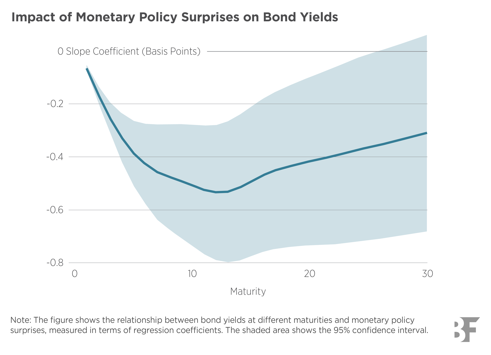

## Table of Contents

## What is monetary policy?

Monetary policy is the way a country's central bank controls the amount of money in the economy. It's like adjusting the taps on a money supply to make sure there's not too much or too little money flowing around. The central bank does this by setting interest rates, which is the cost of borrowing money. When interest rates are low, it's cheaper to borrow, so people and businesses might spend more. When rates are high, borrowing costs more, so people might save more instead of spending.

The goal of monetary policy is to keep the economy stable. If there's too much money, prices can go up too fast, which is called inflation. The central bank might raise interest rates to slow down spending and cool off the economy. On the other hand, if there's not enough money, the economy might slow down too much, leading to fewer jobs and less growth. In this case, the central bank might lower interest rates to encourage spending and boost the economy. By carefully managing these rates, the central bank tries to keep the economy growing at a healthy pace.

## What are bond yields?

Bond yields are the rate of return you get from investing in a bond. Imagine you lend money to someone and they promise to pay you back with interest. The bond yield is like the interest rate they're offering you. It tells you how much money you'll earn each year from the bond, as a percentage of the bond's price.

When people talk about bond yields, they usually mean the yield to maturity. This is the total interest you'll earn if you hold the bond until it matures, or reaches its end date. Bond yields can change over time, depending on things like interest rates set by the central bank and how much people want to buy or sell bonds. If bond prices go up, yields go down, and if bond prices go down, yields go up. It's like a seesaw: when one side goes up, the other goes down.

## How does monetary policy affect the economy?

Monetary policy is like a big steering wheel for the economy. The central bank uses it to control how much money is flowing around. When they want to speed up the economy, they might lower interest rates. This makes borrowing cheaper, so people and businesses might take out loans to buy things like houses or start new projects. More spending means more jobs and more growth. But if the economy is growing too fast and prices are going up too quickly, the central bank might raise interest rates. This makes borrowing more expensive, so people might spend less and save more, which can help slow down the economy and keep prices stable.

The effects of monetary policy can be seen in many parts of the economy. For example, when interest rates change, it can affect bond yields. If rates go up, new bonds will offer higher yields to attract buyers, making older bonds with lower yields less attractive. This can cause their prices to drop. Also, changes in interest rates can influence how much people want to save or invest. When rates are high, saving money in a bank might look more appealing than investing in stocks or starting a business. On the other hand, when rates are low, people might look for other ways to make their money grow, like investing in the stock market or buying real estate. By carefully adjusting interest rates, the central bank tries to keep the economy balanced and growing at a healthy pace.

## What are the main tools of monetary policy?

The main tools of monetary policy are interest rates, open market operations, and reserve requirements. Interest rates are the most common tool. When the central bank changes interest rates, it affects how much it costs to borrow money. Lowering interest rates makes borrowing cheaper, which can encourage people and businesses to spend more. Raising interest rates makes borrowing more expensive, which can slow down spending and help control inflation.

Open market operations are another tool. This is when the central bank buys or sells government bonds. If the central bank buys bonds, it puts more money into the economy, which can help it grow. If it sells bonds, it takes money out of the economy, which can help slow it down. Reserve requirements are the third tool. This is the amount of money banks have to keep in reserve and not lend out. If the central bank lowers reserve requirements, banks can lend more money, which can boost the economy. If it raises reserve requirements, banks have to keep more money in reserve, which can slow down lending and the economy.

By using these tools, the central bank can influence how much money is circulating in the economy. This helps them keep the economy growing at a healthy pace and control inflation.

## How do changes in interest rates influence bond yields?

When interest rates change, it has a big effect on bond yields. Imagine you have a bond that pays a fixed amount of interest every year. If the central bank raises interest rates, new bonds will have to offer higher interest to attract buyers. This makes your old bond less attractive because it pays less interest than the new ones. So, to sell your old bond, you might have to lower its price. When bond prices go down, the yield, or the return you get from the bond, goes up. It's like a seesaw: when one side goes up, the other goes down.

On the other hand, if the central bank lowers interest rates, new bonds will offer lower interest. This makes your old bond more attractive because it pays more interest than the new ones. So, the price of your old bond might go up because more people want to buy it. When bond prices go up, the yield goes down. This is why changes in interest rates can cause bond yields to move in the opposite direction. By adjusting interest rates, the central bank can influence how much return investors can expect from bonds.

## What is the relationship between inflation and bond yields?

Inflation and bond yields are closely connected. When inflation goes up, it means that prices for things like food, gas, and other stuff are rising. This makes the money you get from a bond worth less over time. To make up for this, investors want a higher return on their bonds. So, when inflation rises, bond yields usually go up too. This is because bond issuers have to offer higher interest rates to attract buyers who are worried about their money losing value.

On the other hand, when inflation is low, the money you get from a bond keeps more of its value. Investors don't need as high a return to feel okay about their investment. So, when inflation is low, bond yields tend to be lower too. This is because bond issuers can offer lower interest rates and still attract buyers. The relationship between inflation and bond yields is important for investors to understand because it helps them decide where to put their money to get the best return.

## How does quantitative easing impact bond markets?

Quantitative easing, or QE, is when a central bank buys a lot of bonds to put more money into the economy. When the central bank does this, it makes the demand for bonds go up. This means bond prices go up too. But remember, bond yields and bond prices move in opposite directions. So, when bond prices go up because of QE, bond yields go down. This makes borrowing cheaper, which can help the economy grow.

QE also changes how investors think about bonds. When the central bank is buying a lot of bonds, investors might think it's a safe time to buy bonds too. This can make even more people want to buy bonds, pushing prices up and yields down even more. But if investors start to think that inflation might go up because of all the extra money in the economy, they might want higher yields to make up for it. So, QE can make bond markets move in big ways, affecting how much it costs to borrow and how investors see their investments.

## Can you explain the term structure of interest rates and its relevance to bond yields?

The term structure of interest rates is like a map that shows how interest rates change over time for bonds with different lengths of time until they mature. It's often shown as a graph called the yield curve. The yield curve can be flat, meaning short-term and long-term interest rates are about the same, or it can slope up, meaning long-term rates are higher than short-term rates. Sometimes, it can even slope down, which means short-term rates are higher than long-term rates. This shape of the yield curve tells us a lot about what people think will happen to the economy in the future.

The term structure of interest rates is really important for understanding bond yields because it helps investors see what kind of returns they can expect from bonds with different maturity dates. If the yield curve is sloping up, it means investors can get higher yields from long-term bonds. This might happen if people think the economy will grow and inflation will go up in the future. But if the yield curve is sloping down, it might mean investors are worried about the economy and want to get their money back sooner, so they're okay with lower yields from long-term bonds. By looking at the term structure, investors can make better choices about which bonds to buy and how long they want to keep their money tied up.

## How do central bank policies affect different types of bonds (e.g., government vs. corporate)?

Central bank policies, like changing interest rates or doing quantitative easing, affect different types of bonds in different ways. Government bonds, like those issued by the U.S. Treasury, are usually seen as very safe. When the central bank lowers interest rates, the yields on new government bonds go down. This makes older government bonds with higher yields more attractive, so their prices go up. If the central bank does quantitative easing and buys a lot of government bonds, it also pushes up the prices of these bonds and pushes down their yields. This makes borrowing cheaper for the government, which can help the economy grow.

Corporate bonds, on the other hand, are seen as riskier because they're issued by companies, not the government. When the central bank lowers interest rates, it can help companies borrow money more cheaply, which can be good for their business. But if people start to worry about the economy, they might want to move their money from riskier corporate bonds to safer government bonds. This can make corporate bond prices go down and their yields go up. During quantitative easing, if the central bank is mainly buying government bonds, it might not help corporate bonds as much. But if the central bank also buys corporate bonds, it can push up their prices and push down their yields, making it easier for companies to borrow.

## What role does market expectation of future monetary policy play in current bond yields?

Market expectations about what the central bank might do in the future can really change bond yields right now. If people think the central bank will raise interest rates soon, they might want higher yields on bonds to make up for it. This is because higher interest rates mean new bonds will offer more money, making old bonds with lower yields less attractive. So, to sell those old bonds, their prices might go down, and when bond prices go down, yields go up. It's like a seesaw: when one side goes up, the other goes down.

On the other hand, if people think the central bank will keep interest rates low or even lower them, they might be okay with lower yields on bonds now. This is because they expect new bonds to offer less money, making old bonds with higher yields more attractive. So, the prices of those old bonds might go up, and when bond prices go up, yields go down. By guessing what the central bank will do, investors can decide whether to buy or sell bonds now, which affects bond yields today.

## How do international monetary policies influence domestic bond yields?

International monetary policies can have a big effect on what happens to bond yields at home. Imagine that a big country like the United States decides to raise its interest rates. This makes U.S. bonds more attractive because they offer higher returns. Investors from other countries might want to buy these U.S. bonds, so they sell their own country's bonds to get the money to do it. When they sell a lot of bonds from their own country, the prices of those bonds go down, and when bond prices go down, yields go up. So, even though it's the U.S. that changed its interest rates, it can make bond yields go up in other countries too.

On the other hand, if a big country decides to lower its interest rates, it can make its own bonds less attractive. Investors might start looking for better returns in other countries, which can push up the prices of bonds in those countries. When bond prices go up, yields go down. So, a country that lowers its interest rates can make bond yields go down in other countries too. This shows how closely connected the world's economies are, and how what one country does can affect what happens to bond yields everywhere.

## What are some advanced models used to predict bond yield movements based on monetary policy changes?

One advanced model that helps predict bond yield movements based on monetary policy changes is the Taylor Rule. This model looks at how the central bank might change interest rates based on things like inflation and how fast the economy is growing. If the model thinks the central bank will raise interest rates because inflation is going up, it can help predict that bond yields will go up too. The Taylor Rule is like a guide that helps investors guess what the central bank might do next, which can affect how they buy and sell bonds.

Another model is the Arbitrage-Free Nelson-Siegel (AFNS) model. This model is a bit more complicated, but it helps predict how the whole yield curve, which shows the yields of bonds with different times until they mature, might change. The AFNS model looks at past data to see how bond yields have moved when the central bank changed its policies. By using this information, it can make better guesses about what might happen to bond yields in the future. This model is useful for investors who want to know not just what might happen to short-term bond yields, but also to long-term ones.

Lastly, there's the Vector Autoregression (VAR) model. This model looks at lots of different things at the same time, like interest rates, inflation, and how much people are spending. It uses this information to predict how these things might affect each other and, in turn, how they might change bond yields. The VAR model is helpful because it shows how a change in one part of the economy, like a new monetary policy, can ripple through to affect bond yields. By understanding these connections, investors can make smarter choices about when to buy or sell bonds.

## What is the process of decoding bond yields?

Bond yields refer to the return an investor can anticipate receiving from holding a bond until maturity. They are a critical measure for assessing the potential profitability and risk associated with fixed-income investments. Understanding the relationship between bond prices and yields is fundamental in navigating the bond market. Essentially, bond prices and bond yields inversely correlate: when bond prices rise, yields fall, and when bond prices fall, yields increase. This inverse relationship arises because the yield is calculated based on the bond’s fixed interest payments relative to its current market price.

Interest rate changes, primarily influenced by monetary policies of central banks, directly affect bond yields. When a central bank, such as the Federal Reserve, alters interest rates, it influences the attractiveness of existing bonds. For instance, if interest rates rise, newly issued bonds will typically offer higher yields to attract investors, making existing bonds with lower yields less attractive. Consequently, the prices of existing bonds fall, resulting in higher yields. Conversely, a reduction in interest rates can lead to lower yields on new bonds, thus increasing the demand and prices for existing higher-yield bonds, resulting in reduced yields.

This dynamic plays a significant role in the valuation of various types of bonds, including government securities and corporate debt instruments. Investors rely on bond yield data not only to evaluate potential returns but also to weigh the inherent risks. For instance, higher yields might indicate increased risk, perhaps due to issuer credit quality or prevailing economic conditions.

Understanding bond yields involves consideration of several types of yield metrics. The most common are the current yield, yield to maturity (YTM), and yield to call (YTC). The YTM is especially important as it accounts for the total return an investor can expect if the bond is held to maturity, assuming all coupon payments are reinvested at the same rate. Investors use formulas to calculate these yields, with YTM being derived from the following iterative equation:

$$

P = \sum_{t=1}^{n} \frac{C}{(1 + YTM)^t} + \frac{F}{(1 + YTM)^n} 
$$

Where:
- $P$ is the current price of the bond,
- $C$ is the annual coupon payment,
- $F$ is the face value of the bond,
- $n$ is the number of years to maturity.

The calculations can be simplified and implemented in Python, especially when solving for YTM using numerical methods:
```python
from scipy.optimize import newton

def bond_ytm(price, coupon, face_value, years_to_maturity):
    def ytm_func(ytm):
        total = 0
        for t in range(1, years_to_maturity + 1):
            total += (coupon / (1 + ytm) ** t)
        total += (face_value / (1 + ytm) ** years_to_maturity)
        return total - price

    return newton(ytm_func, 0.05)  # 0.05 serves as an initial guess

# Example usage:
price = 950
coupon = 60
face_value = 1000
years_to_maturity = 5
ytm = bond_ytm(price, coupon, face_value, years_to_maturity)
print(f'The yield to maturity is: {ytm:.2%}')
```

Evaluating bond yields through such analysis helps investors in making informed decisions regarding portfolio diversification and risk management, especially as bonds form a vital part of their fixed-income investments.

## References & Further Reading

[1]: Bernanke, B. S. (2020). ["The New Tools of Monetary Policy."](https://www.jstor.org/stable/26921596) Journal of Economic Perspectives, 34(4), 3-20.

[2]: Markowitz, H. (1952). ["Portfolio Selection."](https://onlinelibrary.wiley.com/doi/abs/10.1111/j.1540-6261.1952.tb01525.x) The Journal of Finance, 7(1), 77-91.

[3]: Lopez de Prado, M. (2018). ["Advances in Financial Machine Learning."](https://www.amazon.com/Advances-Financial-Machine-Learning-Marcos/dp/1119482089) Wiley.

[4]: Aronson, D. R. (2007). ["Evidence-Based Technical Analysis: Applying the Scientific Method and Statistical Inference to Trading Signals."](https://onlinelibrary.wiley.com/doi/book/10.1002/9781118268315) Wiley.

[5]: Chan, E. P. (2008). ["Quantitative Trading: How to Build Your Own Algorithmic Trading Business."](https://github.com/ftvision/quant_trading_echan_book) Wiley.