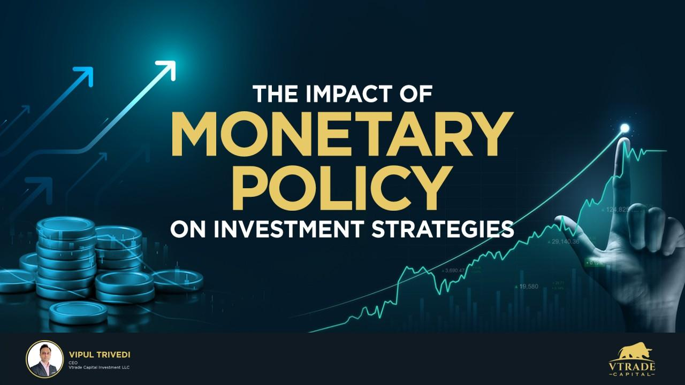

Financial markets are complex ecosystems where investment strategies, monetary policy, and algorithmic trading intertwine to shape both immediate market dynamics and long-term economic growth. Understanding these interconnected elements is crucial for comprehending how financial markets influence and are influenced by various economic forces.

Monetary policy, administered by central banks, plays a pivotal role in steering economic stability and growth. Through mechanisms such as interest rate adjustments, reserve requirements, and open market operations, central banks aim to control inflation, manage employment levels, and foster a conducive environment for economic growth. These policy decisions impact various asset classes, including stocks, bonds, and real estate, thereby influencing investors' strategic moves. For instance, an expansionary monetary policy, characterized by lower interest rates, can lead to increased investment in equities and real estate as borrowing becomes cheaper and yield-seeking behavior intensifies.



Investment strategies are often tailored to the prevailing monetary policy landscape. Investors continuously realign their portfolios, adapting aggressive or conservative stances based on expected policy shifts. Understanding how monetary policy guides economic growth enables investors to make informed decisions, balancing risks and rewards. Diversification and strategic asset allocation are key approaches that investors use to navigate policy changes, ensuring resilience against market volatility and enhancing potential returns.

Algorithmic trading, which utilizes computer algorithms to automate trading decisions, has emerged as a dominant force in financial markets. These systems improve market efficiency and liquidity, facilitating faster execution of trades and narrowing bid-ask spreads. Algorithms can execute complex trading strategies, such as high-frequency trading, statistical arbitrage, and market making, thereby playing a crucial role in price discovery and market dynamics. Algorithmic traders adapt swiftly to monetary policy announcements, often reacting to macroeconomic data faster than human traders. This rapid response can sometimes amplify market movements, underscoring the need for robust risk management and regulatory oversight.

The interplay between algorithmic trading and monetary policy is an area of significant importance for central banks. As algorithmic systems can accentuate volatility following policy changes, policymakers must consider these dynamics when implementing and communicating monetary strategies. Additionally, the rise of high-frequency trading in volatile markets presents both challenges and opportunities, necessitating a nuanced approach to policy regulation and market stabilization.

This introduction lays the groundwork for a detailed analysis of how investment strategies, monetary policy, and algorithmic trading collectively shape financial market behavior and economic growth. Each of these components plays a critical role in fostering stability and efficiency, making it essential for investors, policymakers, and financial professionals to understand and navigate these dynamics effectively.

## Table of Contents

## Understanding Monetary Policy and Its Economic Impact

Monetary policy is a critical component of economic management employed by central banks to achieve macroeconomic stability. Its primary objectives are to control inflation and maximize employment, thereby fostering a stable economic environment conducive to growth. Inflation control involves maintaining price stability, ensuring that inflation remains within a target range to prevent the erosion of purchasing power. At the same time, by maximizing employment, central banks aim to reach the full employment level, where all individuals willing and able to work can find employment.

Monetary policy can broadly be categorized into two types: expansionary and contractionary. Expansionary monetary policy is typically employed during periods of economic downturn to stimulate economic activity. This is achieved by lowering interest rates, thereby reducing the cost of borrowing and encouraging both consumer spending and business investment. On the other hand, contractionary monetary policy is used to cool down an overheating economy where inflation is rising too quickly. This involves raising interest rates to reduce spending and slow down inflationary pressures.

Central banks utilize several tools to implement monetary policy. Key tools include:

1. **Interest Rate Adjustments**: Perhaps the most recognized tool, central banks manipulate the policy interest rate to influence overall economic activity. Lower rates make borrowing cheaper, thereby stimulating investment and consumption, while higher rates aim to restrain these activities.

2. **Reserve Requirements**: These are regulations set by central banks dictating the minimum reserves each bank must hold. Altering reserve requirements impacts the amount of funds banks can lend, thereby controlling money supply.

3. **Open Market Operations (OMO)**: This involves the buying and selling of government securities in the open market to regulate money supply. For instance, purchasing securities injects liquidity into the economy, while selling them withdraws liquidity.

The impact of monetary policy adjustments extends across various asset classes:

- **Stocks**: Changes in interest rates affect corporate earnings potential and the discount rates applied to future cash flows, thereby impacting stock valuations. Generally, lower interest rates boost stock markets by reducing borrowing costs and increasing consumer spending, while higher rates can have the opposite effect.

- **Bonds**: Interest rate changes inversely affect bond prices. When rates rise, existing bonds with lower rates become less attractive, reducing their market value. Conversely, when rates fall, bond prices generally increase.

- **Real Estate**: The real estate market is heavily influenced by interest rates, as they determine mortgage costs. Lower interest rates tend to boost property prices by making mortgage financing more affordable, whereas higher rates can dampen real estate demand and reduce prices.

Monetary policy plays a vital role in steering economic growth and influences investment strategies. By affecting interest rates and borrowing costs, monetary policy shapes the economic environment within which investment decisions are made. Investors may adapt their strategies according to the prevailing monetary policy stance—favoring certain asset allocations over others to optimize returns and manage risk. In an expansionary environment, for example, investors might increase allocations to equities and real estate, while contractionary policies might see a shift towards more fixed-income securities.

In summary, understanding monetary policy is essential for evaluating economic conditions and making informed investment decisions. Its impact on inflation, employment, and various asset classes underscores its pivotal role in creating a stable economic framework conducive to sustainable growth.

## Investment Strategies in a Monetary Policy Landscape

Investors adjust their portfolios in response to monetary policy changes to optimize returns and manage risk effectively. These adjustments are grounded in the anticipated effects of monetary policies on various asset classes. Monetary policies, through tools such as [interest rate](/wiki/interest-rate-trading-strategies) changes, can directly influence the cost of borrowing, consumer spending, and overall economic activity, thereby affecting investment decision-making.

### Aggressive vs. Conservative Investment Strategies

Investment strategies can generally be classified as aggressive or conservative, each suitable for different monetary policy scenarios. Aggressive strategies are characterized by a higher risk tolerance with the aim of achieving superior returns. These strategies typically involve a higher allocation towards equities and growth-oriented assets. During an expansionary monetary policy phase, characterized by lower interest rates, aggressive investors may increase their equity exposure to capitalize on economic growth and increased consumer spending.

Conversely, conservative strategies prioritize capital preservation and stable returns, often emphasizing bonds, cash, and income-generating assets. In a contractionary policy environment, where interest rates rise, conservative investors might increase their bond holdings to benefit from higher yields while reducing exposure to potentially volatile equities.

### Diversification and Asset Selection

Diversification is a fundamental principle in portfolio management, particularly under varying monetary conditions. By spreading investments across different asset classes, sectors, and geographic regions, investors can mitigate risks associated with specific monetary policy changes. The selection of assets is influenced by interest rates and market conditions. For instance, in a low-interest-rate environment, income-focused investors might seek dividends from equities to supplement income, whereas in a high-interest-rate scenario, bonds may offer competitive returns.

### Active Portfolio Management

Active portfolio management involves making specific investment decisions to outperform a benchmark index. Amidst economic policy shifts, active management is especially pertinent as investors seek to take advantage of changing interest rates and economic indicators. Portfolio managers may adjust their asset allocations more frequently in response to central bank announcements or macroeconomic data releases, thereby aligning their portfolios with expected market opportunities or shielding against potential downturns.

### Examples of Strategic Asset Allocation

Strategic asset allocation in response to expansionary and contractionary policies involves setting long-term portfolio weights based on expected returns, risks, and correlations of asset classes given current and projected economic conditions. 

In an expansionary policy environment, investors might allocate more towards growth-oriented sectors such as technology and consumer discretionary, expecting these industries to benefit from increased consumer spending and business investments. For instance:

```python
def expansionary_allocation():
    equity_allocation = 0.70  # 70% in equities
    bond_allocation = 0.20    # 20% in bonds
    cash_allocation = 0.10    # 10% in cash
    return equity_allocation, bond_allocation, cash_allocation

expansionary_allocation()
```

In contrast, during a contractionary phase, increased interest rates may lead to higher borrowing costs, potentially slowing economic growth. As a result, investors could prioritize bonds and stable dividend-paying stocks:

```python
def contractionary_allocation():
    equity_allocation = 0.40  # 40% in equities
    bond_allocation = 0.50    # 50% in bonds
    cash_allocation = 0.10    # 10% in cash
    return equity_allocation, bond_allocation, cash_allocation

contractionary_allocation()
```

Adjusting investment strategies based on monetary policies requires an understanding of the economic landscape, interest rate trends, and asset class behaviors. Active, informed adjustments can aid investors in optimizing their returns while managing risk effectively across economic cycles.

## The Rise of Algorithmic Trading

Algorithmic trading refers to the use of computer algorithms to execute trading orders with minimal human intervention. By leveraging complex mathematical models and predetermined strategies, [algorithmic trading](/wiki/algorithmic-trading) systems can analyze market data and execute trades at speeds and frequencies that a human trader cannot match. This approach has become a cornerstone of modern financial markets, playing a crucial role in improving market efficiency and [liquidity](/wiki/liquidity-risk-premium).

Algorithmic trading enhances market efficiency by reducing the time taken to execute trades, thus helping to narrow bid-ask spreads. It processes vast amounts of market data swiftly, allowing for rapid responses to market events and thus maintaining liquidity. High-frequency trading ([HFT](/wiki/high-frequency-trading-strategies)) plays a significant role in this aspect, executing numerous orders at incredibly fast speeds to profit from small price movements. This not only increases liquidity but also contributes to tighter spreads.

Various types of algorithmic trading strategies are employed in the financial markets. High-frequency trading focuses on capitalizing on minute price discrepancies at rapid speeds. Statistical [arbitrage](/wiki/arbitrage) uses quantitative methods to identify and exploit inefficiencies between related financial instruments. Market making involves providing liquidity by simultaneously offering buy and sell quotes on securities, [earning](/wiki/earning-announcement) the spread between these quotes.

Algorithmic trading significantly influences price discovery and market dynamics. By continuously analyzing and acting on market information, these systems facilitate accurate and real-time reflection of asset prices in response to news and data releases. This constant engagement in trades ensures that prices remain close to their true value, fostering transparent and efficient markets.

Despite its advantages, algorithmic trading poses challenges to market stability. The speed and [volume](/wiki/volume-trading-strategy) of trades can lead to significant [volatility](/wiki/volatility-trading-strategies), especially if multiple algorithms react similarly to market news or anomalies. This was notably observed during the 2010 Flash Crash when automated trading systems contributed to a rapid and steep market decline, highlighting the potential for systemic risks.

Moreover, while algorithmic trading provides liquidity, it can withdraw it just as quickly in times of stress, potentially exacerbating market volatility. These systems, being pre-programmed, may struggle to adapt quickly to unexpected market events, posing a risk to market stability.

In summary, algorithmic trading plays a critical role in modern financial markets by enhancing efficiency, providing liquidity, and facilitating price discovery. However, it also introduces complexities and challenges that need careful management to ensure market stability. The interplay of these factors urges the need for continuous oversight and adaptation to emerging technologies and market environments.

## The Interplay Between Algorithmic Trading and Monetary Policy

Algorithmic trading systems have revolutionized the way financial markets operate by using computer algorithms to execute trades at speeds and frequencies that are impossible for human traders. These systems react to monetary policy changes and economic data by analyzing vast amounts of information quickly, allowing them to adjust positions in anticipation of or in response to policy shifts. For instance, when central banks announce changes in interest rates, algorithms can immediately process the information to predict market movements and execute trades, potentially intensifying the immediate price action resulting from the announcement.

The potential for algorithms to amplify market movements following policy announcements can be significant. Algorithms that are programmed to capitalize on specific patterns or anomalies may increase trading volumes, thus enhancing market volatility in the short term. For example, in a scenario where interest rates are unexpectedly cut, algorithms might rapidly buy up assets perceived to benefit from a lower rate environment, causing prices to move more drastically than they might have otherwise. This amplification can lead to price overshooting, creating an environment where subsequent market corrections are necessary.

Central banks face challenges and implications from algorithmic trading in implementing effective monetary policy. These institutions must ensure that their communications and policy decisions are transparent and clear to prevent misinterpretations that algorithms could exploit. Additionally, the decentralized nature of algorithmic trading can complicate the transmission of monetary policy, as the swift execution of trades may lead to misalignments between policy intent and market reaction.

High-frequency trading (HFT), a type of algorithmic trading, poses both challenges and opportunities in volatile markets. One challenge is the potential for market disruptions due to rapid and large-scale trading activities that can exacerbate volatility during times of economic uncertainty. Conversely, HFT can enhance liquidity and improve the efficiency of price discovery by narrowing bid-ask spreads.

Regulatory considerations are crucial for integrating algorithmic trading with monetary policy frameworks. Regulators must ensure that trading algorithms are not causing undue market instability or exposing the financial system to systemic risks. This may involve stringent oversight of trading practices, including the implementation of circuit breakers to mitigate flash crashes or the development of robust frameworks to monitor and manage the systemic impact of algorithmic strategies. Furthermore, collaboration between central banks and regulatory bodies is essential to adapt monetary policies that consider the evolving landscape of algorithmic trading.

## Conclusion

The interplay between monetary policy, investment strategies, and algorithmic trading is central to understanding modern financial markets and economic stability. Monetary policy profoundly influences investment decisions and economic stability by altering interest rates and financial conditions. Adjustments in monetary policy impact asset valuations, investment returns, and economic confidence, thus driving investor strategies towards either risk aversion or risk-seeking behavior, depending on the economic climate.

Algorithmic trading enhances market efficiency and liquidity, executing trades at speeds and volumes beyond human capability. It interacts intricately with policy changes, swiftly responding to market signals and macroeconomic indicators. This rapid response contributes to the price discovery process, often resulting in immediate market adjustments following policy announcements.

Understanding these dynamics is critical for investors, policymakers, and financial professionals. Investors must recognize these interactions to optimize portfolio strategies, anticipate market volatility, and achieve desired outcomes. Policymakers need to understand how programming and trading algorithms might amplify market reactions, creating both challenges and opportunities for effective monetary policy implementation.

There is a need for ongoing research and adaptive strategies to harness the synergies between these elements while mitigating associated risks. As the financial landscape evolves, so must the methodologies and frameworks used to navigate it. Strategic approaches are essential to effectively leveraging investment strategies amid changing monetary policies and technological advancements in trading. This involves a collaborative effort to continually refine approaches that balance economic growth, market stability, and investor returns.

## References and Further Reading

### References and Further Reading

1. **Books on Economic Strategy and Monetary Policy**:
   - Bernanke, Ben S. *The Federal Reserve and the Financial Crisis*. Princeton University Press, 2013. An insightful exploration of the Federal Reserve's role in economic stabilization.
   - Taylor, John B. *Principles of Economics*. Cengage Learning, 2019. Offers a comprehensive understanding of economic principles, including the impacts of monetary policy.

2. **Scholarly Articles**:
   - Mishkin, Frederic S. “Monetary Policy Strategy: Lessons from the Crisis.” *National Bureau of Economic Research, Working Paper 16755*, 2011. [Link to paper](https://www.nber.org/papers/w16755). This paper discusses the strategic adjustments in monetary policy post-financial crisis.
   - Svensson, Lars E.O. “Inflation Targeting as a Monetary Policy Rule.” *Journal of Monetary Economics*, vol. 43, no. 3, 1999, pp. 607-654. [Link to journal](https://doi.org/10.1016/S0304-3932(99)00007-0). It analyzes the effectiveness of inflation targeting in monetary policy.

3. **Financial Reports and Publications**:
   - Financial Stability Report by the Federal Reserve [Link to report](https://www.federalreserve.gov/publications/financial-stability-report.htm). This semiannual report provides insights into the current financial landscape and monetary policy considerations.
   - International Monetary Fund (IMF) World Economic Outlook [Link to outlook](https://www.imf.org/en/Publications/WEO). The IMF's report on economic developments and policy issues.

4. **Algorithmic Trading Resources**:
   - Narang, Rishi K. *Inside the Black Box: The Simple Truth About Quantitative Trading*. John Wiley & Sons, 2009. This book serves as an introduction to algorithmic and quantitative trading strategies.
   - Aldridge, Irene. *High-Frequency Trading: A Practical Guide to Algorithmic Strategies and Trading Systems*. Wiley, 2013. Delivers comprehensive knowledge on the design and implementation of high-frequency trading systems.

5. **Research Papers on Algorithmic Trading and Market Dynamics**:
   - Hendershott, Terrence, Jones, Charles M., and Menkveld, Albert J. “Does Algorithmic Trading Improve Liquidity?” *Journal of Finance*, vol. 66, no. 1, 2011, pp. 1-33. [Link to journal](https://doi.org/10.1111/j.1540-6261.2010.01624.x). This paper explores how algorithmic trading affects market liquidity.
   - Budish, Eric, Cramton, Peter, and Shim, John. “The High-Frequency Trading Arms Race: Frequent Batch Auctions as a Market Design Response.” *The Quarterly Journal of Economics*, vol. 130, no. 4, 2015, pp. 1547–1624. [Link to journal](https://doi.org/10.1093/qje/qjv027). Analyzes the competitive dynamics and market impact of high-frequency trading.

6. **Further Exploration**:
   - The European Central Bank’s (ECB) Economic Bulletin [Link to bulletin](https://www.ecb.europa.eu/pub/economic-bulletin/html/index.en.html). Offers detailed analyses on monetary policy and economic conditions in the Eurozone.
   - Bank for International Settlements (BIS) Papers on Monetary and Financial Stability [Link to BIS papers](https://www.bis.org/publ/bispap.htm). A collection of studies and reports focusing on global monetary and financial stability.

## References & Further Reading

[1]: Bernanke, Ben S. *The Federal Reserve and the Financial Crisis*. Princeton University Press, 2013.

[2]: Mishkin, Frederic S. "Monetary Policy Strategy: Lessons from the Crisis." *National Bureau of Economic Research, Working Paper 16755*, 2011. [Link to paper](https://www.nber.org/papers/w16755).

[3]: Svensson, Lars E.O. "Inflation Targeting as a Monetary Policy Rule." *Journal of Monetary Economics*, vol. 43, no. 3, 1999, pp. 607-654. [Link to journal](https://www.nber.org/papers/w6790)00007-0).

[4]: Narang, Rishi K. *Inside the Black Box: The Simple Truth About Quantitative Trading*. John Wiley & Sons, 2009.

[5]: Aldridge, Irene. *High-Frequency Trading: A Practical Guide to Algorithmic Strategies and Trading Systems*. Wiley, 2013.

[6]: Hendershott, Terrence, Jones, Charles M., and Menkveld, Albert J. "Does Algorithmic Trading Improve Liquidity?" *Journal of Finance*, vol. 66, no. 1, 2011, pp. 1-33. [Link to journal](https://onlinelibrary.wiley.com/doi/full/10.1111/j.1540-6261.2010.01624.x).

[7]: Budish, Eric, Cramton, Peter, and Shim, John. "The High-Frequency Trading Arms Race: Frequent Batch Auctions as a Market Design Response." *The Quarterly Journal of Economics*, vol. 130, no. 4, 2015, pp. 1547–1624. [Link to journal](https://academic.oup.com/qje/article/130/4/1547/1916146).

[8]: Financial Stability Report by the Federal Reserve. [Link to report](https://www.federalreserve.gov/publications/financial-stability-report.htm).

[9]: International Monetary Fund (IMF) World Economic Outlook. [Link to outlook](https://www.imf.org/en/Publications/WEO).

[10]: The European Central Bank’s (ECB) Economic Bulletin. [Link to bulletin](https://www.ecb.europa.eu/press/economic-bulletin/html/index.en.html).

[11]: Bank for International Settlements (BIS) Papers on Monetary and Financial Stability. [Link to BIS papers](https://www.bis.org/publ/bppdf/bispap18.pdf).