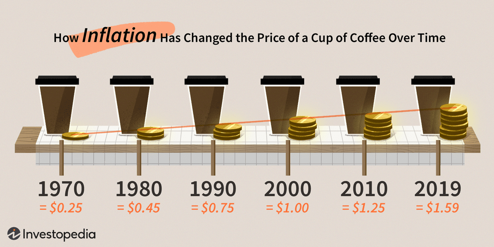

The interplay between inflation, money supply, economic impact, and algorithmic trading is a complex but crucial topic in modern finance. Inflation, the rate at which the general level of prices for goods and services rises, erodes purchasing power and is often driven by changes in the money supply. The money supply encompasses the total amount of monetary assets available in an economy at a specific time, which central banks influence through monetary policy tools such as interest rates and open market operations.

Algorithmic trading, also known as algo trading, relies on computer algorithms and complex models to execute trades at speeds and frequencies that are impossible for human traders. These algorithms often incorporate a range of economic indicators, including data on money supply, to forecast market movements and make informed trading decisions.



Understanding the interconnections among these factors is crucial for both economic policymakers and market participants. By analyzing how changes in the money supply can influence inflation and, in turn, how inflation impacts trading strategies, stakeholders can better anticipate market trends. This knowledge is essential to optimizing trading strategies, as it allows for more accurate forecasting and risk management.

For instance, an increase in the money supply can lead to inflationary pressures, altering interest rates and thus impacting borrowing and investment decisions. Algo trading systems, by incorporating these macroeconomic indicators, can adapt strategies to capitalize on these shifts, providing traders with a competitive advantage.

In summary, the relationship between inflation, money supply, and algorithmic trading forms a dynamic framework shaping financial markets. By understanding these elements and their interactions, traders and investors can enhance their strategic approaches, effectively navigating the complexities of modern economic landscapes.

## Table of Contents

## Understanding Inflation and Money Supply

Inflation is a phenomenon that occurs when the money supply grows at a rate surpassing that of economic output, causing a general rise in the prices of goods and services. This increase in prices diminishes purchasing power, meaning consumers can buy less with the same amount of money. The relationship between money supply and economic output is pivotal in understanding why inflation happens and how it affects the broader economy.

The Federal Reserve, the central banking system of the United States, plays a critical role in managing the money supply to uphold economic stability. It employs various monetary policy tools to achieve this balance. One of the primary methods is adjusting interest rates, specifically the federal funds rate, which influences borrowing costs across the economy. Lowering interest rates can encourage borrowing and investment, thereby increasing the money supply and potentially stimulating economic activity. Conversely, raising rates can cool off an overheated economy by reducing borrowing and slowing growth in money circulation.

Another tool at the Federal Reserve's disposal is open market operations, which involve the buying and selling of government securities in the open market. When the Federal Reserve buys securities, it injects [liquidity](/wiki/liquidity-risk-premium) into the banking system, increasing the money supply. Selling securities does the opposite by withdrawing liquidity and tightening the money supply.

These interventions are guided by economic theories such as the Quantity Theory of Money. This theory posits a direct relationship between the quantity of money in an economy and the level of prices of goods and services. Expressed by the formula $MV = PT$, where $M$ denotes the money supply, $V$ represents the velocity of money (how often each unit of currency is used in transactions within a given period), $P$ is the price level, and $T$ signifies the transaction [volume](/wiki/volume-trading-strategy) or total output.

According to the Quantity Theory, if the money supply increases while the velocity of money and the transaction volume remain stable, the price level must rise – leading to inflation. This concept is integral to monetary policy decisions, as understanding the dynamic between these variables allows policymakers to predict the potential impact on the economy and adjust their strategies accordingly.

In conclusion, comprehending the mechanisms of inflation and money supply management is essential for grasping how economic policies are formulated and implemented. By regulating the money supply, central banks aim to balance economic growth with price stability, ensuring a stable economic environment conducive to sustainable development.

## Economic Impacts of Money Supply Changes

Changes in the money supply exert significant influence on an economy, manifesting as inflation, deflation, or hyperinflation, depending on underlying economic conditions. Broadly, the money supply relates to how much currency and coinage is circulating in the economy, including various types of bank deposits. This circulation affects purchasing power, pricing, and overall economic stability.

### Inflation and Growth Stimulation

An increase in the money supply is often employed to stimulate economic growth, especially during periods of stagnation or recession. The theoretical underpinning is that more money in circulation leads to lower interest rates, encouraging borrowing and spending by businesses and consumers. This can, in turn, boost economic activity and drive up Gross Domestic Product (GDP). However, this approach carries the risk of runaway inflation if the growth in money supply outpaces the economy's ability to produce goods and services. 

Mathematically, the relationship between money supply (M) and price level (P) can be captured by the equation of exchange from the Quantity Theory of Money:

$$
MV = PQ
$$

Where:
- $M$ is the money supply,
- $V$ is the velocity of money,
- $P$ is the price level, and
- $Q$ is the quantity of goods and services produced.

When $M$ increases rapidly, without a corresponding increase in $Q$, $P$ tends to rise, resulting in inflation.

### Tight Money Supply and Economic Contraction

Conversely, a restrictive monetary policy — one that reduces the money supply — can mitigate inflationary pressures. By increasing interest rates or enacting measures to withdraw liquidity from the economy, central banks can temper demand, stabilizing prices. However, this can lead to increased unemployment and slower economic growth, as higher borrowing costs tend to suppress consumer spending and business investment.

The challenge lies in maintaining a balanced approach, where the money supply supports growth without destabilizing prices or pushing the economy into recession. 

### Case Study: COVID-19 Pandemic

The economic disruptions caused by the COVID-19 pandemic in 2020 prompted unprecedented monetary policy interventions worldwide. Central banks, including the Federal Reserve, injected vast quantities of money into the financial system to prevent economic collapse. By doing so, they managed to stabilize financial markets and support economic recovery. However, as the pandemic's effects waned and economies reopened, the additional liquidity led to significant inflationary pressures, illustrating the delicate balance needed when adjusting money supply. The response highlighted how centrally-controlled money supply adjustments could impact economic activity, interest rates, and subsequently inflation. 

Overall, the money supply's impact on the economy underscores the importance of careful and responsive monetary policy. Understanding these dynamics helps policymakers devise strategies to stabilize economic performance, aiming for employment and price stability.

## Algorithmic Trading and Economic Indicators

Algorithmic trading utilizes automated systems defined by pre-set rules and complex mathematical models to execute trades at optimal timings. These systems heavily rely on economic indicators to predict and capitalize on market movements. Key among these indicators are measures of money supply and interest rates, which reflect the level of economic activity and monetary policy stance.

Monetary aggregates, including M0 (physical currency in circulation), M1 (M0 plus demand deposits), and M2 (M1 plus savings deposits, small-time deposits, and retail money market funds), act as barometers of economic liquidity. These indicators are integral to [algorithmic trading](/wiki/algorithmic-trading) strategies, providing insights into the purchasing power within the economy and facilitating predictions of market movements.

For algorithmic traders, the incorporation of these indicators allows for the creation of strategies that respond dynamically to economic changes. For example, a substantial increase in M2 might suggest potential inflationary pressures, prompting adjustments in trading algorithms to mitigate risks or take advantage of anticipated price changes. Additionally, changes in central bank policies, such as alterations in interest rates, can directly influence trading decisions by affecting the cost of borrowing and the attractiveness of different asset classes.

Algorithmic strategies gain a competitive edge by fine-tuning their response to these economic signals. The ability to incorporate real-time data enables traders to act swiftly, securing better trade execution. Python code, for instance, is frequently employed to construct models that gauge these economic indicators:

```python
import pandas as pd
import numpy as np

# Assume 'economic_data.csv' contains columns: 'Date', 'M0', 'M1', 'M2', 'InterestRate'
df = pd.read_csv('economic_data.csv', parse_dates=['Date'])

# Calculate simple moving average for M2 to spot trends
df['M2_SMA'] = df['M2'].rolling(window=3).mean()

# Feature: Economic Liquidity Index, a weighted sum of M0, M1, M2
df['Economic_Liquidity_Index'] = 0.1 * df['M0'] + 0.3 * df['M1'] + 0.6 * df['M2']

# Simple logic to determine trade action, based on M2 trends and interest rates
def make_trade_decision(row):
    if row['M2_SMA'] > row['M2'] and row['InterestRate'] < 1.5:
        return 'Buy'
    elif row['M2_SMA'] < row['M2'] and row['InterestRate'] > 2.0:
        return 'Sell'
    else:
        return 'Hold'

df['Trade_Action'] = df.apply(make_trade_decision, axis=1)
```

This example illustrates the use of moving averages and economic liquidity indexes as components in trade decision models. Such methods underscore the value of algorithms capable of processing comprehensive datasets to deliver prompt responses to economic conditions. By continuously refining these strategies, algorithmic traders are better equipped to navigate the intricate dynamics of financial markets effectively.

## Case Study: Monetary Policy and Algo Trading

The Federal Reserve's monetary policies, including quantitative easing (QE) and tightening, have significantly impacted trading strategies, particularly those employed in algorithmic trading. These policies aim to control the money supply and influence economic activity. Understanding their effects on financial markets is essential for developing effective algorithmic trading strategies.

Quantitative easing, implemented during times of economic stress, involves the large-scale purchase of government securities or other financial assets to inject liquidity into the economy. This increase in the money supply aims to lower interest rates and encourage borrowing and investment. Algorithmic traders, who rely on sophisticated models, must adjust their strategies to account for increased market liquidity and potential shifts in asset prices. For instance, a Python model might include code to dynamically adjust investment allocations based on monetary policy signals:

```python
def adjust_allocation(interest_rate, liquidity_index):
    if liquidity_index > 0.5 and interest_rate < 0.02:  # Example thresholds
        return 'Increase equity allocation'
    else:
        return 'Maintain or decrease equity allocation'
```

Conversely, quantitative tightening, which involves reducing the money supply by selling off assets, can lead to higher interest rates and decreased liquidity. This shift can create opportunities for algorithmic traders to capitalize on [volatility](/wiki/volatility-trading-strategies) and market corrections. Traders analyze historical data to predict how tightening may affect asset prices and volatility. Post-2008 data reveals that algorithmic models adapted to these conditions by factoring in reduced liquidity and increased risk premiums.

The response to the COVID-19 pandemic further illustrates how monetary policy influences market behavior. The Federal Reserve's rapid implementation of QE measures led to unprecedented liquidity levels. Algo traders quickly integrated real-time economic data into their algorithms to anticipate and respond to these macroeconomic changes. By employing [machine learning](/wiki/machine-learning) techniques, they could refine predictions and adjust trading strategies in real-time, enhancing their competitive edge.

An essential aspect of algorithmic trading in this context is the integration of real-time economic data, enabling quicker adaptation to policy shifts. Economic indicators, such as inflation rates, employment figures, and GDP growth, are continuously monitored to optimize trading decisions. The ability to harness and interpret this data allows traders to identify trends and make informed decisions promptly.

Overall, the ability to swiftly adjust to monetary policy changes is crucial for algorithmic traders aiming to maintain profitability in dynamic markets. Integrating advanced data analytics and economic theory ensures that trading strategies remain robust and responsive to the ever-evolving financial landscape.

## Conclusion

Understanding the intricate relationship between inflation, money supply, and algorithmic trading is essential for successfully navigating modern financial markets. Inflation, often influenced by shifts in the money supply, plays a critical role in shaping market conditions. As central banks adjust monetary policies to stabilize economies, algorithmic trading systems must adapt to efficiently respond to these evolving economic signals.

Effective trading strategies integrate economic theory with advanced technological tools to predict and capitalize on market shifts. For instance, by incorporating key economic indicators and data analytics, algorithmic traders can optimize their strategies. Tools such as machine learning models can be utilized to process vast amounts of historical and real-time data, enabling traders to identify patterns and anticipate future price movements. 

Consider a Python-based approach for integrating economic data into trading strategies. One might use libraries such as Pandas for data manipulation and Scikit-learn for predictive modeling:

```python
import pandas as pd
from sklearn.ensemble import RandomForestRegressor

# Assuming 'economic_data.csv' contains relevant economic indicators
data = pd.read_csv('economic_data.csv')

# Feature engineering and model training
features = data[['money_supply', 'interest_rates', 'inflation_rate']]
target = data['market_index']

model = RandomForestRegressor()
model.fit(features, target)

# Predicting future market trends based on new economic data
new_data = [[12000, 1.5, 2.2]]  # example new economic conditions
predicted_index = model.predict(new_data)
```

Continuous analysis and strategic adjustments ensure that traders remain agile and responsive to an ever-changing economic landscape. As financial markets evolve, maintaining a feedback loop where algorithmic models are regularly updated with the latest data and recalibrated becomes crucial. This adaptability allows traders to manage risks effectively and seize opportunities as they arise.

Investors who cultivate a deep understanding of these interconnections, coupled with technological prowess, are better positioned to navigate the complexities of the financial markets. By using advanced tools and continuously adjusting their strategies, they can enhance their trading performance, minimize potential losses, and exploit new market opportunities.

## References & Further Reading

[1]: Friedman, M. (1970). ["A Theoretical Framework for Monetary Analysis."](https://www.jstor.org/stable/1830684) Journal of Political Economy, 78(2), 193-238.

[2]: ["Advances in Financial Machine Learning"](https://www.amazon.com/Advances-Financial-Machine-Learning-Marcos/dp/1119482089) by Marcos Lopez de Prado

[3]: ["The Federal Reserve System: Purposes and Functions"](https://www.federalreserve.gov/aboutthefed/files/pf_3.pdf) by the Federal Reserve

[4]: ["Evidence-Based Technical Analysis: Applying the Scientific Method and Statistical Inference to Trading Signals"](https://www.amazon.com/Evidence-Based-Technical-Analysis-Scientific-Statistical/dp/0470008741) by David Aronson

[5]: Taylor, J. B. (1999). ["A Historical Analysis of Monetary Policy Rules."](https://www.nber.org/system/files/chapters/c7419/c7419.pdf) In Monetary Policy Rules (pp. 319-341). National Bureau of Economic Research.

[6]: ["Quantitative Trading: How to Build Your Own Algorithmic Trading Business"](https://www.amazon.com/Quantitative-Trading-Build-Algorithmic-Business/dp/1119800064) by Ernest P. Chan

[7]: ["Machine Learning for Algorithmic Trading"](https://github.com/stefan-jansen/machine-learning-for-trading) by Stefan Jansen

[8]: Bernanke, B. S. (2005). ["The Global Saving Glut and the U.S. Current Account Deficit."](https://www.federalreserve.gov/boarddocs/speeches/2005/200503102/) Remarks at the Sandridge Lecture, Virginia Association of Economists, Richmond, Virginia.