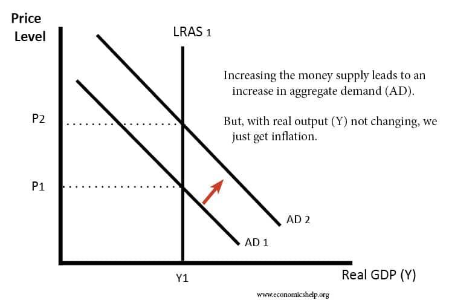

## Table of Contents

## What is money supply?

Money supply is the total amount of money available in an economy at a specific time. It includes all the cash, coins, and money in bank accounts that people and businesses can use to buy things or pay for services. Think of it like a big pool of money that everyone in the country can dip into. The size of this pool can change, and it's important because it affects how the economy grows or slows down.

The money supply is measured in different ways, usually called M0, M1, and M2. M0 is the most basic measure and includes just the physical money, like coins and notes. M1 adds in money in checking accounts, which people can easily use. M2 goes further and includes money in savings accounts and other types of deposits that are a bit harder to spend right away. Each measure gives a different view of how much money is out there and how it's being used.

Central banks, like the Federal Reserve in the United States, keep a close eye on the money supply. They can increase or decrease it to help control inflation or boost the economy. For example, if they want to slow down inflation, they might reduce the money supply to make money more valuable. If they want to encourage spending and growth, they might increase it. It's a bit like turning a tap to control the flow of water into the pool of money.

## What is inflation?

Inflation is when the prices of things we buy, like food, clothes, and toys, go up over time. It means that the same amount of money can buy less stuff than it used to. For example, if a candy bar cost $1 last year and now it costs $1.10, that's inflation. It happens because the amount of money in the economy can grow faster than the number of goods and services available.

Inflation is measured by looking at the average price changes of a big group of things people buy, called a "basket of goods." This helps us understand how much more expensive life is getting. A little bit of inflation is normal and can be good because it encourages people to spend money now rather than later. But if inflation gets too high, it can make it hard for people to afford things, and it can hurt the economy.

Central banks, like the Federal Reserve in the U.S., try to keep inflation at a level that helps the economy grow without getting out of control. They do this by adjusting interest rates and the money supply. If inflation is too high, they might raise interest rates to make borrowing money more expensive, which can slow down spending and help bring prices down.

## How is money supply measured?

Money supply is measured in different ways to show how much money is available in an economy. The most basic way is called M0, which counts all the physical money like coins and paper notes. This is the money you can touch and use right away. M1 goes a bit further by adding in the money people keep in their checking accounts, which they can easily spend with a card or a check. So, M1 includes M0 plus the money in checking accounts.

Then there's M2, which is a broader measure. M2 includes everything in M1, plus money in savings accounts and other types of deposits that are not as easy to spend right away. This gives a bigger picture of the money available because it counts money that people might use soon, even if it's not as quick to access as the money in their checking accounts. Each of these measures helps economists and central banks understand how much money is out there and how it's being used, which is important for making decisions about the economy.

## What are the different types of inflation?

There are several types of inflation, and each one happens for different reasons. The first type is called demand-pull inflation. This happens when people want to buy more things than what's available. Imagine everyone wanting to buy the latest toy, but there aren't enough toys to go around. So, the price of the toy goes up because everyone is trying to get it. Another type is cost-push inflation, which happens when it costs more to make things. If the price of the materials needed to make a toy goes up, the toy's price will go up too, even if people aren't buying more toys.

Another kind of inflation is built-in inflation, also known as wage-price inflation. This happens when workers want higher wages because prices are going up, and then businesses raise prices to cover the higher wages. It's like a cycle where prices and wages keep pushing each other up. There's also hyperinflation, which is when prices go up very, very fast. This is rare but can happen if a country prints too much money or has big economic problems. Hyperinflation can make money lose its value quickly, so people rush to spend it before prices go up even more.

Lastly, there's deflation, which is the opposite of inflation. Deflation happens when prices start to go down instead of up. This can sound good, but it can actually be bad for the economy because people might wait to buy things, hoping prices will drop even more. This can slow down the economy and make businesses struggle. Understanding these different types of inflation helps us see why prices change and how it affects our lives.

## How does an increase in money supply affect inflation?

When there's more money in the economy, it can lead to higher inflation. Think of it like this: if everyone suddenly has more money to spend, they'll want to buy more things. But if the number of things to buy stays the same, the prices of those things will go up. It's like too many people trying to buy the same toy, so the price of the toy goes up. This is called demand-pull inflation, and it happens because there's more money chasing the same amount of goods and services.

Central banks keep a close eye on the money supply to control inflation. If they see that there's too much money around, they might try to slow down how fast the money supply is growing. They can do this by raising interest rates, which makes borrowing money more expensive. When borrowing is more expensive, people and businesses might spend less, which can help keep prices from going up too fast. So, managing the money supply is a big part of keeping inflation under control.

## Can you explain the quantity theory of money?

The quantity theory of money is a simple idea that helps us understand how the amount of money in an economy affects prices. It says that if the amount of money grows faster than the number of things to buy, prices will go up. Imagine if everyone got twice as much money, but there were still the same number of toys to buy. People would be willing to pay more for those toys, so the prices would go up. This theory is often summed up with a formula: MV = PQ, where M is the money supply, V is the velocity of money (how fast money moves around), P is the price level, and Q is the quantity of goods and services.

In simple terms, if the money supply (M) goes up and everything else stays the same, prices (P) will go up too. This is because more money chasing the same amount of stuff makes each thing more valuable. But, the theory also says that if the velocity of money (V) changes, or if the number of goods and services (Q) changes, it can affect prices too. So, while the quantity theory of money gives us a good basic idea, it's not the only thing that matters when we're trying to understand why prices change.

## What role does the central bank play in controlling money supply?

The central bank, like the Federal Reserve in the U.S., is like a big boss that helps control how much money is in the economy. One way they do this is by changing interest rates. If they want more money in the economy, they can lower interest rates. This makes it cheaper for people and businesses to borrow money, so they might spend more. If they want less money around, they can raise interest rates. This makes borrowing more expensive, so people might spend less. The central bank can also buy or sell government bonds. When they buy bonds, they put more money into the economy. When they sell bonds, they take money out.

Another way the central bank controls the money supply is by setting rules for banks. They can tell banks how much money they need to keep in reserve instead of lending it out. If the central bank says banks need to keep more money in reserve, there's less money for banks to lend, so the money supply grows more slowly. If they let banks keep less in reserve, banks can lend more, and the money supply grows faster. By using these tools, the central bank tries to keep the economy growing steadily without letting inflation get out of control.

## How do monetary policies influence inflation through money supply?

Monetary policies are the tools that central banks use to control the money supply and influence inflation. One main tool is changing interest rates. If the central bank wants to slow down inflation, they might raise interest rates. This makes borrowing money more expensive, so people and businesses might spend less. When people spend less, there's less money chasing the same amount of goods, which can help keep prices from going up too fast. On the other hand, if the central bank wants to boost the economy and maybe accept a bit more inflation, they might lower interest rates. This makes borrowing cheaper, so people might spend more, which can help the economy grow but might also push prices up a bit.

Another way monetary policy affects the money supply is through buying and selling government bonds. When the central bank buys bonds, it's putting more money into the economy because they pay for the bonds with new money. This can make the money supply grow faster, which might lead to more spending and higher inflation. If the central bank sells bonds, they're taking money out of the economy because people pay for the bonds with their money. This can slow down the growth of the money supply and help keep inflation in check. By using these tools, central banks try to balance the economy so it grows without letting inflation get out of control.

## What are the historical examples where changes in money supply significantly impacted inflation?

One big example of how changing the money supply can affect inflation happened in Germany after World War I. The German government was in a lot of debt and decided to print more money to pay it off. They printed so much money that there was way more money than things to buy. This led to hyperinflation, where prices went up really fast. People had to [carry](/wiki/carry-trading) wheelbarrows full of money just to buy a loaf of bread. It got so bad that money lost its value, and it made life very hard for everyone.

Another example is from the United States in the 1970s. During this time, the U.S. government spent a lot of money on things like the Vietnam War and social programs. To pay for all this, they increased the money supply. At the same time, there were problems with oil supplies, which made the cost of making things go up. This led to a situation called stagflation, where prices went up (inflation) but the economy wasn't growing. The Federal Reserve, which is like the U.S.'s central bank, had to raise interest rates a lot to slow down the money supply and bring inflation under control. It took a few years, but they finally managed to do it.

## How do expectations of inflation affect the relationship between money supply and inflation?

Expectations of inflation can really change how money supply affects inflation. If people think prices are going to go up, they might start spending their money faster. They want to buy things before they get more expensive. This can make the economy grow faster because more money is moving around. But it can also push prices up even more because everyone is trying to buy things at the same time. So, if the central bank increases the money supply and people expect inflation, it can make inflation happen faster and stronger.

On the other hand, if people don't expect prices to go up, they might not change their spending habits much even if the money supply grows. They might keep saving their money or spend it slowly, thinking prices will stay the same. This can make the effect of increasing the money supply less strong on inflation. So, what people think about the future can really change how much increasing the money supply will make prices go up. Central banks have to think about these expectations when they're trying to control inflation.

## What are the limitations of using money supply as a predictor of inflation?

Using money supply to predict inflation isn't always perfect because there are other things that can affect prices too. For example, if people start spending their money faster or slower than usual, it can change how much inflation happens even if the money supply stays the same. Also, things like oil prices or big changes in what people want to buy can push prices up or down, no matter what the money supply is doing. So, while the money supply is important, it's not the only thing that matters when trying to guess what will happen with inflation.

Another problem is that the way we measure money supply can be tricky. There are different ways to count it, like M1 and M2, and each one gives a different picture of how much money is out there. Sometimes, the money that's easy to spend (like in checking accounts) might not tell the whole story because people might also have money in savings accounts or other places that are harder to spend right away. So, looking at just one measure of money supply might not give a clear idea of what's going to happen with inflation. It's like trying to predict the weather by only looking at the temperature and not considering things like humidity or wind.

## How do international factors and exchange rates modify the impact of money supply on inflation?

International factors and exchange rates can really change how money supply affects inflation. Imagine a country that imports a lot of stuff from other countries. If their money supply grows and their currency gets weaker compared to other countries' money, it can make those imports more expensive. This is because they need more of their own money to buy the same things from abroad. When the price of imports goes up, it can push up prices at home too, making inflation happen even if the money supply didn't grow that much.

Exchange rates also play a big role. If a country's currency gets stronger, it can make imports cheaper, which might help keep prices from going up too fast. But if the currency gets weaker, it can make everything more expensive, adding to inflation. Central banks have to think about these international effects when they're trying to control the money supply and keep inflation in check. It's like trying to balance a seesaw with a lot of different weights on each side.

## What are the economic impacts of changes in money supply?

Changes in the money supply exert significant influence on an economy, manifesting as inflation, deflation, or hyperinflation, depending on underlying economic conditions. Broadly, the money supply relates to how much currency and coinage is circulating in the economy, including various types of bank deposits. This circulation affects purchasing power, pricing, and overall economic stability.

### Inflation and Growth Stimulation

An increase in the money supply is often employed to stimulate economic growth, especially during periods of stagnation or recession. The theoretical underpinning is that more money in circulation leads to lower interest rates, encouraging borrowing and spending by businesses and consumers. This can, in turn, boost economic activity and drive up Gross Domestic Product (GDP). However, this approach carries the risk of runaway inflation if the growth in money supply outpaces the economy's ability to produce goods and services. 

Mathematically, the relationship between money supply (M) and price level (P) can be captured by the equation of exchange from the Quantity Theory of Money:

$$
MV = PQ
$$

Where:
- $M$ is the money supply,
- $V$ is the velocity of money,
- $P$ is the price level, and
- $Q$ is the quantity of goods and services produced.

When $M$ increases rapidly, without a corresponding increase in $Q$, $P$ tends to rise, resulting in inflation.

### Tight Money Supply and Economic Contraction

Conversely, a restrictive monetary policy — one that reduces the money supply — can mitigate inflationary pressures. By increasing interest rates or enacting measures to withdraw [liquidity](/wiki/liquidity-risk-premium) from the economy, central banks can temper demand, stabilizing prices. However, this can lead to increased unemployment and slower economic growth, as higher borrowing costs tend to suppress consumer spending and business investment.

The challenge lies in maintaining a balanced approach, where the money supply supports growth without destabilizing prices or pushing the economy into recession. 

### Case Study: COVID-19 Pandemic

The economic disruptions caused by the COVID-19 pandemic in 2020 prompted unprecedented monetary policy interventions worldwide. Central banks, including the Federal Reserve, injected vast quantities of money into the financial system to prevent economic collapse. By doing so, they managed to stabilize financial markets and support economic recovery. However, as the pandemic's effects waned and economies reopened, the additional liquidity led to significant inflationary pressures, illustrating the delicate balance needed when adjusting money supply. The response highlighted how centrally-controlled money supply adjustments could impact economic activity, interest rates, and subsequently inflation. 

Overall, the money supply's impact on the economy underscores the importance of careful and responsive monetary policy. Understanding these dynamics helps policymakers devise strategies to stabilize economic performance, aiming for employment and price stability.

## References & Further Reading

[1]: Friedman, M. (1970). ["A Theoretical Framework for Monetary Analysis."](https://www.jstor.org/stable/1830684) Journal of Political Economy, 78(2), 193-238.

[2]: ["Advances in Financial Machine Learning"](https://www.amazon.com/Advances-Financial-Machine-Learning-Marcos/dp/1119482089) by Marcos Lopez de Prado

[3]: ["The Federal Reserve System: Purposes and Functions"](https://www.federalreserve.gov/aboutthefed/files/pf_3.pdf) by the Federal Reserve

[4]: ["Evidence-Based Technical Analysis: Applying the Scientific Method and Statistical Inference to Trading Signals"](https://www.amazon.com/Evidence-Based-Technical-Analysis-Scientific-Statistical/dp/0470008741) by David Aronson

[5]: Taylor, J. B. (1999). ["A Historical Analysis of Monetary Policy Rules."](https://www.nber.org/system/files/chapters/c7419/c7419.pdf) In Monetary Policy Rules (pp. 319-341). National Bureau of Economic Research.

[6]: ["Quantitative Trading: How to Build Your Own Algorithmic Trading Business"](https://www.amazon.com/Quantitative-Trading-Build-Algorithmic-Business/dp/1119800064) by Ernest P. Chan

[7]: ["Machine Learning for Algorithmic Trading"](https://github.com/stefan-jansen/machine-learning-for-trading) by Stefan Jansen

[8]: Bernanke, B. S. (2005). ["The Global Saving Glut and the U.S. Current Account Deficit."](https://www.federalreserve.gov/boarddocs/speeches/2005/200503102/) Remarks at the Sandridge Lecture, Virginia Association of Economists, Richmond, Virginia.