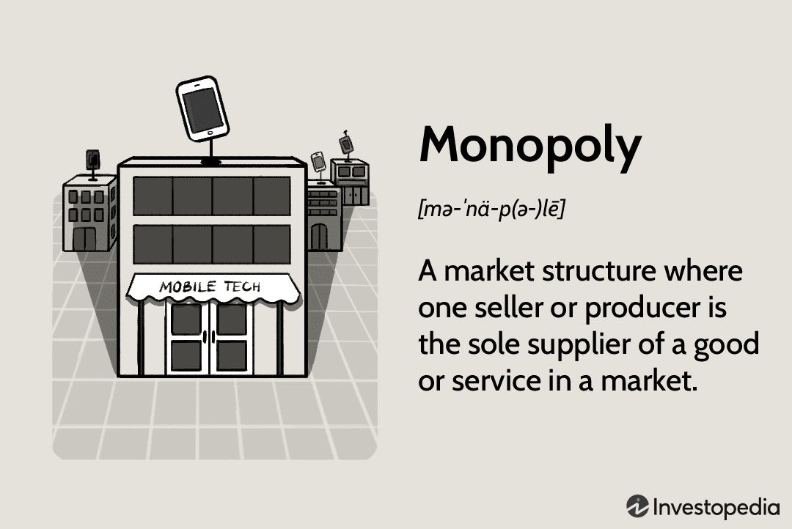

Monopolies, defined as market structures where a single firm controls the entire market supply of a product or service, play a crucial role in economics. These entities have the power to influence prices and output levels, often leading to reduced competition and consumer choice. Monopolies can emerge through various pathways such as government regulation, ownership of key resources, strategic mergers, or innovation that outpaces competitors. Their economic significance is rooted in their ability to dictate market conditions, influence economic efficiency, and impact consumer welfare through their pricing strategies and control over supply chains.

Algorithmic trading, or algo trading, refers to the use of computer algorithms to automate trading decisions and execute orders in financial markets. This concept has rapidly gained traction due to its potential to process vast amounts of data quickly and execute transactions at speeds unattainable by human traders. The evolution of algorithms, fueled by advancements in technology and data analytics, has revolutionized trading by enhancing efficiency and potentially increasing returns, although not without associated risks such as increased market volatility.

The objective of this article is to explore the interconnections between monopolies, economic market impact, and algorithmic trading. By examining the dynamics between these elements, we aim to shed light on how monopolistic behaviors can influence market operations and how algorithmic trading, in turn, affects market dynamics and competition. Understanding these interactions is vital in the modern economic environment, where technology-driven market strategies have become pervasive.

In the current financial landscape, the influence of monopolies and algorithmic trading warrants scrutiny from regulators, policymakers, and market participants alike. The article will cover several key areas: defining monopolies and their historical context, examining their economic market impacts, and introducing algorithmic trading. It will also analyze how algorithmic trading affects market dynamics and explore the potential interconnections between monopolies and algo trading. Finally, the discussion will culminate in an analysis of various case studies, concluding with insights and recommendations for future economic systems. By elucidating these topics, this article aims to provide a comprehensive understanding of the complex interplay between monopolistic practices and advanced trading technologies.

## Table of Contents

## Understanding Monopolies

A monopoly is characterized by a single entity's dominance over a particular market or industry, effectively controlling the supply of goods or services while significantly influencing prices and output levels. Such dominance usually results from barriers that prevent competitors from entering the market, including legal restrictions, resource ownership, network effects, and high startup costs. This dominance allows the monopolistic entity considerable power to set prices higher than they might be in a more competitive environment, often leading to reduced consumer surplus and economic inefficiency.

### Historical Context and Famous Examples of Monopolies

Historically, monopolies have played a significant role in shaping economic landscapes. One prominent example is Standard Oil, which dominated the oil industry in the late 19th century under John D. Rockefeller. Through strategic acquisitions and aggressive pricing tactics, Standard Oil controlled approximately 90% of the U.S. oil refining capacity, leading to its dissolution by the U.S. Supreme Court in 1911 under antitrust regulations. Another example is the British East India Company, which held monopoly control over trade in vast regions, significantly impacting the global trade and economic policies of the 17th and 18th centuries.

### Impact of Monopolies on Consumer Choice and Market Competition

Monopolies can significantly impact consumer choice and market competition. With few or no competitors, a monopolistic entity might decrease product quality, limit choices, or set prices above an equilibrium level, adversely impacting consumer welfare. For instance, consumers may face higher prices and fewer alternatives, leading to a decline in consumer sovereignty. Furthermore, monopolistic practices can stifle innovation and efficiency, as the lack of competitive pressure reduces the incentive for continuous improvement.

### Regulatory Challenges and Economic Policies Surrounding Monopolies

Regulating monopolies presents numerous challenges, as governments must balance the prevention of abusive market power with encouraging economic growth and innovation. Antitrust laws and regulations, such as the Sherman Antitrust Act and the Clayton Antitrust Act in the United States, aim to restrict anti-competitive practices and promote fair competition. Despite these regulations, enforcement can be complex due to economic and political influences, evolving business models, and technological advancements that continually reshape market dynamics.

### Debate Over the Pros and Cons of Monopolies in Economic Theory

The debate over monopolies in economic theory is multifaceted. On one hand, monopolies can result in allocative inefficiency and a deadweight loss to society as they maximize profits by producing at a level where marginal cost is less than marginal revenue. This not only reduces consumer surplus but also leads to inefficiencies. On the other hand, monopolies may benefit from economies of scale, enabling lower production costs and potentially significant investments in innovation and research, which can lead to technological advancements. 

Notably, some economic theorists argue that monopolies can drive progress, as profits gained from market control are reinvested into innovation and infrastructure, potentially benefiting consumers in the long run. However, these potential benefits are contingent upon the presence of regulatory frameworks that ensure monopolistic power is not abused to the detriment of consumers and overall market health.

## Economic Market Impact of Monopolies

Monopolies can exert a profound effect on market prices and supply-demand dynamics due to their substantial market power. Market power allows a monopolistic entity to act as a price maker rather than a price taker, setting prices above marginal cost, which can lead to abnormal profits. The ability to influence prices often results from the lack of competition and high entry barriers for other firms. In mathematical terms, a monopoly maximizes profit where marginal revenue ($MR$) equals marginal cost ($MC$), allowing the entity to set higher prices ($P$) than in competitive markets where $P = MC$.

The pricing strategies monopolies employ, such as price discrimination, allow them to charge different prices to different consumer segments based on willingness to pay. This involves segmenting the market and extracting consumer surplus, therefore maximizing profits through targeted pricing mechanisms.

Monopolies often impede innovation and technological advancement due to reduced competitive pressures. In competitive markets, firms continuously innovate to gain an edge over competitors by improving products or reducing costs. However, a monopolistic firm, while still capable of innovation, may lack the incentive to do so rapidly or extensively because of secure market dominance. Conversely, in certain cases, monopolies can channel significant resources into research and development due to their large revenue base, potentially yielding pioneering advancements.

The social and economic ramifications of monopolistic structures often manifest in wealth distribution and inequality. Monopolies can lead to the concentration of wealth in the hands of a few corporate entities or individuals, thus exacerbating economic inequality. This concentration is not limited to wealth but includes political and economic power, potentially influencing regulatory frameworks in favor of monopolistic interests.

Monopolistic practices might also result in adverse long-term effects on market health and sustainability. The inefficiencies inherent in monopolistic markets, such as allocative and productive inefficiency, can lead to welfare losses over time. From a consumer perspective, limited choices and higher prices diminish consumer surplus, while from a producer perspective, incentives to enhance operational efficiency may wane.

Moreover, monopolies can create significant barriers for new entrants, stifling entrepreneurial ventures and innovation at the grassroots level. This suppression of new competition keeps the market stagnant and limits economic diversity. As a result, markets under monopolistic dominance risk becoming less adaptable to changes in consumer preferences and technological advancements, threatening long-term economic vitality.

Overall, monopolistic market structures considerably shape various economic factors, including pricing, innovation, wealth distribution, and market sustainability. Understanding these dynamics is crucial in evaluating the broader implications of monopolies within modern economies.

 to Algorithmic Trading

Algorithmic trading, commonly referred to as algo trading, involves using computer programs and systems to execute trades in financial markets based on predefined criteria. These criteria can include various factors such as timing, price, and [volume](/wiki/volume-trading-strategy) to capitalize on trading opportunities unavailable through manual trading. The fundamental principles of algo trading revolve around speed, accuracy, and the ability to process a vast amount of data to make informed trading decisions almost instantaneously.

The evolution of [algorithmic trading](/wiki/algorithmic-trading) has been significant, particularly over the last few decades. Initially, algorithmic trading was mainly utilized by large institutional investors who had access to the necessary technological infrastructure. However, advancements in computing power and decreasing costs have democratized access, enabling smaller firms and individual traders to engage in algorithmic trading. In the early 2000s, algo trading began to gain prominence with the advent of electronic trading platforms, which replaced traditional floor trading. This transition accelerated the adoption of algorithms as traders sought tools capable of executing trades faster and more efficiently than human traders.

Key technologies driving the growth of algorithmic trading include high-frequency trading ([HFT](/wiki/high-frequency-trading-strategies)) systems, [machine learning](/wiki/machine-learning) algorithms, and improved data analytics. High-frequency trading exploits very short-term market inefficiencies, often executing millions of trades per day at extremely high speeds. Machine learning algorithms have brought a new dimension to algo trading by allowing systems to learn from historical data and adapt to new market conditions. Improved data analytics enable traders to process vast amounts of real-time information to forecast market trends and make strategic trading decisions.

When compared to traditional trading methods, algorithmic trading offers several distinct advantages. Traditional trading relies heavily on human judgment and manual execution, which can be slower and subject to emotional bias. In contrast, algorithmic trading eliminates human error and bias by automating the trading process. It allows for [backtesting](/wiki/backtesting) strategies on historical data, enabling traders to refine their models for improved future performance. Furthermore, algo trading provides the capability to monitor multiple markets and instruments simultaneously, a task impractical for human traders.

Despite its advantages, algorithmic trading also carries potential risks. One significant risk is the potential for technical failures or glitches, which can lead to erroneous trades and substantial financial losses. Flash crashes, where markets plummet and recover rapidly, have occasionally been associated with algorithmic trading systems malfunctioning. Market manipulation is another risk, as sophisticated algorithms could potentially be used to exploit market movements.

Additionally, algorithmic trading can contribute to increased market [volatility](/wiki/volatility-trading-strategies), as rapid automated trading can exacerbate price swings. It requires vigilant regulatory oversight to prevent market abuse and ensure fair trading practices. Traders must carefully consider these risks while designing and deploying their algorithms to safeguard against unintended consequences.

Understanding the evolution, benefits, and risks of algorithmic trading is essential for market participants and regulators alike. It offers the potential for enhanced market efficiency and opportunities for traders while posing challenges that need careful management and regulation.

## How Algorithmic Trading Affects Market Dynamics

Algorithmic trading, commonly referred to as algo trading, plays a significant role in modern financial markets by using automated systems to execute trades at high speed and volume, guided by complex mathematical models and algorithms. This method has significantly reshaped market dynamics, influencing factors such as market efficiency, [liquidity](/wiki/liquidity-risk-premium), volatility, and transaction costs.

One of the primary contributions of algorithmic trading is the enhancement of market efficiency. By quickly assimilating and reacting to new information, algo trading reduces the discrepancies between asset prices and their intrinsic values, thus ensuring more accurate pricing. The speed and precision of these algorithms enable them to capitalize on market inefficiencies in milliseconds, thus narrowing bids and offers which leads to more efficient markets.

Liquidity is another market aspect greatly influenced by algorithmic trading. Algorithms provide liquidity by facilitating a continuous flow of buy and sell orders, thus enabling smoother transactions and reducing the bid-ask spread. This increased liquidity is beneficial for all market participants, as it reduces transaction costs and makes it easier to enter or [exit](/wiki/exit-strategy) positions. However, this benefit comes with the downside of potentially increasing market volatility. When too many algorithmic systems act simultaneously on the same signals, it may result in rapid price swings.

In terms of transaction costs, algorithmic trading is generally seen to reduce these by optimizing order execution. This is achieved through strategies such as slicing large orders into smaller pieces to minimize market impact, a common practice known as "order fragmentation." However, the reduction of direct transaction costs must be weighed against the potential costs arising from increased volatility and the risk of unforeseen events, such as "flash crashes," where rapid selling drives prices downward suddenly.

The regulatory challenges associated with algorithmic trading are considerable. Regulatory bodies worldwide are concerned about the transparency, fairness, and stability of financial markets impacted by algorithms. Ensuring that these highly complex systems do not create unfair advantages or systemic risks is a priority. Regulators are thus increasingly implementing measures to monitor and govern the deployment of trading algorithms, including mandatory testing, registration, and the imposition of circuit breakers to mitigate the impact of rapid market movements.

Ethical considerations also surface in the discourse on algorithmic trading. Algorithms are designed to capitalize on market inefficiencies; however, they can also exacerbate inequalities between market participants. High-frequency trading firms, which leverage cutting-edge technology and infrastructure, may have advantages that are inaccessible to traditional traders, potentially leading to an uneven playing field. Moreover, the opacity of proprietary algorithms raises concerns about fairness and the potential for market manipulation.

Finally, the effects of algorithmic trading on various market participants can be profound. Institutional investors often employ algorithmic trading to execute large trades without noticeable market impact, thereby obtaining better pricing. In contrast, individual investors might face challenges due to their relative lack of access to high-speed trading technologies. Traditional traders might find themselves at a disadvantage, given the speed and complexity at which algorithmic strategies operate.

In conclusion, algorithmic trading has become an integral component of modern financial markets, offering both opportunities and challenges in enhancing market efficiency, liquidity, and cost-effectiveness. However, it also necessitates stringent regulatory oversight and a careful balancing of ethical considerations to ensure a fair and stable market environment for all participants.

## Interconnections Between Monopolies and Algorithmic Trading

Monopolies, by their nature, possess significant market power which can be further augmented through the adoption of algorithmic trading technologies. Algorithmic trading, or algo trading, involves the use of computer algorithms to execute trades at high speed and volume, thus offering the potential to enhance efficiency and profitability for firms that dominate their respective markets. Here, we explore how monopolistic entities may exploit these technologies, the advantages they gain, and the broader implications for market dynamics and regulation.

### Leveraging Algorithmic Trading Technologies

Monopolistic companies, often with substantial resources, can invest heavily in the development and implementation of sophisticated algorithmic trading systems. These systems analyze vast datasets to identify profitable trading opportunities, optimize execution strategies, and minimize transaction costs. By leveraging these technologies, monopolies can maintain or even extend their dominance by optimizing their supply chain efficiencies, setting strategic pricing positions, or through speculative investments that further entrench their market position.

### Competitive Advantages for Monopolistic Firms

Monopolistic firms that employ algorithmic trading gain several competitive advantages:

1. **Cost Efficiency**: Algorithms reduce the need for human intervention in trading processes, cutting costs associated with manual operations.

2. **Speed and Precision**: High-frequency trading capabilities allow monopolies to conduct operations at unprecedented speed and precision, exploiting market fluctuations to their benefit.

3. **Data Utilization**: With access to comprehensive market data, monopolies can develop predictive models that inform strategic decisions in real-time, allowing preemptive actions against potential market disruptions.

4. **Risk Management**: Advanced algorithms aid in risk assessment and management, thus providing monopolies with tools to manage financial exposure effectively.

### Implications for Market Competition and Fairness

The incorporation of algo trading by monopolistic firms raises concerns regarding market fairness and competition. These technologies can amplify existing market power asymmetries, where monopolies, due to their enhanced capabilities, can manipulate market conditions to disfavor smaller competitors, potentially leading to market manipulation practices. Furthermore, the opacity associated with sophisticated algorithms complicates regulatory oversight, posing a challenge in ensuring equitable market practices.

### Case Studies and Real-life Examples

Historically, several cases exemplify how monopolistic behaviors coupled with algorithmic trading have influenced market dynamics. For instance, Google's advertising technology, which functions as a monopoly in its field, utilizes algorithmic auctions that determine ad pricing and placement with minimal human intervention [1]. Critics argue that this system allows Google to extract higher profits while exerting excessive control over market dynamics, as evidenced in antitrust lawsuits filed against the company [2].

### Future Outlook and Potential Regulation

As algorithmic trading continues to evolve, regulators face the challenge of crafting policies that balance innovation with competitive fairness. Potential regulatory measures may include enhancing transparency requirements for algorithmic trading strategies, setting limits on high-frequency trading practices that exacerbate market volatility, and fostering a competitive landscape that limits monopolistic dominance through technology.

Looking forward, the interplay between monopolies and algorithmic trading necessitates careful scrutiny to preserve competitive market ecosystems. Policies must evolve to ensure that the advancements in trading technologies serve broader economic interests rather than entrenching monopolistic power. 

---

**References**:

[1] Varian, H. R., "Position Auctions," *International Journal of Industrial Organization*, vol. 25, no. 6, pp. 1163-1178, 2007.

[2] United States v. Google LLC: Complaint for Injunctive and Other Equitable Relief, Case 3:20-cv-07810, 2020.

## Conclusion

Monopolies have long held a significant place in economic discussions due to their profound effect on market structures. They are notorious for limiting consumer choice, stifling competition, and potentially distorting free market dynamics. By controlling large portions of the market, monopolists can manipulate prices and output levels to their advantage, often to the detriment of consumer welfare and market health. The economic impact of monopolies extends into innovation as their ensured market dominance may reduce incentives to innovate, potentially impeding technological breakthroughs and progress.

Algorithmic trading, however, represents a transformative development in financial markets. It enhances market efficiency through fast and automated decision-making processes, facilitating liquidity and reducing transaction costs. Algo trading's growing prominence highlights the need for robust frameworks to manage its risks while optimizing its benefits. The deployment of sophisticated algorithms can alter market dynamics, influencing liquidity and volatility, and poses significant regulatory challenges to ensure fair play in financial markets.

The interaction between monopolistic behaviors and algorithmic trading unveils complex interdependencies. Monopolies can exploit algorithmic trading to cement their market positions, leveraging technology for competitive advantage. This dual influence raises vital questions about market competition and fairness. Algorithmic strategies, when utilized by monopolies, could lead to scenarios where market prices are further skewed in favor of dominant firms, amplifying existing inequalities and economic imbalances.

To address these challenges, policymakers must devise strategies that balance market power and innovation. Regulations could focus on ensuring transparency and accountability in algorithmic trading, preventing anti-competitive practices by monopolistic firms. Encouraging competition through policies that lower entry barriers and promote fair access to technology for smaller players could also help counteract monopolistic strategies bolstered by algorithmic trading.

Future research should focus on the evolving nature of monopolistic strategies in the context of advancing technologies such as [artificial intelligence](/wiki/ai-artificial-intelligence) and machine learning in trading. Understanding these dynamics will be crucial for developing economic systems that are resilient, equitable, and capable of fostering sustainable growth. As the economic landscape continues to change, the interplay between monopolies and algorithmic trading will remain a critical area of study for economists and policymakers alike.

## References & Further Reading

[1]: Bergstra, J., Bardenet, R., Bengio, Y., & Kégl, B. (2011). ["Algorithms for Hyper-Parameter Optimization."](https://papers.nips.cc/paper/4443-algorithms-for-hyper-parameter-optimization) Advances in Neural Information Processing Systems 24.

[2]: ["Advances in Financial Machine Learning"](https://www.amazon.com/Advances-Financial-Machine-Learning-Marcos/dp/1119482089) by Marcos Lopez de Prado

[3]: ["Evidence-Based Technical Analysis: Applying the Scientific Method and Statistical Inference to Trading Signals"](https://www.amazon.com/Evidence-Based-Technical-Analysis-Scientific-Statistical/dp/0470008741) by David Aronson

[4]: ["Machine Learning for Algorithmic Trading"](https://github.com/stefan-jansen/machine-learning-for-trading) by Stefan Jansen

[5]: ["Quantitative Trading: How to Build Your Own Algorithmic Trading Business"](https://www.amazon.com/Quantitative-Trading-Build-Algorithmic-Business/dp/1119800064) by Ernest P. Chan