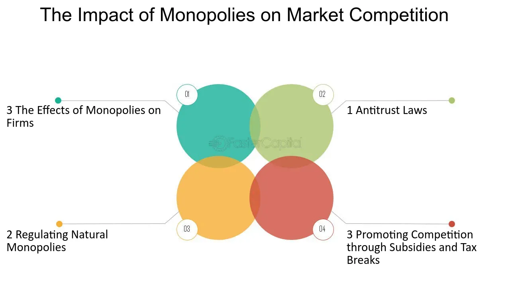

## Table of Contents

## What is a monopoly?

A monopoly is when one company or person has complete control over a product or service. This means they are the only ones who can sell it, and no one else can compete with them. Because of this, they can set the prices however they want, and people have to pay whatever the monopoly asks if they want the product or service.

Monopolies can happen for different reasons. Sometimes, a company might be the first to create a new product and get a patent, which stops others from making the same thing. Other times, a company might buy out all its competitors until it's the only one left. Governments usually keep an eye on monopolies because they can be bad for customers, who might end up paying more for less choice.

## How does a monopoly form in a market?

A monopoly can form in a market when one company becomes the only seller of a certain product or service. This can happen if the company is the first to invent something new and gets a patent. A patent is like a special permission that stops other companies from making the same thing for a while. Or, a company might become a monopoly by buying up all the other companies that sell the same thing. When this happens, there's no one left to compete with them.

Sometimes, a company can become a monopoly because it's just really good at what it does. It might be able to make things cheaper or better than anyone else, so all the other companies can't keep up and go out of business. Governments usually watch out for monopolies because they can be bad for people. If there's only one company selling something, they can charge whatever they want, and people have to pay it if they want the product or service. This can make things more expensive and give people fewer choices.

## What are the basic characteristics of a monopolistic market?

In a monopolistic market, one company or person has total control over selling a product or service. This means no other companies can sell the same thing. Because of this, the company can decide the price all by itself. If people want the product or service, they have to pay whatever the company asks. This can make things more expensive for customers because they don't have any other choices.

Another characteristic of a monopolistic market is that there are high barriers that stop other companies from entering. These barriers can be things like patents, which give a company the only right to make and sell a new invention for a while. Or, it could be that the company needs a lot of money to start up, which other companies might not have. Because of these barriers, it's hard for new companies to start selling the same product or service, which keeps the monopoly strong.

Lastly, in a monopolistic market, the company often has a lot of power over the supply of the product or service. It can choose how much to make and sell. If it makes less, the price might go up because there's not enough for everyone who wants it. This control over supply can help the company make more money, but it can also make things harder for customers who might not be able to get what they need.

## How do monopolies affect consumer prices?

In a monopoly, one company controls everything about a product or service. This means they can set the price however they want because no other companies are selling the same thing. If people want to buy it, they have to pay whatever the monopoly asks. This often makes things more expensive for customers because they don't have any other choices. The monopoly might choose to set high prices to make more money, knowing that people have to pay it if they want the product or service.

Sometimes, a monopoly might also control how much of the product or service is available. If they make less of it, the price can go up because there's not enough for everyone who wants it. This can make things even more expensive for customers. On the other hand, if the monopoly is very good at making things cheaply, they might keep prices lower to stop other companies from trying to compete. But usually, without competition, prices tend to be higher than they would be if there were other companies selling the same thing.

## What is the impact of monopolies on product quality and innovation?

In a monopoly, the company that controls everything might not care as much about making their product or service better. This is because they don't have to worry about other companies trying to take their customers away. If they're the only ones selling something, they might think, "Why bother making it better if people have to buy it from us anyway?" So, the quality of the product or service might not get better over time, and it might even get worse if the company tries to save money.

On the other hand, monopolies can sometimes help with innovation. If a company has a lot of money and power, they might be able to spend more on research and coming up with new ideas. They might invent new things that no one else has thought of yet. But this doesn't always happen. Sometimes, without competition, a monopoly might not feel the need to keep coming up with new things. So, while they could help with innovation, it's not guaranteed, and it depends a lot on what the company decides to do with its power.

## How do monopolies influence market competition?

In a monopoly, one company has all the control over a product or service. This means there's no competition because no other companies can sell the same thing. When there's no competition, the monopoly doesn't have to worry about other companies trying to take their customers away. They can set the prices however they want, and people have to pay it if they want the product or service. This can make it hard for new companies to start up because they can't compete with the big monopoly.

Because of this, monopolies can make it really hard for the market to stay competitive. If a new company tries to start selling something similar, they might not be able to because the monopoly has too much power. The monopoly might have special rights, like patents, that stop others from making the same thing. Or, they might need a lot of money to start up, which new companies might not have. So, monopolies can keep other companies out and stop the market from being competitive.

## What are the economic inefficiencies caused by monopolies?

Monopolies can lead to economic inefficiencies because they don't have to compete with other companies. When there's no competition, a monopoly might not try to make their product or service better or cheaper. They might just keep things the same because they know people have to buy from them anyway. This can make the product or service more expensive than it would be if there were other companies trying to offer a better deal. So, customers end up paying more for something that might not be as good as it could be.

Another problem is that monopolies might not make as much of the product or service as people want. They might choose to make less so they can charge higher prices. This can lead to a situation where some people who want the product or service can't get it, even if they're willing to pay. This is called a deadweight loss, and it's bad for the economy because it means resources aren't being used in the best way. Overall, monopolies can make the economy less efficient by keeping prices high, quality low, and limiting how much of a product or service is available.

## How do government regulations attempt to control monopolies?

Governments try to control monopolies because they can be bad for people and the economy. One way they do this is by making laws that stop companies from becoming too powerful. These laws are called antitrust laws. They help make sure that no one company can control everything and that there's still competition in the market. If a company tries to buy up all its competitors or does something else that might create a monopoly, the government can step in and stop it. This helps keep prices fair and gives people more choices.

Another way governments control monopolies is by watching them closely. If a company already has a monopoly, the government might set rules about what they can and can't do. For example, they might not let the monopoly charge too much or make too little of their product. The government might also break up a big company into smaller ones if it thinks that will help competition. This way, even if a monopoly exists, it can't do whatever it wants, and the market stays more balanced.

## What are the historical examples of monopolies and their market impacts?

One famous example of a monopoly is the Standard Oil Company in the late 1800s and early 1900s. Standard Oil, led by John D. Rockefeller, controlled almost all of the oil refining in the United States. They did this by buying up other oil companies and making deals that made it hard for anyone else to compete. Because Standard Oil had so much power, they could set high prices for oil, which made things more expensive for people. Eventually, the government used antitrust laws to break up Standard Oil into smaller companies, which helped bring more competition back to the market.

Another example is the telephone company AT&T, which had a monopoly on telephone services in the United States for many years. AT&T controlled almost all the phone lines and services, which meant they could charge whatever they wanted for phone calls. This made phone services expensive and limited people's choices. In 1982, the government decided to break up AT&T into smaller companies, which led to more competition and lower prices for phone services. This breakup helped make phone services more affordable and gave people more options for their communication needs.

A more recent example is Microsoft in the late 1990s and early 2000s. Microsoft had a lot of control over the computer software market, especially with their Windows operating system. They were accused of using their power to stop other companies from competing fairly. The government took action against Microsoft, and while they weren't broken up, they had to change some of their business practices. This helped open up the market for other companies to compete, which led to more innovation and better choices for consumers.

## How do monopolies affect small businesses and new entrants in the market?

Monopolies make it really hard for small businesses and new companies to get started. When one big company controls everything, it can be tough for smaller companies to compete. The monopoly might have a lot of money and power, which means they can do things that smaller companies can't. For example, they might be able to buy things cheaper because they buy in large amounts, or they might have special rights, like patents, that stop others from making the same product. This makes it hard for new companies to even get into the market because they can't offer the same thing at a lower price or with better quality.

Also, monopolies can make it difficult for small businesses to grow. If a small business tries to sell something similar to what the monopoly sells, they might not be able to get customers. The monopoly can set lower prices just to keep the small business from getting any sales, even if it means they lose money for a while. This is called predatory pricing, and it can force small businesses to close down. Without competition, the monopoly keeps its power, and new businesses struggle to survive.

## What are the global implications of monopolies on international trade?

Monopolies can affect international trade by making it hard for other countries to compete. When a company has a monopoly in one country, it can control the prices and supply of a product or service. This means that other countries might have to pay more to buy from the monopoly, which can make their own products more expensive. If a country tries to start making the same product, they might not be able to because the monopoly has too much power. This can lead to less trade between countries because it's hard for them to find good deals.

Also, monopolies can affect how countries work together in the global market. If a big company has a monopoly, it might try to control not just its own country but also other countries. They might make deals that favor them and make it hard for other countries to sell their own products. This can lead to unfair trade practices and make it harder for countries to grow their economies. Governments around the world often work together to stop monopolies from causing these problems, but it can be a big challenge.

## What advanced economic theories explain the long-term effects of monopolies on market dynamics?

Advanced economic theories, like the theory of contestable markets, help explain how monopolies can affect markets over the long term. This theory says that even if a company has a monopoly, it might still act like there's competition if other companies can easily enter the market. If it's not too hard for new companies to start selling the same thing, the monopoly might keep prices lower and quality higher to stop new competitors from coming in. But if it's really hard for new companies to enter because of high costs or special rights like patents, the monopoly might not worry about competition and could keep prices high and quality low.

Another theory is the Schumpeterian growth model, which looks at how monopolies can affect innovation and growth. This theory says that sometimes, having a monopoly can be good for innovation because the company has a lot of money to spend on research and new ideas. If they come up with something new, it can help the whole economy grow. But if the monopoly doesn't feel the need to keep innovating because no one else can compete, they might not spend money on new ideas, and the economy might not grow as fast. So, whether monopolies help or hurt the economy in the long run depends a lot on how they use their power and if there's a chance for new companies to challenge them.

## References & Further Reading

[1]: Bergstra, J., Bardenet, R., Bengio, Y., & Kégl, B. (2011). ["Algorithms for Hyper-Parameter Optimization."](https://papers.nips.cc/paper/4443-algorithms-for-hyper-parameter-optimization) Advances in Neural Information Processing Systems 24.

[2]: ["Advances in Financial Machine Learning"](https://www.amazon.com/Advances-Financial-Machine-Learning-Marcos/dp/1119482089) by Marcos Lopez de Prado

[3]: ["Evidence-Based Technical Analysis: Applying the Scientific Method and Statistical Inference to Trading Signals"](https://www.amazon.com/Evidence-Based-Technical-Analysis-Scientific-Statistical/dp/0470008741) by David Aronson

[4]: ["Machine Learning for Algorithmic Trading"](https://github.com/stefan-jansen/machine-learning-for-trading) by Stefan Jansen

[5]: ["Quantitative Trading: How to Build Your Own Algorithmic Trading Business"](https://www.amazon.com/Quantitative-Trading-Build-Algorithmic-Business/dp/1119800064) by Ernest P. Chan