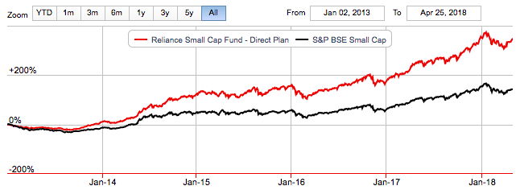

In the ever-evolving financial markets, numerous elements shape stock prices and guide investment decisions. Among these, mutual funds and algorithmic trading stand out due to their significant impact and influence. Mutual funds, as collective investment vehicles, pool capital from a large number of investors to purchase a diversified portfolio of stocks and other securities. Their large-scale buying and selling activities have the power to move markets, causing immediate fluctuations in stock prices.

On the other hand, algorithmic trading represents a revolutionary shift in investment strategies. By utilizing advanced mathematical models and computer algorithms, this form of trading executes orders at speeds and efficiencies beyond human capability. Key strategies employed include trend-following, arbitrage opportunities, and mean reversion, each offering a systematic approach devoid of emotional biases.



Together, these two components of modern finance—mutual funds and algorithmic trading—exert considerable influence over market dynamics. The interactions between institutional investments and algorithm-driven trades can create a complex market environment that challenges traditional investing paradigms.

Understanding the dynamics of mutual funds and algorithmic trading can arm investors with the insights needed to make strategic, informed decisions. It empowers them to harness the potential of contemporary trading strategies, thereby enhancing returns in a competitive marketplace. As technology and institutional behaviors continue to reshape financial landscapes, mastering these elements is crucial for achieving sustained financial success.

## Table of Contents

## Impact of Mutual Funds on Stock Prices

Mutual funds, as collective investment vehicles, wield considerable influence over stock prices due to their significant asset bases and trading volumes. When mutual funds engage in large-scale buying or selling, they create immediate impacts on stock prices, often leading to noticeable fluctuations. This effect is primarily attributed to the substantial volume of shares being transacted, which can shift the supply-demand equilibrium of the market.

Institutional herding is a phenomenon that can amplify these market movements. This occurs when fund managers make investment decisions by emulating the trades of other successful funds, potentially causing synchronized buying or selling. As a result, stock price movements can become exaggerated beyond what might be justified by fundamentals alone. This herding behavior is partly driven by the pursuit of benchmark-relative performance, where fund managers aim to align their returns closely with those of their peers or index benchmarks.

Over the longer term, mutual funds have the potential to establish trends in stock prices through their aggregated investment decisions. Their substantial financial power allows them to favor certain sectors or individual stocks, encouraging sustained bullish trends in these areas. Conversely, if funds collectively divest from certain holdings, it could contribute to a prolonged bearish market for those securities. The persistent buying or selling activities by mutual funds can influence investor sentiment and market [momentum](/wiki/momentum), leading to extended periods of price appreciation or depreciation.

Research indicates that mutual funds' investment activities can have lasting effects on market perceptions and investor behaviors. Studies have shown that stocks with significant mutual fund ownership often experience different risk-return dynamics compared to those with lower institutional ownership. This can be attributed to the funds' ability to provide [liquidity](/wiki/liquidity-risk-premium), stabilize prices, and influence corporate governance practices through active engagement with company management.

In summary, mutual funds play a pivotal role in shaping stock market dynamics. Their large-scale transactions can lead to immediate price fluctuations, while institutional herding can amplify these movements. Over time, mutual fund activities help establish market trends, impacting the overall direction of stock prices either positively or negatively. As key institutional investors, their actions are closely monitored by market participants for insights into future market developments.

## Algorithmic Trading in Modern Markets

Algorithmic trading utilizes computer algorithms to automate trading processes, providing both precision and speed that are unattainable through human trading. This method relies on mathematical models and complex algorithms to make decisions, executing orders after analyzing multiple market variables simultaneously. These programs can swiftly process vast amounts of data, execute trades at optimal prices, pinpoint liquidity, and reduce transaction costs.

Among the popular strategies employed in [algorithmic trading](/wiki/algorithmic-trading) are trend-following, [arbitrage](/wiki/arbitrage), and mean reversion. Trend-following strategies are based on historical patterns, identifying stocks or commodities that have been moving in a particular direction and capitalizing on the momentum. These strategies generally do not forecast or predict specific price levels but instead leverage the understanding that trends will persist over a specific period. Arbitrage strategies exploit price inefficiencies between different markets or instruments, a process that often requires rapid execution to be effective. Meanwhile, mean reversion strategies operate on the principle that prices and returns eventually move back towards the mean or average level of the entire data set. This involves establishing data bands around a price average and implementing trades based on price deviations from this band.

Despite the efficiency and speed of algorithmic trading, it is not without its challenges. One significant risk is the potential for technical failures. These failures can originate from errors in code, improper data feeds, or unanticipated market conditions, all of which can lead to significant financial losses. Additionally, algorithmic trading can contribute to market [volatility](/wiki/volatility-trading-strategies). Algorithms, when improperly calibrated, can exacerbate market swings rather than stabilize them. 

For example, during market stress, algorithms can collectively generate massive buy or sell orders, creating a domino effect that increases volatility rather than providing liquidity and market corrections. Furthermore, high-frequency trading, a subset of algorithmic trading, has been criticized for potentially contributing to "flash crashes," where rapid selling can lead to a steep and sudden market decline.

Overall, while algorithmic trading offers considerable advantages by removing emotional biases and improving trading efficiency, it mandates robust risk management protocols and constant monitoring to mitigate its inherent challenges. With the integration of [machine learning](/wiki/machine-learning), algorithms are also evolving, providing enhanced predictive capabilities and strategic adaptability to navigate the complexities of financial markets.

## Mutual Funds and Algorithmic Trading: A Symbiotic Relationship

The intersection of mutual fund activities and algorithmic trading creates a complex relationship that significantly influences market dynamics. Both mutual funds and algorithmic trading operate at a significant scale, which contributes to the fluidity and stability of financial markets. This symbiotic relationship centers on the way algorithmic strategies can react to mutual fund movements. 

Algorithmic trading programs, designed to operate without emotional bias, detect patterns and movements in the market that are often influenced by the large transactions made by mutual funds. For instance, algorithms may follow trends initiated by mutual funds or, alternatively, exploit temporary pricing inefficiencies resulting from these large-scale trades. This reaction capability depends on the ability of algorithms to process vast amounts of market data and execute trades within milliseconds. The algorithms rely heavily on data-driven metrics, such as moving averages or statistical analyses, to make informed decisions in real-time.

One of the key benefits of this symbiosis is the enhancement of market liquidity. By nature, mutual funds execute large orders that can temporarily reduce liquidity. Algorithmic traders act to counterbalance these movements by providing additional market depth, absorbing the impact of large trades, and enhancing the overall trading [volume](/wiki/volume-trading-strategy). Consequently, this can lead to more stable prices and a more efficient market.

However, this relationship does not come without risks, especially in periods of market stress. In such situations, the rapid-fire decisions made by algorithms can lead to increased volatility. In particular, if mutual funds start selling assets en masse during a downturn, algorithms may exacerbate price drops by also executing sell orders based on the observed trend. This phenomenon contributes to sharp market swings and, in extreme cases, can trigger flash crashes. 

Risk management practices are vital in these scenarios, and modern markets often include circuit breakers—mechanisms that temporarily halt trading if prices fall too quickly—to mitigate such risks. As both mutual funds and algorithmic trading continue to grow and evolve, understanding their interaction is crucial for stakeholders aiming to balance profit-making opportunities with long-term financial stability.

## Leveraging Investment Strategies for Optimal Returns

Investors can leverage insights into mutual fund activities and algorithmic trading to enhance portfolio performance effectively. By understanding the patterns and behaviors of mutual funds, investors gain insight into institutional actions that can influence market dynamics. Recognizing these patterns allows investors to anticipate market shifts and adjust their strategies accordingly. 

Adopting sophisticated trading algorithms offers a competitive edge in executing trades swiftly and accurately. Algorithms can be tailored to identify arbitrage opportunities, implement trend-following mechanisms, or capitalize on mean-reversion strategies. For instance, a basic Python algorithm for detecting arbitrage opportunities might look like this:

```python
import numpy as np

def detect_arbitrage(prices):
    for i in range(len(prices) - 1):
        for j in range(i + 1, len(prices)):
            if prices[i] > prices[j]:
                print(f"Arbitrage Opportunity: Buy at {prices[j]} and sell at {prices[i]}")

prices = [100, 98, 102, 99, 97]
detect_arbitrage(prices)
```

Continuous learning and adaptation to technological advancements are vital. The financial markets are dynamic, and technological tools and methodologies are constantly evolving. Investors need to stay informed about the latest trends and tools to maintain an edge. This includes understanding new algorithmic strategies, adopting cutting-edge technologies, and keeping abreast of regulatory changes that might impact trading activities.

By analyzing mutual fund activities and embracing advanced trading techniques, investors can position themselves strategically within the financial market. This proactive approach not only optimizes portfolio returns but also equips investors to handle market volatility with greater confidence. Staying agile and informed is crucial for achieving sustainable financial success in today’s fast-paced markets.

## Conclusion

As technology continues to evolve and institutional behaviors adapt, mutual funds and algorithmic trading maintain their crucial roles in shaping financial markets. With mutual funds being significant players through substantial investment activities and algorithmic trading bringing efficiency and speed, understanding these forces is essential for investors aiming to navigate the complexities of modern trading environments effectively.

Recognizing the influence of mutual funds provides investors with insights into market trends and potential movements. The scale at which these funds operate can set the tone for market sentiments, thereby impacting stock prices and overall market stability. On the other hand, algorithmic trading offers a precision approach, minimizing human errors and leveraging data-driven strategies to optimize trading outcomes.

By combining an understanding of these dynamics with actively monitoring market trends and utilizing advanced trading tools, investors are better equipped to make strategic decisions. This preparedness allows them not only to enhance their portfolios but also to manage risk and market volatility more effectively.

Incorporating continuous learning and adaptation to technological advancements in their strategies, investors can optimize returns and achieve sustainable financial growth. Remaining informed about the latest developments and applying innovative investment tools are key factors in achieving success in today's fast-paced financial landscape.

## References & Further Reading

[1]: Ben-David, I., Franzoni, F., & Moussawi, R. (2012). ["Hedge Fund Stock Trading in the Financial Crisis of 2007–2009."](https://www.nber.org/system/files/working_papers/w20071/w20071.pdf) Journal of Financial Economics, 105(3), 524-550. 

[2]: Jegadeesh, N., & Titman, S. (1993). ["Returns to Buying Winners and Selling Losers: Implications for Stock Market Efficiency."](https://www.bauer.uh.edu/rsusmel/phd/jegadeesh-titman93.pdf) The Journal of Finance, 48(1), 65-91.

[3]: Aldridge, I. (2013). ["High-Frequency Trading: A Practical Guide to Algorithmic Strategies and Trading Systems."](https://onlinelibrary.wiley.com/doi/pdf/10.1002/9781119203803.fmatter) Wiley.

[4]: Barber, B. M., Odean, T. (2000). ["Trading Is Hazardous to Your Wealth: The Common Stock Investment Performance of Individual Investors."](https://faculty.haas.berkeley.edu/odean/Papers%20current%20versions/Individual_Investor_Performance_Final.pdf) The Journal of Finance, 55(2), 773-806.

[5]: Hasbrouck, J., & Saar, G. (2013). ["Low-Latency Trading."](https://www.sciencedirect.com/science/article/abs/pii/S1386418113000165) Journal of Financial Markets, 16(4), 646-679.

[6]: Fama, E. F., & French, K. R. (1992). ["The Cross-Section of Expected Stock Returns."](https://onlinelibrary.wiley.com/doi/full/10.1111/j.1540-6261.1992.tb04398.x) The Journal of Finance, 47(2), 427-465.