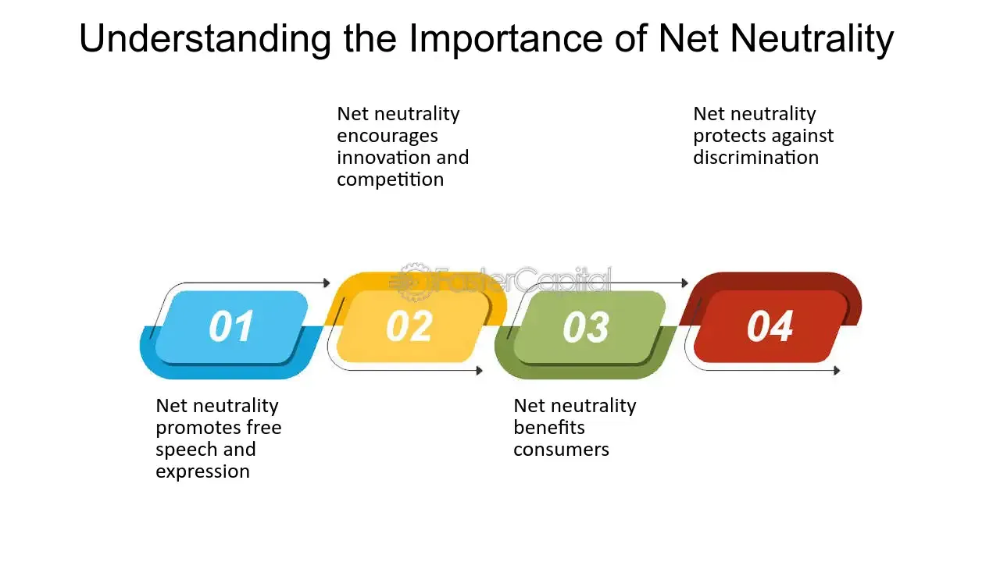

## Table of Contents

## What is net neutrality?

Net neutrality is the idea that internet service providers should treat all data on the internet equally. This means they shouldn't favor certain websites or services by making them faster or blocking others. It's like saying the internet should be a level playing field for everyone.

Without net neutrality, internet providers could charge more for faster access to certain sites or slow down others. This could make it harder for small businesses and new websites to compete with big companies. People worry that without net neutrality, the internet might become less free and open for everyone.

## How does net neutrality affect internet service providers (ISPs)?

Net neutrality rules stop internet service providers from treating different kinds of internet traffic differently. This means ISPs can't charge more money for faster access to certain websites or slow down others. Without these rules, ISPs could make more money by offering special deals to big companies who want their websites to load faster. This could be good for the ISPs because they could earn more, but it might make the internet less fair for everyone else.

On the other hand, net neutrality can limit what ISPs can do with their networks. They might want to manage their networks in ways that they think are better, like giving priority to important services like video calls or emergency services. But with net neutrality, they have to treat all data the same, which can make it harder for them to control how their networks work. This can be frustrating for ISPs because they feel like their hands are tied when it comes to managing their own services.

## What are the basic arguments for and against net neutrality?

People who support net neutrality say it's important because it keeps the internet fair for everyone. They believe that without net neutrality, big companies could pay to make their websites faster, leaving smaller websites behind. This could make it hard for new businesses to start up and for people to find all kinds of information easily. They also worry that internet service providers might block or slow down websites they don't like, which could limit what people can see and do online. They think the internet should be a level playing field where everyone has the same chance.

On the other hand, people who are against net neutrality argue that it stops internet service providers from managing their networks in the best way. They say that without net neutrality rules, ISPs could offer different plans that might be better for some people, like faster internet for video streaming or gaming. They believe that ISPs should be able to charge more for better service, just like how you might pay more for a bigger house or a faster car. They also think that without these rules, ISPs could invest more money in improving the internet, which could make it better for everyone in the long run.

## How might net neutrality impact internet speeds and access?

Net neutrality means that internet service providers have to treat all data the same way. This can affect internet speeds because ISPs can't make some websites faster than others. If there's a lot of traffic on the internet, everything might slow down equally. But this also means that everyone gets a fair chance to use the internet, no matter what websites they visit.

Without net neutrality, ISPs could make some websites faster if those websites pay more money. This could mean that big companies get faster internet, while smaller websites might be slower. It could also mean that if you want to use certain services, like streaming movies or playing games online, you might have to pay extra for faster internet. This could make the internet less fair and might make it harder for some people to access all the information they need.

## What has been the historical impact of net neutrality regulations on investment in internet infrastructure?

People have different ideas about how net neutrality rules affect the money that internet service providers spend on making the internet better. Some say that these rules make ISPs less likely to invest in new stuff because they can't make more money by treating some websites differently. They think that without net neutrality, ISPs could offer special deals and make more money, which could lead to more investment in internet infrastructure.

On the other hand, others believe that net neutrality hasn't really stopped ISPs from investing in the internet. They say that even with these rules, ISPs still want to make their services better to keep their customers happy. They argue that the internet has kept growing and getting faster even with net neutrality rules in place, so these rules might not be as big a problem for investment as some people think.

## Can net neutrality influence the level of innovation in the tech industry?

Net neutrality can help innovation in the tech industry by making sure that everyone has the same chance to use the internet. Without net neutrality, big companies might pay to make their websites faster, which could make it hard for new and small businesses to compete. If the internet is fair, new ideas and businesses have a better chance to grow. This means more people can try new things and innovate, because they don't have to worry about big companies having an unfair advantage.

On the other hand, some people think that net neutrality might slow down innovation. They say that without these rules, internet service providers could offer special deals and make more money, which they could use to improve the internet. This could lead to faster internet and better services, which might help new tech ideas come to life. But it's not clear if this would really happen, because it could also make the internet less fair and harder for new businesses to start.

## How do different countries' approaches to net neutrality affect their tech investment landscapes?

Different countries have different rules about net neutrality, and these rules can change how much money companies want to spend on making the internet better. In places like the United States and parts of Europe, there are strong net neutrality rules. This means internet service providers have to treat all data the same way. Some people think this makes companies less likely to spend money on new internet projects because they can't make extra money by treating some websites differently. But others say that even with these rules, companies still want to improve the internet to keep their customers happy.

In countries with weaker net neutrality rules or no rules at all, like some places in Asia and Africa, internet service providers can offer special deals to big companies. This might make them more willing to invest in the internet because they can make more money. But this could also make the internet less fair, and it might be harder for new and small businesses to start up and grow. So, the approach to net neutrality can affect how much and where companies decide to invest in tech, depending on whether they think the rules help or hurt their chances to make money.

## What are the economic theories supporting or opposing net neutrality's effect on investment?

Some economic theories say that net neutrality rules can make internet service providers less likely to invest in new internet projects. They think that without these rules, ISPs could make more money by offering special deals to big companies who want their websites to load faster. This extra money could be used to improve the internet, like making it faster or reaching more people. These theories suggest that if ISPs can't make more money this way, they might not want to spend as much on making the internet better.

On the other hand, other economic theories argue that net neutrality doesn't really stop ISPs from investing in the internet. They say that even with these rules, ISPs still want to keep their customers happy by making the internet faster and better. These theories point out that the internet has kept growing and improving even in places with strong net neutrality rules. They believe that a fair internet, where everyone has the same chance, can actually help more businesses start and grow, which could lead to more overall investment in the tech industry.

## How do net neutrality policies potentially alter the competitive dynamics among startups and established tech companies?

Net neutrality policies can help startups compete with big tech companies by making the internet fair for everyone. When net neutrality rules are in place, internet service providers can't make some websites faster than others. This means that a new startup has the same chance to reach people as a big company like Google or Amazon. Without these rules, big companies might pay to make their websites faster, which could make it hard for startups to get noticed. So, net neutrality can level the playing field and give new businesses a better chance to grow and innovate.

On the other hand, some people think that without net neutrality, the competition might actually get better. They say that if internet service providers can offer special deals, it might lead to more money being spent on making the internet faster and better. This could help everyone, including startups, by giving them access to better internet services. But it's not clear if this would really happen, because it could also make the internet less fair and harder for new businesses to start up and compete with big companies.

## What empirical data exists on the correlation between net neutrality and venture capital investment in tech?

There isn't a lot of clear data that shows exactly how net neutrality affects venture capital investment in tech. Some studies suggest that when net neutrality rules are strong, venture capitalists might be more willing to invest in startups. They think that a fair internet gives new businesses a better chance to grow and compete with big companies. For example, a study by the Berkman Klein Center at Harvard University found that net neutrality can help create a more level playing field, which might encourage more investment in new tech ventures.

On the other hand, other research argues that net neutrality might make internet service providers less likely to invest in new internet projects. They think that without these rules, ISPs could make more money by offering special deals to big companies, and this extra money could be used to improve the internet. A report by the Phoenix Center for Advanced Legal & Economic Public Policy Studies suggested that net neutrality rules could lead to less investment in broadband infrastructure, which might affect the overall tech investment landscape. But it's hard to say for sure because the data can be complicated and different studies can come to different conclusions.

## How might the repeal or enforcement of net neutrality affect long-term technological innovation?

If net neutrality rules are taken away, big internet companies could pay to make their websites faster. This might make it harder for new and small businesses to start up and grow. People who want to start a new tech company might worry that they can't compete with big companies who can pay for faster internet. This could mean less new ideas and less new tech stuff coming out. But some people think that without net neutrality, internet companies could make more money and use it to make the internet faster and better, which might help new tech ideas in the long run.

On the other hand, keeping net neutrality rules might help more new tech companies start up. When the internet is fair for everyone, new businesses have a better chance to grow and come up with new ideas. This could lead to more innovation because more people are trying new things. But some people think that net neutrality rules might stop internet companies from making the internet better, because they can't make more money by treating some websites differently. So, it's not clear which way would be better for long-term tech innovation.

## What are the advanced regulatory frameworks proposed to balance net neutrality with incentives for investment and innovation?

Some people have come up with new ideas to make net neutrality rules work better with the need for more investment and new ideas in tech. One idea is to let internet service providers offer different kinds of internet plans, but with rules to make sure they don't treat some websites unfairly. For example, they could have a plan that's better for video streaming, but they can't slow down other websites just because they want to. This way, ISPs might be more willing to spend money on making the internet better, while still keeping things fair for everyone.

Another idea is to have special rules for new and small businesses. These rules could give startups a break, like making it easier for them to get fast internet without paying a lot of money. This could help new tech companies grow and come up with new ideas, even if big companies can pay for faster internet. By balancing these rules, the internet could stay fair and open, while also encouraging more investment and innovation in the long run.

## References & Further Readings

The Internet Association. "Net Neutrality: A Primer." This document provides an overview of net neutrality principles, explaining the foundational concepts and their significance for individuals and businesses relying on an open internet.

Pew Research Center. "U.S. Views of Technology and the Future." This study investigates public opinions on technology, highlighting the implications for net neutrality and how Americans perceive internet regulations.

Van Schewick, B. "Internet Architecture and Innovation." This publication discusses the relationship between internet architecture and innovation, offering insights into how net neutrality impacts technological progress and business models.

Wu, T. "Network Neutrality, Broadband Discrimination." This work explores the legal and economic aspects of net neutrality, addressing potential discriminatory practices by ISPs and their consequences for online access.

BEREC. "Guidelines on the Implementation by National Regulators of European Net Neutrality Rules." The guidelines provide regulatory frameworks for enforcing net neutrality across European Union member states, aiming to maintain fair access to the internet while allowing innovation and competition.

