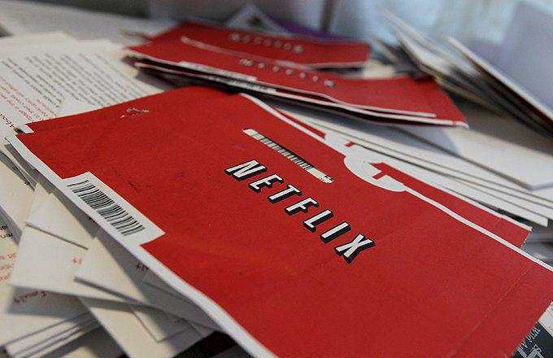

In the past decade, the television industry has experienced transformative changes, largely due to digital disruption. A key player in this revolution is Netflix, which has pioneered new models of media consumption through its streaming service platform. Netflix's innovative approach has fundamentally altered audience viewing habits by providing on-demand, ad-free content that can be accessed anytime and from anywhere. This shift from conventional broadcasting to a more personalized viewing experience has challenged traditional media networks to re-evaluate their strategies, as audiences now prefer the flexibility and convenience offered by streaming services.

The purpose of this article is to delve into the influence of Netflix within the TV industry and to draw a comparison with algorithmic trading in the financial sector. Both sectors highlight how technology is reshaping traditional paradigms by leveraging data-driven insights to optimize user experience and operational efficiency. In the world of finance, algorithmic trading uses sophisticated algorithms to make quick trading decisions based on large volumes of data. Similarly, Netflix utilizes algorithms to analyze viewer preferences and enhance content recommendation systems, thereby creating a tailored viewing experience for each user.

This examination of technological disruption provides a framework for understanding how traditional models are being challenged and transformed. By assessing these shifts, we can glean valuable insights into the potential trajectory of media and entertainment. As the industry continues to evolve, recognizing and adapting to these technological advancements will be crucial for stakeholders aiming to stay relevant in this rapidly changing landscape.

## Table of Contents

## The Rise of Streaming Services

Streaming services, particularly Netflix, have fundamentally transformed how audiences consume entertainment by challenging the traditional cable and satellite TV models. The introduction of Netflix's on-demand, ad-free viewing experience marked a significant departure from conventional television practices, where scheduled programming dictated the consumption patterns of viewers. This innovation catered to an evolving market demand for greater control and flexibility in content consumption, subsequently altering the landscape of television.

The binge-watching phenomenon, where viewers consume multiple episodes of a series in a single sitting, epitomizes the shift away from scheduled programming. It underscores increasingly personalized and self-directed viewing habits. This change in consumer preferences compelled traditional TV networks to reevaluate their strategies, necessitating adaptation to the new viewing paradigm to remain relevant. Networks have since explored their own streaming services or partnered with existing platforms to retain their audience.

Netflix's journey from a DVD rental service established in 1997 to a global streaming powerhouse demonstrates not only a technological evolution but also a keen understanding of market dynamics and consumer behavior. By leveraging data analytics to tailor its offerings, Netflix effectively capitalized on the growing appetite for diverse and high-quality content. Its strategic investment in original programming further solidified its standing as an industry leader, setting a precedent for the necessity of original content production in the streaming age.

The rapid growth of streaming services, as evidenced by Netflix's expansion, illuminates the broader trends reshaping the TV landscape. Content delivery has grown increasingly digital and consumer-centric, emphasizing convenience and accessibility. Consequently, legacy networks face the dual challenge of reinventing their business models while also competing in a more crowded and technologically advanced market. 

This seismic shift instigated by Netflix continues to influence the television industry, as it inspires innovation and adaptation across the sector. Its pioneering role in altering viewer habits and disrupting traditional delivery models provides crucial lessons on the importance of agility and foresight in an era that is progressively defined by digital disruption.

## Netflix's Impact on Content Creation and Distribution

Netflix has fundamentally transformed content creation and distribution, reshaping how audiences interact with media. This transformation is spearheaded by an original content strategy that leverages data-driven insights to predict viewer preferences and customize content offerings. Netflix's approach parallels [algorithmic trading](/wiki/algorithmic-trading), where large datasets are analyzed to inform decision-making processes. By observing viewer behavior patterns, Netflix can anticipate content demand, culminating in a highly personalized viewing experience.

The success of Netflix's original series such as "Stranger Things" and "The Crown" underscores the market's appetite for unique, high-quality storytelling. These series have not only captivated global audiences but also demonstrated the effectiveness of Netflix's data-centric approach in crafting compelling narratives that resonate with viewers. Utilizing [machine learning](/wiki/machine-learning) algorithms, Netflix continually refines its content recommendations, ensuring that users are engaged and satisfied with their viewing options.

Moreover, Netflix's model challenges traditional media gatekeepers by democratizing access to content creation and distribution. Traditional networks often rely on established industry practices and gatekeeping to determine which shows are produced and aired. In contrast, Netflix's data-oriented strategy allows for a more diverse array of content to gain visibility, thus promoting a richer and more varied media landscape. By empowering creators from different cultural backgrounds, Netflix enhances global content diversity and enriches the viewer experience.

This shift in content distribution echoes the operational dynamics of algorithmic trading, where both sectors utilize data to maintain a competitive edge. Just as traders analyze market trends and fluctuations to optimize trading strategies, Netflix uses viewership data to refine its content portfolio and distribution tactics. This reliance on data highlights the increasing convergence of technology and creativity in modern media landscapes.

The strategic advantage offered by Netflix’s data-driven model has encouraged other industry players to adopt similar approaches. As traditional broadcasters and cable networks face significant pressure to remain relevant in a digital-first world, understanding and implementing data-backed strategies will be essential. This ongoing evolution in content consumption and distribution highlights the impact of technology in redefining the parameters of storytelling and viewer engagement on a global scale.

## Algorithmic Trading and Media Consumption: A Comparative Analysis

Algorithmic trading leverages sophisticated algorithms to execute trading decisions at speeds unattainable by humans. At its core, this process relies on the analysis of large datasets to identify patterns and execute trades that capitalize on fleeting opportunities. For example, algorithmic traders often employ strategies such as high-frequency trading, [momentum](/wiki/momentum) trading, or statistical [arbitrage](/wiki/arbitrage), utilizing mathematical models to prompt buy or sell actions based on historical price data and market indicators. This is often encapsulated by formulas where algorithms assess the potential trade value $V$ by calculating $V = P + \alpha \times M$, with $P$ representing historical price, $\alpha$ the impact [factor](/wiki/factor-investing), and $M$ a market indicator.

Similarly, Netflix employs advanced algorithms to tailor viewing experiences, optimizing content recommendations to suit individual user preferences. This personalization is primarily driven by data aggregation and analysis processes that assess viewing history, genre interests, content ratings, and user interactions. Netflix's recommendation algorithm famously uses machine learning techniques such as collaborative filtering and matrix factorization to predict which shows or movies might appeal to an individual viewer. For instance, a simplified recommendation score $R$ could be determined by $R = U_i \times V_j$, where $U_i$ represents user preferences, and $V_j$ denotes movie attributes.

Both algorithmic trading and Netflix's recommendation system heavily rely on big data analytics and machine learning to refine their outputs. In algorithmic trading, the edge is achieved by minimizing latency and maximizing prediction accuracy through improved algorithms and faster processing speeds. Likewise, Netflix continuously refines its recommendation systems by incorporating new data and enhancing its machine learning models to improve customer satisfaction and engagement. 

The parallels in these sectors underscore the transformative impact of technology, enhancing precision and engagement through real-time, data-driven insights. This transformation is indicative of a broader trend across various industries, where technology serves as a catalyst, breaking existing paradigms to offer smarter, more personalized solutions. For instance, sectors such as healthcare, retail, and logistics are tapping into these technological advancements for predictive analytics, personalized marketing, and operational efficiency.

In conclusion, the technologies applied in both algorithmic trading and media consumption exhibit a profound ability to transform industries by leveraging data and machine learning. As these technologies evolve, their principles could be adapted to enhance processes and consumer experiences across diverse fields, highlighting an exciting trajectory of innovation and opportunity.

## Challenges and Opportunities in the Evolving TV Ecosystem

As Netflix and other streaming platforms continue their ascent, traditional television networks face significant challenges in maintaining relevance. This disruption is partly driven by a shift in consumer behavior, exemplified by the increasing trend of cord-cutting. According to Nielsen's Total Audience Report, millions of households have abandoned cable subscriptions in favor of streaming services. This migration presents a formidable challenge to the traditional TV advertising and revenue models, which have typically depended on a broad, captive audience base.

To navigate these challenges, traditional TV networks and content creators can explore opportunities for collaboration with streaming platforms. By partnering with digital platforms, traditional media outlets can tap into expansive data analytics capabilities. This collaboration could enable better-targeted advertising and content that aligns more closely with evolving viewer preferences. For instance, joint production ventures could leverage the storytelling strengths of traditional creators with the distribution expertise of streaming services.

The competitive landscape has further intensified with new entrants such as Disney+ and Amazon Prime Video. These platforms not only offer vast libraries of original content but also capitalize on established franchised properties to attract subscribers—a strategy highlighted by Disney+'s success with titles like "The Mandalorian" linked to the Star Wars universe. This competition raises the stakes for all players in the industry, necessitating innovative strategies to capture and retain audience attention.

The influx of new competitors creates both threats and prospects. While it heightens pressure on legacy networks, it also fosters a more dynamic content ecosystem. Businesses, therefore, should consider exploring diversified content strategies and digital integration to remain competitive. Lessons for navigating digital disruption can be drawn from various sectors, emphasizing agile adaptation and technology integration. Understanding these dynamics could offer valuable insights for businesses not only in the television industry but also across other sectors facing similar transformative pressures.

## The Future of Television and Streaming

The future of television is poised for a paradigm shift as consumer preferences increasingly prioritize flexibility and personalization. Streaming services have driven this change by facilitating on-demand content consumption, deviating from traditional broadcasting's fixed schedules. A significant element of future innovation will be continuous enhancements in content delivery mechanisms and user interfaces. For instance, advancements in machine learning and [artificial intelligence](/wiki/ai-artificial-intelligence) promise to refine content recommendation systems, making them more intuitive and user-friendly. As platforms gather extensive data on viewer habits, they can tailor experiences more precisely, aligning with individual preferences and viewing patterns.

Emerging technologies such as virtual reality (VR) and augmented reality (AR) present new frontiers for audience engagement. VR can immerse viewers in a 360-degree environment, transforming passive viewing into an interactive experience. Meanwhile, AR can overlay digital content onto the physical world, potentially revolutionizing genres like sports and live events by providing real-time data and interactive features during broadcasts. For example, imagine a sports broadcast where [statistics](/wiki/bayesian-statistics) and player profiles appear on the screen as the game unfolds, enriching the viewer's experience without detracting from the content.

As streaming services grow, their influence on cultural and societal norms is anticipated to deepen. Original content produced by platforms like Netflix, Amazon Prime Video, and Disney+ has already influenced global cultural trends by providing diverse stories that resonate with audiences worldwide. These platforms often take risks on unconventional narratives and underrepresented voices, broadening the cultural discourse. Additionally, the globalization of content means that a series popular in one country can quickly gain a following across the globe, fostering a shared cultural experience.

The post-Netflix era of television will likely see a diversification of streaming platforms as companies invest in unique content to differentiate themselves from competitors. This could lead to a more fragmented landscape where niche services cater to specific audience segments, potentially increasing competition but also driving innovation. For traditional broadcasters, the challenge will be to integrate aspects of streaming services, embracing hybrid models that combine linear and on-demand content to retain their audience base.

In conclusion, the television industry's future hinges on its ability to adapt to evolving viewer expectations and technological innovations. By embracing flexibility, personalization, and new engagement technologies, the industry can continue to thrive amidst ongoing digital disruption. The shift towards a more personalized and engaging viewing experience will redefine both content creation and consumption, pushing boundaries and setting new standards for entertainment in a rapidly changing world.

## Conclusion

The disruption caused by Netflix has fundamentally altered the television landscape, initiating a transformative wave that continues to redefine content consumption and distribution. This paradigm shift can be likened to the impact of algorithmic trading in the financial sector, where data-driven strategies have revolutionized traditional business models. Just as financial markets utilize algorithms to optimize trading performance through massive data analysis and predictive modeling, Netflix employs sophisticated algorithms to tailor its offerings, enhance user experience, and predict viewer preferences.

In this new digital era, stakeholders in the TV industry must embrace technological innovation and adapt to rapid changes. These data-centric strategies underscore the importance of leveraging technology not just to remain competitive but to lead the market. For stakeholders to thrive amidst ongoing transformation, remaining informed about emerging trends and advances is essential. This involves a willingness to experiment with new content delivery mechanisms, adopt flexible business models, and maintain a keen awareness of consumer demands.

The evolution of the TV industry requires a continuous adaptation to novel technological advancements, beyond merely responding to current disruptions. As new digital entrants reshape existing paradigms and consumer behavior leans towards personalization and on-demand access, traditional media companies and new market players alike must innovate to sustain audience engagement.

Looking beyond the television industry, the implications of these changes are profound. They signal a broader trend of digital disruption permeating various sectors, offering lessons in agility and foresight. Industries across the board can draw parallels from the interplay between Netflix's strategic maneuvers and algorithmic trading, emphasizing the importance of adopting data-driven methodologies. This confluence of media and technology not only reflects a shift in entertainment consumption but also points toward a future where adaptability and technological fluency will be pivotal in navigating and excelling in increasingly dynamic business environments.

## References & Further Reading

[1]: ["Netflix and the Future of Television"](https://www.ft.com/content/fd376c16-f8d7-49fd-9b13-9ed2f001eaa1) by Netflix

[2]: ["The Netflix Effect: Technology and Entertainment in the 21st Century"](https://www.bloomsbury.com/us/netflix-effect-9781501309441/) by Kevin McDonald and Daniel Smith-Rowsey

[3]: Aguiar, L., & Waldfogel, J. (2018). ["Netflix: Global dominance through technological superiority and data analytics."](https://www.nber.org/papers/w22675) National Bureau of Economic Research.

[4]: ["The Moon: The Netflix Journey"](https://en.wikipedia.org/wiki/The_Moon_(2023_film)) by Alex Heath

[5]: ["Streaming, Sharing, Stealing: Big Data and the Future of Entertainment"](https://mitpress.mit.edu/9780262534529/streaming-sharing-stealing/) by Michael D. Smith and Rahul Telang

[6]: ["How Netflix reinvented itself for the algorithm age"](https://www.forbes.com/sites/petercohan/2013/04/23/how-netflix-reinvented-itself/) by J. McCorvey

[7]: ["Algorithmic Trading"](https://en.wikipedia.org/wiki/Algorithmic_trading) - Investopedia

[8]: ["Visualizing Netflix Engineering Culture"](https://netflixtechblog.com/) by Netflix Tech Blog

[9]: "How Netflix Uses Big Data to Drive Success" available on [Forbes](https://www.forbes.com/sites/enriquedans/2020/01/15/netflix-big-data-and-playing-a-long-game-is-proving-a-winningstrategy/) by Bernard Marr

[10]: ["Academic research on strategic decisions of Netflix"](https://www.researchgate.net/publication/362902311_THE_STRATEGIC_ANALYSIS_OF_NETFLIX_INC) by Journal of Interdisciplinary Economics