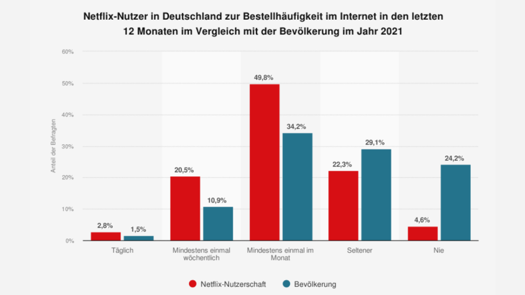

## Table of Contents

## What is Netflix and when was it founded?

Netflix is a company that lets people watch movies and TV shows on the internet. They have a big collection of videos that you can watch whenever you want. You pay a monthly fee, and then you can watch as much as you like.

Netflix was started in 1997 by Reed Hastings and Marc Randolph. At first, they sent DVDs to people's homes through the mail. Later, in 2007, they began offering videos to watch online. This change helped them grow a lot and become very popular around the world.

## How does Netflix's business model differ from traditional television?

Netflix's business model is different from traditional television because it lets people watch shows and movies whenever they want, instead of at set times. With traditional TV, you have to watch programs when they are shown on the schedule. But with Netflix, you can start watching a show at any time, pause it, and come back to it later. This is called "on-demand" viewing. Also, Netflix doesn't have commercials, so you can watch your show without interruptions.

Another big difference is how Netflix makes money. Traditional TV channels often get money from advertisers who pay to show commercials during the programs. Netflix, on the other hand, makes money by charging people a monthly fee to use their service. This means Netflix can focus on making shows and movies that their subscribers want to watch, without worrying about pleasing advertisers. This model has helped Netflix create a lot of popular original content that people all over the world enjoy.

## What are the key features of Netflix that have attracted viewers?

One of the main things that has brought people to Netflix is that you can watch shows and movies whenever you want. This is called on-demand viewing. You don't have to wait for a certain time to watch your favorite show. You can start watching, stop, and come back to it later. This is really convenient for people who have busy lives or different schedules. Also, Netflix doesn't have commercials, so you can watch your show without any interruptions. This makes the watching experience much better.

Another big reason people like Netflix is because it has a lot of different shows and movies to choose from. They have shows and movies from all over the world, so there's something for everyone. Plus, Netflix makes its own shows and movies, called original content. Some of these have become very popular and have won awards. People also like that Netflix suggests shows and movies they might like based on what they've watched before. This makes it easier to find new things to watch that you'll enjoy.

## How has Netflix changed viewer habits and consumption patterns?

Netflix has changed the way people watch TV and movies a lot. Before Netflix, people had to watch shows at the times they were on TV. But with Netflix, you can watch whenever you want. This means you can watch a whole season of a show in one weekend if you want to. It's called binge-watching, and it's become really popular. People can also watch shows on their phones or tablets, so they can watch anywhere, not just at home.

Another way Netflix has changed things is by making people watch more shows from other countries. Before, people mostly watched shows from their own country. But Netflix has shows and movies from all over the world, so people are trying new things they might not have watched before. This has made people more open to different kinds of stories and cultures. Also, because Netflix suggests shows you might like, people are watching a wider variety of shows than they used to.

## What impact has Netflix had on traditional cable and satellite TV subscriptions?

Netflix has had a big impact on traditional cable and satellite TV subscriptions. A lot of people are choosing to cancel their cable or satellite TV and switch to streaming services like Netflix instead. This is called "cord-cutting." People do this because streaming services are often cheaper and let you watch shows and movies whenever you want, without commercials. This has made it harder for cable and satellite companies to keep their customers.

Because of this, cable and satellite companies have had to change how they do things. They've started offering their own streaming services or adding on-demand options to their packages. They're trying to keep up with what people want, which is more flexibility and fewer commercials. But even with these changes, a lot of people still prefer streaming services like Netflix because they're easier to use and often have more of the shows and movies people want to watch.

## How has Netflix influenced the production and distribution of television content?

Netflix has changed how TV shows and movies are made and shared with people. Before, TV shows were made by big networks and shown at certain times. But Netflix started making its own shows and movies, called original content. They put a lot of money into making these shows really good, and they've become very popular. This has made other companies want to make their own streaming services and original shows too. Now, there are a lot more choices for people to watch.

Netflix also changed how TV shows are shared with people. Instead of waiting a week for the next episode, Netflix puts out a whole season at once. This lets people watch all the episodes whenever they want. It's called binge-watching, and it's become really popular. Because of this, other companies have started doing the same thing. They're trying to keep up with what people want, which is to watch shows on their own schedule. This has made TV watching a lot more flexible and fun for everyone.

## What are some notable original series produced by Netflix that have impacted the industry?

Netflix has made some really popular shows that have changed the TV world. One of these is "Stranger Things." It's about some kids in the 1980s who find strange things happening in their town. It became a big hit and made a lot of people want to watch Netflix. Another show is "House of Cards," which was one of the first big shows Netflix made. It's about politics and power, and it showed that Netflix could make shows that were just as good as the ones on regular TV.

Another important show is "The Crown," which tells the story of Queen Elizabeth II. It's a big, expensive show that looks and feels like a movie. It won a lot of awards and showed that Netflix could make shows that people all over the world would want to watch. "Narcos" is also a big show that tells the true story of drug lords in Colombia. It got people interested in stories from other countries and helped make Netflix popular everywhere. These shows have shown that Netflix can make great TV and has changed what people expect from TV shows.

## How has Netflix's global expansion affected local television markets?

Netflix's global expansion has changed local TV markets a lot. When Netflix started offering its service in more countries, it gave people more choices for watching TV shows and movies. Before, people mostly watched shows made in their own country. But with Netflix, they can now watch shows from all over the world. This has made local TV channels have to work harder to keep their viewers. They need to make better shows or offer their own streaming services to compete with Netflix.

Also, Netflix has started making shows in different countries, not just in the United States. This means they are making shows that are about local stories and in local languages. This has been good for local actors and filmmakers because they get more chances to work on big projects. But it can also be hard for local TV channels because they have to compete with these big-budget Netflix shows. Overall, Netflix's global expansion has made the TV world more competitive and has given viewers more choices, but it has also made things harder for local TV channels.

## What data analytics does Netflix use to influence content creation and viewer engagement?

Netflix uses a lot of data to help them make shows and keep people watching. They look at things like what shows people start watching, how long they watch, and what they watch next. This helps them figure out what kinds of shows people like and what they might want to see more of. For example, if a lot of people watch a show about space, Netflix might decide to make more shows about space. They also use this data to decide when to release new shows and how to market them, so more people will watch.

Another way Netflix uses data is to make the watching experience better for each person. They have a system that suggests shows you might like based on what you've watched before. This is called personalization, and it makes people more likely to keep watching because they find shows they enjoy. Netflix also uses data to change the pictures and descriptions of shows to match what they think you'll like. This helps them keep people interested and coming back to watch more.

## How has Netflix's entry into the market affected competition among other streaming services?

Netflix's entry into the market has made other streaming services work harder to keep their viewers. When Netflix started, it showed that people really liked watching shows and movies whenever they wanted. This made other companies like Amazon and Hulu want to start their own streaming services. They had to make sure their services were good enough to compete with Netflix. They did this by making their own shows and movies, and by trying to make their service easy to use and cheap.

Because of Netflix, there are now a lot more streaming services for people to choose from. Companies like Disney and Apple have also started their own services, like Disney+ and Apple TV+. They all want to get people to watch their shows instead of Netflix's. This has made the streaming world very competitive. It's good for people because they have more choices, but it can be hard for the companies because they have to keep making new and interesting shows to keep people watching.

## What regulatory challenges has Netflix faced in different countries, and how have these affected its operations?

Netflix has faced different regulatory challenges in different countries that have affected how it works. In some places, governments have rules about what can be shown on TV and online. For example, in some countries, Netflix has to follow rules about showing certain types of content, like not showing violence or certain political views. These rules can make it hard for Netflix to offer the same shows everywhere. They sometimes have to change or remove shows to follow these rules, which can be frustrating for viewers who want to watch everything.

Another big challenge is about taxes and how Netflix makes money. Some countries have special taxes on streaming services, which can make it more expensive for Netflix to work there. For example, in Europe, there are rules that say a certain amount of the money Netflix makes has to be spent on making shows in those countries. This can be good because it helps local filmmakers, but it can also be hard for Netflix because it means they have to spend more money in some places than others. These challenges can make it harder for Netflix to grow and offer the same service everywhere.

## What future trends can we anticipate for Netflix and its impact on the television industry?

In the future, Netflix will probably keep growing and changing the TV world. They will likely make even more shows and movies from different countries. This will give people more choices and help them learn about other cultures. Netflix might also use more technology to make watching even easier and more personal. They could use things like virtual reality or better ways to suggest shows you might like. This could make the TV experience even better and keep people coming back to watch more.

Another trend we might see is more competition from other streaming services. Companies like Disney and Amazon are already making their own shows and trying to get people to watch them instead of Netflix. This competition could make Netflix work harder to keep its viewers happy. They might have to spend more money on making great shows or finding new ways to keep people watching. Overall, Netflix will keep shaping the TV world by making it more global, personal, and competitive.

## References & Further Reading

[1]: ["Netflix and the Future of Television"](https://www.ft.com/content/fd376c16-f8d7-49fd-9b13-9ed2f001eaa1) by Netflix

[2]: ["The Netflix Effect: Technology and Entertainment in the 21st Century"](https://www.bloomsbury.com/us/netflix-effect-9781501309441/) by Kevin McDonald and Daniel Smith-Rowsey

[3]: Aguiar, L., & Waldfogel, J. (2018). ["Netflix: Global dominance through technological superiority and data analytics."](https://www.nber.org/papers/w22675) National Bureau of Economic Research.

[4]: ["The Moon: The Netflix Journey"](https://en.wikipedia.org/wiki/The_Moon_(2023_film)) by Alex Heath

[5]: ["Streaming, Sharing, Stealing: Big Data and the Future of Entertainment"](https://mitpress.mit.edu/9780262534529/streaming-sharing-stealing/) by Michael D. Smith and Rahul Telang

[6]: ["How Netflix reinvented itself for the algorithm age"](https://www.forbes.com/sites/petercohan/2013/04/23/how-netflix-reinvented-itself/) by J. McCorvey

[7]: ["Algorithmic Trading"](https://en.wikipedia.org/wiki/Algorithmic_trading) - Investopedia

[8]: ["Visualizing Netflix Engineering Culture"](https://netflixtechblog.com/) by Netflix Tech Blog

[9]: "How Netflix Uses Big Data to Drive Success" available on [Forbes](https://www.forbes.com/sites/enriquedans/2020/01/15/netflix-big-data-and-playing-a-long-game-is-proving-a-winningstrategy/) by Bernard Marr

[10]: ["Academic research on strategic decisions of Netflix"](https://www.researchgate.net/publication/362902311_THE_STRATEGIC_ANALYSIS_OF_NETFLIX_INC) by Journal of Interdisciplinary Economics