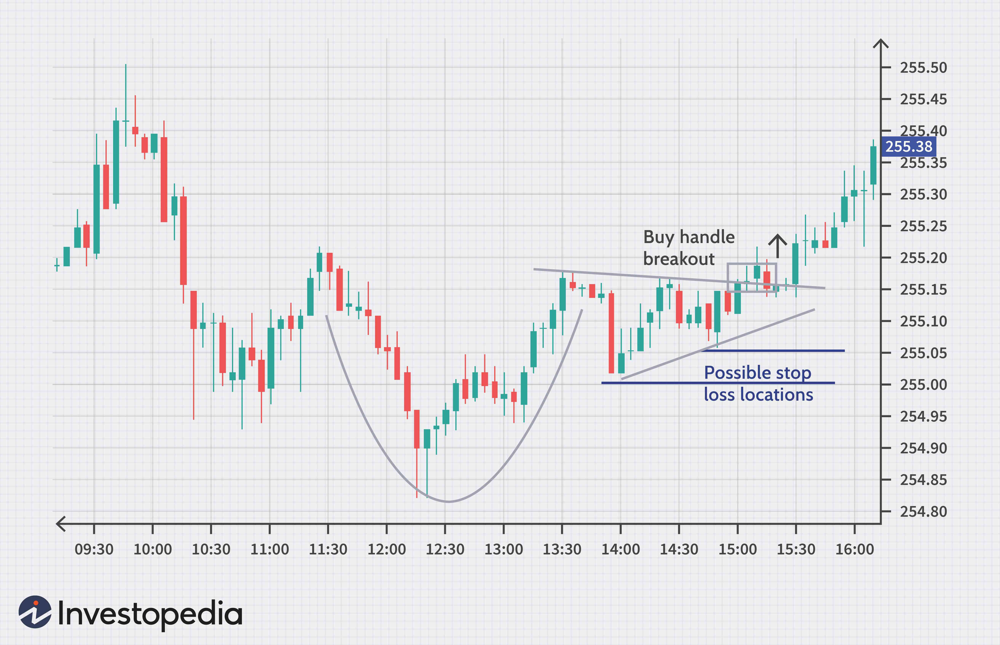

In the ever-evolving world of finance, the interplay between stock prices, news, market dynamics, and algorithmic trading plays a critical role in shaping the landscape of modern markets. With the advent of advanced technology, particularly algorithmic trading, there has been a significant transformation in how stock markets operate, influencing both pricing and trading decisions.

The dynamic nature of finance necessitates a thorough understanding of the key components that drive market behavior. Stock prices are no longer simply reflections of corporate performance and macroeconomic indicators; they are also subject to the rapid dissemination and interpretation of news, which can cause swift changes in market conditions. News related to economic reports, corporate earnings, and geopolitical events can all have immediate effects on stock prices, driven by the speed and reach of modern communication channels.

Adding to this complexity is the rise of algorithmic trading, where computer programs execute trades with precision and at speeds unimaginable by human traders. This has not only increased the efficiency of markets but has also introduced new challenges regarding market stability and fairness. Algorithms are capable of analyzing vast datasets to identify trading opportunities, often anticipating market trends before they fully manifest.

Understanding the relationship between these elements is essential for investors aiming to navigate the complexities of today's financial environment. Investors must consider how news influences market sentiments and stock movements, how algorithmic trading affects market structures, and how these factors collectively shape market dynamics. By acknowledging the interplay of these forces, investors can develop strategies to mitigate risks and capitalize on opportunities within the financial markets. This article will explore these themes, offering insights into the fundamental drivers of modern stock market behavior.

## Table of Contents

## The Role of News in Stock Market Fluctuations

News events serve as potent catalysts for stock market fluctuations, creating shifts in both short-term volatility and long-term price trends. The sensitivity of stock prices to news stems from the market's anticipation and reaction to new information, which often redefines investor expectations and market valuations.

Economic reports are pivotal in dictating market behavior. Metrics such as GDP growth, unemployment rates, inflation data, and consumer confidence indices provide insights into the economic health of a country, influencing investor sentiment and subsequent stock prices. For example, an unexpected rise in inflation may lead to stock market jitters as investors anticipate potential [interest rate](/wiki/interest-rate-trading-strategies) hikes by central banks.

Corporate announcements also play a crucial role in stock market dynamics. Earnings reports, mergers and acquisitions, changes in corporate governance, or strategic business shifts can all lead to immediate stock price adjustments. Traders and investors analyze these announcements to reassess the company’s valuation and future [earning](/wiki/earning-announcement) potential. Companies like Apple and Tesla, known for their market-moving announcements, frequently see significant stock price swings around major event dates.

Geopolitical developments are another major influence. Events such as elections, international conflicts, or trade negotiations can alter market landscapes significantly. For instance, trade tensions between major economies like the United States and China can impact stock prices globally, as investors reassess risk in the face of new trade barriers or tariffs.

Market participants, including traders and institutional investors, place significant emphasis on monitoring news cycles. Anticipating stock price shifts based on news involves sophisticated strategies and tools, ranging from sentiment analysis using natural language processing (NLP) to technical indicators that predict potential market movements prior to official announcements. Skilled traders leverage these insights to gain a competitive edge, often engaging in speculative activities that drive preemptive stock price movements.

The media's role in shaping market [volatility](/wiki/volatility-trading-strategies) cannot be overstated. The speed and scale at which news spreads, amplified by digital platforms and social media, dramatically influence investor behavior. Rapid dissemination of news can trigger swift market responses, as evidenced by the phenomenon of "flash crashes," where news with significant perceived impact circulates rapidly, causing abrupt market sell-offs. Consequently, the media serves as both an informer and catalyst, accentuating the frequency and magnitude of price volatility.

In sum, the interconnection between news and stock market fluctuations underscores the dynamic nature of financial markets, where timely access to information holds immense power. Understanding these dynamics equips investors with the foresight needed to navigate the complexities inherent in market behavior influenced by news.

## Algorithmic Trading: A Market Force

Algorithmic trading employs advanced computer programs to execute stock trades with remarkable speed and [volume](/wiki/volume-trading-strategy). This modern trading technique leverages algorithms—predefined sets of rules for calculations and problem-solving—to automate and optimize trading strategies. The primary advantages of [algorithmic trading](/wiki/algorithmic-trading) are its efficiency and precision. By automatically analyzing large datasets and executing trades faster than any human could, algorithmic systems enhance the speed and accuracy of transactions. This minimizes human error and allows for the exploitation of even the smallest market inefficiencies.

Nevertheless, the proliferation of algorithmic trading also presents challenges, particularly concerning market stability. The vast volume of trades executed by algorithms can lead to significant price fluctuations, especially when many algorithms are programmed to react to similar market signals. This can lead to heightened volatility and, in extreme cases, result in "flash crashes," where rapid selling causes a steep market decline in a short period.

A substantial share of daily trading in stock markets is driven by algorithms, which impacts [liquidity](/wiki/liquidity-risk-premium) and the price discovery process. Liquidity is generally enhanced as algorithms provide continuous buying and selling orders, making it easier for market participants to enter or [exit](/wiki/exit-strategy) positions. However, these systems can sometimes withdraw liquidity under stressful market conditions, exacerbating market instability.

The effects of algorithmic trading on market fairness and dynamics have attracted the attention of regulatory bodies. Regulators are increasingly scrutinizing the role of algorithms, focusing on ensuring that these systems do not undermine market integrity. There is a growing discourse on the need for regulatory measures that oversee the deployment of algorithmic strategies, ensuring they comply with fair trading practices and do not contribute to market manipulations. The need for such oversight is underscored by concerns over the potential for algorithms to create systematic risks through interconnected trading strategies that may lead to unintended market consequences.

Developments in [artificial intelligence](/wiki/ai-artificial-intelligence) and [machine learning](/wiki/machine-learning) are poised to further enhance algorithmic trading. These technologies promise even more sophisticated prediction capabilities, potentially transforming trading dynamics by allowing algorithms to adapt and learn from new data patterns. This evolution emphasizes the importance of balancing innovation with regulation to safeguard market stability while encouraging technological advancement.

## Market Impact of Algorithmic Trading

Algorithmic trading has become a significant force in modern stock markets, with its strategies playing a crucial role in influencing market movements. During high volatility periods, these strategies can amplify market fluctuations, thereby affecting the stability and functioning of financial markets.

The capability of algorithmic trading systems to process vast amounts of data allows them to anticipate news events and market trends more swiftly than human traders. This speed and efficiency position algorithms as dominant participants in the market. For instance, algorithms can execute trades within milliseconds based on pre-defined instructions, reacting to changes in stock prices or market conditions far quicker than any human could respond.

Despite the advantages of algorithmic trading, there is ongoing debate about its effects on market stability. A prominent concern is the phenomenon of 'flash crashes', where rapid, automated sell-offs can cause sudden and severe price drops in the market. One of the most well-known incidents occurred on May 6, 2010, when the U.S. stock market experienced a brief, but dramatic, plunge, wiping out $1 trillion in market value before recovering just as quickly. The incident highlighted how algorithmic trading could potentially destabilize the market, leading to discussions about regulatory measures to mitigate such risks.

On the other hand, some argue that algorithmic trading contributes to market stability by providing liquidity and aiding in price discovery. By continuously buying and selling stocks, algorithms help maintain market equilibrium and reduce the impact of large trades that might otherwise cause significant price swings. Thus, the role of algorithms in market dynamics is complex and multifaceted.

Looking ahead, advancements in artificial intelligence (AI) and machine learning are poised to further enhance the capabilities of algorithmic trading. These technologies enable the creation of more sophisticated algorithms that can learn and adapt to market conditions over time, potentially increasing their effectiveness in executing trading strategies. However, the introduction of AI into trading systems also brings concerns about unintended market consequences, such as the risk of AI-driven collusion or the over-optimization of trading tactics that could lead to inefficiencies or anti-competitive behavior.

As algorithmic and AI-driven trading systems evolve, regulators and market participants must carefully consider the balance between leveraging technological innovation and ensuring market integrity and fairness. Addressing these challenges will be crucial to harnessing the benefits of these technologies while mitigating their potential risks.

## AI and Its Influence on Stock Trading

AI technologies are fundamentally transforming stock trading by offering enhanced accuracy and predictive powers that significantly benefit financial markets. They utilize complex algorithms and vast amounts of data to analyze market trends, assess risks, and forecast future stock movements with unprecedented precision. AI systems are capable of processing high-frequency trading data, enabling traders to make swift decisions and execute trades at optimal moments.

A critical aspect of AI in stock trading is its potential for collusion or unintended market impacts, raising concerns among regulators. AI-driven strategies may inadvertently synchronize to move markets in a particular direction, leading to artificial manipulation or heightened volatility. Regulators worry about AI systems engaging in practices that might mimic collusion, causing systematic disruptions that could destabilize markets. Ensuring transparency in AI-powered trading systems is vital to mitigate these risks. Transparency in algorithms and decision-making processes is essential to uphold market efficiency and fairness, allowing stakeholders to understand and trust the technology guiding their investments.

Moreover, as AI continues to advance and integrate further into stock trading, striking a balance between innovation and regulation becomes paramount. The challenge lies in fostering these technological advancements while implementing robust regulatory frameworks to prevent potential abuses and maintain market integrity. Policymakers are tasked with crafting guidelines that not only support the evolution of AI-driven trading technologies but also safeguard the financial ecosystem from unforeseen consequences.

Understanding this balance is particularly crucial as AI systems become more deeply entrenched in financial markets. The dialogue between innovation and regulation will shape the future of trading, demanding vigilance from investors and regulators to harness the benefits of AI while addressing its inherent challenges. By navigating these complexities, stakeholders can ensure that AI's influence on stock trading remains a force for positive development in the financial sector.

## Conclusion

The intersection of stock prices, news, market impact, and algorithmic trading emphasizes the multifaceted nature of contemporary financial markets. Investors must stay informed about these interconnected elements to make prudent and strategic investment decisions. The rise of algorithmic and AI-driven trading presents both significant risks and opportunities. As these technologies evolve, they increase market efficiency and liquidity but also introduce potential volatility and ethical concerns. Stakeholders—ranging from individual investors to institutional entities—face the challenge of balancing the benefits of technological innovations with the need for market stability and fairness.

Future developments will likely further transform market landscapes, highlighting the necessity for adaptability and vigilance from both investors and regulatory bodies. The ongoing integration of AI and machine learning into trading systems promises advancements in predictive analytics, potentially enhancing decision-making capabilities. However, it also raises questions about transparency, algorithmic biases, and the potential for systemic risks such as "flash crashes." Regulators are increasingly tasked with ensuring that technological advancements do not compromise market integrity, emphasizing the importance of continuous monitoring and regulatory adjustments.

The evolving nature of these technologies requires investors and regulators to maintain a dynamic approach, ensuring that their strategies and policies remain relevant and effective. Adapting to new tools and methodologies will be crucial for navigating the intricacies of future financial ecosystems, as the ever-changing landscape of algorithmic and AI-enhanced trading continues to bring both challenges and opportunities.

## References & Further Reading

[1]: Tetlock, P. C. (2007). ["Giving Content to Investor Sentiment: The Role of Media in the Stock Market."](https://onlinelibrary.wiley.com/doi/abs/10.1111/j.1540-6261.2007.01232.x) The Quarterly Journal of Economics, 122(3), 1139-1168.

[2]: Barber, B. M., & Odean, T. (2008). ["All That Glitters: The Effect of Attention and News on the Buying Behavior of Individual and Institutional Investors."](https://faculty.haas.berkeley.edu/odean/Papers%20current%20versions/AllThatGlitters_RFS_2008.pdf) Review of Financial Studies, 21(2), 785-818.

[3]: Aldridge, I. (2013). ["High-Frequency Trading: A Practical Guide to Algorithmic Strategies and Trading Systems."](https://www.wiley.com/en-us/High+Frequency+Trading%3A+A+Practical+Guide+to+Algorithmic+Strategies+and+Trading+Systems%2C+2nd+Edition-p-9781118343500) Wiley Trading.

[4]: Hendershott, T., Jones, C. M., & Menkveld, A. J. (2011). ["Does Algorithmic Trading Improve Liquidity?"](https://onlinelibrary.wiley.com/doi/full/10.1111/j.1540-6261.2010.01624.x) Journal of Finance, 66(1), 1-33.

[5]: Narang, R. (2013). ["Inside the Black Box: The Simple Truth About Quantitative Trading."](https://onlinelibrary.wiley.com/doi/book/10.1002/9781118267738) Wiley Finance.

[6]: Zhang, X. F. (2006). ["Information Uncertainty and Stock Returns."](https://onlinelibrary.wiley.com/doi/abs/10.1111/j.1540-6261.2006.00831.x) Review of Financial Studies, 19(4), 1365-1400.

[7]: Bouchaud, J. P., & Potters, M. (2003). ["Theory of Financial Risk and Derivative Pricing: From Statistical Physics to Risk Management."](https://www.cambridge.org/core/books/theory-of-financial-risk-and-derivative-pricing/5BBBA04CE72ED9E5E7C1C028D9A94FCB) Cambridge University Press. 

[8]: Bordino, I., Battiston, S., Caldarelli, G., Cristelli, M., Ukkonen, A., & Weber, I. (2012). ["Web Search Queries Can Predict Stock Market Volumes."](https://journals.plos.org/plosone/article?id=10.1371/journal.pone.0040014) PLoS ONE, 7(7): e40084.