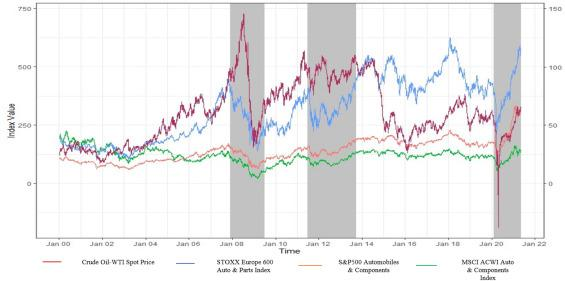

## Table of Contents

## What is the relationship between oil prices and the automotive industry?

Oil prices have a big impact on the automotive industry. When oil prices go up, it costs more to make cars because many parts of a car, like plastics and rubber, come from oil. Also, higher oil prices mean that gasoline, which cars need to run, becomes more expensive. This can make people less likely to buy cars, especially big ones that use a lot of gas. Car companies might then have to lower their prices or offer discounts to sell their cars, which can hurt their profits.

On the other hand, when oil prices are low, it's cheaper for car companies to make cars and for people to buy gas. This can make more people want to buy cars, which is good for the automotive industry. Low oil prices can also encourage people to buy bigger cars like trucks and SUVs because they are cheaper to run. However, if oil prices stay low for a long time, it might make people more interested in electric cars, which don't use gas at all. This could eventually change the kinds of cars that car companies make.

## How do fluctuations in oil prices affect car manufacturing costs?

When oil prices go up and down, it changes how much it costs to make cars. Oil is used to make many parts of a car, like plastics and rubber. So, if oil prices go up, the cost of these parts goes up too. This means car companies have to spend more money to build each car. If oil prices drop, the cost of these parts goes down, and it becomes cheaper for car companies to make cars.

These changes in oil prices can also affect other costs for car makers. For example, when oil prices are high, the cost of shipping cars from the factory to dealers goes up because trucks and ships use oil to run. On the other hand, when oil prices are low, shipping costs go down. All these costs add up, and big changes in oil prices can make a big difference in how much it costs to make a car.

## What impact do oil prices have on consumer demand for vehicles?

When oil prices go up, it makes gas more expensive. People don't want to spend a lot of money on gas, so they might not buy cars, especially big cars like trucks and SUVs that use a lot of gas. They might choose smaller cars that use less gas, or they might wait to buy a car until gas prices go down. This can make car companies sell fewer cars and maybe even lose money.

When oil prices go down, gas gets cheaper. People feel better about buying cars because it won't cost them as much to fill up their tanks. They might be more likely to buy bigger cars like trucks and SUVs because they are cheaper to drive. This can help car companies sell more cars and make more money. But if oil prices stay low for a long time, more people might start thinking about buying electric cars that don't use gas at all.

## How do rising oil prices influence the sales of different types of vehicles, such as SUVs versus compact cars?

When oil prices go up, it makes gas more expensive. People start to think more about how much gas their car uses. Big cars like SUVs use a lot of gas, so when gas prices are high, people might not want to buy them. Instead, they might choose smaller cars like compact cars that use less gas. This means that car companies might sell fewer SUVs and more compact cars when oil prices are high.

On the other hand, when oil prices are low, gas is cheaper. People don't worry as much about how much gas their car uses, so they might be more likely to buy bigger cars like SUVs. These cars are more fun to drive and have more space, so people like them when they don't have to worry about the cost of gas. Car companies might sell more SUVs and fewer compact cars when oil prices are low.

## In what ways do oil price changes affect the profitability of automotive companies?

When oil prices go up, it can hurt the profits of car companies. Making cars costs more because many car parts, like plastics and rubber, come from oil. Also, it costs more to ship cars to dealers because trucks and ships use oil to run. At the same time, people might not want to buy cars, especially big ones like SUVs, because gas is expensive. Car companies might have to lower their prices or offer discounts to sell cars, which means they make less money on each car they sell. All of these things can make it harder for car companies to make a profit when oil prices are high.

On the other hand, when oil prices go down, it can help car companies make more money. It's cheaper to make cars and to ship them to dealers. People are more likely to buy cars, especially bigger ones like trucks and SUVs, because gas is cheaper. This means car companies can sell more cars and don't have to offer as many discounts. When more cars are sold at higher prices, car companies can make more profit. However, if oil prices stay low for a long time, more people might start buying electric cars, which could change what kinds of cars car companies make and how much profit they can make in the future.

## How have historical oil price shocks impacted the automotive industry?

In the past, big changes in oil prices have really shaken up the car industry. For example, in the 1970s, there were oil crises that made oil prices jump up a lot. This made gas really expensive, and people started looking for cars that used less gas. Car companies had to change their plans and start making smaller cars like the Ford Pinto and the Volkswagen Rabbit. These cars were more popular because they saved money on gas. The big car companies, like General Motors and Ford, had a hard time because they had been making big cars that used a lot of gas, and now people didn't want them as much.

Another big oil price shock happened in the late 2000s. Oil prices went up a lot in 2008, just before the big financial crisis. This made gas prices go up too, and people started buying smaller cars again. Car companies like Toyota and Honda did well because they had small, fuel-efficient cars like the Prius. But big car companies like GM and Chrysler struggled because people didn't want their big trucks and SUVs as much. This time, the high oil prices, along with the financial crisis, made things really tough for the car industry, and some companies needed help from the government to stay in business.

## What strategies do automotive manufacturers employ to mitigate the risks associated with volatile oil prices?

Car companies try to handle the ups and downs of oil prices by making different kinds of cars. They know that when oil prices go up, people want smaller cars that use less gas. So, they make sure to have a good mix of small cars and big cars like SUVs. This way, no matter what happens with oil prices, they can still sell cars that people want. They also spend money on research to make their cars use less gas, which helps when oil prices are high.

Another thing car companies do is to plan ahead. They use special tools to guess what oil prices might do in the future. This helps them decide what kinds of cars to make and how many. They might also buy oil or gas ahead of time when prices are low, so they don't have to pay as much later if prices go up. This can help them keep their costs down and make more money even when oil prices are changing a lot.

## How do oil prices influence the shift towards electric and hybrid vehicles?

When oil prices go up, people start to worry about how much they spend on gas. This makes them think about buying electric or hybrid cars that don't use as much gas or don't use it at all. Electric cars run on electricity, which is usually cheaper than gas, especially when oil prices are high. Hybrid cars use both gas and electricity, so they can save money on gas too. When people see that gas prices are high, they might choose these types of cars because they cost less to drive. This can push car companies to make more electric and hybrid cars to meet the demand.

On the other hand, when oil prices are low, gas is cheaper and people might not care as much about saving money on gas. They might keep buying cars that run on gas because it's cheaper to fill up their tanks. But if oil prices stay low for a long time, car companies might still decide to make more electric and hybrid cars. They know that the world is trying to use less oil and gas because of climate change, so they plan for the future. Even if oil prices are low now, they want to be ready for when more people want electric and hybrid cars.

## What role do government policies play in mediating the impact of oil prices on the automotive sector?

Government policies can help the car industry when oil prices go up and down. When oil prices are high, governments might give money to car companies to help them make cars that use less gas or no gas at all, like electric cars. They might also give people money or tax breaks if they buy these kinds of cars. This can make more people want to buy them, even when gas is expensive. Governments can also make rules that say cars have to use less gas, which pushes car companies to make better cars.

When oil prices are low, governments might still want to help the car industry move away from gas cars. They might keep giving money or tax breaks for electric and hybrid cars to make sure people keep buying them. This helps car companies plan for the future, even if oil prices are low right now. Governments can also spend money on building places to charge electric cars, which makes it easier for people to use them. All these things help the car industry deal with changes in oil prices and move towards a future with less oil.

## How do oil prices affect the global supply chain and logistics within the automotive industry?

When oil prices go up, it costs more to move cars and car parts around the world. Oil is used to make gas for trucks and ships that [carry](/wiki/carry-trading) cars from factories to dealers. So, if oil prices are high, it costs more to ship cars, and this can make cars more expensive for people to buy. Car companies might have to pay more to get their cars to the right places, which can hurt their profits. They might also have to wait longer to get parts they need because shipping costs more, and this can slow down how fast they can make cars.

When oil prices go down, it's cheaper to move cars and parts. This can help car companies save money on shipping, and it might make cars a little cheaper for people to buy. It's easier and faster to get parts from one place to another, so car companies can make cars more quickly. But even when oil prices are low, car companies still have to think about other costs and problems in the global supply chain, like rules from different countries or problems at ports.

## What are the long-term implications of oil price trends on automotive industry innovation and investment?

When oil prices go up and down a lot, it makes car companies think about the future. They know that if oil prices keep going up, people will want cars that use less gas or no gas at all. So, car companies spend money on new ideas and technology to make better electric and hybrid cars. They also try to make their gas cars use less gas. This means they invest a lot in research and new factories to make these kinds of cars. If oil prices stay high for a long time, car companies might put even more money into electric cars because they know that's what people will want.

On the other hand, if oil prices stay low for a long time, car companies might not feel as much pressure to change right away. They might keep making gas cars because they are still popular when gas is cheap. But even with low oil prices, car companies know that the world is trying to use less oil because of climate change. So, they still invest in electric and hybrid cars to be ready for the future. They also look for other ways to save money and make better cars, like using new materials or making their factories work better. This way, they can keep making money no matter what happens with oil prices.

## How do automotive industry stakeholders forecast and prepare for future oil price scenarios?

Automotive industry stakeholders use different tools and methods to guess what oil prices might do in the future. They look at what has happened with oil prices in the past and use computer programs to make predictions. They also pay attention to what's happening in the world, like if there are wars or new laws that could change oil prices. By thinking about all these things, they try to plan for different situations, like if oil prices go up a lot or stay low for a long time. This helps them decide what kinds of cars to make and how many.

To prepare for future oil price changes, car companies make different plans. They might decide to make more electric and hybrid cars because they know people will want them if oil prices go up. They also try to make their factories work better and use new materials to save money. Sometimes, they buy oil or gas ahead of time when it's cheap, so they don't have to pay more later if prices go up. By doing all these things, car companies can keep making money and stay ready for whatever happens with oil prices.

## References & Further Reading

[1]: Stern, N. (2006). ["The Economics of Climate Change: The Stern Review."](https://www.lse.ac.uk/GranthamInstitute/publication/the-economics-of-climate-change-the-stern-review/) Cambridge University Press.

[2]: Basu, S., & Jones, R. (2020). ["Algorithmic Trading in Practice: Online Class."](https://link.springer.com/content/pdf/10.1007/978-981-19-1657-1_13.pdf) The Wharton School, University of Pennsylvania.

[3]: Hamilton, J. D. (2008). ["Oil and the Macroeconomy."](https://www.researchgate.net/publication/24108242_Oil_and_the_Macroeconomy_since_World_War_II) Handbook of Energy and Climate Change, National Bureau of Economic Research.

[4]: Geman, H. (2005). ["Energy Commodity Trading and Risk Management."](https://download.e-bookshelf.de/download/0000/5675/90/L-G-0000567590-0015270354.pdf) Wiley Finance.

[5]: Raj, M., & Teng, M. (2019). ["The Impact of Artificial Intelligence on Accounting, Automation, and Financial Markets."](https://papers.ssrn.com/sol3/papers.cfm?abstract_id=3368605) World Scientific Publishing Company.

[6]: Blas, J. & Farchy, J. (2021). ["The World for Sale: Money, Power, and the Traders Who Barter the Earth's Resources."](https://books.google.com/books/about/The_World_For_Sale.html?id=ia8gEAAAQBAJ) Oxford University Press.