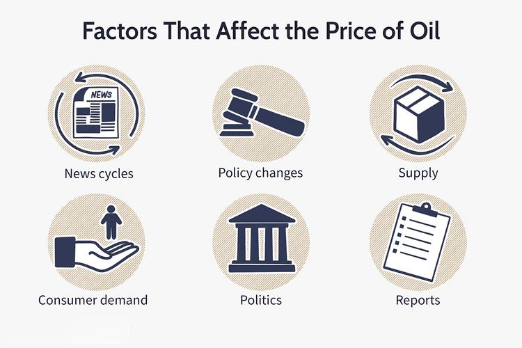

In the ever-evolving landscape of the automotive and financial sectors, understanding the interplay between oil prices, the auto industry, and algorithmic trading is crucial for investors, manufacturers, and policymakers alike. Fluctuations in oil prices significantly impact the automotive sector. As a key determinant of fuel costs, oil prices influence consumer preferences, prompting changes in demand for various types of vehicles, from fuel-efficient models to large SUVs and trucks. Auto manufacturers must remain agile, adapting production strategies and investing in technology to respond efficiently to these shifts.

Similarly, the financial sector has witnessed a profound transformation with the advent of algorithmic trading. This sophisticated technique leverages artificial intelligence to analyze vast datasets, predict market movements, and execute trades at lightning speeds. Such technology not only enhances trading efficiency and liquidity but also introduces complexities, such as regulatory challenges and ethical considerations.



Examining the dynamic relationship between oil prices, automotive trends, and algorithmic trading provides insights into market behavior and investment opportunities. By understanding these interactions, stakeholders can better navigate the complexities inherent in these interconnected sectors, allowing for strategic decision-making and the identification of potential areas for growth and innovation. Through this comprehensive overview, the article aims to illuminate how these elements collectively shape market conditions and drive economic change.

## Table of Contents

## Understanding Oil Prices and Their Impact on the Automotive Sector

Oil prices play a pivotal role in shaping the dynamics of the automotive industry, influencing both consumer demand and manufacturing supply. A significant factor is the correlation between oil prices and the sale of fuel-intensive vehicles such as SUVs and trucks. When oil prices fall, the cost of operating these vehicles decreases, making them more attractive to consumers, thereby boosting overall automobile sales. Conversely, high oil prices can deter potential buyers, particularly from purchasing larger, less fuel-efficient vehicles, which can dampen sales figures.

This price sensitivity is a direct consequence of how oil prices affect gasoline costs, a major consideration for car buyers. As a result, fluctuations in oil prices lead to shifts in consumer preferences. For instance, when oil prices are high, there tends to be an increased interest in fuel-efficient or alternative fuel vehicles. Manufacturers often respond by adjusting their production strategies to align with changing preferences, ensuring they cater to the demand for vehicles with better fuel economy during periods of high oil prices.

Moreover, the impact of oil prices extends to the profitability of automotive manufacturers. Fluctuating oil prices can cause shifts in operational expenses and influence the cost structure of vehicle production. Lower oil prices may reduce logistics and transportation costs, potentially enhancing profitability for manufacturers. On the other hand, persistently high oil prices can increase costs along the supply chain, from raw materials to distribution, squeezing margins and affecting the financial health of companies in the sector.

In summary, the relationship between oil prices and the automotive industry is multifaceted, affecting consumer buying patterns, vehicle production strategies, and the economic viability of automotive companies. Managing these influences is crucial for stakeholders to mitigate risks and capitalize on opportunities presented by changing oil market conditions.

## How the Auto Industry Adapts to Oil Price Variations

Automotive manufacturers strategically adjust their production based on oil price trends by closely monitoring fuel cost dynamics and consumer preferences. When oil prices rise, there tends to be an increased consumer demand for more fuel-efficient or electric vehicles (EVs). This shift is driven by the economic necessity for consumers to reduce their fuel expenditures. Consequently, automakers focus on accelerating the development and production of vehicles that offer greater fuel efficiency or operate on alternative energy sources, such as hybrid and electric powertrains. Companies like Tesla have capitalized on this trend by prioritizing the production of EVs, while traditional manufacturers have launched hybrid models to capture a share of this evolving market. 

Conversely, when oil prices decrease, consumer interest often shifts to larger, less fuel-efficient vehicles, such as SUVs and trucks, due to the lower cost of fuel consumption. This change prompts manufacturers to adjust their production lines accordingly, increasing the output of vehicles that align with these preferences. Automakers such as Ford and General Motors have historically adjusted their inventory to cater to these cyclical trends, ramping up production of larger models when fuel is inexpensive.

In response to these volatile market dynamics, automakers are investing in innovative technologies and alternative fuels to hedge against future oil price fluctuations. These investments include the development of advanced fuel-saving technologies and diversification into electric and hybrid vehicle platforms. Efforts are further directed towards improving battery technologies to enhance the efficiency and range of EVs. Automakers are also exploring alternative fuels, such as hydrogen, to provide a broader range of sustainable options for consumers. These strategic moves ensure that manufacturers remain competitive across varying oil price scenarios while aligning with global shifts towards sustainability and emissions reduction.

Additionally, the integration of sustainable practices includes advancements in manufacturing processes, aimed at reducing the carbon footprint and increasing overall energy efficiency of production facilities. By doing so, manufacturers not only respond to consumer demand but also comply with regulatory frameworks aimed at reducing vehicular emissions, thereby driving long-term industry transformation.

These adaptive strategies highlight the auto industry's agility in navigating oil price [volatility](/wiki/volatility-trading-strategies), ensuring resilience in an ever-changing economic landscape.

## The Role of Artificial Intelligence in Oil Trading

Artificial intelligence (AI) and [algorithmic trading](/wiki/algorithmic-trading) have significantly reshaped the landscape of oil trading on the global stage. The integration of AI into this sector allows for the processing and analysis of massive datasets, offering traders insights into market movements with an unprecedented degree of accuracy. Traditional trading methods that relied on human intuition and experience are increasingly being supplemented or replaced by AI systems capable of recognizing patterns and trends in real-time data, thereby providing a competitive advantage.

AI systems utilize complex algorithms and [machine learning](/wiki/machine-learning) techniques to predict market movements. For example, they can analyze historical price data, market sentiment from news articles, and social media trends to anticipate future price changes. These predictive capabilities enable traders to make informed decisions, minimizing risks and optimizing returns on investments. A basic example of such a system in Python might involve using libraries like TensorFlow or scikit-learn to train a model on historical price data:

```python
import numpy as np
from sklearn.ensemble import RandomForestRegressor
from sklearn.model_selection import train_test_split

# Example data
prices = np.array([...])  # Historical oil prices
features = np.array([...])  # Corresponding features like volume, market sentiment

# Split data into training and testing sets
X_train, X_test, y_train, y_test = train_test_split(features, prices, test_size=0.2, random_state=42)

# Train a RandomForest model
model = RandomForestRegressor(n_estimators=100, random_state=42)
model.fit(X_train, y_train)

# Predict future prices based on the test set
predicted_prices = model.predict(X_test)
```

Algorithmic trading, driven by these AI systems, enhances market [liquidity](/wiki/liquidity-risk-premium) and efficiency by enabling the execution of trades at a speed and accuracy unattainable by human traders. The use of algorithms allows markets to adjust swiftly to new information, reducing price discrepancies and ensuring that prices more accurately reflect available information.

Despite these benefits, the rise of AI-driven trading systems brings forth several challenges, particularly in terms of regulatory scrutiny and potential market manipulation. The speed at which these systems operate can exacerbate market volatility, and the opacity of complex algorithms poses transparency issues. Regulators are increasingly concerned with ensuring that these systems adhere to fair trading practices and do not disadvantage certain market participants.

Moreover, the potential for algorithmic trading to be manipulated—intentionally or otherwise—remains a critical concern. Flash crashes, where rapid market sell-offs occur due to algorithmic interactions, exemplify the risks inherent in high-frequency trading environments. Consequently, regulatory bodies are tasked with developing frameworks to monitor and manage the impact of AI in oil trading, balancing innovation with market stability.

The integration of AI in oil trading highlights a pivotal shift towards technology-driven solutions in financial markets. As AI continues to evolve, its role in shaping the future of trading strategies and market dynamics is expected to expand, necessitating ongoing evaluation and adaptation from both market participants and regulators.

## Algorithmic Trading in the Auto Industry

The automotive industry has increasingly embraced algorithmic trading to optimize supply chain logistics and manage market exposure effectively. This adoption reflects a broader trend of leveraging advanced computational methods to enhance decision-making processes across various sectors.

Algorithmic trading in the auto industry involves utilizing advanced analytics to predict market trends and align operations with real-time data. By analyzing vast datasets, companies can forecast demand and adjust production schedules accordingly. This approach not only ensures that manufacturers can meet consumer needs efficiently but also helps in minimizing inventory costs, thereby improving overall operational efficiency.

One critical application of algorithmic trading in this context is managing financial risks associated with currency fluctuations. Given the global nature of the automotive supply chain, currency exchange rates can significantly impact costs. Algorithmic systems allow companies to hedge against these risks by executing trades that protect against adverse currency movements. This strategic financial management is essential for maintaining competitive pricing and safeguarding profitability.

Furthermore, algorithmic solutions are pivotal in responding to variations in raw material costs and changing consumer demands. For instance, when the price of raw materials like steel or aluminum fluctuates, algorithms can predict these changes and suggest procurement strategies that minimize costs. Similarly, by analyzing consumer behavior patterns, manufacturers can better align production with market preferences, ensuring that supply matches demand while adopting flexible strategies to accommodate shifts in consumer interests, such as the growing preference for electric vehicles.

By integrating these algorithmic systems, automotive companies can achieve a sophisticated level of operational agility. This integration not only helps in maintaining a balance between cost and quality but also positions companies to respond dynamically to industry challenges. As the transportation sector continues to evolve, the role of algorithmic trading in the automotive industry is expected to expand, offering new opportunities for innovation and efficiency enhancement.

## Challenges and Ethical Considerations

While AI and algorithmic trading offer significant advantages, they also present a range of ethical and operational challenges that must be carefully managed. 

One of the primary concerns is transparency. Algorithmic trading systems can be complex and operate with minimal human intervention, making it difficult to understand the decision-making processes embedded within the algorithms. This opacity raises questions about accountability, particularly when trading systems malfunction or lead to market disruptions. 

Data privacy is another critical issue. Algorithmic trading relies on massive datasets, which may include sensitive information. The integration of personal data into trading algorithms can inadvertently lead to privacy violations, thereby necessitating stringent data governance frameworks and protocols to protect individual privacy.

Market fairness is also a central topic in discussions about algorithmic trading systems. High-frequency trading ([HFT](/wiki/high-frequency-trading-strategies)), a subset of algorithmic trading, can lead to an uneven playing field where firms with advanced technology may have a competitive advantage over those without. This discrepancy raises ethical considerations about equal access and the integrity of financial markets.

Additionally, the rapid evolution of AI technologies challenges regulatory bodies to adapt quickly. The existing regulatory frameworks may not adequately address the intricacies of algorithmic trading, leading to loopholes that can be exploited. Regulatory agencies must enhance their capabilities to monitor, assess, and implement rules that ensure fair and responsible usage of automated trading systems.

Overall, while the integration of AI and algorithmic trading into the energy and automotive sectors offers tremendous potential, it also necessitates a cautious approach to navigate the accompanying ethical and operational challenges. Ensuring transparency, safeguarding data privacy, and maintaining market fairness are paramount for these advancements to contribute positively to economic and social systems.

## Conclusion

Oil prices, the auto industry, and algorithmic trading are intricately linked sectors that influence global economic conditions. Fluctuations in oil prices directly impact consumer behavior, affecting the demand for certain types of vehicles. This, in turn, influences manufacturing priorities within the automotive sector, prompting a shift towards either fuel-efficient vehicles or larger, fuel-intensive ones, depending on current oil price trends.

As technologies evolve, stakeholders in these industries face a spectrum of challenges and opportunities. The rise of [artificial intelligence](/wiki/ai-artificial-intelligence) and algorithmic trading continues to reshape how these markets operate, offering enhanced predictive capabilities and operational efficiencies. However, these advancements also introduce complexities such as data privacy concerns, transparency issues, and potential market manipulation. Regulatory bodies must adapt swiftly to ensure these technologies are used responsibly, maintaining market integrity and fairness.

Continued innovation and regulatory adaptation play a crucial role in maximizing the benefits arising from the interplay among oil prices, the automotive sector, and algorithmic trading. This involves developing new technologies in vehicle manufacturing, improving fuel efficiency, and exploring alternative energy sources. It also requires refining algorithmic trading methods to enhance market stability while safeguarding against unethical practices. Ensuring sustainable growth amidst these dynamics demands a concerted effort from industry leaders, policymakers, and investors, who must work collaboratively to navigate the evolving landscape and mitigate potential risks.

## References & Further Reading

[1]: Stern, N. (2006). ["The Economics of Climate Change: The Stern Review."](https://www.lse.ac.uk/GranthamInstitute/publication/the-economics-of-climate-change-the-stern-review/) Cambridge University Press.

[2]: Basu, S., & Jones, R. (2020). ["Algorithmic Trading in Practice: Online Class."](https://link.springer.com/content/pdf/10.1007/978-981-19-1657-1_13.pdf) The Wharton School, University of Pennsylvania.

[3]: Hamilton, J. D. (2008). ["Oil and the Macroeconomy."](https://www.researchgate.net/publication/24108242_Oil_and_the_Macroeconomy_since_World_War_II) Handbook of Energy and Climate Change, National Bureau of Economic Research.

[4]: Geman, H. (2005). ["Energy Commodity Trading and Risk Management."](https://download.e-bookshelf.de/download/0000/5675/90/L-G-0000567590-0015270354.pdf) Wiley Finance.

[5]: Raj, M., & Teng, M. (2019). ["The Impact of Artificial Intelligence on Accounting, Automation, and Financial Markets."](https://papers.ssrn.com/sol3/papers.cfm?abstract_id=3368605) World Scientific Publishing Company.

[6]: Blas, J. & Farchy, J. (2021). ["The World for Sale: Money, Power, and the Traders Who Barter the Earth's Resources."](https://books.google.com/books/about/The_World_For_Sale.html?id=ia8gEAAAQBAJ) Oxford University Press.