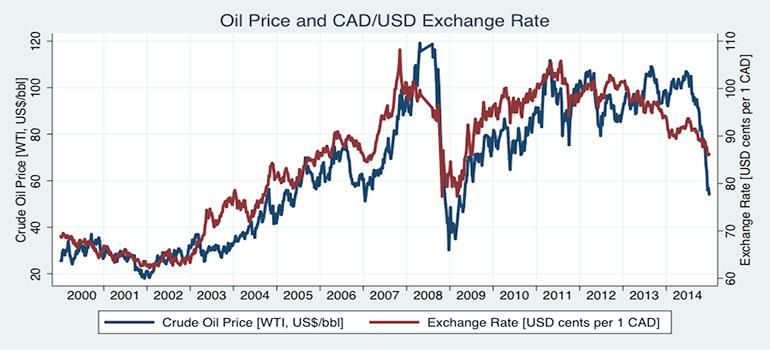

Oil prices are a critical factor in the Canadian economy, given Canada's position as a leading global oil producer. The fluctuations in oil prices directly impact various sectors of the economy, influencing everything from governmental fiscal policies to corporate earnings. As oil is a major export for Canada, changes in its price can have significant ripple effects, influencing not only industry stakeholders but also the overall economic health of the nation.

The Canadian dollar, colloquially known as the 'loonie,' has a well-documented correlation with oil prices. Typically, when oil prices rise, the Canadian dollar strengthens due to increased foreign earnings from oil exports. Conversely, a drop in oil prices tends to weaken the loonie, as the resulting decrease in export revenues impacts the nation's trade balance. This direct relationship is often leveraged by traders and economists to predict currency movements, thereby influencing the foreign exchange market.



Algorithmic trading takes advantage of the correlation between oil prices and the Canadian dollar, using complex mathematical models and computer algorithms to make informed trading decisions. These algorithms can process vast amounts of data at high speed, identifying patterns and executing trades that align with predefined criteria based on price movements and economic indicators. As a result, traders can optimize strategies to capitalize on fluctuations in the USD/CAD exchange rate, influenced by oil price dynamics.

This article explores the relationship between oil prices, the Canadian dollar, and algorithmic trading. By examining the economic implications, currency effects, and technological applications, we aim to provide a comprehensive understanding of how these elements interact and the resulting opportunities in the financial markets.

## Table of Contents

## The Economics of Oil Prices

Oil prices are influenced by a complex interplay of factors, including supply and demand dynamics, geopolitical events, and production decisions by key oil-producing countries. The pricing mechanism initially responds to the fundamental economic principle of supply and demand: when supply outstrips demand, prices tend to fall, and when demand exceeds supply, prices generally rise. Changes in oil reserves, production quotas from organizations like the Organization of the Petroleum Exporting Countries (OPEC), and technological advancements in extraction methods can significantly affect supply levels.

Geopolitical events, such as conflicts in oil-rich regions, economic sanctions, or strategic agreements among major oil producers, can lead to substantial and sometimes sudden fluctuations in oil prices. For instance, tension in the Middle East often leads to concerns over supply disruptions, causing speculative trading that can drive prices up.

For Canada, oil represents a substantial segment of its exports, meaning fluctuations in oil prices can have a direct impact on the national economy. As a major player in the global oil market, Canada stands to benefit when oil prices increase. Higher prices result in greater revenues from oil exports, contributing positively to national income and potentially leading to an uptick in related economic activities, such as increased employment in the oil sector and growth in ancillary industries like transportation and manufacturing.

When oil prices rise, the Canadian economy often experiences a boost in economic activities and revenues, as evidenced by a surge in investments in oil extraction and infrastructure projects. This increase in economic activity can further stimulate job creation, increased consumer spending, and greater capital investment in infrastructure projects, providing a multiplier effect on the broader economy.

Overall, the [volatility](/wiki/volatility-trading-strategies) of oil prices presents both opportunities and challenges for countries like Canada, heavily reliant on oil exports. While price increases can bolster economic performance, declines can lead to revenue drops, necessitating efficient economic strategies to buffer against such fluctuations. Understanding these dynamics is crucial for policymakers and businesses as they navigate the economic impacts of shifting oil prices.

## Impact of Oil Prices on the Canadian Dollar

The relationship between oil prices and the value of the Canadian dollar (the "loonie") is a fundamental aspect of the Canadian economy. When oil prices rise, the Canadian dollar tends to strengthen. This phenomenon is primarily due to the fact that higher oil prices lead to increased foreign earnings from Canada's extensive oil exports, thereby raising demand for the Canadian dollar as oil transactions are typically conducted in Canadian currency. The correlation between oil prices and the loonie is robust because the oil sector constitutes a significant portion of Canada's export economy.

Conversely, when oil prices decline, the Canadian dollar generally weakens. Reduced oil prices lead to a drop in export revenues, as foreign demand for Canadian oil either stagnates or reduces, thereby decreasing the need for Canadian currency. This inverse relationship reinforces the extent to which Canada's economic well-being is reliant on the state of the global oil market, establishing oil as a pivotal export commodity that influences currency value.

The economic dependence on oil exports means the Canadian dollar's exchange rate is often seen as a petro-currency. This dependency can be quantified by examining the correlation coefficient between oil prices (West Texas Intermediate [WTI] benchmark) and the USD/CAD exchange rate over different periods, illustrating how closely tied the Canadian currency is to fluctuations in oil markets. 

Additionally, Canada's oil exports not only generate foreign currency but also impact domestic economic conditions, influencing overall investor confidence and having a ripple effect on various sectors tied directly or indirectly to the oil industry. This makes it essential for traders and policymakers alike to monitor oil price trends to gauge potential trajectories of the Canadian dollar, allowing them to anticipate market movements and adjust strategies accordingly.

## Algorithmic Trading and Oil Price Dynamics

Algorithmic trading systems are designed to manage large volumes of data swiftly and efficiently, and can be particularly effective in capitalizing on the correlation between oil prices and the Canadian dollar. These correlations arise due to Canada's substantial oil exports; changes in oil prices often influence the valuation of the Canadian currency. The process involves using automated systems to analyze datasets reflecting price movements, allowing for the execution of trades based on criteria set by traders.

The core functionality of [algorithmic trading](/wiki/algorithmic-trading) in this context lies in its data analysis capabilities. Traders typically set up algorithms that utilize historical data to recognize patterns and trends conducive to predicting future movements. For instance, with the USD/CAD currency pair, the value movement often aligns with shifts in oil prices. A rise in oil prices could potentially lead to an appreciation of the Canadian dollar, while a drop might cause depreciation. 

To capitalize on these dynamics, algorithms might employ regression models to establish and quantify the relationship between historical oil prices and USD/CAD exchange rates. Algorithms use these models to predict currency movements and trigger trades automatically according to the set parameters. For example, a simplified linear regression model could be represented as follows:

$$
\text{USD/CAD\_rate} = \alpha + \beta \times \text{Oil\_price} + \epsilon
$$

where $\alpha$ and $\beta$ are coefficients determined by historical data, and $\epsilon$ is the error term.

Not only do these systems react to historical trends, but they can also incorporate real-time data inputs to adapt to market fluctuations instantly. Traders might deploy complex [machine learning](/wiki/machine-learning) algorithms, such as neural networks, that learn from accumulated information and improve prediction accuracy over time.

Below is a basic Python snippet demonstrating how an algorithm might be configured to make predictive analyses using historical correlations between oil prices and the USD/CAD rate:

```python
import pandas as pd
from sklearn.linear_model import LinearRegression

# Sample historical data (for illustration purposes)
data = {'Oil_Price': [50, 55, 60, 65, 70], 'USD_CAD_Rate': [1.30, 1.28, 1.25, 1.23, 1.22]}
df = pd.DataFrame(data)

# Defining the model
model = LinearRegression()
X = df[['Oil_Price']]
y = df['USD_CAD_Rate']

# Fitting the model
model.fit(X, y)

# Predicting the exchange rate based on a new oil price
new_oil_price = 75
predicted_rate = model.predict([[new_oil_price]])
print(f"Predicted USD/CAD rate for oil price of {new_oil_price} is {predicted_rate[0]}")
```

By efficiently identifying market signals and executing trades based on statistical insights, algorithmic trading enables traders to optimize their strategies in response to oil price dynamics. This allows for more agile and informed decision-making, which could be advantageous in a volatile market influenced by global energy trends.

## Case Studies: Successful Strategies in Algo Trading

### Case Studies: Successful Strategies in Algo Trading

Algorithmic trading has enabled traders to capitalize on market trends by automating decision-making processes. This section covers two case studies that highlight successful trading strategies linked to fluctuations in oil prices and their effect on the Canadian dollar, illustrating the adaptability of algorithmic trading systems in this domain.

**Case Study 1: Profiting from a Sustained Rise in Oil Prices**

In this first scenario, the trading strategy was developed to exploit a consistent increase in oil prices over a defined period. The algorithm is designed to detect upward trends in oil prices by analyzing historical data, news sentiment, and production reports from major oil-exporting nations.

The trading logic leverages the strong historical correlation between rising oil prices and an appreciating Canadian dollar. For instance, the algorithm may employ a moving average crossover strategy. A simple Python implementation might look like this:

```python
# Import necessary libraries
import pandas as pd
import numpy as np

# Load data
data = pd.read_csv('oil_and_currency_data.csv')

# Calculate moving averages
data['Oil_20_MA'] = data['Oil Price'].rolling(window=20).mean()
data['CAD_20_MA'] = data['CAD/USD Rate'].rolling(window=20).mean()

# Define signals
data['Buy_Signal'] = np.where(data['Oil Price'] > data['Oil_20_MA'], 1, 0)

# Execute trades
data['CAD_Position'] = np.where(data['Buy_Signal'] == 1, 'Long', 'Neutral')

# Assess performance
profits = data[data['CAD_Position'] == 'Long']['CAD/USD Rate'].pct_change().sum()
print(f'Total profits from strategy: {profits:.2f}%')
```

This strategy assumes that when oil prices consistently trade above their 20-day moving average, it signals a bullish trend. Consequently, the algorithm takes a long position on the Canadian dollar, which tends to appreciate with rising oil prices.

**Case Study 2: Anticipating a Drop in Oil Prices and Adjusting Positions**

In the second scenario, the algorithm anticipates a decline in oil prices and subsequently adjusts its positions on the Canadian dollar. This approach may involve a more complex model incorporating machine learning techniques to predict price movements based on past data and external factors like political events or supply chain disruptions.

A decision tree or random forest model could be implemented to predict price drops. Here's a simplified example using Python:

```python
from sklearn.model_selection import train_test_split
from sklearn.ensemble import RandomForestClassifier
from sklearn.metrics import classification_report

# Prepare data
features = data[['Oil Price', 'Interest Rates', 'Inventories']]
labels = data['CAD/USD Rate'].apply(lambda x: 1 if x < threshold_value else 0)

# Split the data
X_train, X_test, y_train, y_test = train_test_split(features, labels, test_size=0.3, random_state=42)

# Train the model
model = RandomForestClassifier()
model.fit(X_train, y_train)

# Making predictions
predictions = model.predict(X_test)

# Evaluate the model
print(classification_report(y_test, predictions))
```

This algorithm uses a predictive model to signal when to short the Canadian dollar when oil prices are forecasted to drop. By accurately predicting these declines, the algorithm strategically reduces exposure to potential losses.

**Versatility of Algorithmic Trading**

These case studies exemplify how algorithmic trading systems can successfully unlock opportunities by responding to oil market dynamics. The strategic advantage provided by these algorithms lies in their ability to process large volumes of data rapidly and execute trades with precision, crucial in exploiting the correlation between oil prices and the Canadian dollar.

## Future Outlook for Oil, the Canadian Dollar, and Algo Trading

The future of oil in Canada is shaped by a multitude of factors, including fluctuating export costs and the rising importance of renewable energy sources. Canada's oil industry must grapple with these uncertainties, posing potential challenges but not diminishing the sector's overall impact on the national economy. Oil exports constitute a significant portion of Canada's trade balance, ensuring that fluctuations in oil prices continue to wield substantial influence over the Canadian dollar.

Despite emerging trends in energy transition, the Canadian dollar remains closely tied to oil prices due to the country's economic reliance on energy exports. As the global energy landscape evolves, it is anticipated that Canada's oil and gas sector will adapt, albeit with potential alterations in production methods and export strategies to align with environmental and economic demands. However, the correlation between oil prices and the Canadian dollar is expected to persist, albeit potentially moderated by diversifying economic activities and energy investments.

Advancements in technology, particularly within algorithmic trading, are poised to refine how traders interpret and respond to market signals related to oil and currency fluctuations. Algorithmic trading systems, leveraging machine learning and [artificial intelligence](/wiki/ai-artificial-intelligence), enhance analytical capabilities, allowing for more precise predictions and timely execution of trades. These systems can digest a myriad of market data, including historical pricing patterns, geopolitical indicators, and economic reports, to optimize trading decisions.

With continuous improvements in computing power and data analytics, algorithmic trading strategies are expected to further evolve, incorporating increasingly sophisticated models that can address complex interactions between oil prices, the Canadian dollar, and other financial instruments. For instance, machine learning algorithms might use neural networks to detect non-linear relationships that typical models might overlook, as illustrated by the following Python pseudocode example:

```python
from sklearn.neural_network import MLPRegressor

# Sample data representing oil prices and Canadian dollar exchange rates
oil_prices = [...]  
exchange_rates = [...]

# Creating a neural network model
model = MLPRegressor(hidden_layer_sizes=(100,), max_iter=1000, random_state=42)

# Train the model
model.fit(oil_prices, exchange_rates)

# Predict future exchange rates based on projected oil prices
future_oil_prices = [...]
predicted_exchange_rates = model.predict(future_oil_prices)
```

Such predictive analytics allow traders to maintain a competitive edge, by preemptively adjusting trading strategies in response to anticipated market dynamics. As both the energy sector and financial technologies advance, the interaction between oil, the Canadian dollar, and algorithmic trading will likely become increasingly complex but also more intelligently navigable.

## Conclusion

The intricate relationship between oil prices, the Canadian dollar, and algorithmic trading offers a unique opportunity for traders to enhance their trading performance. As oil prices fluctuate due to shifts in global demand, geopolitical tensions, or changes in production levels from major oil-producing nations, the Canadian dollar often mirrors these movements due to Canada's economic reliance on oil exports. This correlation allows traders to anticipate currency movements by closely monitoring oil price trends.

Algorithmic trading systems capitalize on this correlation by employing sophisticated models and data analytics to identify trading opportunities. These systems execute trades based on predetermined criteria that [factor](/wiki/factor-investing) in the dynamic movements of oil prices and their impact on the USD/CAD currency pair. The success of such trading strategies relies significantly on the accuracy of the algorithms in processing and responding to market signals.

To remain competitive and maximize profitability, traders must continuously monitor market trends and technological advancements. As financial markets evolve, new data sources and improved computational techniques present opportunities to refine trading algorithms. By staying informed about the latest developments in algorithmic trading technologies and understanding the underlying economic factors at play, traders can adapt their strategies to better exploit the ongoing relationship between oil prices and the Canadian dollar. In effect, this strategic approach is vital for navigating the complexities of modern financial markets and securing a competitive edge.

## References & Further Reading

[1]: Chen, Y., Rogoff, K., & Rossi, B. (2010). “Can Exchange Rates Forecast Commodity Prices?” *The Quarterly Journal of Economics*, 125(3), 1145–1194. [Link](https://www.nber.org/papers/w13901)

[2]: Elder, J. (2004). “Another Look at Forecasting Commodity Prices Using Exchange Rates.” *Journal of Economic Dynamics and Control*, 28(11), 2271-2298. [Link](https://github.com/Dan-wanna-M/kbnf/blob/master/tests/rwkv_vocab_v20230424.json)

[3]: Hammoudeh, S., & Yuan, Y. (2008). "Metal volatility in presence of oil and interest rate shocks." *Energy Economics*, 30(2), 606-620. [Link](https://www.sciencedirect.com/science/article/pii/S0140988307001156)

[4]: Kilian, L. (2009). “Not All Oil Price Shocks Are Alike: Disentangling Demand and Supply Shocks in the Crude Oil Market.” *American Economic Review*, 99(3), 1053–1069. [Link](https://www.jstor.org/stable/25592494)

[5]: Narayan, P. K., & Narayan, S. (2010). "Modelling the impact of oil prices on Vietnam's stock prices." *Applied Energy*, 87(10), 3566-3571. [Link](https://www.sciencedirect.com/science/article/pii/S0306261909002323)