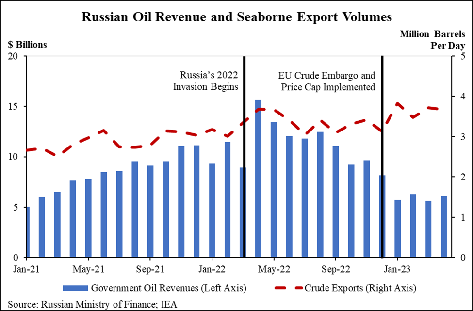

## Table of Contents

## What is the current state of oil prices globally?

Oil prices around the world have been going up and down a lot lately. Right now, they are pretty high compared to a few years ago. This is because there are a lot of things happening that affect how much oil countries produce and how much people need it. For example, some countries have decided to produce less oil, which makes the price go up. Also, the world is starting to use more oil again after the big drop during the time when many people stayed home because of the global health crisis.

Another thing that is pushing oil prices up is the uncertainty about what will happen next. People are worried about things like wars, new laws about oil, and how fast the world is switching to using less oil and more green energy. All these things make it hard to guess what oil prices will do next. But for now, oil is still really important for cars, planes, and making things, so the prices stay high because so many people and businesses need it.

## How does Russia rank as an oil-producing country?

Russia is one of the biggest oil-producing countries in the world. It usually comes in second place, right after the United States. Russia produces a lot of oil every day, around 10 million barrels. This makes Russia very important in the global oil market because it has so much oil to sell to other countries.

The amount of oil Russia produces can change because of things like politics, how much money they want to make, and what's happening with oil prices around the world. Russia works with other countries in a group called OPEC+ to decide how much oil they will produce. This helps them try to keep oil prices stable. But sometimes, if Russia decides to produce more or less oil, it can make a big difference in what people pay for oil everywhere.

## What percentage of Russia's GDP is derived from oil and gas?

Oil and gas are very important for Russia's economy. They make up a big part of the country's money. About 15 to 20 percent of Russia's GDP comes from oil and gas. This means that one out of every five or six dollars Russia makes comes from selling oil and gas.

This percentage can change a bit from year to year. It depends on how much oil and gas Russia sells and what price they get for it. When oil prices are high, the percentage might go up. When prices are low, it might go down. But no matter what, oil and gas are always a big part of Russia's money.

## How do fluctuations in oil prices affect Russia's national budget?

Fluctuations in oil prices have a big impact on Russia's national budget. When oil prices go up, Russia makes more money from selling oil and gas. This means the government has more money to spend on things like schools, hospitals, and roads. It can also help the government pay off debts and save money for the future. So, when oil prices are high, Russia's budget looks better, and the country can do more for its people.

On the other hand, when oil prices go down, Russia earns less money from oil and gas. This can make it hard for the government to pay for all the things it needs to. They might have to cut back on spending, which can affect services like healthcare and education. Sometimes, the government might need to use money it has saved up or borrow more money to cover the budget. So, lower oil prices can make Russia's budget tight and force the government to make tough choices.

## What are the historical trends of oil prices and their impact on the Russian economy?

Historically, oil prices have gone up and down a lot, and these changes have had a big effect on Russia's economy. When oil prices were very high, like in the early 2000s and around 2010-2014, Russia made a lot of money from selling oil and gas. This helped the country grow and improve things like roads and schools. The government had more money to spend, and people felt good about the economy. But when oil prices crashed in 2014 and stayed low for a few years, Russia's economy struggled. The government had to cut back on spending, and the value of the Russian currency, the ruble, went down. This made life harder for many people in Russia.

In more recent years, oil prices have been going up again, which has been good for Russia's economy. Since 2020, after a big drop because of the global health crisis, oil prices have been climbing back up. This has helped Russia's budget and made the government more able to spend money on things that help people. But oil prices can still change quickly, and Russia has to be careful. The country relies a lot on oil and gas, so any big drop in prices can cause problems. Russia is trying to find other ways to make money, but for now, oil and gas are still very important for the economy.

## How does the Russian government use oil revenues to fund public services and infrastructure?

The Russian government uses the money it gets from selling oil to help pay for things like schools, hospitals, and roads. When oil prices are high, the government has more money to spend on these public services. This means they can build new schools or fix old ones, make sure hospitals have what they need, and keep roads and bridges in good shape. The money from oil also helps pay for things like police and firefighters, which keep people safe.

But when oil prices go down, the government has less money to spend. This can mean they have to cut back on some services. Maybe they can't build as many new schools or hospitals, or they might not be able to fix the roads as often. The government might have to be careful with how they spend the money they do have, making sure it goes to the most important things. So, the amount of money Russia makes from oil can really change how much they can do for the people who live there.

## What economic policies does Russia implement to mitigate the effects of low oil prices?

When oil prices go down, Russia uses different ways to handle the money problems this causes. One thing they do is save money when oil prices are high. They put this money into a special fund, called the National Wealth Fund, which they can use when oil prices drop. This helps them keep paying for important things like schools and hospitals even when they're not making as much money from oil. Another way Russia deals with low oil prices is by changing how much they spend. If they see that oil prices are going to stay low, they might decide to spend less on new projects and focus on what's most important.

Russia also tries to make money in other ways when oil prices are low. They might try to sell more things to other countries, like cars or machines, to make up for the money they're not getting from oil. The government might also change the taxes people and businesses have to pay, to get more money coming in. By doing these things, Russia tries to keep their economy strong even when oil prices are not helping as much.

## How do changes in oil prices influence the value of the Russian ruble?

When oil prices go up or down, it can change how much the Russian ruble is worth. Oil is a big part of what Russia sells to other countries, so when oil prices are high, Russia makes more money. This extra money can make the ruble stronger because people and businesses in other countries want to buy rubles to pay for the oil. A stronger ruble means that Russian people can buy things from other countries for less money.

But when oil prices drop, Russia makes less money from selling oil. This can make the ruble weaker because other countries don't need as many rubles to buy oil. A weaker ruble means that things from other countries cost more for Russian people. So, the price of oil can really affect how much the ruble is worth and how much it can buy.

## What are the social impacts of oil price volatility in Russia?

When oil prices go up and down a lot, it can change life for people in Russia in big ways. If oil prices are high, the government has more money to spend on things like schools and hospitals. This means better services for people, which can make life easier and happier. But when oil prices drop, the government might not have as much money. They might have to cut back on these services, which can make it harder for people to get the help they need. This can lead to less money for families and more stress.

Also, when oil prices change a lot, it can affect jobs. When prices are high, companies that work with oil can hire more people, which is good for the economy. But when prices go down, these companies might have to let people go or not hire as many new workers. This can make it hard for people to find jobs and take care of their families. So, the ups and downs of oil prices can really shake up life in Russia, making things better or worse depending on what's happening with oil.

## How does Russia's dependence on oil affect its international relations and geopolitical strategies?

Russia's dependence on oil plays a big role in how it acts with other countries and what it does in the world. Because oil is so important for Russia's money, the country tries to keep oil prices high. They do this by working with other countries in a group called OPEC+. Russia and these countries agree on how much oil to produce, which can help keep prices stable. This makes Russia a key player in the global oil market, and other countries have to pay attention to what Russia does. Sometimes, Russia might use its oil to get what it wants in international talks or to help friends and hurt enemies.

But relying so much on oil can also cause problems. If oil prices drop a lot, Russia's power in the world can go down too. Other countries might not listen to Russia as much if they don't need its oil as badly. Also, as more countries start using green energy and less oil, Russia might lose some of its power. So, Russia tries to keep good relationships with other countries that buy its oil and gas, like Europe and China. They also try to find new ways to make money, like selling more things other than oil, to stay strong in the world even if oil becomes less important.

## What are the long-term economic risks for Russia due to its reliance on oil?

Russia's heavy dependence on oil for its money can be risky in the long run. One big problem is that oil prices can go up and down a lot. If prices drop and stay low for a long time, Russia might not make enough money to pay for important things like schools and hospitals. This can make life harder for people in Russia and make the country's economy weaker. Also, if other countries start using less oil because they are switching to green energy, Russia might sell less oil and make less money. This could make Russia less powerful in the world and hurt its economy.

Another risk is that Russia might not be ready for a world that uses less oil. If they don't find other ways to make money, like selling more things besides oil, they could be in trouble when oil is not as important. This means Russia needs to think about new ways to grow its economy and not just rely on oil. If they don't, they might face big problems in the future, like not having enough money to take care of their people and keep their place in the world.

## What diversification strategies is Russia employing to reduce its dependency on oil revenues?

Russia is trying to make money in other ways so it doesn't have to rely so much on oil. One big thing they are doing is trying to sell more things to other countries, like cars, machines, and food. They want to grow these parts of their economy so they can make money even if oil prices go down. Russia is also working on making more high-tech stuff, like computers and software. By doing this, they hope to have a stronger economy that doesn't depend so much on oil.

Another way Russia is trying to diversify is by putting money into other industries at home. They are spending more on things like farming, building new factories, and making more things to sell inside Russia. This helps create jobs and makes the country less dependent on oil money. Russia also wants to improve its tourism industry, hoping more people will come to visit and spend money there. By doing all these things, Russia hopes to have a more balanced economy that can handle changes in oil prices better.

## What is Algorithmic Trading in the Energy Market?

Algorithmic trading, which employs computer algorithms to execute trades at high speed and efficiency, has become a staple in the energy market, particularly concerning oil trading. Its rise is attributed to its ability to rapidly analyze market data and execute trades at speeds far beyond human capability, thus influencing oil prices.

The foundation of [algorithmic trading](/wiki/algorithmic-trading) in the energy market lies in its capacity to process vast amounts of data almost instantaneously. Algorithms use pre-defined criteria to make trading decisions, such as price fluctuations, market trends, and statistical patterns. For example, a simple rule-based algorithm might execute a buy order if the price of oil drops below a specific threshold and a sell order when it rises above another threshold.

Mathematically, these algorithms often employ statistical models like moving averages, which are calculated using the formula:

$$
\text{MA}_n = \frac{1}{n} \sum_{i=0}^{n-1} P_i
$$

where $\text{MA}_n$ is the moving average over $n$ periods, and $P_i$ represents the price of oil at the $i^{th}$ period. This model helps traders identify trends and make informed trading choices.

The incorporation of [artificial intelligence](/wiki/ai-artificial-intelligence) has further bolstered algorithmic trading capabilities. Machine learning models can predict market movements by training on historical price data, identifying patterns humans might overlook. For instance, neural networks, a type of AI modeled after the human brain, can be employed to forecast price trends. 

A simple Python implementation of a linear regression model for predicting oil prices might look like this:

```python
from sklearn.linear_model import LinearRegression
import numpy as np

# Sample price data (features) and future price (target)
X = np.array([[1.0], [1.2], [1.4], [1.5], [1.7]])  # example feature, like past prices
y = np.array([1.3, 1.5, 1.6, 1.8, 2.0])            # future prices

# Initialize and train the model
model = LinearRegression()
model.fit(X, y)

# Predict future price
predicted_price = model.predict([[1.8]])
print(f"Predicted future price: {predicted_price}")
```

Such predictive capabilities enable oil traders to anticipate and capitalize on price movements, refining trading strategies for maximizing profits. Additionally, the high-frequency trading aspect of these algorithms allows them to execute trades at the most opportune moments, often within milliseconds of market changes — a speed unattainable by human traders.

In conclusion, algorithmic trading, with its reliance on sophisticated algorithms and AI, has become crucial in the energy market. It provides traders with significant advantages in terms of speed, accuracy, and predictive power, all of which collectively influence and drive oil prices.

## What is the future outlook for Russia and oil prices?

Predictions on the future global oil supply and demand are poised to considerably impact Russia's economic landscape. As a principal player in the oil market, Russia's economic stability is intricately linked to oil price trends. The International Energy Agency (IEA) projects that global demand for oil will continue to grow, albeit at a slower pace, due to increasing energy efficiency measures and a gradual shift toward renewable energy sources. However, the global supply will also be influenced by production decisions from OPEC+ and technological advancements in oil extraction.

Potential future sanctions or geopolitical developments are critical factors that could significantly alter Russia's economic environment. Sanctions previously imposed on Russia have demonstrated the country's vulnerability to international political decisions, which can limit its access to foreign markets and technology. For instance, sanctions targeting Russian energy exports could disrupt lucrative revenue streams, forcing policy adjustments and economic diversification.

Algorithmic trading is anticipated to maintain a significant role in the energy markets, influencing oil price dynamics and trading strategies. The advance of artificial intelligence and [machine learning](/wiki/machine-learning) algorithms offers traders the ability to incorporate large datasets for real-time decision-making, leading to more complex and rapid market reactions. These algorithms analyze patterns and trends that human traders might overlook, responding swiftly to any shifts caused by geopolitical tensions or supply-demand imbalances.

The integration of algorithms in trading systems can be expressed mathematically by maximizing profit functions under certain constraints, such as:

$$
\text{Maximize} \quad E\left[P \cdot \Delta Q - C(Q)\right]
$$

where $P$ is the predicted future oil price, $\Delta Q$ represents the change in volume traded, and $C(Q)$ is the cost function associated with the trading activity.

Python remains the preferred programming language for implementing these trading strategies due to its rich ecosystem of libraries such as NumPy, Pandas, and Scikit-learn which are used for numerical computations, data analysis, and machine learning. Consequently, as algorithmic trading strategies evolve, they will increasingly influence Russia's interactions within the global oil markets, impacting its economic prospects amid fluctuating oil prices.

## References & Further Reading

[1]: Baffes, J., & Kose, M. A. (2010). ["Global Economic Prospects: The Changing of Global Oil Market."](https://www.semanticscholar.org/paper/The-Great-Plunge-in-Oil-Prices%3A-Causes%2C-and-Policy-Baffes-Kose/aa3a5ee7d04f23b6281ed84f7097b23c088d9567) World Bank.

[2]: Gaddy, C. G., & Ickes, B. W. (2005). ["Russia's Dependence on Oil and Implications for Russia's Economic Growth."](https://www.academia.edu/126320431/Russian_Modernisation_A_New_Paradigm) Eurasia Geography and Economics.

[3]: Raudszus, J., & Wheeler, D. (2020). ["Algorithmic Trading Concepts and Development: Tools and Techniques for Automated Systems."](https://wires.onlinelibrary.wiley.com/doi/full/10.1002/widm.1356) Apress.

[4]: ["The Impact of Oil Prices on the Russian Economy: Empirical Analysis"](https://www.sciencedirect.com/science/article/pii/S2405473915000367) by International Monetary Fund.

[5]: Ulrich, B., & Chandler, D. (2020). ["Algorithmic Trading and Stock Market Dynamics: The Influence of Algorithmic Strategies on Market Liquidity"](https://en.wikipedia.org/wiki/Kennesaw_State_Owls_football_statistical_leaders) Journal of Financial Markets.