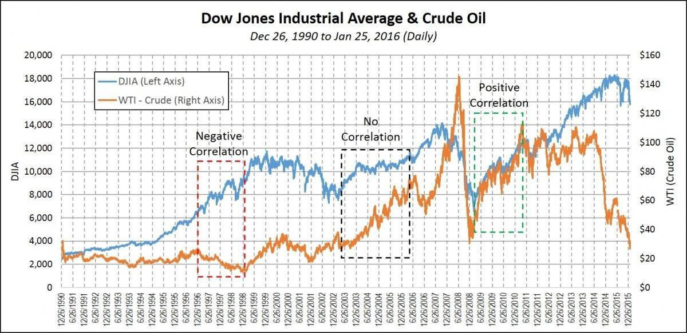

## Table of Contents

## What are oil prices and why are they important?

Oil prices are the costs that people and companies have to pay to buy oil. Oil is a liquid that comes from under the ground and is used to make gasoline for cars, heat homes, and make many products like plastics. The price of oil can change every day and is usually talked about in dollars per barrel. A barrel is a unit of measure that equals 42 gallons.

Oil prices are important because they affect many parts of our lives. When oil prices go up, it can make gasoline more expensive, which means people have to pay more to fill up their cars. This can also make the cost of many products go up because it costs more to make and transport them. On the other hand, when oil prices go down, it can make things cheaper and help the economy grow. Governments and businesses watch oil prices closely because they can affect how much money people have to spend and how well the economy is doing.

## How do oil prices affect the overall economy?

Oil prices have a big effect on the economy because they change the cost of many things. When oil prices go up, it makes gasoline more expensive. This means people have to spend more money to drive their cars. Because of this, they might have less money to spend on other things like food or clothes. Also, when oil prices go up, it costs more for companies to make and move their products. This can make the prices of many things go up, which can slow down the economy.

On the other hand, when oil prices go down, it can help the economy grow. Cheaper oil means cheaper gasoline, so people have more money to spend on other things. This can make businesses sell more and hire more people. Also, when it costs less to make and move products, companies can keep their prices lower. This can make people feel more confident about spending money, which helps the economy get stronger.

Overall, oil prices are like a big lever that can push the economy up or down. They affect how much money people and businesses have to spend, which in turn affects how well the economy is doing. Keeping an eye on oil prices is important for understanding and predicting economic changes.

## What is the relationship between oil prices and stock markets?

Oil prices and stock markets are closely linked. When oil prices go up, it can make the stock market go down. This happens because higher oil prices mean higher costs for companies. They have to spend more money on fuel and transportation, which can make their profits smaller. When companies make less money, their stock prices can go down, and this can make the whole stock market go down too. Also, when oil prices go up, people might have less money to spend on other things, which can hurt companies that sell those things and make their stock prices go down.

On the other hand, when oil prices go down, it can make the stock market go up. Lower oil prices mean lower costs for companies, so they can make more profit. When companies make more money, their stock prices can go up, and this can make the whole stock market go up too. Also, when oil prices go down, people have more money to spend on other things, which can help companies that sell those things and make their stock prices go up. So, oil prices can have a big effect on how the stock market does.

But it's not always simple. Sometimes, the stock market might go up even if oil prices go up, especially if the economy is doing well. And sometimes, the stock market might go down even if oil prices go down, especially if there are other big problems in the economy. So, while oil prices are important, they are just one of many things that can affect the stock market.

## Can you explain how rising oil prices impact different sectors of the stock market?

Rising oil prices can hurt many sectors of the stock market. For example, when oil prices go up, it makes transportation more expensive. This is bad for companies that need to move their products, like those in the shipping and airline industries. These companies have to spend more money on fuel, which can make their profits smaller. When their profits go down, their stock prices can go down too. Also, car companies might see their stock prices drop because people might not want to buy new cars if gas is expensive. Retail companies, like stores that sell clothes or furniture, can also be hurt because people might not want to spend money on those things if they have to spend more on gas.

On the other hand, rising oil prices can help some sectors. Oil and gas companies, like those that drill for oil, can make more money when oil prices go up. This is because they can sell their oil for more money. When these companies make more money, their stock prices can go up. Companies that make things out of oil, like chemicals and plastics, can also benefit because they can charge more for their products. So, while rising oil prices can hurt many sectors, they can help the oil and gas industry and related businesses.

Overall, the impact of rising oil prices on the stock market is not the same for all sectors. Some sectors, like transportation and retail, can be hurt by higher oil prices, while others, like oil and gas, can benefit. Understanding how oil prices affect different parts of the stock market can help investors make better decisions.

## How do falling oil prices influence stock market performance?

Falling oil prices can help the stock market do better. When oil prices go down, it makes gasoline and fuel cheaper. This means companies that need to move their products, like shipping and airline companies, don't have to spend as much money on fuel. When these companies save money, they can make more profit. More profit can make their stock prices go up. Also, when oil prices fall, people have more money to spend on other things because they don't have to spend as much on gas. This can help companies that sell things like clothes or furniture, and their stock prices can go up too.

However, falling oil prices can hurt some parts of the stock market. Oil and gas companies, like those that drill for oil, can make less money when oil prices go down. This is because they have to sell their oil for less money. When these companies make less money, their stock prices can go down. Companies that make things out of oil, like chemicals and plastics, can also be hurt because they might have to charge less for their products. So, while falling oil prices can help many parts of the stock market, they can hurt the oil and gas industry and related businesses.

## What historical examples show the impact of oil price changes on stock markets?

One big example of how oil prices can affect the stock market happened in the 1970s. In 1973, oil prices went up a lot because of an oil embargo by some countries in the Middle East. This made gasoline very expensive, and it hurt the economy. Many companies had to pay more for fuel, which made their profits smaller. The stock market went down a lot because of this. People call this time the "Oil Crisis," and it showed how important oil prices are for the economy and the stock market.

Another example happened in 2008. Oil prices went up to almost $150 a barrel, which was a record high at the time. This made everything more expensive, and it hurt a lot of companies. The stock market went down a lot because of this. But then, oil prices started to fall quickly, and by the end of 2008, they were much lower. This helped the stock market start to recover, but it took a long time for things to get better. This shows how oil prices going up and then going down can have a big effect on the stock market.

In 2014, oil prices fell a lot, going from over $100 a barrel to below $30 a barrel in just a few years. This helped many parts of the economy because it made fuel cheaper. The stock market went up because companies could make more profit, and people had more money to spend. But it hurt the oil and gas industry a lot. Many oil companies had to cut jobs and close down some of their operations. This shows how falling oil prices can help some parts of the stock market but hurt others.

## How do oil-dependent countries' stock markets react to oil price fluctuations?

Oil-dependent countries are places where the economy relies a lot on oil. When oil prices go up, it's usually good for these countries. Their stock markets can go up because oil companies make more money. People in these countries might also feel richer because their government gets more money from selling oil. This can make the whole economy do better, and more people might want to buy stocks. For example, in countries like Saudi Arabia or Russia, when oil prices go up, their stock markets often go up too.

But when oil prices go down, it can be bad for oil-dependent countries. Their stock markets can go down because oil companies make less money. The government might have less money to spend on things like schools and hospitals. This can make the economy do worse, and people might not want to buy stocks. For example, when oil prices fell a lot in 2014, the stock markets in countries like Venezuela and Nigeria went down a lot too. So, oil price changes can have a big effect on the stock markets in oil-dependent countries.

## What role do oil futures and commodities play in stock market dynamics?

Oil futures and commodities are important parts of the stock market. Oil futures are agreements to buy or sell oil at a certain price in the future. They help people guess what oil prices will be like later. If people think oil prices will go up, they might buy oil futures now to make money later. This can make the stock market go up because it shows that people are feeling good about the future. But if people think oil prices will go down, they might sell their oil futures, which can make the stock market go down because it shows that people are worried.

Commodities are things like oil, gold, and wheat that people buy and sell. They are important for the stock market because they show what is happening in the real world. When the prices of commodities like oil go up, it can make the stock market go up too. This is because it means that companies that use or sell these commodities might make more money. But when commodity prices go down, it can make the stock market go down because it means that these companies might make less money. So, oil futures and commodities are like big signals that can tell us a lot about what is happening in the stock market.

## How do investors use oil price trends to make stock market decisions?

Investors watch oil price trends closely because they can help them guess what might happen in the stock market. If oil prices are going up, investors might think that companies that make or sell oil will do well. They might buy stocks in these companies, hoping to make money when the stock prices go up. But if oil prices are going down, investors might sell their stocks in oil companies because they think these companies will make less money. They might also buy stocks in other companies that will do better with lower oil prices, like airlines or shipping companies that save money on fuel.

Oil price trends can also tell investors about the bigger picture of the economy. If oil prices are going up a lot, it might mean that the economy is growing fast and people are using more oil. This can make investors feel good about buying stocks in many different companies. But if oil prices are going down a lot, it might mean that the economy is slowing down and people are using less oil. This can make investors worried about buying stocks, and they might sell some of their stocks to be safe. So, by looking at oil price trends, investors can make better choices about which stocks to buy or sell.

## What are the long-term versus short-term effects of oil price changes on stock markets?

In the short term, oil price changes can make the stock market go up or down quickly. If oil prices go up a lot in a short time, it can make gasoline and fuel more expensive. This can hurt companies that need to move their products, like airlines and shipping companies, because they have to spend more money on fuel. When these companies make less money, their stock prices can go down, and this can make the whole stock market go down too. But if oil prices go down quickly, it can help these companies save money on fuel, which can make their stock prices go up. This can make the stock market go up too. So, short-term oil price changes can make the stock market move a lot.

In the long term, oil price changes can have a bigger effect on the economy and the stock market. If oil prices stay high for a long time, it can slow down the economy because everything gets more expensive. People might not want to spend as much money, and companies might not want to invest in new things. This can make the stock market go down over time. But if oil prices stay low for a long time, it can help the economy grow because everything gets cheaper. People might spend more money, and companies might invest in new things. This can make the stock market go up over time. So, long-term oil price changes can shape the economy and the stock market in big ways.

## How do geopolitical events affecting oil supply impact stock market volatility?

Geopolitical events, like wars or trade disagreements, can change how much oil is available. When these events happen, they can make oil prices go up and down a lot. This can make the stock market move a lot too. For example, if a country that makes a lot of oil has a war, it might not be able to send as much oil to other countries. This can make oil prices go up because there is less oil to buy. When oil prices go up quickly, it can make the stock market go down because companies have to pay more for fuel, and people might not want to spend as much money.

But sometimes, geopolitical events can also make oil prices go down. For example, if countries agree to work together and make more oil, it can make oil prices go down because there is more oil to buy. When oil prices go down quickly, it can make the stock market go up because companies save money on fuel, and people might want to spend more money. So, geopolitical events can make the stock market move a lot because they can change how much oil is available and how much it costs.

## What advanced financial models are used to predict the impact of oil prices on stock markets?

To predict how oil prices will affect the stock market, people use advanced financial models. One common model is the Vector Autoregression (VAR) model. This model looks at how different things, like oil prices and stock prices, affect each other over time. It uses past data to guess what might happen in the future. For example, if oil prices have gone up in the past and the stock market has gone down, the VAR model can use this information to predict what might happen if oil prices go up again. This helps investors and companies make better decisions about buying or selling stocks.

Another model that people use is the GARCH (Generalized Autoregressive Conditional Heteroskedasticity) model. This model is good at predicting how much the stock market might move up or down when oil prices change. It looks at how much the stock market has moved in the past when oil prices changed, and it uses this information to guess how much it might move in the future. For example, if the stock market has moved a lot in the past when oil prices went up, the GARCH model can predict that it might move a lot again if oil prices go up. This helps investors understand how risky it might be to buy or sell stocks when oil prices change.

## What is the Economic Impact of Oil Beyond Stock Prices?

Oil prices exert a significant influence on the broader economy, extending beyond simply affecting stock prices. One primary channel through which oil prices impact the economy is via production costs. In industries heavily dependent on energy, such as transportation, manufacturing, and agriculture, an increase in oil prices can result in elevated production costs. This is due to higher fuel and energy expenses, which can lead to increased prices for goods and services throughout the supply chain. Consequently, these higher costs can be transferred to consumers in the form of increased prices, potentially leading to inflationary pressures.

In contrast, when oil prices fall, production costs often decrease, enabling businesses to reduce prices, enhance profits, or expand operations. This reduction in costs can stimulate economic growth, particularly in energy-intensive industries.

Conversely, high oil prices can have a stimulating effect on investment and job creation within the energy sector. As oil prices rise, exploration and production activities can become more economically viable, prompting energy companies to invest in new projects and infrastructure. This investment can lead to job creation, not only within the energy sector but also across supporting industries such as engineering, construction, and technology services.

However, the ripple effects of high oil prices are not universally positive across all sectors. Industries that are heavily reliant on transportation, such as logistics and airlines, may experience increased operational costs, which can lead to reduced profit margins and potential job cuts.

Consider the transportation industry where fuel is a significant component of operating expenses. If we denote the total cost $C$ as a function of fuel price $F$, the relationship can be represented as:

$$
C = a + bF
$$

where $a$ represents fixed costs and $b$ reflects variable costs associated with fuel. A sudden increase in $F$ would directly elevate $C$, compelling companies to either pass on these costs to consumers or absorb them, affecting profitability.

In the manufacturing sector, higher oil prices can increase the costs of raw materials and transportation, leading to compressed profit margins or higher prices for consumers. This can affect demand, impacting the entire supply chain and potentially leading to decreased economic activity.

In conclusion, the economic impact of oil prices is multifaceted, affecting production costs, consumer spending, investments, and employment differently across sectors. Policymakers and businesses must consider these dynamics to mitigate negative impacts and leverage opportunities that arise from fluctuations in oil prices.

## How does algorithmic trading relate to oil price volatility?

Algorithmic trading has become a crucial component in the financial markets, especially for trading commodities like oil, which are subject to significant price fluctuations. These models leverage advanced algorithms to swiftly analyze a wide array of economic indicators, providing traders with the ability to predict market trends and execute trades at optimal times. This capability is particularly beneficial in markets such as oil, where prices can be influenced by geopolitical events, supply and demand changes, and macroeconomic data.

Algorithmic trading systems often utilize complex mathematical models that incorporate statistical methods, [machine learning](/wiki/machine-learning), and real-time data analysis. For instance, a simple linear regression model might be used to predict oil prices based on past data:

$$
P_{\text{future}} = \beta_0 + \beta_1 \times P_{\text{past}} + \epsilon
$$

where $P_{\text{future}}$ is the predicted future price, $P_{\text{past}}$ is the past price, $\beta_0$ and $\beta_1$ are coefficients determined by the model, and $\epsilon$ is the error term. However, more sophisticated models might involve neural networks or support vector machines, allowing for nonlinear relationships and more accurate predictions.

The advantages of [algorithmic trading](/wiki/algorithmic-trading) in the volatile oil market are manifold. Algorithms can process vast amounts of data much faster than humans, enabling prompt reactions to market movements and the exploitation of [arbitrage](/wiki/arbitrage) opportunities. They also remove emotional bias from trading decisions, which can be particularly beneficial in high-stress environments.

However, algorithmic trading is not without challenges. One major pitfall is the potential for excessive market [volatility](/wiki/volatility-trading-strategies). Algorithmic models, especially those relying on similar market indicators, can lead to high-frequency trading that amplifies price swings. Moreover, these models require constant updates and calibrations to remain effective, as market conditions and economic indicators evolve.

Another risk lies in the reliance on historical data, which may fail to predict unprecedented market conditions—such as drastic geopolitical events or unexpected shifts in supply and demand dynamics. Additionally, technical glitches or errors in algorithmic models can cause significant financial losses.

Understanding the mechanics and implications of algorithmic trading is crucial for stakeholders in the oil markets. It provides insights into modern trading strategies that are increasingly shaping the financial landscape, influencing not just individual trades but potentially the broader market dynamics. As technology continues to evolve, it will be vital to balance these sophisticated trading mechanisms with robust risk management practices.

## References & Further Reading

[1]: Kilian, L. (2009). ["Not All Oil Price Shocks are Alike: Disentangling Demand and Supply Shocks in the Crude Oil Market."](https://www.aeaweb.org/articles?id=10.1257/aer.99.3.1053) American Economic Journal: Macroeconomics, 1(2), 113-137.

[2]: Hamilton, J.D. (2009). ["Understanding Crude Oil Prices."](https://journals.sagepub.com/doi/10.5547/ISSN0195-6574-EJ-Vol30-No2-9) The Energy Journal.

[3]: Lopez de Prado, M. (2018). ["Advances in Financial Machine Learning."](https://www.amazon.com/Advances-Financial-Machine-Learning-Marcos/dp/1119482089) Wiley.

[4]: Zhang, D., Broadstock, D.C., & Zhang, L. (2018). ["The Role of Oil Prices in China's Economy."](https://www.sciencedirect.com/science/article/pii/S1544612320309983) Energy Economics, 74, 153-165.

[5]: Gürtler, M., & Rauh, M. (2013). ["The Impact of Oil Price Volatility on the Value at Risk of Oil-Related Financial Products."](https://www.cfr.org/report/oil-price-volatility-causes-effects-and-policy-implications) Review of Derivatives Research, 16(2), 159-182.