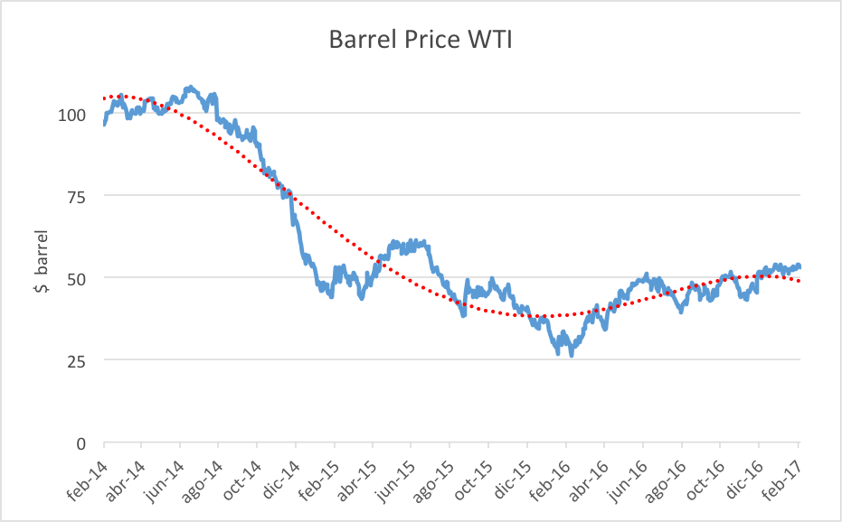

## Table of Contents

## What are the main sources of income for Venezuela's economy?

Venezuela's economy mainly depends on oil. The country has a lot of oil, and it sells this oil to other countries. This brings in a lot of money for Venezuela. The government uses this money to run the country and help its people. Oil is so important that it makes up most of Venezuela's income.

Apart from oil, Venezuela also earns money from other things. It has minerals like iron and gold, which it can sell. Agriculture is another source of income. Venezuela grows crops like coffee and sugar, and it can sell these too. However, these other sources do not bring in as much money as oil does.

## How do oil prices directly affect Venezuela's government revenue?

When the price of oil goes up, Venezuela's government earns more money. This is because oil is the biggest thing Venezuela sells to other countries. If oil prices are high, each barrel of oil sold brings in more money. This extra money can help the government pay for things like schools, hospitals, and roads. It can also help the government give more help to its people.

On the other hand, when oil prices go down, Venezuela's government earns less money. If oil prices are low, each barrel of oil sold brings in less money. This makes it harder for the government to pay for important things. It might have to cut back on services or find other ways to get money. Because Venezuela relies so much on oil, changes in oil prices can make a big difference to the government's money.

## What is the historical relationship between oil prices and Venezuela's economic performance?

Venezuela's economy has always been closely tied to the price of oil. When oil prices are high, Venezuela's economy does well. The government gets a lot of money from selling oil, and it can spend this money on things like schools, hospitals, and helping people. During times when oil prices were very high, like in the early 2000s, Venezuela's economy grew a lot. People had more money, and the country could afford to do more things.

But when oil prices fall, Venezuela's economy struggles. The government gets less money from selling oil, and it has a hard time paying for everything it needs to. This has happened many times in Venezuela's history. For example, when oil prices dropped in the 1980s and again in the 2010s, the economy went into a crisis. People had less money, and the country faced big problems like inflation and shortages of food and medicine. So, the ups and downs of oil prices have a big impact on how well Venezuela's economy does.

## How has the fluctuation in oil prices impacted Venezuela's currency value?

The value of Venezuela's currency, the bolivar, goes up and down with the price of oil. When oil prices are high, Venezuela earns a lot of money from selling oil. This extra money makes the bolivar stronger. People trust the currency more because the government has more money to spend on the country. So, when oil prices are high, the bolivar can buy more things compared to other countries' money.

But when oil prices drop, the bolivar loses value. If oil prices are low, Venezuela earns less money, and it becomes harder for the government to pay for everything it needs. This makes people trust the bolivar less. They might want to use other currencies instead. So, when oil prices are low, the bolivar becomes weaker and can buy fewer things compared to other countries' money. This has happened many times in Venezuela's history, making the value of the bolivar go up and down a lot.

## What are the effects of oil price changes on Venezuela's inflation rates?

When oil prices go up, Venezuela's government gets more money. This can help keep inflation low because the government can spend more on things like food and medicine. When people can buy these things easily, prices don't go up as fast. But if the government spends too much money, it can also cause inflation. This happens because more money is chasing the same amount of goods, so prices go up.

When oil prices go down, Venezuela's government gets less money. This makes it hard to pay for everything, and the government might have to print more money. Printing more money can lead to high inflation because there is more money but not more goods. In Venezuela, when oil prices dropped in the 2010s, inflation got very high. People found it hard to buy things because prices were going up so fast.

## How do oil prices influence employment rates in Venezuela?

When oil prices are high, Venezuela's government gets more money. This means they can spend more on things like building roads, schools, and hospitals. When the government spends more, it creates more jobs. People who work in the oil industry, like drilling and refining, also have more work to do. So, when oil prices are high, more people in Venezuela can find jobs.

But when oil prices go down, the government gets less money. They have to cut back on spending, which means fewer jobs in building projects and other areas. People in the oil industry might lose their jobs because there is less work to do. This makes it harder for people to find work, and unemployment goes up. So, when oil prices are low, fewer people in Venezuela have jobs.

## What role do oil prices play in Venezuela's foreign debt and credit ratings?

When oil prices are high, Venezuela can earn a lot of money from selling oil. This extra money helps the country pay back its foreign debt more easily. When Venezuela can pay its debts on time, other countries and banks trust it more. This makes it easier for Venezuela to borrow more money if it needs to. Also, when Venezuela is doing well with its money, credit rating agencies might give it a better credit rating. A better credit rating means other countries and banks see Venezuela as a safer place to lend money to.

But when oil prices drop, Venezuela earns less money from selling oil. This makes it harder for the country to pay back its foreign debt. When Venezuela struggles to pay its debts, other countries and banks trust it less. This makes it harder for Venezuela to borrow more money because lenders see it as riskier. Also, when Venezuela is having money problems, credit rating agencies might lower its credit rating. A lower credit rating means other countries and banks see Venezuela as a riskier place to lend money to, making it even harder for Venezuela to get loans.

## How have oil price drops affected social programs and public services in Venezuela?

When oil prices drop, Venezuela's government gets less money. This makes it hard for the government to pay for social programs and public services. Social programs like food help and health care need a lot of money to work well. When the government has less money, it might have to cut back on these programs. This means fewer people can get the help they need, and the help they do get might not be as good.

Public services like schools and hospitals also need money to run. When oil prices are low, the government might not be able to pay teachers and doctors as much, or it might not be able to keep buildings in good shape. This can make it harder for people to get a good education or the health care they need. So, when oil prices drop, it can make life harder for many people in Venezuela because the government has less money to spend on helping them.

## What strategies has the Venezuelan government employed to mitigate the impact of low oil prices?

When oil prices drop, the Venezuelan government tries different things to make up for the lost money. One thing they do is try to sell more oil to other countries. They might lower the price of their oil to get more buyers. They also look for new places to sell oil, hoping to make up for the low prices by selling more. Another thing they do is borrow money from other countries or banks. This can help them keep paying for things like schools and hospitals, even when they are not making as much money from oil.

The government also tries to save money by cutting back on spending. They might reduce the money they give to social programs or public services. This can mean fewer people get help or the help they get is not as good. Sometimes, they also try to make more money from other things, like mining or farming. But these other things do not bring in as much money as oil, so it is hard to make up for the low oil prices completely. Overall, the government tries many different ways to deal with low oil prices, but it is still a big challenge.

## How do global oil market dynamics, such as OPEC decisions, affect Venezuela's economy?

The global oil market is very important for Venezuela because oil is the main thing they sell. OPEC, which is a group of countries that sell oil, makes decisions about how much oil to sell and at what price. When OPEC decides to cut back on how much oil they sell, the price of oil usually goes up. This is good for Venezuela because they can make more money from selling their oil. But if OPEC decides to sell more oil, the price can go down. This is bad for Venezuela because they make less money, and it can make their economy struggle.

OPEC's decisions can also change how much other countries want to buy oil from Venezuela. If OPEC countries are selling a lot of oil, other countries might not want to buy as much from Venezuela. This can make it even harder for Venezuela to make money from oil. So, what OPEC does can have a big impact on how much money Venezuela makes and how well their economy does. Venezuela tries to work with OPEC to help keep oil prices high, but sometimes they cannot control everything that happens in the global oil market.

## What are the long-term economic diversification plans in Venezuela in response to oil price volatility?

Venezuela knows that relying too much on oil can be risky because oil prices go up and down a lot. So, they have plans to make their economy more diverse. This means they want to make money from other things besides oil. One big plan is to grow more food and sell it. They want to make farming bigger and better so they can feed their people and sell extra food to other countries. Another plan is to use their minerals like iron and gold more. They want to mine more of these minerals and sell them to make money.

Another part of their plan is to make more things in Venezuela. They want to start factories that can make things like cars and machines. This would create jobs and help the economy grow in new ways. They also want to bring in more tourists. Venezuela has beautiful places that people might want to visit, so they plan to build hotels and other things for tourists. All these plans are meant to help Venezuela's economy be stronger and less dependent on oil, even if it takes a long time to make them work.

## How do international sanctions and geopolitical factors interact with oil prices to impact Venezuela's economy?

International sanctions and geopolitical factors can make things harder for Venezuela when oil prices are already low. Sanctions are rules that other countries put on Venezuela to stop them from doing certain things. For example, some countries have put sanctions on Venezuela to stop them from selling oil. This means Venezuela can't sell as much oil as they want, even if oil prices are high. When oil prices are low and there are sanctions, it's even harder for Venezuela to make money. Geopolitical factors, like fights with other countries, can also make it harder for Venezuela to sell oil. If other countries don't want to buy oil from Venezuela because of these fights, Venezuela's economy can struggle even more.

But it's not just about selling less oil. Sanctions and geopolitical factors can also make it hard for Venezuela to get money from other places. When countries put sanctions on Venezuela, it can be hard for them to borrow money from banks or other countries. This means they have less money to spend on things like schools and hospitals. Geopolitical fights can also scare away companies that might want to invest in Venezuela. If companies are worried about fights with other countries, they might not want to start new projects in Venezuela. So, when oil prices are low and there are sanctions and geopolitical problems, Venezuela's economy can face a lot of challenges.

## References & Further Reading

[1]: Organization of the Petroleum Exporting Countries (OPEC). [Annual Statistical Bulletin](https://www.opec.org/opec_web/static_files_project/media/downloads/publications/OPEC_ASB_2021.pdf).

[2]: Lopez de Prado, Marcos. [Advances in Financial Machine Learning](https://www.amazon.com/Advances-Financial-Machine-Learning-Marcos/dp/1119482089). Wiley, 2018.

[3]: Aronson, David. [Evidence-Based Technical Analysis: Applying the Scientific Method and Statistical Inference to Trading Signals](https://www.amazon.com/Evidence-Based-Technical-Analysis-Scientific-Statistical/dp/0470008741). Wiley, 2006.

[4]: Jansen, Stefan. [Machine Learning for Algorithmic Trading: Predictive Models to Extract Signals from Market and Alternative Data for Systematic Trading Strategies with Python](https://github.com/stefan-jansen/machine-learning-for-trading). Packt Publishing, 2018.

[5]: Chan, Ernest P. [Quantitative Trading: How to Build Your Own Algorithmic Trading Business](https://github.com/ftvision/quant_trading_echan_book). Wiley, 2008.