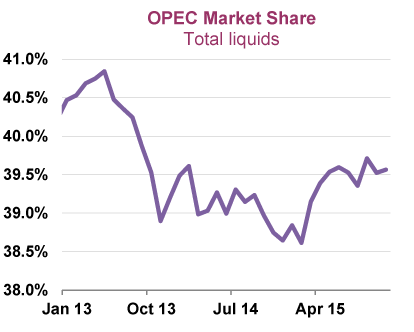

The global oil market is central to the international economy, serving as a crucial energy source and a significant determinant of geopolitical dynamics. Oil's ubiquitous applications, from fueling transportation to underpinning industrial processes, render its pricing and distribution vital economic concerns. The Organization of the Petroleum Exporting Countries (OPEC) plays a pivotal role in this landscape. Established in 1960 by countries including Iran, Iraq, Kuwait, Saudi Arabia, and Venezuela, OPEC seeks to coordinate and unify petroleum policies among member countries, thereby securing fair and stable prices for petroleum producers and ensuring a reliable supply to consumers. OPEC's ability to influence oil production levels allows it to wield substantial power over global oil prices, impacting economies worldwide.

In recent years, algorithmic trading has emerged as a transformative force in oil trading practices. Algorithmic trading leverages mathematical models and sophisticated software to execute trades at speeds and frequencies that are impossible for human traders. This high-frequency trading technique enhances market efficiency and liquidity, offering precision in pricing and significant cost reductions. Moreover, it reshapes traditional oil trading by enabling rapid adjustments to trades based on real-time market data, including supply projections, geopolitical developments, and other relevant factors.

This article aims to explore the complex interplay between OPEC's influence, global oil prices, and the advent of algorithmic trading. It seeks to analyze how OPEC's strategic decisions resonate through the oil market and how algorithmic trading might react to or anticipate such changes. Understanding this intersection will offer insights into the future of oil trading, providing a clearer picture of the challenges and opportunities that lie ahead for traders and policymakers in a technologically advanced landscape.

## Table of Contents

## Understanding OPEC's Role in the Oil Market

The Organization of the Petroleum Exporting Countries (OPEC) was established in 1960 in Baghdad by five founding members: Iran, Iraq, Kuwait, Saudi Arabia, and Venezuela. This organization was formed to coordinate and unify petroleum policies among member countries, ensuring the stabilization of oil markets. By doing so, OPEC aims to secure fair and stable prices for petroleum producers, an efficient and regular supply of petroleum to consuming nations, and a fair return on capital to those investing in the petroleum industry.

OPEC plays an instrumental role in regulating oil production to stabilize global oil prices. It does so primarily through coordinated production adjustments. By setting production targets for its member countries, OPEC can exert significant influence over the global oil supply. When demand for oil is high, OPEC may decide to increase production limits to help moderate prices. Conversely, when demand is slack, it may reduce production to prevent a sharp decline in prices. 

To effectively influence oil supply and demand, OPEC employs a range of strategic measures. These include setting quotas for member countries, engaging in negotiations and agreements that affect both member and non-member states, and closely monitoring the oil market to make informed decisions. Additionally, OPEC often cooperates with non-member oil-producing countries to exert a collective impact on the market, as seen in agreements like OPEC+.

OPEC's decisions have a substantial impact on non-OPEC oil-producing countries and the global oil market. For non-OPEC countries, OPEC’s production quotas can influence their production strategies and economic stability, especially for those heavily reliant on oil revenues. On a broader scale, OPEC's activities can lead to fluctuations in oil prices, affecting global economic conditions. For instance, significant production cuts by OPEC can lead to higher oil prices, influencing inflation rates and economic policy decisions worldwide. Conversely, production increases tend to lower prices, which can benefit oil-importing countries but decrease revenues for oil-exporting nations. This interconnectedness underscores the importance of OPEC's role as a major player in the global oil market.

## Factors Influencing Global Oil Prices

Global oil prices are influenced by a variety of interconnected factors, each contributing to the complexity and [volatility](/wiki/volatility-trading-strategies) of the market. Understanding these factors requires a multifaceted approach, considering economic theories, geopolitical dynamics, technological innovations, and the shifting energy landscape.

### Supply-Demand Dynamics

Oil prices are fundamentally driven by the principles of supply and demand. Global events significantly impact these dynamics, creating fluctuations in prices. For example, major economic developments, such as rapid industrial growth in emerging economies, can lead to increased demand for oil, driving prices upward. Conversely, economic downturns typically reduce demand, leading to lower prices. Natural disasters and unforeseen circumstances, such as the COVID-19 pandemic, have also demonstrated their capacity to disrupt supply chains and alter consumption patterns, affecting global oil markets.

### Geopolitical Tensions and Economic Policies

Geopolitical tensions often play a critical role in shaping oil price trends. Conflicts in oil-rich regions, such as the Middle East, can lead to concerns over supply stability, causing price spikes. Similarly, economic policies, including sanctions imposed on oil-producing nations, trade wars, and shifts in energy regulations, can influence market perceptions and expectations, leading to price adjustments. For instance, sanctions on countries like Iran and Venezuela have historically impacted their oil output, affecting global oil supply and prices.

### Technological Advancements in Oil Extraction

The development of new technologies in oil extraction, such as hydraulic fracturing and deep-water drilling, has transformed the supply landscape. These technologies have unlocked previously inaccessible reserves, increasing the global oil supply and exerting downward pressure on prices. The application of data analytics and AI in optimizing extraction processes has further enhanced efficiency, contributing to more stable production rates and influencing price stability.

### Impact of Renewable Energy Sources

The global shift towards renewable energy sources is gradually reshaping the traditional oil market. As nations commit to reducing carbon emissions, investments in renewable energy, such as solar, wind, and electric vehicles, are increasing. This transition is expected to decrease long-term dependence on oil, thereby influencing price trends. As renewables become more cost-competitive, they could potentially cap the long-term growth of oil prices, encouraging diversification in energy sourcing and consumption.

In summary, global oil prices are subject to a complex interplay of supply-demand dynamics, geopolitical tensions, technological innovations, and the rising influence of renewable energy. These elements collectively create an intricate market environment, affecting price trends and the strategic decisions of market participants.

## The Rise of Algorithmic Trading in Oil Markets

Algorithmic trading, often referred to as "algo trading," is a method of executing trades using computerized systems based on a set of predefined instructions or algorithms. These algorithms can perform trades at speeds and frequencies that are impossible for a human trader. At its core, [algorithmic trading](/wiki/algorithmic-trading) combines mathematical models and complex formulas to execute orders swiftly and effectively, aiming to generate profits from small market inefficiencies.

### Benefits of Algo Trading in Oil Markets

Algorithmic trading has revolutionized the oil trading industry by enhancing efficiency and accuracy. One primary advantage is the significant reduction in transaction costs. Algo trading systems can process multiple indicators and data streams, providing real-time analysis that enables traders to make informed decisions instantly. By eliminating human intervention, these systems reduce errors associated with emotional or biased decision-making.

Moreover, algo trading allows for high-frequency trading ([HFT](/wiki/high-frequency-trading-strategies)), where algorithms execute thousands of trades within seconds. This capability ensures that market participants can capitalize on the minute price disparities that often exist in oil markets. Algo trading also employs advanced risk management tools that continuously monitor market conditions, adjusting trading strategies to mitigate potential losses.

### Changing Traditional Trading Models

Traditional trading models in the oil market heavily relied on human traders making decisions based on market analysis and forecasts. Algorithmic trading has shifted this paradigm by enabling automated systems to parse through vast amounts of market data, news reports, and even social media feeds to detect trading opportunities. These algorithms can analyze historical data patterns and forecast future trends, offering a predictive edge over traditional methods.

Algorithmic trading also brings enhanced [liquidity](/wiki/liquidity-risk-premium) to the markets. By executing numerous trades rapidly, these systems ensure market movements are smoother and less volatile, which is beneficial for both short-term traders and long-term investors. The sheer speed and efficiency of algorithmic trading have led many trading firms to focus on developing and refining sophisticated algorithms tailored to oil trading.

### Challenges and Risks

Despite its advantages, algorithmic trading in oil markets is not without challenges and risks. One major concern is the potential for systemic risks. Since many algorithms function similarly, they can lead to market conditions where trades are amplified, causing extreme volatility. This was evidenced in events such as the "Flash Crash" of 2010, where the Dow Jones Industrial Average dropped drastically within minutes.

Another challenge is the reliance on historical data, which may not always account for unprecedented market events. Algorithms need constant updates and recalibrations to adapt to changing market environments, especially in a volatile sector like oil trading. Additionally, the complexity of these algorithms requires effective oversight and understanding, which can pose difficulties for regulators aiming to prevent market abuse.

Finally, there are cybersecurity risks. The reliance on digital platforms makes algo trading susceptible to hacking and technical failures. Ensuring robust security measures and backup systems are crucial to safeguarding trading operations.

In conclusion, while algorithmic trading offers enhanced efficiency and precision in oil markets, its integration comes with significant challenges requiring vigilant oversight and adaptive strategies to minimize risks and harness its full potential.

## Synergy between OPEC, Global Oil Prices, and Algo Trading

Algorithmic trading has become a critical component of modern oil markets, significantly influencing trading practices and strategies. The algorithms, which utilize mathematical models and historical data, can react swiftly to new information, including major decisions by the Organization of the Petroleum Exporting Countries (OPEC). When OPEC announces changes in oil production quotas or other policies, these algorithms can adjust trading patterns almost instantaneously, mitigating potential risks or capitalizing on new opportunities presented by price volatility.

OPEC's decisions can cause immediate fluctuations in oil prices as markets adjust to anticipated supply and demand shifts. Algorithmic trading systems are designed to absorb these price signals and make quick decisions, often executing trades in milliseconds. This rapid response capability allows traders to exploit momentary price inefficiencies created by market participants reacting to OPEC's announcements. For instance, an OPEC decision to cut production might lead to an immediate rise in oil prices. Algorithms can detect this upward trend and trigger buy orders to benefit from the expected appreciation in oil value.

Rapidly changing oil prices pose both challenges and opportunities for algorithmic trading strategies. Price volatility can be advantageous, allowing algorithms to engage in high-frequency trading to capture small price changes. However, the unpredictability of such volatility also risks triggering erroneous trades if the underlying algorithms misinterpret market signals or fail to adjust adequately to factors beyond OPEC's influence, such as geopolitical events or sudden economic shifts.

Significant market movements have showcased the interaction between OPEC decisions and algorithmic trading. For example, during the 2014 oil price downturn, OPEC's decision not to reduce production contributed to plummeting oil prices. Algorithmic trading systems at that time were heavily geared towards capturing short-selling opportunities, amplifying the downward price pressure. These automated trades, reacting to OPEC's policy and the resultant market sentiment, played a role in accelerating the drop in oil prices.

The future intersection of OPEC, global oil prices, and algorithmic trading holds promising potential. As technology advances, algorithms are expected to become more sophisticated, incorporating [machine learning](/wiki/machine-learning) to improve decision-making processes based on evolving patterns and historical data analysis. This could lead to algorithms that better anticipate OPEC's policy moves and their potential market impacts, providing traders an edge in developing robust strategies.

Policymakers and stakeholders should anticipate that algorithmic trading will continue to adapt to the evolving dynamics of the global oil market. As such, understanding and forecasting OPEC's decisions could become even more critical. Regulatory frameworks may need to evolve to ensure that algorithmic trading contributes positively to market stability rather than exacerbating volatility.

In summary, the synergy between OPEC's influence on oil prices and algorithmic trading is transforming the landscape of the oil market. As these systems become more integral to trading strategies, their ability to process vast amounts of information and execute trades quickly positions them as crucial tools in navigating the complexities of global oil markets.

## Conclusion

OPEC's influence on oil markets has been a cornerstone of global economic stability for decades. By strategically regulating oil production, OPEC aims to maintain balanced oil prices, which in turn affects global economic growth, inflation, and energy policies. Decisions made by OPEC are not only influential among member countries but also significantly impact non-OPEC nations. These decisions contribute to a fluctuating oil landscape characterized by shifts in supply and demand dynamics, geopolitical tensions, technological innovations, and the rise of renewable energy sources.

Simultaneously, the modern oil market has been transformed by the advent of algorithmic trading. Utilizing complex algorithms, trading bots can analyze vast datasets and execute trades at speeds unimaginable to human traders. This technology enhances market efficiency and liquidity, adapting rapidly to market movements. However, it also presents challenges, such as increased volatility and risks associated with technical failures.

Looking ahead, the integration of algorithmic trading within the oil markets presents both opportunities and challenges for traders and policymakers. The ability of algorithms to swiftly respond to OPEC's decisions and other market stimuli could lead to heightened market responsiveness but also necessitates robust safeguards against erratic market behavior.

Traders and policymakers must remain vigilant and informed to navigate this evolving landscape effectively. The convergence of OPEC's long-standing market influence with cutting-edge technological advancements underscores the need for continuous adaptation and strategic foresight in the global oil market.

## References & Further Reading

[1]: Yergin, D. (1991). [The Prize: The Epic Quest for Oil, Money & Power](https://www.amazon.com/Prize-Epic-Quest-Money-Power/dp/1439110123). Simon & Schuster.

[2]: Adelman, M. A. (1995). [The Genie out of the Bottle: World Oil since 1970](https://www.jstor.org/stable/41322699). MIT Press.

[3]: Katsumata, H. (2011). ["The Role of OPEC in the 21st Century."](https://www.ourenergypolicy.org/wp-content/uploads/2013/08/RoleOfOPEC.pdf) Energy Policy, Volume 39, Issue 2.

[4]: Lopez de Prado, M. (2018). [Advances in Financial Machine Learning](https://www.amazon.com/Advances-Financial-Machine-Learning-Marcos/dp/1119482089). Wiley.

[5]: Fry, J. (2009). ["The Role of High-Frequency Trading in the US Equity Markets."](https://onlinelibrary.wiley.com/doi/full/10.1111/joes.12434) Annals of Operations Research, Volume 165.

[6]: Simoudis, E. (2021). [AI and Data Driven Innovation in Oil and Gas](https://www.sciencedirect.com/science/article/pii/S2666546820300410). Technology Press.

[7]: Chan, E. P. (2008). [Quantitative Trading: How to Build Your Own Algorithmic Trading Business](https://github.com/ftvision/quant_trading_echan_book). Wiley.