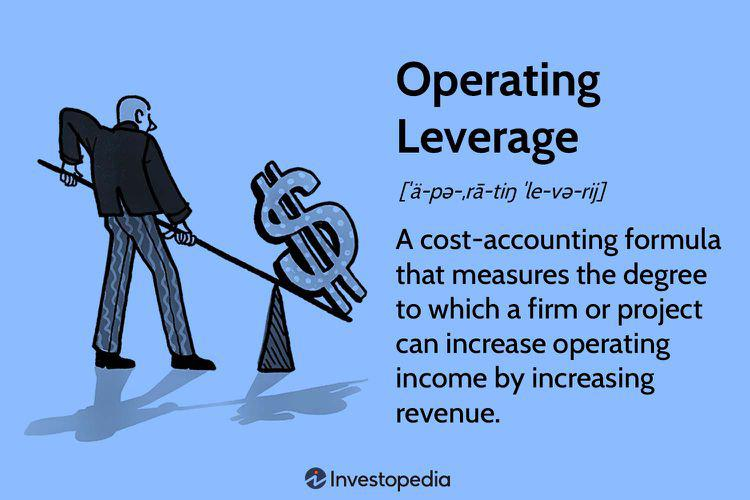

Leverage in finance refers to leveraging borrowed capital to increase potential returns. It essentially involves using various forms of financing to amplify the impact of investment outcomes. This concept can be categorized into financial and operating leverage, both of which are vital in enhancing a company's profitability and stimulating business growth.

Financial leverage is concerned with the degree to which a company utilizes borrowed funds in its capital structure. By incorporating more debt, companies can potentially boost their return on equity, especially during periods of growth. However, this comes with a significant level of risk, as higher leverage can lead to financial distress if the company fails to meet its debt obligations.



Operating leverage, on the other hand, deals with a company's fixed versus variable cost ratio. High operating leverage implies a large portion of a company’s costs are fixed, which can dramatically increase operating income as sales increase. However, this also means the company is more vulnerable to fluctuations in sales, posing a different set of risks.

The article focuses on unpacking the implications of both financial and operating leverage on business operations. It will also scrutinize the utilization of leverage in the rapidly evolving domain of algorithmic trading, where leverage can significantly enhance trading outcomes. Understanding how leverage functions, together with its inherent risks, is paramount for businesses and investors aiming to optimize leverage usage in diverse financial contexts. This includes adopting strategic approaches to maximize benefits while effectively managing the underlying risks associated with leverage.

## Table of Contents

## Understanding Financial Leverage

Financial leverage is a key concept in finance that involves the use of borrowed capital with the aim of amplifying potential returns on investment. It essentially measures the extent to which an entity, such as a corporation, utilizes debt to finance its operations rather than relying solely on equity capital.

The financial leverage ratio is a crucial metric in assessing a company's financial leverage. This ratio is defined as the total debt divided by the total equity of the company:

$$
\text{Financial Leverage Ratio} = \frac{\text{Total Debt}}{\text{Total Equity}}
$$

This ratio indicates the debt level of a company in relation to its equity, providing insight into the company's capital structure. A higher financial leverage ratio suggests that a company is using more debt compared to its equity, which can lead to higher potential returns on equity if the borrowed funds are invested wisely.

However, while financial leverage can indeed amplify returns, it does so by increasing a company's exposure to risk. The primary risk associated with elevated financial leverage is financial distress. Heavy reliance on debt increases the fixed financial obligations of a company, which must be met regardless of the company's performance. This can lead to difficulties in covering these obligations during periods of reduced earnings or unforeseen financial downturns, potentially culminating in bankruptcy.

Prudent management of financial leverage is essential to mitigate the risks associated with debt financing. Companies must balance their mix of debt and equity to optimize their capital structure, taking into account the costs and benefits associated with financial leverage. Decision-makers need to ensure that the expected returns from investments funded by debt exceed the cost of debt and [factor](/wiki/factor-investing) in the potential economic conditions that could impact their ability to meet debt obligations.

Overall, financial leverage is a double-edged sword: it can boost profitability and return on investment when managed effectively, but it necessitates careful consideration and planning to prevent adverse outcomes from financial distress.

## Exploring Operating Leverage

Operating leverage is a critical concept in financial management, relating to the structure of a company's expenses. It reflects the extent to which a firm utilizes fixed costs as opposed to variable costs. When a company has high operating leverage, a significant portion of its total costs are fixed. This means that any changes in sales [volume](/wiki/volume-trading-strategy) can lead to proportionally larger changes in operating income, both positively and negatively.

In essence, operating leverage measures the sensitivity of operating income to changes in sales. A simple formula to calculate the degree of operating leverage (DOL) is:

$$
DOL = \frac{\text{Percentage change in EBIT}}{\text{Percentage change in sales}}
$$

Where EBIT stands for Earnings Before Interest and Taxes. This formula demonstrates the factor by which a change in sales will be magnified into a change in operating income.

High operating leverage is common in industries where initial investments and fixed costs are substantial, such as pharmaceuticals, manufacturing, or telecommunications. These industries often benefit greatly from increases in sales due to the high proportion of fixed costs, which do not change with production levels. However, they are also vulnerable to downturns in sales, as the fixed nature of their costs prevents easy adjustment.

Understanding and managing operating leverage is crucial for businesses. For instance, it aids in planning for profitability across various sales volumes. Companies can evaluate different operational scenarios and their potential impacts on profitability. They can also strategically decide on cost structures, choosing between investing in fixed costs that provide long-term efficiency but high leverage, versus variable costs that offer flexibility.

For example, a company anticipating stable and growing demand might opt for high operating leverage, investing in automation to lower variable costs and increase production efficiency. Conversely, in a volatile market, a firm might prefer lower operating leverage to reduce the risk associated with fixed expenses, thereby maintaining flexibility.

In conclusion, by carefully analyzing and applying operating leverage, businesses can navigate financial uncertainties, optimize their cost structures, and strategically plan for sustainable growth.

## Comparative Analysis: Financial vs. Operating Leverage

Financial leverage involves the use of debt to increase the potential return on investment. It allows companies to utilize borrowed funds, thereby enhancing their capacity to invest in opportunities that generate returns exceeding the cost of debt. The primary benefit of financial leverage is the magnification of returns; however, this also elevates the company's insolvency risk if its earnings fall short of expectations. The financial leverage ratio is typically calculated as:

$$
\text{Financial Leverage Ratio} = \frac{\text{Total Debt}}{\text{Total Equity}}
$$

Operating leverage, in contrast, is associated with the fixed cost structure within a company. A company with high operating leverage has a larger proportion of fixed costs in its operational framework. This structure allows changes in sales volume to have a substantial impact on operating income, leading to higher profits once the break-even point is surpassed. However, it also means that a decline in sales can severely impact profitability, thus heightening the company's sensitivity to market fluctuations. 

A comparative analysis reveals a parallel between financial and operating leverage in terms of risk amplification. Financial leverage primarily raises the risk of insolvency as it involves fixed financial obligations regardless of the company's performance. Meanwhile, operating leverage increases profit sensitivity to variations in sales volume, impacting earnings potential during volatile market conditions. Therefore, managing these risks effectively is critical for any business.

Strategically balancing financial and operating leverage is crucial to maintaining a stable financial position and optimizing strategic outcomes. A company that combines both forms of leverage can potentially maximize returns by aligning its debt levels and cost structure with its risk tolerance and market conditions. Proper management entails actively monitoring leverage levels, maintaining coherent financial strategies, and adapting to market changes to prevent adverse financial outcomes. Understanding these dynamics and their implications is vital for crafting a robust financial strategy that capitalizes on leverage while mitigating associated risks.

## Leverage in Algorithmic Trading

Algorithmic trading leverages sophisticated computer algorithms to execute trades at speeds and frequencies impossible for human traders. This technology enables traders to exploit leveraged positions, thereby controlling larger market positions with less capital investment. Through high-frequency trading and other algorithmic strategies, leverage can amplify potential returns. However, it also introduces significant risks due to market [volatility](/wiki/volatility-trading-strategies) and rapid price changes.

The concept of leverage in [algorithmic trading](/wiki/algorithmic-trading) is straightforward: by borrowing capital, traders can increase their buying power, enabling them to hold larger positions than their equity would normally permit. This is especially useful in markets where even slight price movements can lead to significant profit when large positions are involved. However, this increased exposure also means that even small adverse price movements can lead to substantial losses.

To mitigate the risks associated with leveraged trading, efficient risk management strategies are essential. Stop-loss orders are one of the most commonly used tools. A stop-loss order involves setting a predetermined price level at which a trading position is automatically sold, thus limiting potential losses. For example, if a trader buys a leveraged position in a stock at $100, they might set a stop-loss order at $95. If the stock price falls to $95, the trade is automatically executed, preventing further losses.

Diversification is another critical strategy for managing risks in algorithmic trading. By spreading investments across various financial instruments, sectors, or geographical regions, traders can reduce the impact of a poor-performing asset on their overall portfolio. This strategy benefits from the principle that not all markets or assets will react to economic events in the same way.

Additionally, algorithmic trading benefits from adhering to regulatory requirements and maintaining a robust risk management framework. Regulatory compliance ensures that trading activities do not exceed leverage limits imposed by financial authorities, thus safeguarding against excessive exposure. 

To illustrate the application of risk management strategies in algorithmic trading, consider the following Python code snippet which demonstrates setting a stop-loss order:

```python
class TradingStrategy:
    def __init__(self, entry_price, stop_loss_percent):
        self.entry_price = entry_price
        self.stop_loss_percent = stop_loss_percent
        self.stop_loss_price = self.calculate_stop_loss()

    def calculate_stop_loss(self):
        return self.entry_price * (1 - self.stop_loss_percent / 100)

    def check_stop_loss(self, current_price):
        if current_price <= self.stop_loss_price:
            return "Trigger Sell Order"
        else:
            return "Hold Position"

# Example usage
strategy = TradingStrategy(entry_price=100, stop_loss_percent=5)
current_price = 96
decision = strategy.check_stop_loss(current_price)
print(decision)  # Output: "Hold Position"
```

This simple algorithm calculates the stop-loss price and can be adjusted for real-time checks of current trading positions. In summary, while leverage in algorithmic trading can substantially augment potential gains, it is imperative to employ robust risk management techniques to safeguard against substantial losses.

## Risks and Management Strategies

Leverage is a double-edged sword in finance, known for its ability to magnify both gains and losses. When market movements are unfavorable, the risk implications of leverage become pronounced. Therefore, implementing effective risk management strategies is crucial to mitigate these risks.

One fundamental strategy is diversification. By spreading investments across various asset classes or sectors, the overall risk of the portfolio can be reduced. Diversification works on the principle that different assets will respond differently to the same economic event, ensuring that the adverse performance of some investments is balanced by the positive performance of others.

Another essential strategy is the use of stop-loss orders. Stop-loss orders allow investors to specify a price at which their assets will be sold automatically if the market moves unfavorably. This approach helps to limit potential losses by exiting a position before it becomes severely detrimental to the portfolio.

Adhering to regulatory requirements is also crucial in managing leverage risks. Regulations, such as the Basel III international banking regulations, are designed to enhance the banking sector's ability to absorb shocks arising from financial and economic stress, thus maintaining stability. These regulations often prescribe leverage limits to prevent excessive risk-taking.

Additionally, regularly updating and refining strategies in response to changing market conditions is vital. As financial markets are dynamic, staying informed about economic indicators and market trends allows investors to adjust their leverage strategies appropriately. For example, during periods of economic uncertainty, reducing leverage can protect against potential downturns.

Incorporating these strategies not only helps in managing the inherent risks associated with leverage but also ensures that the advantages of leveraging, such as enhanced returns, are maintained. Combining a conservative approach with regular strategy assessments enables investors to utilize leverage effectively while safeguarding their assets.

## Conclusion

Leverage is a potent tool in finance, offering the capacity to augment profitability and stimulate business growth when strategically employed. By leveraging borrowed capital, enterprises gain the ability to invest beyond their immediate financial resources, potentially leading to increased returns on equity and enhanced competitive positioning. However, the benefits of leverage come hand in hand with heightened risk, necessitating careful management and strategic planning.

Balancing financial and operating leverage is crucial for maintaining economic stability and safeguarding against excessive risks. Financial leverage allows firms to amplify returns through debt, while operating leverage involves optimizing fixed costs to boost profitability from sales volume changes. A company's ability to effectively manage these forms of leverage can significantly influence its operational success and market resilience.

For both businesses and traders, mastering leverage's complexities is essential for navigating today's dynamic financial terrain. A comprehensive understanding of leverage not only aids in mitigating risks associated with borrowing and fixed costs but also equips decision-makers with the insights needed to harness leverage as a powerful enabler of growth. A strategic approach to leverage, grounded in thorough risk assessment and management, can transform potential vulnerabilities into opportunities for sustained business advancement.

## References & Further Reading

For those interested in gaining a deeper understanding of financial and operating leverage, authoritative resources in finance provide essential insights and practical strategies for optimization. Central to this pursuit are corporate finance textbooks and articles on comprehensive financial analysis, which elucidate the complexities and applications of leverage in various financial contexts.

Prominent works by financial experts, such as Aswath Damodaran, offer valuable perspectives on financial leverage. Damodaran, a renowned professor of finance, is well-respected for his textbooks and articles that articulate the foundational principles of corporate finance, including the strategic use of leverage. His works often feature detailed explanations, real-world applications, and insights into how leverage can be effectively managed to enhance profitability and mitigate risks.

For practical explanations and real-world case studies, platforms like Investopedia serve as accessible and reliable resources. Investopedia provides a wealth of articles that break down the fundamental concepts of leverage and offer tips on leveraging financial and operating strategies effectively. The platform's content is particularly beneficial for both professionals and students seeking to grasp the nuances of leverage in modern finance.

In addition to the aforementioned resources, interested readers may benefit from exploring academic journals and studies that discuss leverage's implications and varied applications. These often contain quantitative analyses and case studies that highlight successful leverage strategies in different market environments. Such resources not only provide theoretical knowledge but also equip readers with practical strategies, aiding in achieving a balanced and optimized approach to using leverage within business and trading activities.