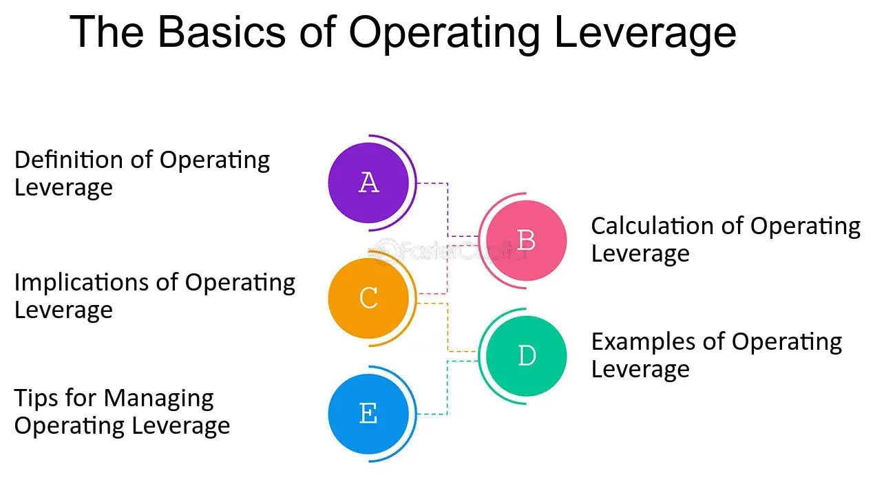

## Table of Contents

## What is operating leverage?

Operating leverage is a measure of how much a company's operating income changes when its sales change. It shows how sensitive a company's profits are to changes in sales volume. A company with high operating leverage has a lot of fixed costs, like rent or salaries, which do not change with sales. This means that even a small increase in sales can lead to a big increase in profits, but a small decrease in sales can also lead to a big decrease in profits.

For example, think of a factory that makes toys. If the factory has a lot of machines and workers that it pays the same amount whether it makes 100 toys or 1,000 toys, it has high operating leverage. If the factory sells more toys, its profits can grow quickly because the extra sales mostly turn into profit. But if it sells fewer toys, its profits can drop quickly because it still has to pay for the machines and workers. Understanding operating leverage helps businesses plan for the future and manage risks.

## How is operating leverage calculated?

Operating leverage is calculated using a formula that looks at the percentage change in operating income (earnings before interest and taxes, or EBIT) compared to the percentage change in sales. The formula is: Operating Leverage = Percentage Change in EBIT / Percentage Change in Sales. To use this formula, you first need to know how much the company's sales and operating income have changed over a certain period, like a year.

For example, if a company's sales increased by 10% from one year to the next, and its operating income increased by 20% over the same period, the operating leverage would be 20% / 10% = 2. This means that for every 1% increase in sales, the company's operating income increases by 2%. A higher number means the company has higher operating leverage, which can be good or bad depending on whether sales are going up or down.

## What are the components of operating leverage?

Operating leverage is made up of two main parts: fixed costs and variable costs. Fixed costs are expenses that stay the same no matter how much a company sells. These can include things like rent for a building, salaries for employees, or the cost of machinery. On the other hand, variable costs change with the level of sales. These can include things like the cost of materials needed to make a product or sales commissions.

When a company has high fixed costs compared to its variable costs, it has high operating leverage. This means that a small change in sales can lead to a big change in profits. For example, if a company sells more products, the extra money from sales mostly turns into profit because the fixed costs don't change. But if sales go down, the company still has to pay those fixed costs, which can quickly reduce profits. Understanding these components helps a company know how sensitive its profits are to changes in sales.

## Can you explain the difference between high and low operating leverage?

High operating leverage means a company has a lot of fixed costs and fewer variable costs. Fixed costs are things like rent or salaries that don't change no matter how much the company sells. When a company with high operating leverage sells more products, its profits can grow quickly because the extra sales money mostly turns into profit. But if sales go down, the company still has to pay those fixed costs, which can make profits drop fast. So, high operating leverage is good when sales are going up but risky when sales are going down.

Low operating leverage is when a company has more variable costs and fewer fixed costs. Variable costs are things like the cost of materials or sales commissions that change with how much the company sells. With low operating leverage, a company's profits don't change as much when sales go up or down. If sales increase, the extra money from sales is partly used to pay for the higher variable costs, so profits don't grow as quickly. But if sales decrease, the company's costs also go down, so profits don't drop as fast. Low operating leverage is less risky but also means slower profit growth when sales are good.

## How does operating leverage affect a company's profitability?

Operating leverage affects a company's profitability by changing how much its profits go up or down when its sales change. If a company has high operating leverage, it means it has a lot of fixed costs like rent or salaries that stay the same no matter how much it sells. When sales go up, the extra money from sales mostly turns into profit because the fixed costs don't change. This can make profits grow quickly. But if sales go down, the company still has to pay those fixed costs, which can make profits drop fast. So, high operating leverage can make a company's profits change a lot.

On the other hand, if a company has low operating leverage, it means it has more variable costs like the cost of materials or sales commissions that change with how much it sells. When sales go up, the extra money from sales is partly used to pay for the higher variable costs, so profits don't grow as quickly. But if sales go down, the costs also go down, so profits don't drop as fast. Low operating leverage makes a company's profits more stable but also means slower profit growth when sales are good.

## What are the risks associated with high operating leverage?

High operating leverage means a company has a lot of fixed costs, like rent or salaries, that don't change no matter how much it sells. This can be risky because if sales go down, the company still has to pay those fixed costs. When sales drop, profits can fall quickly because the company doesn't have less costs to match the lower sales. This can make it hard for the company to stay profitable during tough times.

For example, imagine a factory that makes toys. If the factory has a lot of machines and workers it pays the same amount for, whether it makes 100 toys or 1,000 toys, it has high operating leverage. If fewer people want to buy toys, the factory still has to pay for the machines and workers, but it's making less money from sales. This can lead to big losses if the drop in sales is big enough. So, high operating leverage can make a company more vulnerable to changes in the market.

## How does operating leverage impact a business during economic downturns?

During an economic downturn, businesses with high operating leverage can face big problems. High operating leverage means a business has a lot of fixed costs, like rent or salaries, that don't change even if sales go down. When fewer people are buying things because of a bad economy, a business with high operating leverage still has to pay those fixed costs. This can make profits drop a lot because the business isn't making as much money from sales, but its costs stay the same. It's like trying to keep a big ship afloat with less water coming in; it's hard to stay above water.

On the other hand, businesses with low operating leverage might do better during tough economic times. Low operating leverage means a business has more variable costs, like the cost of materials or sales commissions, that go down when sales go down. So, if people are buying less, the business's costs also go down, which helps keep profits from falling too much. It's like having a smaller boat that can adjust to less water more easily. This makes the business less risky during an economic downturn because it can better handle changes in sales.

## Can operating leverage influence a company's strategic decisions?

Yes, operating leverage can influence a company's strategic decisions a lot. If a company has high operating leverage, it means it has a lot of fixed costs like rent or salaries. When making plans, the company might choose to focus on growing sales because even a small increase can lead to a big jump in profits. But it also needs to be careful because if sales go down, profits can drop fast. So, the company might decide to save money for tough times or look for ways to lower its fixed costs to be less risky.

On the other hand, a company with low operating leverage has more variable costs like the cost of materials. This kind of company might make different choices. It might focus on keeping costs flexible so it can handle changes in sales better. For example, it might use more part-time workers or buy materials only when needed. This way, if sales go down, the company's costs go down too, helping it stay profitable even during tough times. So, understanding operating leverage helps a company make smart choices about how to grow and manage risks.

## How does operating leverage vary across different industries?

Operating leverage can be very different from one industry to another. Some industries, like manufacturing or airlines, often have high operating leverage. This means they have a lot of fixed costs, like big machines or airplanes, that they have to pay for no matter how much they sell. If these companies can sell more, their profits can grow quickly because the extra sales money mostly turns into profit. But if they sell less, their profits can drop fast because they still have to pay for those big fixed costs.

Other industries, like retail or services, might have lower operating leverage. These industries often have more variable costs, like the cost of goods they sell or the wages of part-time workers, that change with how much they sell. If sales go up, the extra money from sales is partly used to pay for the higher costs, so profits don't grow as quickly. But if sales go down, the costs also go down, so profits don't drop as fast. This makes these industries less risky during tough times but also means slower profit growth when sales are good.

## What role does operating leverage play in financial planning and analysis?

Operating leverage plays a big part in financial planning and analysis because it helps businesses understand how their costs and sales affect their profits. When a company knows its operating leverage, it can make better plans for the future. For example, if a company has high operating leverage, it knows that even a small change in sales can lead to a big change in profits. This means the company might focus on growing sales to make more money, but it also needs to be ready for tough times when sales might go down.

In financial analysis, operating leverage helps analysts see how risky a company is. If a company has high operating leverage, it's more risky because its profits can change a lot with small changes in sales. Analysts use this information to decide if a company is a good investment or if it might need to change its strategy to be safer. By understanding operating leverage, companies and analysts can make smarter decisions about how to manage costs, grow sales, and plan for the future.

## How can a business optimize its operating leverage to improve performance?

A business can optimize its operating leverage by finding a good balance between fixed and variable costs. If a business has too many fixed costs, like rent or salaries, it might want to look for ways to lower these. For example, it could use more part-time workers instead of full-time ones, or rent smaller spaces. By doing this, the business can lower its operating leverage, which makes it less risky if sales go down. But if the business thinks sales will grow a lot, it might keep more fixed costs to take advantage of the high operating leverage and make bigger profits when sales go up.

Another way to optimize operating leverage is by focusing on growing sales. If a business can increase its sales, high operating leverage can help it make more profit quickly. The business could do this by finding new customers, selling more to existing customers, or expanding into new markets. But it's important for the business to also have a plan for what to do if sales don't grow as expected. This might mean saving money or having a way to quickly lower costs if needed. By understanding and managing its operating leverage, a business can improve its performance and be ready for different situations.

## What advanced metrics or models can be used to assess the impact of operating leverage on business performance?

To assess the impact of operating leverage on business performance, one useful metric is the degree of operating leverage (DOL). The DOL is calculated by dividing the percentage change in operating income by the percentage change in sales. This metric helps businesses understand how sensitive their profits are to changes in sales. A higher DOL means that a small change in sales can lead to a big change in profits, which is great when sales are growing but risky when they're falling. By regularly calculating the DOL, a business can better plan for different sales scenarios and adjust its strategies accordingly.

Another advanced model is the break-even analysis, which helps businesses figure out the sales level needed to cover all costs. This model takes into account both fixed and variable costs, showing how changes in sales volume affect profitability. For a business with high operating leverage, the break-even point will be higher because of the large fixed costs. By using break-even analysis, a business can see how close it is to making or losing money and make informed decisions about pricing, cost management, and sales targets. These tools together give a clear picture of how operating leverage impacts performance and what steps can be taken to optimize it.

## What is Financial Leverage and How Can It Be Understood?

Financial leverage is a key concept in finance that involves the use of borrowed capital with the aim of amplifying potential returns on investment. It essentially measures the extent to which an entity, such as a corporation, utilizes debt to finance its operations rather than relying solely on equity capital.

The financial leverage ratio is a crucial metric in assessing a company's financial leverage. This ratio is defined as the total debt divided by the total equity of the company:

$$
\text{Financial Leverage Ratio} = \frac{\text{Total Debt}}{\text{Total Equity}}
$$

This ratio indicates the debt level of a company in relation to its equity, providing insight into the company's capital structure. A higher financial leverage ratio suggests that a company is using more debt compared to its equity, which can lead to higher potential returns on equity if the borrowed funds are invested wisely.

However, while financial leverage can indeed amplify returns, it does so by increasing a company's exposure to risk. The primary risk associated with elevated financial leverage is financial distress. Heavy reliance on debt increases the fixed financial obligations of a company, which must be met regardless of the company's performance. This can lead to difficulties in covering these obligations during periods of reduced earnings or unforeseen financial downturns, potentially culminating in bankruptcy.

Prudent management of financial leverage is essential to mitigate the risks associated with debt financing. Companies must balance their mix of debt and equity to optimize their capital structure, taking into account the costs and benefits associated with financial leverage. Decision-makers need to ensure that the expected returns from investments funded by debt exceed the cost of debt and [factor](/wiki/factor-investing) in the potential economic conditions that could impact their ability to meet debt obligations.

Overall, financial leverage is a double-edged sword: it can boost profitability and return on investment when managed effectively, but it necessitates careful consideration and planning to prevent adverse outcomes from financial distress.

## What is Exploring Operating Leverage?

Operating leverage is a critical concept in financial management, relating to the structure of a company's expenses. It reflects the extent to which a firm utilizes fixed costs as opposed to variable costs. When a company has high operating leverage, a significant portion of its total costs are fixed. This means that any changes in sales [volume](/wiki/volume-trading-strategy) can lead to proportionally larger changes in operating income, both positively and negatively.

In essence, operating leverage measures the sensitivity of operating income to changes in sales. A simple formula to calculate the degree of operating leverage (DOL) is:

$$
DOL = \frac{\text{Percentage change in EBIT}}{\text{Percentage change in sales}}
$$

Where EBIT stands for Earnings Before Interest and Taxes. This formula demonstrates the factor by which a change in sales will be magnified into a change in operating income.

High operating leverage is common in industries where initial investments and fixed costs are substantial, such as pharmaceuticals, manufacturing, or telecommunications. These industries often benefit greatly from increases in sales due to the high proportion of fixed costs, which do not change with production levels. However, they are also vulnerable to downturns in sales, as the fixed nature of their costs prevents easy adjustment.

Understanding and managing operating leverage is crucial for businesses. For instance, it aids in planning for profitability across various sales volumes. Companies can evaluate different operational scenarios and their potential impacts on profitability. They can also strategically decide on cost structures, choosing between investing in fixed costs that provide long-term efficiency but high leverage, versus variable costs that offer flexibility.

For example, a company anticipating stable and growing demand might opt for high operating leverage, investing in automation to lower variable costs and increase production efficiency. Conversely, in a volatile market, a firm might prefer lower operating leverage to reduce the risk associated with fixed expenses, thereby maintaining flexibility.

In conclusion, by carefully analyzing and applying operating leverage, businesses can navigate financial uncertainties, optimize their cost structures, and strategically plan for sustainable growth.

## What is the Comparative Analysis of Financial vs. Operating Leverage?

Financial leverage involves the use of debt to increase the potential return on investment. It allows companies to utilize borrowed funds, thereby enhancing their capacity to invest in opportunities that generate returns exceeding the cost of debt. The primary benefit of financial leverage is the magnification of returns; however, this also elevates the company's insolvency risk if its earnings fall short of expectations. The financial leverage ratio is typically calculated as:

$$
\text{Financial Leverage Ratio} = \frac{\text{Total Debt}}{\text{Total Equity}}
$$

Operating leverage, in contrast, is associated with the fixed cost structure within a company. A company with high operating leverage has a larger proportion of fixed costs in its operational framework. This structure allows changes in sales volume to have a substantial impact on operating income, leading to higher profits once the break-even point is surpassed. However, it also means that a decline in sales can severely impact profitability, thus heightening the company's sensitivity to market fluctuations. 

A comparative analysis reveals a parallel between financial and operating leverage in terms of risk amplification. Financial leverage primarily raises the risk of insolvency as it involves fixed financial obligations regardless of the company's performance. Meanwhile, operating leverage increases profit sensitivity to variations in sales volume, impacting earnings potential during volatile market conditions. Therefore, managing these risks effectively is critical for any business.

Strategically balancing financial and operating leverage is crucial to maintaining a stable financial position and optimizing strategic outcomes. A company that combines both forms of leverage can potentially maximize returns by aligning its debt levels and cost structure with its risk tolerance and market conditions. Proper management entails actively monitoring leverage levels, maintaining coherent financial strategies, and adapting to market changes to prevent adverse financial outcomes. Understanding these dynamics and their implications is vital for crafting a robust financial strategy that capitalizes on leverage while mitigating associated risks.

## References & Further Reading

For those interested in gaining a deeper understanding of financial and operating leverage, authoritative resources in finance provide essential insights and practical strategies for optimization. Central to this pursuit are corporate finance textbooks and articles on comprehensive financial analysis, which elucidate the complexities and applications of leverage in various financial contexts.

Prominent works by financial experts, such as Aswath Damodaran, offer valuable perspectives on financial leverage. Damodaran, a renowned professor of finance, is well-respected for his textbooks and articles that articulate the foundational principles of corporate finance, including the strategic use of leverage. His works often feature detailed explanations, real-world applications, and insights into how leverage can be effectively managed to enhance profitability and mitigate risks.

For practical explanations and real-world case studies, platforms like Investopedia serve as accessible and reliable resources. Investopedia provides a wealth of articles that break down the fundamental concepts of leverage and offer tips on leveraging financial and operating strategies effectively. The platform's content is particularly beneficial for both professionals and students seeking to grasp the nuances of leverage in modern finance.

In addition to the aforementioned resources, interested readers may benefit from exploring academic journals and studies that discuss leverage's implications and varied applications. These often contain quantitative analyses and case studies that highlight successful leverage strategies in different market environments. Such resources not only provide theoretical knowledge but also equip readers with practical strategies, aiding in achieving a balanced and optimized approach to using leverage within business and trading activities.

