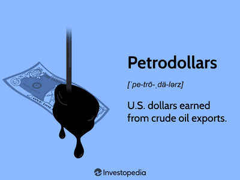

The dynamic interplay between the US dollar, petrodollars, and algorithmic trading is pivotal in understanding modern economic systems. This intricate relationship influences global markets and reshapes economic paradigms, driven largely by historical factors and technological advancements.

The US dollar's status as the world's primary reserve currency establishes it as a cornerstone of international finance. This status was solidified in the mid-20th century, largely due to the Bretton Woods Agreement, which pegged many currencies to the dollar and underscored its global prominence. Following the collapse of the Bretton Woods system, the dollar maintained its dominance through strategic economic policies and international trade agreements.

Petrodollars, a term coined in the 1970s, represent the US dollars earned by oil-exporting countries through the sale of petroleum. The influx of petrodollars has perpetuated the dollar's influence in global markets. The US-Saudi agreement, a critical juncture in cementing the dollar's role in the oil trade, involved Saudi Arabia pricing oil exclusively in US dollars, ensuring a continuous global demand for the currency. This arrangement not only enhances the dollar's hegemony but also facilitates economic stability for oil-producing nations through the recycling of petrodollars into financial markets.

Algorithmic trading has emerged as a formidable force in modern financial markets. By utilizing advanced algorithms and technology, trading processes are enhanced in terms of speed and efficiency, contributing to increased market liquidity. Algorithmic trading encompasses complex computations and automated systems that enable traders to execute a vast number of transactions within microseconds, significantly affecting currency markets.

This article will explore how these elements—US dollar dominance, petrodollar systems, and algorithmic trading—interact and influence each other. By examining historical contexts and assessing economic implications, we aim to provide a comprehensive understanding of their interdependence and impact on the global financial landscape. The role of algorithmic trading in optimizing transactions and enhancing the efficiency of financial markets is particularly noteworthy, requiring careful examination of potential risks and innovations.

Through an analysis of these aspects, readers will gain insight into the ongoing economic influence exerted by the US dollar, petrodollars, and algorithmic trading. An understanding of these factors is crucial for evaluating future economic developments in an increasingly interconnected world, where digital currencies and geopolitical shifts may further transform longstanding practices.

## Table of Contents

## The Rise of the US Dollar in Global Trade

The US dollar's ascension as the world's primary reserve currency is rooted in a combination of historical events and strategic economic policies. The pivotal moment that solidified the dollar's preeminence began with the Bretton Woods Agreement of 1944. This landmark accord established a new international monetary system in the aftermath of World War II, which linked major world currencies to the US dollar, itself convertible into gold at $35 per ounce. This arrangement underscored the dollar's status as the linchpin of global exchange, establishing what has been termed the Bretton Woods System.

The Bretton Woods System was designed to promote international monetary cooperation and economic stability, offering a fixed exchange rate mechanism that reduced currency risks for global trade. The US, with its sizable gold reserves and burgeoning post-war economy, was poised to lead this effort. The US dollar became the principal currency held by governments and institutions as reserves, effectively serving as the world’s reserve currency. However, increasing economic challenges in the 1960s and early 1970s, including US fiscal deficits and inflation, placed immense pressure on the system.

The system's eventual collapse came in 1971 when President Richard Nixon announced the suspension of the dollar's convertibility into gold, effectively ending the Bretton Woods System. This move, known as the Nixon Shock, led to a transition towards a system of floating exchange rates, where currency values are determined by market forces. Despite this significant shift, the dollar retained its dominant position, supported by the strength of the US economy and the global oil market's reliance on the dollar, a phenomenon known as dollar hegemony.

Dollar hegemony has profoundly influenced global trade practices by facilitating smoother transactions and providing a reliable benchmark for international contracts, particularly in commodities like oil. The dollar's stability and [liquidity](/wiki/liquidity-risk-premium) make it an attractive currency for trade and investment, reinforcing a cycle that perpetuates its dominance. Importantly, US economic policies, including monetary and fiscal strategies, have played a crucial role in sustaining dollar hegemony. The Federal Reserve's ability to influence global interest rates underscores the US's monetary influence.

Today, the US dollar maintains its supremacy as the foremost global currency. According to the International Monetary Fund (IMF) data from 2022, approximately 60% of foreign exchange reserves held by central banks are in US dollars. Furthermore, the Bank for International Settlements notes that the dollar is involved in nearly 90% of all foreign exchange transactions, highlighting its unparalleled role in facilitating global commerce.

In conclusion, while the Bretton Woods Agreement catalyzed the US dollar's rise as the world's primary reserve currency, a combination of strategic economic policies and the dollar’s intrinsic stability have helped maintain this status. Despite the evolving global financial landscape, the dollar remains a cornerstone of international trade and finance, driven by both legacy and pragmatic considerations.

## Understanding Petrodollars

Petrodollars refer to the US dollars earned by oil-exporting countries through the sale of oil. The concept emerged prominently in the early 1970s, a period marked by significant economic and geopolitical changes. During this time, global oil prices witnessed a dramatic increase due in part to the actions of the Organization of the Petroleum Exporting Countries (OPEC), which asserted greater control over the pricing and production of oil. This resulted in substantial dollar revenues for oil-producing nations, as oil continued to be priced primarily in US dollars.

Several factors contributed to the rise of the petrodollar system. One of the most notable was the geopolitical strategy of the United States to secure the dollar's position as the dominant currency in global oil trade. This strategy was solidified by the US-Saudi agreement of 1974. In exchange for military protection and economic assistance, Saudi Arabia agreed to price its oil exclusively in US dollars and to invest its surplus oil revenues in US financial markets. This pact not only fortified the bilateral relationship between the US and Saudi Arabia but also ensured that the dollar maintained its stature as the preeminent currency in international trade.

The impact of petrodollars on global economic stability and US economic influence has been profound. By ensuring that oil trade is conducted in dollars, the demand for the currency is perpetually sustained, thereby maintaining its value and liquidity in global markets. This dynamic supports the US's ability to finance its deficits and exert influence over international monetary policies.

Petrodollar recycling is another critical aspect of this system. It refers to the reinvestment of oil-exporting countries' dollar revenues into the economies of oil-consuming nations, primarily through the purchase of US financial assets. This recycling process not only facilitates global liquidity and financial stability but also reinforces the economic ties between oil exporters and economically developed nations, particularly the United States. This cycle of [earning](/wiki/earning-announcement), investing, and spending has significant implications for global financial systems, underpinning the US's strategic economic leverage.

In conclusion, the emergence and development of the petrodollar system have been pivotal in shaping global economic dynamics. Through the US-Saudi agreement and the ongoing practice of petrodollar recycling, the US has been able to sustain its economic dominance, maintaining the dollar's preeminent role in global markets while contributing to worldwide economic stability.

## Algorithmic Trading: A Modern Force

Algorithmic trading, a contemporary mechanism in financial markets, utilizes advanced mathematical models and complex algorithms to execute trading strategies at high speed and [volume](/wiki/volume-trading-strategy). It has significantly reshaped the landscape of trading, with algorithms now executing trades more efficiently than human traders. The proliferation of computational technology has catalyzed the widespread adoption of automated trading systems, which now comprise a substantial portion of daily trading activities in major markets.

The rise of [algorithmic trading](/wiki/algorithmic-trading) can be attributed to advances in technology, particularly in processing power and data availability. By employing algorithms, traders can process vast amounts of market data in real-time, swiftly identifying trading opportunities that might have been missed by manual analysis. Algorithms also enable execution at optimal prices, exploiting minimal price discrepancies across multiple exchanges, which enhances market efficiency. For example, an algorithm might be programmed to buy a currency when its price dips due to temporary market fluctuations and sell when it stabilizes, all without human intervention.

Algorithmic trading greatly contributes to market liquidity, as it can provide constant buy and sell orders that mitigate big swings in asset prices. This liquidity provision maintains tighter bid-ask spreads, resulting in lower transaction costs for all market participants. However, the rapid execution speeds and high frequencies associated with algorithmic trading can also introduce significant risks. Notably, the 2010 "Flash Crash" highlighted vulnerabilities, where algorithmic trading systems contributed to a rapid, yet brief, collapse in the U.S. stock market, primarily due to erroneous trades and lack of safeguards. Such events underscore the potential for algorithms to amplify market [volatility](/wiki/volatility-trading-strategies), possibly leading to systemic risks if not properly managed.

Several case studies emphasize algorithmic trading's influence on currency markets. For instance, during periods of low volatility, high-frequency trading firms deploy algorithms to exploit inefficiencies in the foreign exchange markets. A notable example includes the impact of [carry](/wiki/carry-trading) trade strategies, where algorithms automatically engage in borrowing short-term liabilities in low-yield currencies and investing in high-yield currencies, thus affecting currency valuations worldwide.

While algorithmic trading offers numerous advantages, such as speed and precision, ensuring robust risk management mechanisms is crucial to mitigate unforeseen consequences. Traders and firms must continuously refine their algorithms to address market changes and incorporate fail-safes against erroneous trades. As technological developments continue, algorithmic trading is poised to evolve, necessitating adaptive strategies to navigate its complexities.

## The Intersection of Petrodollars and Algorithmic Trading

The integration of algorithmic trading within the petrodollar system has become a significant [factor](/wiki/factor-investing) in global financial markets, reshaping how currencies and commodities are traded. Algorithmic trading, characterized by the use of automated, pre-programmed instructions, is instrumental in enhancing the efficiency and speed at which transactions are executed. This advancement has a direct impact on the management and utilization of dollar reserves by countries and corporations involved in the oil trade.

Algorithmic trading provides several distinct advantages in managing dollar reserves. By utilizing algorithms, entities can execute large volumes of trades with improved precision, thereby reducing the market impact and the likelihood of slippage. Algorithms enable traders to monitor multiple market variables in real time, facilitating more informed decision-making processes. This capability is especially crucial in currency and commodity trading, where market conditions can change rapidly and unpredictably.

The optimization of currency and commodity trading strategies through algorithmic mechanisms is a major benefit. Algorithms can identify [arbitrage](/wiki/arbitrage) opportunities across different markets, ensuring that trades are executed at the most favorable prices. The ability to process vast amounts of data and execute trades within milliseconds means that algorithmic trading can capitalize on minor price discrepancies that might be imperceptible to human traders. This precision fosters market liquidity, as algorithms contribute to the constant presence of buyers and sellers.

Risk management is another critical area where algorithmic trading plays a pivotal role. Given the volatile nature of commodity markets, particularly those involving oil, sophisticated algorithms are employed to hedge against potential losses. These algorithms use statistical models to simulate various scenarios, enabling traders to anticipate adverse market movements and adjust their positions accordingly. Automated stop-loss orders can be integrated into trading systems to limit potential losses, thereby providing a layer of financial security.

Looking forward, the future trends of algorithmic trading in relation to petrodollars are likely to involve a deeper integration of [artificial intelligence](/wiki/ai-artificial-intelligence) (AI) and [machine learning](/wiki/machine-learning). These technologies can enhance the predictive capabilities of trading algorithms, allowing for more nuanced interpretations of market data and trends. Additionally, the adoption of blockchain technology may further streamline trading processes, offering increased transparency and reducing transaction costs associated with the traditional banking systems currently underpinning the petrodollar cycle.

In summary, the intersection of algorithmic trading and the petrodollar system represents a convergence of technology and global finance, with significant implications for how oil is traded and dollar reserves are managed. As advancements in AI and blockchain continue to evolve, they will undoubtedly shape the future dynamics of this intricate financial relationship.

## Challenges and Risks to the Petrodollar System

The petrodollar system, which emerged in the 1970s through mechanisms that involved trading oil in U.S. dollars, faces significant challenges and risks in the current global economic environment. The traditional reliance on the U.S. dollar for oil transactions is increasingly under scrutiny due to geopolitical, economic, and technological shifts.

Geopolitical shifts are among the most prominent challenges to the petrodollar system. Several countries have expressed interest in diversifying away from the dollar-dominated trade. For instance, China and Russia have been vocal about reducing their dependency on the U.S. dollar. They have taken concrete steps towards this goal by settling some cross-border trade in their own currencies—the Chinese yuan and the Russian ruble. This movement is motivated by a desire to mitigate the risks associated with potential U.S. economic sanctions and to exert greater control over their monetary policies.

The rise of alternative currencies and trade agreements also exacerbates risks to the petrodollar system. Emerging markets and developing countries are increasingly negotiating trade agreements that bypass the U.S. dollar. Regional agreements, such as those among ASEAN nations, often stipulate local currency settlements. This reduces the transactional necessity of the U.S. dollar, consequently diminishing its hegemony.

Technological innovations, particularly digital currencies and blockchain technology, offer another dimension of risk to the petrodollar system. Cryptocurrencies, such as Bitcoin, have introduced a decentralized financial ecosystem in which traditional currency norms can be bypassed. Blockchain technology facilitates secure, transparent, and efficient cross-border transactions independent of established currencies. Central banks globally are exploring digital currencies (CBDCs), which might eventually serve as a vehicle for settling oil trades, thereby threatening the petrodollar's dominance.

China's digital yuan initiative exemplifies a concerted effort to challenge the existing monetary order. The People’s Bank of China has been at the forefront of developing and trialing a digital national currency, which could one day play a pivotal role in international trade, including oil transactions.

Efforts by countries like China and Russia are closely monitored due to their potential to reshape global trade dynamics. Both nations have increased their gold reserves as a strategy to reduce dollar dependency and enhance financial stability. This movement is part of a larger trend where countries are preparing for a diversified currency portfolio in international transactions.

Future scenarios for the petrodollar system are varied. One potential outcome could be a multipolar currency world wherein the U.S. dollar, while remaining significant, shares its role with the euro, yuan, and potentially other currencies or digital alternatives. This could lead to more balanced global financial stability, but also increased complexity in international trade due to multiple currency systems competing simultaneously.

Another scenario could involve technological convergence, where blockchain and digital currencies integrate with traditional finance. This hybrid system could offer seamless, efficient transactions, potentially eroding the exclusive role of the dollar in petrodollar transactions.

In conclusion, the challenges to the petrodollar system are multifaceted, involving geopolitical dynamics, the evolution of global trade practices, and technological advancements. The future of the petrodollar is uncertain, but current trends suggest a shift towards greater currency diversification and technological integration in global trade.

## Conclusion

The interplay between the US dollar, petrodollars, and algorithmic trading remains a cornerstone of modern global economic infrastructure. Throughout this article, we delved into the dynamics that underpin this triad. The US dollar's position as the primary reserve currency, driven initially by the Bretton Woods system, has allowed it to dominate international trade, setting the stage for the subsequent development of the petrodollar system. Petrodollars have bolstered US economic influence, creating a robust cycle of wealth circulation between oil-producing nations and global markets. Algorithmic trading, with its transformative capabilities, further integrates into this framework by optimizing the execution of trades, enhancing market liquidity, and providing sophisticated risk management tools.

The economic impact of these elements is profound and multifaceted. The US dollar's pervasive influence in global transactions ensures that it remains a focal point for monetary policy and international trade negotiations. Petrodollars contribute to economic stability, tying oil revenues to the US financial system, while algorithmic trading introduces unprecedented efficiency levels, rapidly altering trading practices worldwide.

Emerging technologies and ongoing geopolitical shifts portend significant changes. Blockchain and digital currencies present potential disruptors to the petrodollar system, offering alternative methods of transaction and value storage. Geopolitical maneuvers by major economies like China and Russia further challenge the dollar's exclusivity, with initiatives aimed at reducing dependency on the US dollar. These trends suggest a possible reevaluation of traditional financial systems, potentially leading to diversified currency ecosystems.

Looking ahead, the global economy is poised for adaptative shifts influenced by technological advancements and geopolitical realignments. Fintech innovations could restructure financial transactions and trade methodologies, while global power dynamics might reshape currency alliances and dependencies. It is crucial for policymakers, economists, and market participants to remain vigilant, exploring these factors to anticipate future economic conditions effectively.

In conclusion, navigating the intricate ties between the US dollar, petrodollars, and algorithmic trading requires continuous assessment and strategic foresight. These components are not just phenomena of the past or present; their evolution will undoubtedly influence future global economics. Analyzing these relationships offers valuable insights, equipping stakeholders with the knowledge necessary to harness opportunities and mitigate risks in a rapidly changing financial landscape.

## References & Further Reading

[1]: ["The Bretton Woods Agreements"](https://www.investopedia.com/terms/b/brettonwoodsagreement.asp) - International Monetary Fund (IMF)

[2]: ["The Role of the U.S. Dollar as the World’s Primary Reserve Currency"](https://www.federalreserve.gov/econres/notes/feds-notes/the-international-role-of-the-u-s-dollar-20211006.html) - Brookings Institution

[3]: ["Petrodollar Warfare: Oil, Iraq and The Future of the Dollar"](https://www.amazon.com/Petrodollar-Warfare-Iraq-Future-Dollar/dp/0865715149) by William R. Clark

[4]: ["Algorithmic Trading and DMA: An introduction to direct access trading strategies"](https://www.amazon.com/Algorithmic-Trading-DMA-introduction-strategies/dp/0956399207) by Barry Johnson

[5]: ["High-Frequency Trading: A Practical Guide to Algorithmic Strategies and Trading Systems"](https://www.amazon.com/High-Frequency-Trading-Practical-Algorithmic-Strategies/dp/1118343506) by Irene Aldridge

[6]: ["Geopolitics and the Dollar: From Bretton Woods to the Digital Age"](https://www.npr.org/sections/money/2019/07/30/746337868/75-years-ago-the-u-s-dollar-became-the-worlds-currency-will-that-last) - Foreign Affairs

[7]: ["The New Geopolitics of Central Banking in the Age of Digital Currency"](https://www.belfercenter.org/publication/geopolitics-digital-currency) by Joseph E. Stiglitz, Project Syndicate

[8]: ["The Impact of Algorithmic Trading on the Dynamics of the Foreign Exchange Market"](https://www.jstor.org/stable/pdf/43612951.pdf) by Albert Menkveld, National Bureau of Economic Research

[9]: ["Petrodollar Recycling"](https://en.wikipedia.org/wiki/Petrodollar_recycling) - Investopedia

[10]: ["Digital Revolutions in Public Finance"](https://www.elibrary.imf.org/view/book/9781484315224/9781484315224.xml) - International Monetary Fund (IMF)