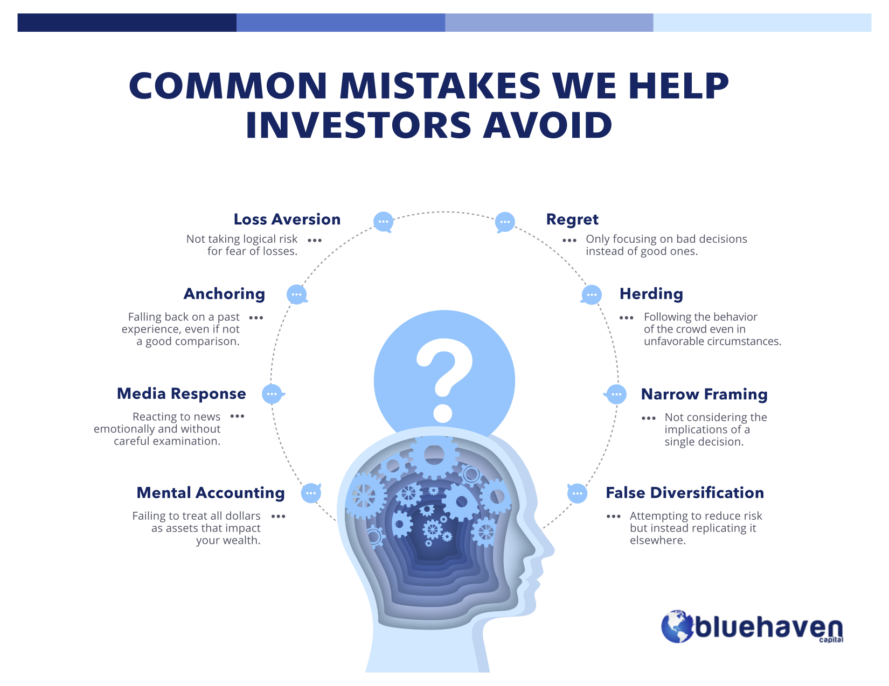

Investment strategies are essential tools for achieving financial growth and stability. However, not all strategies are created equal, and some can lead to significant financial losses. This article aims to shed light on various investment advice and strategies that can result in unfavorable outcomes, including the increasingly prevalent practice of algorithmic trading.

Understanding and recognizing the signs of bad investment advice is a fundamental step in safeguarding one's financial resources. Bad advice often manifests through excessive trading activities, inappropriate use of leverage, and the promotion of high-cost investments without adequate justification. Moreover, advisors who prioritize personal gain over the interests of their clients can mislead investors, making it imperative for individuals to critically assess the motives and expertise of those providing financial guidance.

In addition to scrutinizing advice, investors must be vigilant about the risks associated with certain investment strategies. Overconfidence in high-risk markets, lack of diversification, and the pursuit of momentum in trending sectors are common pitfalls that can erode wealth. Without a sound strategic grounding, these approaches may transform minor setbacks into substantial financial liabilities.

Algorithmic trading, while revolutionary in increasing the efficiency and speed of transactions, introduces its own set of challenges. The advantages provided by this technology, such as reduced emotional bias and swift execution, are counterbalanced by risks such as system errors and increased market volatility. Notable incidents like the Flash Crash illustrate the potential for systemic risk, underscoring the necessity of proper risk management measures, including kill switches and constant algorithm monitoring.

The primary goal of this article is to equip both novice and experienced investors with the knowledge required to navigate these issues effectively. By recognizing and avoiding common financial pitfalls, and employing effective strategies, investors can better protect their financial interests. This understanding is pivotal for achieving sustainable financial success, fostering both growth and security in one's investment portfolio.

## Table of Contents

## The Role of Investment Advice

Financial advisors are pivotal in navigating the complexities of financial markets, yet the quality and intent behind their advice can vary significantly, affecting investor outcomes. While some advisors provide valuable insights and strategies, others may prioritize their gains over the client's, resulting in poor investment choices. This dual role of an advisor as both a guide and a potential risk highlights the need for investors to be discerning about the advice they receive.

Excessive trading activities often signal questionable advice. Frequent trades can lead to substantial commissions and fees, benefiting the advisor more than the client. This practice, known as churning, can erode investment returns and is a red flag for investors. Moreover, inappropriate leverage is another indicator of self-serving advice. Advisors who encourage leveraging your portfolio without a substantial risk assessment may expose investors to unnecessary risks that could magnify losses should market conditions turn unfavorable.

The promotion of high-cost investments is another tactic that can be detrimental. Some advisors might steer clients towards products with high fees or commission structures, like certain mutual funds or annuities, which can eat into returns over time. These strategies may not align with the client's best interest, especially when lower-cost alternatives are available.

An advisor's inadequate knowledge can also result in misguided recommendations, damaging portfolios rather than enhancing them. The investment landscape is complex and requires a thorough understanding of diverse financial instruments, economic indicators, and global markets. Advisors lacking expertise or up-to-date knowledge might fail to navigate these variables effectively, leading to suboptimal investment decisions.

For investors, critically evaluating investment advice involves a proactive approach. Understanding the advisor's motivation and expertise is essential. Key questions include: Are their recommendations in alignment with my financial goals? Do they explain the risks involved? Is their compensation linked to the products they endorse? Transparency in these matters is crucial for establishing trust and ensuring that the advisor's guidance genuinely aligns with the client's interests. By cultivating a critical approach, investors can better navigate the advice they receive and safeguard against potential pitfalls in their investment journey.

## Identifying Bad Investment Strategies

Bad investment strategies often arise from poor advice or a failure to align with market realities. A common pitfall for investors is overconfidence in high-risk areas. This overconfidence can lead investors to overlook the inherent risks associated with certain asset classes or investment types. High-risk investments, such as speculative stocks or cryptocurrencies, while potentially lucrative, can also lead to significant financial losses if not approached with caution.

Another key issue is poor diversification. The principle of diversification is crucial for reducing risk—investors spread their investments across various asset classes to mitigate the impact of any single asset's poor performance on their overall portfolio. Poor diversification could mean over-concentration in a specific sector, geographic region, or type of asset, such as stocks vs. bonds. This lack of balance exposes investors to market fluctuations that could devastate a poorly diversified portfolio.

Momentum investing in "hot" sectors is another strategy fraught with risk. While these sectors may promise rapid returns due to their popularity, they are often subject to sudden corrections. The technology boom of the late 1990s and early 2000s and the more recent [cryptocurrency](/wiki/cryptocurrency) surges are prime examples where investing based on market trends rather than solid fundamentals led many to suffer extensive losses.

Inappropriate leverage is another significant misstep. Leverage involves borrowing funds to increase the potential return on investment. However, it also increases potential losses, making setbacks disproportionately impactful. For instance, if an investor borrows to invest $100,000 at a leverage ratio of 2:1, a 10% loss in the investment value would lead to a 20% loss on the investor's capital, exemplifying how leverage can transform minor market movements into substantial financial liabilities.

Finally, investors must avoid strategies lacking strategic planning and thorough due diligence. Sound investment strategies are grounded in careful research, historical data analysis, and a comprehensive understanding of market conditions. Investors should interrogate the rationale behind each investment choice, assess potential risks, and ensure alignment with their long-term financial goals. By adhering to these principles, investors can eschew detrimental strategies and enhance the stability and growth of their portfolios.

## Algorithmic Trading: Advantages and Pitfalls

Algorithmic trading, also known as automated trading, involves the use of computer algorithms to execute trading orders at optimal speeds and efficiencies. This method utilizes predetermined criteria based on variables such as timing, price, and [volume](/wiki/volume-trading-strategy) to execute trades and has fundamentally transformed financial markets. The primary advantages of [algorithmic trading](/wiki/algorithmic-trading) include increased transaction speed and reduced human emotional interference in trading decisions, leading to a more efficient market operation.

One of the key benefits of algorithmic trading is its ability to execute orders at lightning speeds, which offers a significant competitive advantage. High-frequency trading ([HFT](/wiki/high-frequency-trading-strategies)), a subset of algorithmic trading, exemplifies this by processing large numbers of orders in fractions of a second. This speed allows traders to capitalize on small price discrepancies that might be undetectable to human traders.

Moreover, algorithmic trading reduces the emotional and psychological factors that can impair human decision-making. By relying on pre-set rules and logic, algorithms eliminate biases such as fear and greed that often lead to irrational trading behaviors. This systematic approach can result in improved consistency and discipline in trading strategies.

Despite these advantages, algorithmic trading presents considerable risks. System errors are a major concern, as they can lead to unintended trading behaviors and substantial financial losses. For example, a coding error or a bug in the algorithm could execute trades opposite to the intended strategy or at incorrect prices. Additionally, algorithmic trading can amplify market [volatility](/wiki/volatility-trading-strategies). Automated systems, operating at high speeds, can exacerbate price movements, leading to sharp and rapid fluctuations in asset prices.

A notable illustration of these risks is the Flash Crash of May 6, 2010. During this event, the U.S. stock market experienced a rapid and severe downturn, wiping nearly $1 trillion off the market's value in about 36 minutes. Investigations revealed that algorithmic trading contributed significantly to this extraordinary volatility, as automated systems reacted to market conditions in unforeseen ways, resulting in massive sell-offs.

To mitigate these risks, several risk management strategies are essential. Implementing "kill switches," which can halt trading in the event of abnormal market behavior or system errors, is critical. These switches serve as a safety mechanism to prevent runaway trading situations that can lead to huge losses. Furthermore, constant monitoring and regular auditing of algorithms ensure they function as intended and adapt to evolving market conditions.

In summary, while algorithmic trading provides significant efficiency and execution advantages, it also introduces risks that necessitate careful management and oversight. Proper risk management practices and safeguards like kill switches and algorithm monitoring are vital to harnessing the benefits of algorithmic trading while minimizing potential adverse impacts on financial markets.

## Mitigating Financial Losses

Investors should prioritize robust risk management techniques to prevent financial disasters. Effective risk management is paramount in maintaining the integrity of an investment portfolio. This process involves setting certain control mechanisms and adopting strategic actions to mitigate potential downsides.

One key strategy investors can implement is the use of daily loss limiters. These limiters serve as predetermined cutoff points that stop trading once losses reach a certain threshold on a given day. For example, setting a daily loss limit as a percentage of the total portfolio value can help ensure that losses do not spiral out of control. A basic formula for a daily loss limit might be:

$$
\text{Daily Loss Limit} = \text{Portfolio Value} \times \text{Loss Percentage}
$$

By configuring systems to automatically cease trading upon reaching this limit, investors can prevent further losses amidst unexpected market downturns.

Additionally, refraining from initiating new trades during periods of high volatility is advisable. Volatile markets can lead to unpredictable price swings, making it difficult to execute strategies effectively. Understanding the current market conditions through tools like the Volatility Index (VIX) can inform decisions regarding trade timing.

Periodic review and adjustment of investment strategies are crucial to align financial goals with current market trends. This involves analyzing the performance of assets within the portfolio, reassessing risk tolerance levels, and adjusting allocations accordingly. By doing so, investors can optimize their portfolios to better withstand shifting market dynamics.

For those engaged in algorithmic trading, 'kill switches' represent a vital risk management tool. These are mechanisms designed to halt trading in case of significant system errors or unusual market movements, protecting portfolios from inadvertent losses due to technical failures. 

Finally, ensuring proper portfolio diversification is essential to safeguard against unwarranted adverse outcomes. Diversification involves spreading investments across different asset classes, industries, or geographic regions, which can reduce exposure to specific risks. By carefully diversifying, investors can limit the impact of poor performance in any single investment, thereby stabilizing overall returns.

In summary, by incorporating strategies like daily loss limits, avoiding trades during high volatility, regular strategy reassessments, utilizing kill switches, and diversifying investments, investors can create a resilient risk management framework to help mitigate potential financial losses.

## Conclusion

Informed investment decisions require a clear understanding and discernment of poor advice and ineffective strategies that could jeopardize financial stability. Recognizing the subtle signs of bad advice, such as high-risk recommendations that disregard individual financial goals or risk tolerance, is essential for safeguarding investment portfolios. Investors must exercise due diligence in evaluating the credentials and motivations of financial advisors, ensuring alignment with their financial objectives.

Algorithmic trading, while offering significant opportunities through increased efficiency and enhanced market access, presents risks that necessitate vigilant management. These risks include potential system errors, market volatility, and the amplification of losses in unstable market conditions. Proper risk management techniques, such as implementing fail-safes like kill switches and rigorous algorithm monitoring, are critical to mitigating these risks.

Investors are encouraged to adopt a cautious yet proactive stance in their investment evaluations and decisions. This involves continuous education on market trends, critical analysis of investment vehicles, and regular reviews and adjustments to investment strategies. Such practices help ensure alignment with evolving market dynamics and personal financial goals. 

Ultimately, achieving long-term financial success hinges on a disciplined approach to investing. This includes thorough research, strategic analysis, and the steadfast application of sound investment principles. By remaining vigilant and informed, investors can minimize potential losses and enhance their financial growth prospects.

## References & Further Reading

[1]: Hendershott, T., Jones, C. M., & Menkveld, A. J. (2011). ["Does Algorithmic Trading Improve Liquidity?"](https://onlinelibrary.wiley.com/doi/full/10.1111/j.1540-6261.2010.01624.x) The Review of Financial Studies, 24(3), 417-463.

[2]: Aldridge, I. (2013). ["High-Frequency Trading: A Practical Guide to Algorithmic Strategies and Trading Systems"](https://books.google.com/books/about/High_Frequency_Trading.html?id=6l0DDQAAQBAJ). Wiley.

[3]: O'Hara, M. (2015). ["High Frequency Market Microstructure"](https://www.sciencedirect.com/science/article/pii/S0304405X15000045). Annual Review of Financial Economics, 7(1), 67-91.

[4]: Narang, R. K. (2013). ["Inside the Black Box: A Simple Guide to Quantitative and High-Frequency Trading"](https://onlinelibrary.wiley.com/doi/book/10.1002/9781118662717). Wiley.

[5]: Johnson, K., & Zhao, W. (2012). ["Algorithmic Trading and Information"](https://papers.ssrn.com/sol3/papers.cfm?abstract_id=2001912). World Scientific Publishing.