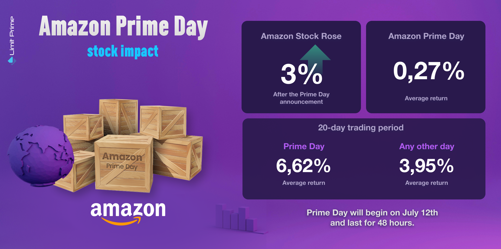

## Table of Contents

## What is Amazon Prime Day?

Amazon Prime Day is a big sale event that happens once a year. It is organized by Amazon, a big online store. During Prime Day, many things like electronics, clothes, and toys are sold at lower prices. Only people who are members of Amazon Prime can join in the sale. Amazon Prime is a special service where you pay a fee every year to get benefits like free fast shipping and streaming movies and shows.

Prime Day usually lasts for two days. It started in 2015 to celebrate Amazon's 20th birthday. Now, it happens every year, usually in July. People look forward to it because they can save a lot of money on things they want to buy. It's like a big shopping party that happens online.

## When was the first Amazon Prime Day held?

The first Amazon Prime Day was held on July 15, 2015. It was a special event to celebrate Amazon's 20th birthday. Amazon wanted to thank their customers and give them a fun shopping experience.

During the first Prime Day, only people who were members of Amazon Prime could take part. They got to buy things at lower prices for 24 hours. It was a big success, and that's why Amazon decided to make it a yearly event.

## How does Amazon Prime Day affect Amazon's sales?

Amazon Prime Day has a big impact on Amazon's sales. During Prime Day, Amazon sees a huge increase in the number of things people buy. This is because many items are sold at lower prices, so more people want to buy them. Prime Day usually brings in more money for Amazon than they make on normal days. It's like a big shopping holiday that helps Amazon make a lot of money.

Not only does Prime Day help Amazon sell more things, but it also gets more people to sign up for Amazon Prime. When people see all the good deals, they might decide to become Prime members so they can join in the fun. This means more people paying for Prime memberships, which is good for Amazon's business. So, Prime Day is a win-win: Amazon sells more stuff and gets more Prime members.

## What is the general trend of Amazon's stock price around Prime Day?

Around Amazon Prime Day, the stock price of Amazon often goes up. This is because Prime Day is a big event where Amazon sells a lot of things at lower prices. When people see these good deals, they buy more, and this makes Amazon's sales go up. When Amazon's sales go up, investors think the company is doing well, so they want to buy more Amazon stock. This demand for the stock can push the price higher.

However, the stock price doesn't always go up. Sometimes, if people think the deals during Prime Day are not as good as before, or if they think Amazon is not making as much money as expected, the stock price might not go up or could even go down a little. But overall, Prime Day is usually good for Amazon's stock price because it shows that the company is doing well and making a lot of sales.

## Can you explain the correlation between Prime Day sales and Amazon's stock performance?

Prime Day sales and Amazon's stock performance are closely linked. When Amazon has a successful Prime Day with lots of sales, it usually makes investors happy. They see that Amazon is selling a lot of things and making good money, so they want to buy more Amazon stock. This demand for the stock can push the price up. It's like when a store has a big sale and lots of people come to buy things, the store looks successful, and people want to invest in it.

However, the stock price doesn't always go up just because of Prime Day. If people think the deals during Prime Day are not as good as before, or if they think Amazon is not making as much money as expected, the stock price might not go up or could even go down a little. But overall, a good Prime Day usually means good news for Amazon's stock because it shows the company is doing well and making a lot of sales.

## How do investors typically react to Prime Day announcements?

When Amazon announces Prime Day, investors usually pay close attention. They know that Prime Day is a big event where Amazon sells a lot of things at lower prices. This often means more sales for Amazon, which can make investors happy. They might think that Amazon is doing well and making a lot of money, so they might want to buy more Amazon stock. This can make the stock price go up because more people want to buy it.

However, not all investors react the same way. Some might be worried if they think the deals during Prime Day are not as good as before or if they think Amazon might not make as much money as expected. In these cases, they might not buy more stock or might even sell some of their stock. This can keep the stock price from going up or even make it go down a little. But overall, Prime Day announcements are usually seen as good news for Amazon's stock because they show that the company is doing well and making a lot of sales.

## What are the key metrics investors look at during Prime Day?

When Prime Day happens, investors look at a few important numbers to see how well Amazon is doing. One big number they watch is the total sales during Prime Day. They want to know how much money Amazon made from all the things people bought. Another number they look at is how many new people signed up for Amazon Prime. If a lot of new people join Prime because of the good deals, it's good for Amazon because it means more people paying for Prime memberships every year.

Investors also look at how much money Amazon made after paying for all the costs of Prime Day. This is called profit. If Amazon made a lot of profit, it's a good sign. They also check if people are happy with the deals and if they are buying more things than last year. If people are happy and buying more, it means Prime Day was a success and Amazon's stock might go up.

## How does Prime Day influence Amazon's long-term stock value?

Prime Day can help boost Amazon's long-term stock value by showing investors that the company is good at bringing in sales and making money. When Prime Day goes well, Amazon sells a lot of things at lower prices, which makes more people want to buy from them. This can make investors feel confident about Amazon's future because they see that the company can keep bringing in customers and making sales. If more people sign up for Amazon Prime because of Prime Day, that's even better because it means more steady income from membership fees every year.

However, Prime Day is just one event in a year, so it's not the only thing that affects Amazon's long-term stock value. Investors also look at how Amazon is doing over time, like if they are growing their business in new areas or if they are making good profits every quarter. If Prime Day shows that Amazon is getting better at selling things and making customers happy, it can help the stock value go up over time. But if Prime Day doesn't go well or if Amazon has other problems, it might not have a big effect on the long-term stock value.

## What external factors might affect Amazon's stock price during Prime Day?

During Prime Day, Amazon's stock price can be affected by things happening outside of the company. For example, if the overall stock market is doing badly because of economic news or world events, Amazon's stock might go down even if Prime Day is going well. Also, if other big companies like Walmart or Target have their own big sales at the same time, it might take some attention away from Amazon and affect their stock price.

Another thing that can impact Amazon's stock during Prime Day is what people are saying about the company. If there are news stories about problems with Amazon's delivery or if customers are not happy with the deals, it can make investors worried. On the other hand, if there is good news about Amazon, like new products or services, it can make investors feel more confident and push the stock price up. So, even though Prime Day is important, other things happening around the world can also play a big role in how Amazon's stock does during this time.

## How do competitors' responses to Prime Day impact Amazon's stock?

When Amazon's competitors like Walmart or Target have their own big sales around the same time as Prime Day, it can affect Amazon's stock price. If these other sales are really good and people decide to shop there instead of Amazon, it might make investors think that Amazon is not doing as well. This could make them less confident in Amazon, and the stock price might go down a little. On the other hand, if Amazon's Prime Day deals are much better and more people choose to shop at Amazon, it can make investors happy and push the stock price up.

But it's not just about the sales. If competitors do something new or different during their sales, like offering special services or better delivery, it can make Amazon look less exciting. Investors might start to worry that Amazon is losing its edge. However, if Amazon responds well to these challenges and keeps its customers happy, it can show that the company is strong and still a good investment. So, how competitors act during Prime Day can have a big impact on how investors see Amazon and its stock price.

## What advanced statistical models are used to predict Amazon's stock movement around Prime Day?

To predict how Amazon's stock will move around Prime Day, experts use advanced statistical models like time series analysis and [machine learning](/wiki/machine-learning). Time series analysis looks at past stock prices and sales data to find patterns. It can help predict what might happen in the future by seeing how the stock has moved around Prime Day in past years. Machine learning models, on the other hand, can learn from lots of different data, not just stock prices. They can look at things like how many people are talking about Prime Day on social media, what competitors are doing, and even the weather. These models get better at predicting the more data they see.

Another model that's often used is the ARIMA model, which stands for AutoRegressive Integrated Moving Average. This model is good at understanding how stock prices change over time and can predict future movements based on past trends. It's especially useful around events like Prime Day because it can account for the seasonal patterns that happen every year. By combining these models with other data, like how many new Prime members sign up or how much people are spending, experts can make more accurate predictions about Amazon's stock price during Prime Day.

## How does the global expansion of Prime Day affect Amazon's stock volatility?

When Amazon started holding Prime Day in more countries around the world, it made their stock price move up and down more. This is because more people from different places are now shopping during Prime Day, which can make the sales numbers go up a lot. But it also means that things like different time zones, local holidays, and how well Amazon can handle shipping to all these places can affect how well Prime Day goes. If something goes wrong in one country, it might make investors worried about Amazon's ability to manage a big global event, and this can make the stock price go down.

On the other hand, if Prime Day goes well in many countries, it can make investors happy because it shows that Amazon is good at selling things all over the world. This can make the stock price go up because more people want to buy Amazon's stock. But because there are so many new things to think about with a global Prime Day, the stock price can be more unpredictable. It might go up and down more than usual because there are more things that can go right or wrong.

## References & Further Reading

[1]: ["The Everything Store: Jeff Bezos and the Age of Amazon"](https://www.amazon.com/Everything-Store-Jeff-Bezos-Amazon/dp/0316219282) by Brad Stone

[2]: Ernest P. Chan. ["Algorithmic Trading: Winning Strategies and Their Rationale"](https://www.wiley.com/en-us/Algorithmic+Trading%3A+Winning+Strategies+and+Their+Rationale-p-9781118460146)

[3]: Jansen, Stefan. ["Machine Learning for Algorithmic Trading"](https://github.com/stefan-jansen/machine-learning-for-trading)

[4]: Lopez de Prado, Marcos. ["Advances in Financial Machine Learning"](https://www.amazon.com/Advances-Financial-Machine-Learning-Marcos/dp/1119482089)

[5]: David Aronson. ["Evidence-Based Technical Analysis: Applying the Scientific Method and Statistical Inference to Trading Signals"](https://www.amazon.com/Evidence-Based-Technical-Analysis-Scientific-Statistical/dp/0470008741)